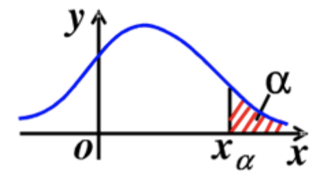

# 生态学数学原理
## 前言
恶补数学知识中
我们先来做一道基础题：
已知1+1=2，那么求证
$$\textbf{grad}f(x_0,y_0)=\triangledown f(x_0,y_0)=f_x(x_0,y_0)i+f_y(x_0,y_0)j$$
本章就是为了讨论这些问题
[TOC]
## 导数与微积分
### 概念
**导数**：
$$f'(x_{0})=\lim_{\Delta x\rightarrow 0}\frac{\Delta y}{\Delta x}=\lim_{\Delta x\rightarrow 0}\frac{f(x_{0}+\Delta x)-f(x_{0})}{\Delta x}$$
那么已知$C_{n}^{k}=\frac{n!}{k!(n-k)!}$，有两个函数$u$和$v$，按二项式定理：$(u+v)^{n}=\sum_{k=0}^{n}C_{n}^{k}u^{n-k}v^k$，则有**莱布尼茨公式**：
$$(uv)^{(n)}=\sum_{k=0}^{n}C_{n}^{k}u^{(n-k)}v^{(k)}$$
**微分**——函数在点$x_{0}$上相对于$\Delta x$的增量(可微的前提是导数存在！)：
$$\textup{d}y=f'{(x_{0})}\Delta x$$
有**洛必达(L'Hospital)法则**：当$x\rightarrow a$时，函数$f(x)$和函数$F(x)$均趋于0时，有：
$$\lim_{x\rightarrow a}{\frac{f(x)}{F(x)}}=\lim_{x\rightarrow a}{\frac{f'(x)}{F'(x)}}$$
**泰勒(Taylor)公式**可以利用用某点的导数信息来求附近某点的值，用多项式来逼近函数值。$f(x)$在点a处泰勒展开，要求$f(x)$在x=a处n阶可导：
$$\displaystyle{\begin{aligned}
  f(x) &=\sum_{n=0}^{\infty }\frac{f^{(n)}(a)(x-a)^n}{n!}\\
  &=
  f(a)+f'(a)(x-a)+\frac{f''(a)(x-a)^2}{2!}+...+\frac{f^{(n)}(a)(x-a)^n}{n!}+R_{n}(x)
\end{aligned}}$$
其中拉格朗日余项$R_{n}(x)=\frac{f^{(n+1)}(\xi )}{(n+1)!}(x-a)^{n+1}$，而$\xi$为$x$和$a$之间的某个值。
利用泰勒展开可以在$x\in [a-R,a+R]$内收敛，即可以用泰勒展开无限逼近$f(x)$，其中Ｒ为收敛半径，即展开点ａ到距离最近的基点的距离。所以要计算点ｂ的函数值，展开点ａ距离ｂ越近越好。当a=0时为**麦克劳林**公式。
**不定积分**:在区间I上，可导函数$F(x)$的导函数为$f(x)$，即对任一$x\in I$，都有：$F'(x)=f(x)$或$dF(x)=f(x)dx$，那么函数$F(x)$就是$f(x)$（或$f(x)dx$在区间$I$上的原函数。该原函数即为$f(x)$在区间$I$上的不定积分，记为：
$$\int f(x)\textup{d}x$$
**定积分**那么函数f(x)在有界区间[a,b]上的定积分（曲边梯形的面积）为$\int_{a}^{b}f(x)dx$。
可推导**牛顿(Newton)-莱布尼兹(Leibniz)公式**：
$$\int_{a}^{b}f(x)\textup{d}x=F(b)-F(a)$$
**偏导数**，设函数$z=f(x,y)$在点$(x_0,y_0)$的某一邻域内有定义，当$y$固定在$y_0$而$x$在$x_0$处有增量$\Delta$时，相应的函数有增量：
$$f(x_0+\Delta x,y_0)-f(x_0,y_0)$$
如果有：
$$\lim_{\Delta x\rightarrow 0}\frac{f(x_0+\Delta x,y_0)-f(x_0,y_0)}{\Delta x}$$
存在，那么称此极限为$z=f(x,y)$在点$(x_0,y_0)$处对$x$的偏导数，记为：
$$\frac{\partial z}{\partial x}|_{x=x_0,y=y_0}或f_x(x_0,y_0)$$
对于函数$z=f(x,y)$的两个二阶混合偏导函数$\frac{\partial }{\partial y}(\frac{\partial z}{\partial x})=\frac{\partial^2 z}{\partial x\partial y}=f_{xy}(x,y)$和$\frac{\partial }{\partial x}(\frac{\partial z}{\partial y})=\frac{\partial^2 z}{\partial y\partial x}=f_{yx}(x,y)$，若它们在区域$D$内连续，那么这两个二阶混合偏导数在该区域内必相等。
我们可以就此拓展出两个自变量下的**拉普拉斯(Laplace)方程**：
$$\Delta u=\frac{\partial ^2u}{\partial x^2}+\frac{\partial ^2u}{\partial y^2}=0$$
一般而言，在三个自变量$(x,y,z)$中，有：
$$\triangledown ^2u=\frac{\partial ^2u}{\partial x^2}+\frac{\partial ^2u}{\partial y^2}+\frac{\partial ^2u}{\partial z^2}=0$$
**全微分**：如果函数$z=f(x,y)$在点$(x,y)$处可微，那么该函数在点$(x,y)$的偏导数$\frac{\partial z}{\partial x}$和$\frac{\partial z}{\partial y}$必定存在，且函数$z=f(x,y)$在点$(x,y)$的全微分为：
$$\textup{d}z=\frac{\partial z}{\partial x}\Delta x+\frac{\partial z}{\partial y}\Delta y$$
在二元函数$z=f(x,y)$在点$(x,y)$的两个偏导数$f_x(x,y)$，$f_y(x,y)$连续，并且$\left | \Delta x\right |$，$\left | \Delta y\right |$都较小时，有近似不等式：
$$\Delta z\approx \textup{d}z= f_x(x,y)\Delta x+ f_y(x,y)\Delta y$$
该式可用于近似计算与误差估计。
#### 方向导数与梯度
如果函数$f(x,y)$在点$P_0(x_0,y_0)$可微，那么函数在改点沿任一方向$l$的**方向导数**存在（即为该函数在这个方向上的变化率），且有：
$$\frac{\partial f}{\partial l}\mid _{(x_0,y_0)}=f_x(x_0,y_0)\textup{cos}\alpha +f_y(x_0,y_0)\textup{cos}\beta $$
我们可以将偏导数理解为函数在坐标轴上的变化率，而方向导数是其在其他方向上的变化率。
上式还可以看做是两个向量$(f_x(x_0,y_0)f_y(x_0,y_0))$和$(cos\alpha ,cos\beta )$的点积，根据点积的计算公式，假设上述两向量间的夹角为$\theta$，上式即可化为：
$$\left \| (f_x(x_0,y_0)f_y(x_0,y_0))\right \|cos\theta $$
因此我们引入**梯度**（**grad**）的概念来表示函数在各个点（如$P_0(x_0,y_0)$)变化率的向量，该向量的模即为方向导数的值（式中$i,j,k$为$x,y,z$轴上长度为1的向量）,这个向量的每个元素分别是多元函数关于每个自变量的偏导数。从上式可以看出，当$\theta =0$时，方向导数的值最大，多元函数增加最快，也就是说梯度的方向就是函数增加最快的方向，当$\theta =\pi$时，方向导数的值最小，多元函数减小最快，也就是在梯度相反的方向上，方向导数最小：
$$\textbf{grad}f(x_0,y_0)=\triangledown f(x_0,y_0)=f_x(x_0,y_0)i+f_y(x_0,y_0)j$$
其中$\triangledown = \frac{\partial }{\partial x}i+\frac{\partial }{\partial y}j$为（二维的）向量微分算子或Nabla算子。
==智力有限，二重积分以后我们不再探讨。==
### 傅里叶变换
通过**欧拉**（**Euler**）公式，可以将复变量指数函数与三角函数挂钩：
$$e^{xi}=cosx+isinx$$
或：
$$\left\{\begin{matrix}
cosx=\frac{e^{xi}+e^{-xi}}{2} \\ 
sinx=\frac{e^{xi}-e^{-xi}}{2i}
\end{matrix}\right.$$
对三角函数$f(t)=A_0+\sum_{n=1}^{\infty }A_nsin(n\omega t+\varphi _n)$，令$\frac{a_0}{2}=A_0$,$a_n=A_nsin\varphi _n$,$b_n=A_ncos\varphi _n$,$\omega =\frac{\pi}{l}$，则：
$$f(t)=\frac{a_0}{2}+\sum_{n=1}^{\infty }(a_ncos{\frac{n\pi t}{l}+b_nsin\frac{n\pi t}{l}})$$
令$\frac{\pi t}{l}=x$，则：
$$f(x)=\frac{a_0}{2}+\sum_{n=1}^{\infty }(a_ncos{nx+b_nsinnx})$$
其中$a_0,a_n,b_n$为常数。右式即为函数$f(x)$的傅里叶级数。
结合欧拉公式可以得到傅里叶系数的复数形式：
$$c_n=\frac{1}{2l}\int_{-l}^{l}f(x)^{-\frac{n\pi x}{l}i}\textup{d}x (n=0,\pm 1,\pm 2...)$$
这个是知识的盲区，不过这篇博文写的不错<https://blog.csdn.net/rannar/article/details/81282973>
傅里叶变换在神经网络与机器学习中用途广泛，所以还是了解一下好。
## 线性代数
对于**行列式**，我们使用对角线法则进行求解：
$$\displaystyle{\begin{aligned}
  D &=\begin{vmatrix}
a_{11}& a_{12}& a_{13}\\
a_{21}& a_{22}& a_{23}\\
a_{31}& a_{32}& a_{33}\\
\end{vmatrix}\\
  &=
  a_{11}a_{22}a_{33}+a_{12}a_{23}a_{31}+a_{13}a_{21}a_{32}-a_{11}a_{23}a_{32}-a_{12}a_{21}a_{33}-a_{13}a_{22}a_{31}
\end{aligned}}$$
对于行列式$D$和它的转置（即行与列对调）行列式$D^T$，有$D=D^T$
接着引入余子式$A_{ij}$的概念：在n阶行列式中，把$(i,j)$元$a_{ij}$所在的第$i$行和第$j$列划去后，留下的$n-1$阶行列式叫做$(i,j)$元$a_{ij}$的余子式，记：
$$A_{ij}=(-1)^{i+j}M_{ij}$$
那么我们可将行列式展开为：
$$D=a_{1j}A_{1j}+a_{2j}A_{2j}+...+a_{nj}A_{nj}$$
### 矩阵
由$m\times n$个数$a_{ij}(i=1,2,...,m;j=1,2,...,n)$排成的m行n列的数表称$m\times n$矩阵，记作：
$$A=\begin{pmatrix}
a_{11}& \cdots & a_{1n}\\
\vdots & \ddots & \vdots\\
a_{m1}& \cdots & a_{mn}
\end{pmatrix}$$
对于矩阵的乘法，设$\mathbf{A}=(a_{ij})$是一个$m\times s$矩阵，$\mathbf{B}=(b_{ij})$是一个$s\times n$矩阵，那么规定矩阵$\mathbf{A}$和矩阵$\mathbf{B}$的乘积是一个$m\times n$矩阵$\mathbf{C}=(c_{ij})$，其中：
$$\displaystyle{\begin{aligned}
  c_{ij}=a_{i1}b_{1j}+a_{i2}b_{2j}+...+a_{is}b_{sj}=\sum_{k=1}^{s}a_{ik}b_{kj}\\
  (i=1,2,...,m; j=1,2,...,n)
\end{aligned}}$$
对于非对称矩阵$D$，其转置矩阵$D^T\neq D$，由方阵A构成的行列式记作$\textup{det} \textbf{A}$或$|\textbf{A}|$。
克拉默法则：对于有n个未知数$x_1,x_2,...,x_n$的n个线性方程组成的方程组：
$$\left\{\begin{matrix}
a_{11}x_1+a_{12}x_2+...+a_{1n}x_n=b_1 \\ 
a_{21}x_1+a_{22}x_2+...+a_{2n}x_n=b_2 \\
......\\
a_{n1}x_1+a_{n2}x_2+...+a_{nn}x_n=b_n
\end{matrix}\right.$$
我们可以用$n$阶行列式$|\textbf{A}|$表示:
$$|\textbf{A}|=\begin{vmatrix}
a_{11}& \cdots & a_{1n}\\
\vdots & \ddots & \vdots\\
a_{m1}& \cdots & a_{mn}
\end{vmatrix}\neq 0$$
若$|\textbf{A}|\neq 0$，则方程组有唯一解：
$$x_1=\frac{|\textbf{A}_1|}{\textbf{A}},x_2=\frac{|\textbf{A}_2|}{\textbf{A}},...,x_n=\frac{|\textbf{A}_n|}{\textbf{A}}$$
其中$\textbf{A}_j(j=1,2,...,n)$是把系数矩阵$\textbf{A}$中第$j$列的元素用方程组右端的常数项代替后所得的$n$阶矩阵：
$$\textbf{A}_j=\begin{pmatrix}
a_{11}& \cdots & a_{1,j-1}&b_1 &a_{1,j+1} & \cdots & a_{1n}\\
\vdots & \ddots & \vdots & \vdots & \vdots & \ddots & \vdots\\
a_{n1}& \cdots & a_{n,j-1} &b_n & a_{n,j+1}& \cdots & a_{nn}
\end{pmatrix}
$$
那么利用矩阵与向量的概念来真正定义**线性相关**：
给定向量组$\textbf{A}$：$\textbf{a}_1,\textbf{a}_2,...,\textbf{a}_m$，如果存在不全为0的数$k_1,k_2,...,k_m$，使：
$$\textbf{a}_1k_1+\textbf{a}_2k_2+...+\textbf{a}_mk_m=0$$
则称向量组$\textbf{A}$是线性相关的。（在计算中一般把矩阵转化为行最简行矩阵进行计算(即第一列是1,0,0,...,0))。
在选定基后，我们可以用矩阵来描述任意一组向量的运动（矩阵是线性空间里跃迁/变换的描述），容纳这样运动的一个空间称为**线性空间**。
==智力有限，未来再整理各种空间变换之类的。==
## 回归问题
[如何理解回归](https://blog.csdn.net/laputa_ml/article/details/80072570)
### 线性回归（Linear Regression)
线性回归是利用一个线性回归方程对一个或多个自变量（*x*）和因变量（*y*）之间的关系进行建模的一种回归分析，而有多个自变量的回归分析称为多元线性回归。
那么什么是线性呢？
这里指的是直线，比如*y=ax+b*这种，也就是说线性回归是在n维空间内寻找一条可以代表空间内所有数据点发展趋势的直线。
那么什么又是回归呢？
回归表明我们通过“线性回归”输出的数值是连续的，而如果输出的数值是离散的，那么我们称之为分类（也许以后会讲分类）。
线性回归的评价标准：
不是所有线都可以用来拟合数据，随便画的线确实可以拟，但合不上，因此我们用各个数据点到直线的距离来评价该直线是否可以有效代表这些数据。
这里我们引入了欧氏距离（Eucliden Metric）的概念：及n维空间内两点间的距离： 
$$\textup{d}(x,y)=\sqrt{\sum_{i=1}^{n}\left (xi-yi \right )^2}$$
那么在线性回归中，我们使用： 
$$\sum_{i=1}^{n}\left (y^{(i)}-\hat{y}^{(i)}\right )^2$$
来表示n维空间内数据点的值（$y^{(i)}$）与拟合直线的值（$\hat{y}^{(i)}$)之间的距离。距离之和即为预测结果与实际结果之总差距，结果越小说明拟合精度越高。这在ML（Machine Learning)中称为损失函数。
**那么怎么求得求线性回归的解呢？(矩阵篇）**
我们要获得的结果$\hat{y}^{(i)}$是由无数个因子决定的，比如说我们要获得明天的天气怎么样，那就要考察无数个因子比如气温、湿度、地形、环流、风速、云相...我们就需要列一个线性表达式：
$$\hat{y}^{(i)}=\theta _{0}+\theta _{1}X_{1}^{(i)}+\theta _{2}X_{2}^{(i)}+...+\theta _{n}X_{n}^{(i)}$$
那么我们可以认为$\theta$是一个列向量：
$$\theta=(\theta _{0},\theta _{1},\theta _{2},...,\theta _{n})^T$$
有一说一，$X$也是一个列向量($X_{0}=1$)（T为转置标记）：
$$X^{(i)}=(X_{0}^{(i)},X_{1}^{(i)},X_{2}^{(i)},...,X_{n}^{(i)})$$
有矩阵乘法，我们易得：
$$\hat{y}^{(i)}=X^{(i)}\cdot \theta $$
这个道理和Excel表格一样，横坐标是我们的变量，纵坐标是标量们的值，而线性回归就是把这个excel表的数据的规律提取出来，如果我们把我们最终要获得的应变量$y^{(i)}$按列一字排开，那么它对应的$X$则是一个大大的矩阵：
$$X_{a}=
\begin{bmatrix}
1& X_{1}^{(1)}& X_{2}^{(1)}& \cdots  & X_{n}^{(1)}\\
1& X_{1}^{(2)}& X_{2}^{(2)}& \cdots  & X_{n}^{(2)}\\
\vdots & \vdots & \vdots & \vdots & \vdots \\
1&X_{1}^{(m)}& X_{2}^{(m)}& \cdots  & X_{n}^{(m)}
\end{bmatrix}$$
拿这个再来做一个向量矩阵的话我们可以得到：
$$\hat{y}=X_a\cdot \theta $$
那么对于一开始的那个损失函数$\sum_{i=1}^{n}\left (y^{(i)}-\hat{y}^{(i)}\right )^2$，我们可以将其看成是列向量列向量$y$与$\hat{y}$的差的平方和，那么列向量$y$与$\hat{y}$之差为一个新的列向量$A$,因此$U$的平方和可以看做是$A$的转置和$A$做个矩阵乘法,由此易得：
$$\sum_{i=1}^{n}\left (y^{(i)}-\hat{y}^{(i)}\right )^2 = (y-X_{a}\cdot \theta )^T(y-X_{a}\cdot \theta )$$
也就是说这是一个已知$y$和$X_{a}$，求$\theta$的解方程。
我们先将损失函数称为$L(\theta)$，有：
$$L(\theta)=\theta ^{T}X_{a}^{T}X_{a}\theta -2y(X_{a}\theta )^T+y^{T}y$$
由于我们是想找一个$\theta$去最小化$L(\theta)$，因此我们对其求导：
$$2X_{a}^{T}X_{a}\theta -2yX^T=0$$
即为：
$$X_{a}^{T}X_{a}\theta =2yX^T$$
因此，线性回归的参数$\theta=2yX^T(X_{a}^{T}X_{a})^{-1}$，求完了参数，那么我们的线性回归的过程也完成了。
**那么怎么求得求线性回归的解呢？(微分篇）**
如何使用线性函数$y=f(t)=at+b$来拟合数据呢？
上文提及线性回归即为求参数$a$,$b$来使得偏差$\sum_{i=0}^{n}(y_i-f(t_i))$最小，令
$$M=\sum_{i=0}^{n}(y_i-(at_i+b)))$$
现在问题转为了求M与自变量a和b关系的问题，可通过解方程组：
$$\left\{\begin{matrix}
M_a(a,b) \\ 
M_b(a,b)
\end{matrix}\right.$$
即令：
$$\left\{\begin{matrix}
\frac{\partial M}{\partial a}=-2\sum_{i=0}^{n}[y_1-(at_i+b)]t_i=0 \\ 
\frac{\partial M}{\partial b}=-2\sum_{i=0}^{n}[y_1-(at_i+b)]=0
\end{matrix}\right.$$
整理合并并将a,b分离后即可得到：
$$\left\{\begin{matrix}
a\sum_{i=0}^{n}t_{i}^{2}+b\sum_{i=0}^{n}t_i=\sum_{i=0}^{n}y_it_i \\ 
a\sum_{i=0}^{n}t_i+(n+1)b=\sum_{i=0}^{n}y_i
\end{matrix}\right.$$
解出a,b即可得到线性回归的方程。
这就是线性回归的最小二乘法，此外还有梯度下降法，但我暂时还不会，先晾着以后再说，另外还有高斯牛顿法，其实学到这里我们已经可以发现所谓的线性回归并不是简单地找一条一次函数去拟合了，所谓的线性指的是特征和结果都为线性？还是别的什么呢？这有待于进一步的学习。
### 分位数回归
#### 分位数quantile
对于总体$X$和给定的$\alpha (0< \alpha < 1)$，若存在$x_{\alpha}$，使$P\left \{X\geq x_{\alpha }\right \}$，则称$x_{\alpha}$为X分布上的**上侧α分位数**或**上侧临界值**。

同理，若存在数$\lambda _1$、$\lambda _2$，使$P\left \{X\geq \lambda _1\right \}=P\left \{X\leq \lambda _1\right \}=\frac{\alpha }{2}$，则称$\lambda _1$、$\lambda _2$为$X$分布的双侧α分位数或双侧临界值。
由此拓展出一些概念：四分位数（Quartile）指统计学中把所有数值从大到小排列并分为四等分，处于三个分隔点位置的得分就是四分位数。第一四分位数 (Q1)，又称“较小四分位数”，等于该样本中所有数值由小到大排列后第25%的数字。第二四分位数 (Q2)，又称“中位数”，等于该样本中所有数值由小到大排列后第50%的数字。第三四分位数 (Q3)，又称“较大四分位数”，等于该样本中所有数值由小到大排列后第75%的数字。第三四分位数与第一四分位数的差距又称四分位距（InterQuartile Range,IQR）。
### 线性混合模型
#### 因子与简单线性回归的拓展
因子是直接或间接影响观察值的因素，我们建立线性模型就是为了分析各个因素对模型的影响。因子可能是连续的，也可能是不连续的，可以将因子划分为：
**固定效应**：所有可能出现的等级或水平都是已知的，并且是可以被观察与记录到的，如环境
**随机效应**：随机地从一个无穷大的群体中抽取样本时可能出现的水平，如遗传
对于线性模型，这里不能用简单的$y=xa+b$来表示了:
$$y=b_0+b_1x_1+b_2x_2+...+b_kx_k+e$$
其中：$b_0,b_1,...,b_k$为未知参数，$x_0,x_1,...,x_k$为影响观察值y的因素，而$e$为随机残差(random rest error)
$$ \begin{bmatrix}
y_1 \\
y_2 \\
\vdots \\
y_n
\end{bmatrix}= \begin{bmatrix}
1 &x_{11} & x_{12} & \cdots & x_{1k} \\
1 &x_{21} & x_{22} & \cdots & x_{2k} \\
\vdots & \vdots & \vdots& \cdots & \vdots \\
1 &x_{n1} & x_{n2} & \cdots & x_{nk}
\end{bmatrix} \begin{bmatrix}
\beta_0 \\
\beta_1 \\
\beta_2 \\
\vdots \\
\beta_k
\end{bmatrix}+\begin{bmatrix}
e_1 \\
e_2 \\
\vdots \\
e_n
\end{bmatrix}$$
简单地说就是：
$$y=X\beta+e(大写字母均为矩阵)$$
其中$E(e)=0,Var(e)=R=\sigma ^2I$（统计学中$\sigma$代表标准差）
该式需要满足条件$E(y)=X/beta，Var(y)=/sigma ^2I，y$服从正态分布。
***
**线性混合模型**相较于一般的线性模型，其混合在模型不单单考虑了固定效应，还考虑了随机效应。以矩阵定义混合模型，可以写成：
$$y=X\beta +Z\mu +\epsilon $$
现有几个假设：
$$\begin{bmatrix}
\mu\\ 
\epsilon 
\end{bmatrix}\sim N\left ( \begin{bmatrix}
0\\ 
0
\end{bmatrix},\begin{bmatrix}
G &0 \\ 
0 &R 
\end{bmatrix}\right )$$
那么混合模型的假定为$\mu N(0,G)$，$\epsilon N(0,R)$，其中$Cov(\mu,\epsilon)=0$，即两者的协方差为0（可以将协方差理解为各个维度间的方差），即两者彼此独立无相关关系，但是他们的方差分别为$G$和$R$。
在这里，$y$是观测值的向量，$\beta$是固定效应($p$个水平)，$\epsilon$是残差的向量矩阵(随机残差)，随机残差的方差为$E(\epsilon)=I_{n\times n}\sigma _{\epsilon }^{2}=R$（可以认为普通的线性回归即为$y=X\beta +\epsilon$）；$\mu$是随机效应($q$个水平)，它的平均值为$E(\mu)=0$，它的方差为$var(\mu)=A_{q\times q}\sigma _{\mu }^{2}=G$；$X$和$Z$分别是$\beta$和$\mu$的矩阵，得到观测值期望为$E(y)=X\beta$，它的方差$var(y)=V=ZGZ^T+R$
对于观测值y的方差(marginal)的推导，有下式：
$$\displaystyle{\begin{aligned}
  var(y) &=V=var(Z\mu+\epsilon)\\
  &=Zvar(\mu)Z^T+var(\epsilon)+cov(Z\mu,\epsilon)+cov(\epsilon,Z\mu)\\
  &=ZGZ^T+R+Zcov(\mu,\epsilon)+cov(\epsilon,\mu)Z^T\\
  &=ZGZ^T+R
\end{aligned}}$$
接下来我们即可利用**BLUP**来进行最佳线性无偏预测，BLUP是四个单词首字母的组合，B即Best就是估计误差最小，L指线性，U为Unbiased是无偏，即估计值的数学期望等于真值，而P是预测。
BLUP是预测随机效应的方法，对应的固定效应值的方法是BLUE。统计上，拟合模型阶段叫估计，预测阶段称预测；而在LMM中，则分别指固定和随机参数的计算，目的都是求解方程组。
可以通过Henderson混合线性公式对其进行求解：
$$\begin{bmatrix}
X'X&X'Z \\ 
 Z'X& Z'Z+kA^{-1}
\end{bmatrix}\begin{bmatrix}
\hat{\beta }\\ 
\hat{\mu }
\end{bmatrix}=\begin{bmatrix}
X'y\\ 
Z'y
\end{bmatrix}$$
其中$k=\frac{\sigma _{\epsilon}^{2}}{\sigma _{\mu}^{2}}$
我们可以将$X'X$和$Z'Z$看做固定因子之间的效应，将$X'Z$和$Z'X$看做是固定因子之间的效应，而$A$则是随机因子的效应，$X'y$和$Z'y$则是观测值的累加。
$$\hat{\beta }=GZ'V^{-1},\hat{\mu }=(X'V^{-1}X)^{-1}X'V^{-1}y$$
**小结**：
对于线性回归模型，我们使用下式来表达：
$$\left\{\begin{matrix}
y=X\beta +\epsilon  \\ 
\epsilon \sim MVN(0,\sigma ^2I_n)
\end{matrix}\right.$$
其中$\epsilon$为随机误差，而MVN为多元正态分布。
而对于线性混合模型，使用下式来表达：
$$\left\{\begin{matrix}
y=X\beta +Z\mu +\epsilon  \\ 
\mu  \sim MVN(0,G) \\
\epsilon \sim MVN(0,R)\\
Cov(G,R)=0
\end{matrix}\right.$$
其中$X\beta$为固定效应，$Z\mu$为随机效应，$G、R$为协方差矩阵。
### 广义线性模型
在一般线性模型中我们假定y服从正态分布，但如果y不符合正态分布呢？
在此之前我们首先回顾线性回归的基石：正态分布及相关的知识点。
#### 期望与回归
如果$X$是概率空间($\Omega ,P$)中的随机变量，那么它的期望值为：
$$\textup{E}[X]=\int_{\Omega }XdP$$
对连续的变量来说是积分，但对离散的变量来说是求和，若X是离散的随机变量且输出值为$x_1,x_2$,...，而输出的概率值为$p_1,p_2$...(和为1)，那么有：
$$\textup{E}[X]=\sum_{i}p_ix_i$$
我们可以将期望值看做是概率世界的结果与概率的乘积？或者是输出结果的平均数。
而正态分布就是一个连续概率分布，我们可以用：
$$Y\sim N(\mu ,\sigma ^2)$$
即随机变量围绕着均值$\mu$运动，而运动的方差为$\sigma ^2$，其概率密度函数为：
$$f(x)=\frac{1}{\sigma \sqrt{2\pi}}e^{-\frac{(x-\mu)^2}{2\sigma ^2}}$$
正态分布的数学期望值或期望值$\mu$等于位置参数，决定了分布的位置；其方差$\sigma^2$的开平方或标准差$\sigma$等于尺度参数，决定了分布的幅度。正态分布的概率密度函数曲线呈钟形，因此人们又经常称之为钟形曲线。通常所说的标准正态分布是位置参数$\mu =0$，尺度参数$\sigma^2 = 1$的正态分布。
对于==线性回归==$y=\theta ^Tx$，其符合正态分布，有$h(x)=\textbf{E}[y|x,\theta ]=\eta$。$\eta$为一个（组）数。
***
广义线性模型GLM可以分解为三部分：Random Component随机因子、System Component系统组成？、Link Function连接函数($g(\cdot)$)。
**Random Component**——An exponential family model for the response
这里是指response variable必须服从某一exponential family distribution指数族分布，如高斯分布、多项分布、泊松分布...
**Systematic Component**——Linear predictor
广义线性模型本质上还是线性模型，还是求参？
**Link Function**——A link function connects the mean of the response to the linear predictor
对于线性回归，我们有$y=X\beta +\epsilon$，那么我们找到一个与$y$相关的$\eta$那么通过连接函数$g(\mu)=\eta$，可以建立response variable分布均值（实际就是我们的预测目标）和linear predictor线性回归的关系。
在数学期望上我们可以用下式来描述==广义线性模型==：
$$h(x)=\textbf{E}[y|x,\theta ]=\eta =g^{-1}(\eta)$$
在广义线性回归中，我们更具实际情况选择不同的$g^{-1}(\eta)$。
#### Logistic Regression
接下来以逻辑斯蒂回归（LR：Logistic Regression）为例来解释GLM：
逻辑斯蒂函数常用于分类问题，它的结构符合GLM的标准：
*随机因子*random component：$y_1 \sim Bern(\mu _i)$
*系统组成*system component：$\eta _i=\sum \theta _jx_{ij}$即为线性回归之意
*连接函数*link function：$\eta =g(\mu)=ln\frac{\mu}{1-\mu}$即为logit函数
*响应函数*response function：$\mu =g^{-1}(\eta )=\frac{1}{1+e^{-\eta }}$称为logistic或sigmoid函数
*预测值*prediction：$h(x_i)=\textbf{E}[y_i|\theta ,x_i]=sigmoid(\eta_i)$
*损失函数*loss function：$E=-ylnh(x)-(1-y)ln(1-h(x))$
可见，link function就是把任意exponential family distribution 的均值$\mu$映射到线性尺度上:
$$\eta =g(\mu)=ln\frac{\mu}{1-\mu}$$
$$\eta=ln\frac{\textbf{E}[y_i|\theta ,x_i]}{1-\textbf{E}[y_i|\theta ,x_i]}=\theta^Tx_i=\sum \theta _jx_{ij}$$
即是，在Logistic Regression模型中，输出$y=1$的log-odds对数几率是关于输入$x$的线性函数。
关于逻辑斯蒂函数，我们有$g'(z)=g(z)(1-g(z))$，也有$1-g(z)=g(-z)$，这里不证。
接下来运用似然函数求证它的loss function（似然函数似乎可以理解为条件概率的逆反，即已知观测的结果，对相关参数进行估计，如已知抛硬币10次有5次正面，想知道硬币质地是否均匀）：
假设我们观察到了数据集$(x_i,t_i)$包含$N$个样本，$x_i$表示某一样本的特征向量，$t_i=0 or 1$表示这一样本的真实类别（observed outcome）。定义$y_i=h(x_i)$为模型输出结果（expected outcome）。我们假设t_i服从Bernoulli伯努利分布（$Bern(x|\mu )=\mu ^x(1-\mu )^{1-x}$），则有以下似然函数：
$$L(D|\theta )=p(t|\theta )=\prod_{i=1}^{N}y_{i}^{ti}(1-y_i)^{1-ti}=\prod_{i=1}^{N}h(x_i)^{t_i}(1-h(x_i))^{1-t_i}$$
取对数化简得：
$$l=lnp(t|\theta )=\sum_{i=1}^{N}[t_ilnh(x_i)+(1-t_i)ln(1-h(x_i))]$$
所以loss function为：
$$J=-l=\sum_{i=1}^{N}[-t_ilnh(x_i)-(1-t_i)ln(1-h(x_i))]$$
又因为$h(x)=g^{-1}(\theta ^Tx)=\frac{1}{1+\theta ^{-\theta ^Tx}}$
将其带入$J$后对weight factor$\theta$求导：
$$\displaystyle{\begin{aligned}
  \frac{\partial J_i}{\partial \theta } &=\frac{\partial J_i}{\partial h(x_i) }\frac{\partial h(x_i)}{\partial \theta }\\
  &=(-t_i\frac{1}{h(x_i)}-(1-t_i)\frac{1}{1-h(x_i)}*(-1))*(h(x_i)(1-h(x_i))x_i)\\
  &=-t_i\frac{1}{h(x_i)}h(x_i)(1-h(x_i))x_i+(1-t_i)\frac{1}{1-h(x_i)}h(x_i)(1-h(x_i))x_i\\
  &=-t_i(1-h(x_i))x_i+(1-t_i)h(x_i)x_i\\
  &=(h(x_i)-t_i)x_i
\end{aligned}}$$
所以其实逻辑斯蒂回归与梯度下降法有着异曲同工之妙。
### 广义线性混合模型
广义线性混合模型GLMM可以是广义线性模型GLM的扩展形式，使得其因变量无需满足正态分布；与此同时它也是线性混合模型LMM的拓展，使得其可以同时考量固定效应与随机效应(也因此在GLMM中误差值并不是随机分布的，而是呈现一定分布的)。
在线性混合模型中，我们有：
$$y=X\beta +Z\mu +\epsilon $$
那么使用连接函数$g(\cdot )$与y进行连接有：
$$\eta=X\beta +Z\mu$$
$$y=g^{-1}(\eta)=h(\eta)+\epsilon $$
