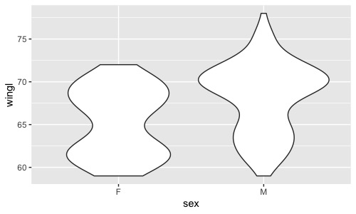
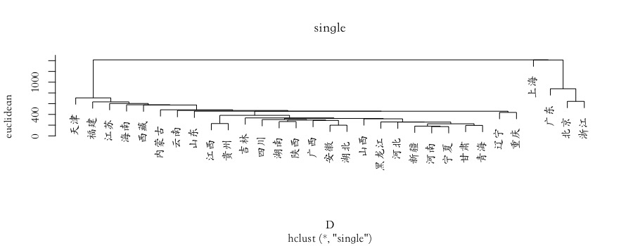
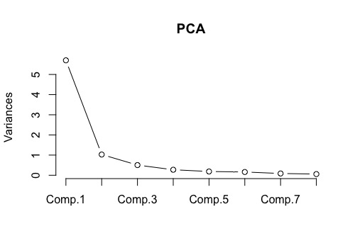

# R学习
## 前言
本科时期用SAS的老师说用Excel做出来的图期刊不会接受，教SPSS的老师说只有标了用SPSS做的数据那些编辑才会相信，而这时候用Matlab的人又站出来说在座的各位都是垃圾。说到底数据科学最终追求的处理工具应当是一种可以在数学处理上有着极其丰富的手段，而在图表输出上有着最大自由的工具，这些，~~Matlab~~R语言都可以做到。但是功能越自由则操作越难，人们总是希望有一个GUI甚至最好是语音操控就可以轻松处理数据，但实际上我们却要在GitHub或者CSDN上苦苦寻找一下午的代码来完成一些简单的回归统计。
R语言在其他学科中属于小角色，但是在生态学中，由于其开源、灵活、免费、简单，因此已经有超过50%的相关学者选择R语言作为他们的研究工具，而当前的生态相关的sci文章中，也有超过50%的文章使用R语言完成其科研分析，其中使用频次最多10个包是lme4, vegan, nlme, ape, MuMIn, MASS, mgcv, ade4, multcomp和car。

因此在这篇R学习当中，我希望
1. 分享学习R语言的进度，同时也是给自己增加一些学习的压力与动力。
2. 避免不求甚解，成为无情的代码搬运工，我希望可以从数学出发，对R语言的分析做一个“面向对象”又“直达底层”的综述。

[TOC]

## 从安装R和Package开始
### 安装R 
不多说
可以安装一下R Studio，这是一个R语言的IDE，它还拥有比较强大的调试功能，也支持纯R脚本和Rmarkdown（这在下载一些R的联系教程时格外有用！），下载时选择免费版即可。
tips：在Rstudio中，我们可以设置断点来分段检查bug。
这里还要推荐一个环境管理软件**Anaconda**。Anaconda可以创建多个互不干扰的环境（类似python的env），分别运行不同版本的软件包。Anaconda还自带了Jupyter Notebook，可以灵活地记笔记，运行与交互，是机器学习的终极伙伴。同时这个软件也自带R studio，几乎集成了你能知道的所有数学分析工具，吹就完事儿了。
### R Packages
R包是R语言的精华，只要会装r包，那恭喜你可以成为数据科学家了
我们通过：
```r
install.packages()
```
在选择适合自己的CRAN镜像后安装我们想要的R包。R包的安装是套娃式的，我们往往装一个R包会提示需要许多前置R包，然后不知不觉就装了几百个R包。我们可以通过：
```r
installed.packages()
```
来单纯看看有什么包，或通过：
```r
rp <- available.packages()
> dim(rp)
```
看看包和他们的版本，不过有时候莫名安装过了而且是最新的但是还是说没有，还得重新装一遍，也挺奇怪的。
那么，如何知道我们想要什么包呢？
1. 在我们阅读的（导师塞给你的）文献中，作者在分析时往往会给出他使用的R包的名称。
2. 我给你们塞一些必备R包orz（不针对特定专业）

**工具类：** readxl包可以直接读取excel的数据，tidyxl和tidyr包可以整理乱七八糟的excel；dplyr包则是归类整理excel等这种数据集的最强包；RMySQL包可以和SQL对接；smartdata包可以做数据预处理（这里推荐基于python的pandas_profiling做数据预览，铁爽).  
**绘图类：** gplots可以做数据可视化，ggplot2包可以用来画你想要的任何图，而ggraph包可以拓展ggplot2的各种功能。vioplot用于制作小提琴图，rainbow用于画彩虹图、箱形图和条形图。rgl包则可以在R中实现3D交互可视化。  
**统计类：** car包用于方差分析、lme4包和nlme包用于实现线性/非线性的混合效应模型，rendomForest包可以实现机器学习中的随机森林模型，multcomp包则可以进行多重比较分析,MuMIn包则可以用来解决混合效应模型。  
**深度学习：** nnet包是最简单的一个单层的神经网络的包，neuralnet则是一个多层多节点的神经网络算法包，keras包则是一个基于TensorFlow的Keras接口（API)，automl则是一个基于元启发的（如蚁群算法、粒子群算法）的深度学习包。

之后我想通过一个个场景的训练/尝试来介绍每个场景中遇到的R包和R包后的数学原理以及这些R包的使用方法。
## R的基本操作
首先，遇事不决就在函数前加问号，可以获得大多数你想要的。
我们可以查看或指定我们R语言的运行空间：可以把我们的数据等等文件放在空间里这样只需要数据的标题就能直接被R引用了。
```r
#查看当前r的运行位置
getwd()
#指定一个运行位置
setwd("你要的什么地方")
```
我们可以在我们的运行位置创建一系列子文件夹便于我们的工作
```r
#比如创建一个临时文件夹
dir.create("Temp")
#也可以用这个函数看看当前工作目录下的所有子文件夹
dir()
#可以直接通过“.."来返回主目录
```
R语言是面向对象的语言，我们有六种对象可以选择：矢量（Vector），因子（Factor），矩阵（Matric），数据框架（data frame），表（list）和函数（functions）：
### Vectors
可以分为数字向量、特征向量和逻辑向量，主要解释一下最后一个这个Logic Vector:
其元素只有3个——True，False，NA（not available）
例如：
```r
a >= 1   # 'a' is higher or equal to 1? (TRUE)
is.factor(ex) # It is a factor? (FALSE)
```
### Matric
因子就不谈了，而矩阵是向量的多重排列。我们可以通过下面的函数来查看/统计/修改矩阵：
```r
#首先创建一个矩阵
matx <- matrix(1:45, nrow = 15)
rownames(matx) <-  LETTERS[1:15]
colnames(matx) <- c("Sample01", "Sample02", "Sample03")
#打开矩阵
matx
#可以看看这是什么样的数据
class(matx)
#通过中括号选择矩阵中某一行和列
matx[, 1]
matx[1, ]
#看看矩阵的首尾
head(matx)
tail(matx)
#紧凑地显示对象的内部结构
str(matx)
#总览
summary(matx)
```
在一般情况下，例如，当我们使用head()探索数据时，该函数将仅返回矩阵的前6行，但是，我们可以在该函数中添加另一个参数。 例如，head(matx，10)，只需在逗号后加上数字10就可以看到前10行。 当矩阵大于500行时，此简单操作特别有用。
### Data frame
Data frame数据帧和矩阵的不同之处在于其可以处理不同类型的向量，感觉上去和excel表格是差不多意思。
```r
#创建一个数据帧
df <- data.frame(species = c("rufus", "cristatus", "albogularis", "paraguayae"), habitat = factor(c("forest", "savanna", "urban", "transition")), high = c(10, 2, 7, 4), distance = c(3, 9, 5, 6))
#按类显示
class(df)
#尝试将上一个矩阵转为数据帧
matx2 <- as.data.frame(matx)
#按类显示看看有什么不同
class(matx2) 
str(df)
```
### List
List是一连串的对象：
```r
lst <- list(data, df, matx)
str(lst)
class(lst)
#使用双括号[[]]即可检查我们list中的对象
lst[[1]]
```

## 利用R整理并绘制数据
### ggplot2
ggplot2是R中最高效的绘图工具，在ggplot2中，我们的数据集必须得是data.frame格式，这种格式易于保存数据，而且能在保留原有的绘图参数下, 用%+%方便地变更已有数据集。ggplot2由数据与映射、几何对象(geom)、统计变化(stats)、标度、坐标系(coord)和分面(facet)这几个部分构成。在实际操作中，我们通过”+”将这些功能以图层的形式连接在一起。
我们对数据进行绘图，使用`df = ggplot(data, aes(x,y))`即可以得到一个数据源于data，横坐标为x，纵坐标为y的**图框**（只是一个框）
我们通过`+ geom_point()`的方式给框里添加一个散点图进去，散点的透明度可以用alpha函数去指导（0< alpha <1)，而我们还可以通过`position = position_`对图形元素进行调整:（在[从lm()开始进行简单线性回归](#%e4%bb%8elm%e5%bc%80%e5%a7%8b%e8%bf%9b%e8%a1%8c%e7%ae%80%e5%8d%95%e7%ba%bf%e6%80%a7%e5%9b%9e%e5%bd%92)中的的第一张图里我们会用到这个）
dodge为避免重叠，并排放置；fill为堆叠图形元素并将高度标准为1（标准化），position为描述；identity为不做变化；jitter为对点添加扰动以免重合（不知道这样会不会对数据的严谨性造成影响），stack为将图形元素堆叠
#### data.frame
一般翻译为数据框，就是R语言中的表，由行和列组成，与Matrix不同的是，其每个列可以是不同的数据类型。
我们可以使用data.frame函数初始化一个Data Frame（听起来有点像SQL语言）
```r {class=line-numbers}
#这里的c()是将括号中的元素连接起来，但不创建向量，而`paste()`则会创建向量。
#我们就会得到一个列名为ID、Name、Gender的表格
student<-data.frame(ID=c(1,2,),Name=c("Eden","Edward"),Gender=c("M","M"))
#我们可以访问里面的元素，比如我们想看第二列：
student[,2]
#那要看其中几列，我们可以（注意是：）：
idname<-student[1:2]
#也可以是
idname<-student[c("ID","Name")]
```
那么其实还是得装一个“sqldf”包，然后就可以用SQL语言去查询了，属实方便：
```r
library(sqldf)
result<-sqldf(“select XX from XX")
```  
那么接下来我们去生成这样的一个数据框来熟悉一下：
```r {class=line-numbers}
#生成一个数据框，其中列x为1-8和1-8（共16个数），列y为使用runif()函数生成的16个服从正态分布的随机数。runif(n,min=0,max=1)意为生成一个数量为n，分布下限为0，上限为1的正态分布的数。
#我们将group1定义为一个循环2次（rep(x,n)为将x循环n次）的一组数
#这组数通过gl()函数定义为了2级因子，重复4次，水平为a和b的两组数。
d <-data.frame(x = c(1:8, 1:8), y = runif(16),
  group1 = rep(gl(2, 4, labels = c("a", "b")), 2)
  group2 = gl(2,8))
head(d)
```
我们使用ggplot2可以将它们画出来，我们使用`facet_grid()`函数将表格按group分面并且group显示在表头:
```r
ggplot(data = d, aes(x = x, y = y, colour = group1)) + geom_point() +
  facet_grid(~group2)
```
可得：

利用随机数我们可以验证许多数学方法！如[模拟正态随机变量并用于kmeans聚类](#kmeans%e8%81%9a%e7%b1%bb)。
接下来我们使用加拉帕戈斯雀的数据进行练习……这个数据大概要一直用到博客更完，数据来源在<http://bioquest.org/birdd/morph.php>。这是Sato等在2000于Mol. Biol. Evol.上发的文章中的数据 <http://mbe.oxfordjournals.org/content/18/3/299.full>。
```r {class=line-numbers}
#我们通过stringsAsFactors = FALSE来避免R将字符串string的列当成变量/因子factor去瞎搞
morph <- read.csv("data/raw/Morph_for_Sato.csv", stringsAsFactors = FALSE)
#tolower()函数将字母全变成小写，toupper()则相反
names(morph) <- tolower(names(morph))
#通过filter(.data=,condition_1,condition_2)来根据condition进行数据的筛选，我们筛选出“Flor_Chrl"岛的数据
morph <- filter(morph, islandid == "Flor_Chrl")
#选择我们用来分析作图的数据
morph <- select(morph, taxonorig, sex, wingl, beakh, ubeakl)
#重命名列
morph <- rename(morph, taxon = taxonorig)
#使用na.omit删去所有的na行，即删去所有数据缺失的行
morph <- data.frame(na.omit(morph)) # remove all rows with any NAs to make this simple
#把morph作为一个data.frame，但此时R会说”`as_data_frame()` is deprecated, use `as_tibble()` (but mind the new semantics).“，那就用as_tibble()？？？，但是tibble不能使用glimpse()工具……
morph <- as_data_frame(morph)
#使用set.seed()函数保证我们设置的随机数每次都一样，此时()内的数只是一个标记，对结果没有影响
set.seed(1)
#使用sample(x=x,size=n,replace=T)来对数据集x进行有放回的n次抽样
#使用seq(from,to,lenth),来对生成一组从什么到什么间隔什么的数，而seq_len(nrow(morph))即为从morph的行数中生成一个从1开始，步长为1的向量/也可以说是从1开始步长为1的一列数去对应morph的各行
那么我们要从morph列的各行中随机挑选200个数据作为morph的数据集
morph <- morph[base::sample(seq_len(nrow(morph)), 200), ]
morph
#使用glimpse功能转置数据以便更好地研究变量
glimpse(morph)
##这是原效果
# taxon                   sex   wingl beakh ubeakl
#   <chr>                   <chr> <dbl> <dbl>  <dbl>
# 1 Geospiza scandens       M        66   9.2   18.7
# 2 Camarhynchus pauper     M        67   8.5   14  
# 3 Geospiza fuliginosa     M        59   8.1   13  
# 4 Geospiza fuliginosa     M        66   8.4   13  
# 5 Geospiza fortis         M        71  13.3   18  
# 6 Geospiza fortis         M        70  12.3   15.8
# 7 Camarhynchus psittacula M        70  11.1   14.2
# 8 Geospiza fortis         M        75  15.4   19.4
# 9 Geospiza fuliginosa     F        64   8     11.9
#10 Geospiza fortis         M        72  12.6   16.2
##这是glimpse后的效果：
#Observations: 200
#Variables: 5
#$ taxon  <chr> "Geospiza scandens", "Camarhynchus #pauper", "Geospiza …
#$ sex    <chr> "M", "M", "M", "M", "M", "M", "M", "M", #"F", "M", "M",…
#$ wingl  <dbl> 66, 67, 59, 66, 71, 70, 70, 75, 64, 72, #61, 70, 62, 64…
#$ beakh  <dbl> 9.2, 8.5, 8.1, 8.4, 13.3, 12.3, 11.1, #15.4, 8.0, 12.6,…
#$ ubeakl <dbl> 18.7, 14.0, 13.0, 13.0, 18.0, 15.8, 14.2,# 19.4, 11.9, …
```
#### 几何对象(geom)
几何对象就是图标中的点线面，geom有以下这些功能：
```
`geom`              | Description
------------------- | -----------
`geom_point()`      | Points
`geom_line()`       | Lines
`geom_ribbon()`     | 可以指定函数的上下边界，geom_ribbon(aes(ymin = a+b, ymax=a-b)) + geom_line来做一个关于a在直线上活动范围（往往是置信区间）的图表
`geom_polygon()`    | 绘制多边形
`geom_pointrange()` | 中间有点的线状图？
`geom_linerange()`  | 一种用三条直线来表示的箱形图？
`geom_path()`       | 高级的geom_line，但是不限制画线的方向
`geom_histogram()`  | 直方图
`geom_text()`       | 将文本和数值插入到图中，比如给散点图每个点做注释，我们可以使用(check_overlap = TRUE)来让所有的注释不重叠。
`geom_label()`      | 高级的geom_text()，可以给注释文字加个框
`geom_violin()`     | Violin plot (another name for a beanplot)，beanplot是高级的小提琴图，有个包可以去研究研究
`geom_map()`        | 画地图，然而我用ArcGIS，不谈
`geom_bar()`        | 柱状图
```
我们来应用一下：
```r
#考察翅膀长度和性别之间的关系
ggplot(morph, aes(sex, wingl)) +
  geom_violin()
```

```
#r通过箱型图翅膀长度和物种间的关系，箱型图中的小点为异常值
ggplot(morph, aes(taxon, wingl)) + geom_boxplot()
```

结果发现下面的物种名字我们都看不见了……
因此我们使用`coord()`来设置坐标系，就非常好了
```r
ggplot(morph, aes(taxon, wingl)) + geom_boxplot() + coord_flip()
```

我们可以在geom_boxplot(aes(fill = ...))中设置箱子的颜色，这样我们就可以按supp（变量）去设置颜色。
我们也可以使用position = position_dodge()来调整箱型图之间的距离。
#### ggplot2的美学(Aesthetics)
我们可以对图表进行各种美学上的设置，这些设置往往会自动附加一个图例：
```r
ggplot(morph, aes(wingl, beakh)) +
  geom_point(aes(colour = sex))
```

我们还可以通过图例里再加一个别的数据，如上喙长(ubeakl)，实现表格数据的套娃：
```r
ggplot(morph, aes(wingl, beakh)) +
  geom_point(aes(size = ubeakl))
```

这样可能太丑了，我们需要换一种方式来表达：
```r
ggplot(morph, aes(wingl, beakh)) +
geom_point(aes(colour = ubeakl))
```

那我们可以把这些参数都加入，制作一张终极套娃：

我们要分类出图的话需要使用facet函数：其中warp是对一个因子分类，而grid是对多个因子：
```r
facet_wrap(facets, nrow = NULL, ncol = NULL, scales = "fixed", shrink = TRUE, as.table = TRUE, drop = TRUE)
#nrow,ncol为设置的行和列，scales为坐标轴刻度，其中参数fixed表示固定坐标轴刻度，而free表示反馈坐标轴刻度；shrink也和坐标轴刻度有关，如果为TRUE（默认值）则按统计后的数据调整刻度范围
#drop表示是否去掉没有数据的分组，默认情况下不显示，逻辑值为FALSE；as.table为和小图排列顺序有关的选项；space表示分面空间是否可以按照数据进行缩放，和scales一样
facet_grid(facets, margins = FALSE, scales = "fixed", space = "fixed", shrink = TRUE, labeller = "label_value", as.table = TRUE, drop = TRUE)
```
如：
```r
ggplot(morph, aes(wingl, beakh)) + geom_point() +
  facet_wrap(~taxon, scales = "free")
```

或：
```r
ggplot(morph, aes(wingl, beakh)) + geom_point() +
  facet_grid(sex~taxon)
```

接下来我们制作pointrange图？其实不知道有啥用……
准备数据并绘图：
```r {class=line-numbers}
morph_quant <- morph %>%
#quantile()是取百分位的函数，[[1]]似乎是一个引用函数？
  group_by(taxon) %>%
  summarise(
  l = quantile(wingl, 0.25)[[1]],
  m = median(wingl),
  u = quantile(wingl, 0.75)[[1]]) %>%
#创造一个新列方便处理
  mutate(taxon = reorder(taxon, m, function(x) x))
ggplot(morph_quant, aes(x = taxon, y = m, ymin = l, ymax = u)) +
  ylab("Wing length") + xlab("") +
  geom_pointrange() +
  coord_flip()
```


#### 给ggplot添加P统计值
可以通过`stat_compare_means`函数给ggplot图像添加P值。该函数的表达式为：
```r
stat_compare_means(mapping = NULL, data = NULL, method = NULL, paired = FALSE, ref.group = NULL, comparisons = NULL, hide.ns = FALSE, label.sep = ", ", label = NULL, label.x.npc = "left", label.y.npc = "top", label.x = NULL, label.y = NULL, geom = "text", position = "identity", na.rm = FALSE, show.legend = NA, inherit.aes = TRUE, ...)
```
一般来说我们通过“+”将这个图层附在我们的ggplot图层后，我们只需要使用：
```r
stat_compare_means(method = NULL, ref.group = NULL, comparisons = NULL, label = NULL)
```
其中，method为我们进行统计时采用的方法，默认是Kruskal-Wallis，也可以设置为anova、t-test之类的，而comparisons是用来设置组间比较的并显示的函数，label函数则是选择怎样的显著性标记，而label.y可以调整添加的p值标志的高度。
#### R语言中的颜色
可以通过定义col参数自定义颜色，在r语言中可以使用`col=c()`来设定颜色填充，通过输入数字2(palette的第一种颜色)，或“red”这种英文，或rgb(1,0,0)这种rgb值或“#FF0000”这种rgb的代码表示来确定我们实际填充的颜色。
而通过`palette()`函数我们可以设置我们的调色板。
还可以使用RcolorBrewer包的`brewer.pal()`函数来填充颜色，包中颜色被分为了序列型(sequential)(display.brewer.all(type = "seq"))和分类型(qualitative)(`display.brewer.all(type = "qual"`)和离散型(diverging)(`display.brewer.all(type = "div"`)
在ggplot中，`scale_fill_brewer()`函数控制着图表的颜色变化，我们可以使用`scale_fill_brewer(palette ="")`来调节颜色，而颜色模板的名字则可以通过在包RColorBrewer中 - 运行 `display.brewer.all()`查看。
### dplyr
dplyr包可以处理r语言内部或外部的一切结构化数据，它高效、快速、简洁，专注于dataframe对象，有着稳健的数据库接口，是学习r语言必备的数据简化工具。
一般而言我们在使用dplyr时会用到5个常用的函数：**select**为选择数据，**filter**为筛选数据，**arrange**为排序数据，**mutate**为列的修改，**summarise**为汇总整理。
可以下载<http://esapubs.org/archive/ecol/E090/184/>的PanTHERIA数据库获得关于物种和环境的数据作为dplyr操作的练手工具。
```r
pantheria <-
  "http://esapubs.org/archive/ecol/E090/184/PanTHERIA_1-0_WR05_Aug2008.txt"
download.file(pantheria, destfile = "data/raw/mammals.txt")
```
接下来加载dplyr包并对数据进行简化并查看：
```r {class=line-numbers}
mammals <- readr::read_tsv("data/raw/mammals.txt")
#使用sub和gsub函数进行替换，sub()和gsub()的区别在于，前者只替换第一次匹配的字串（请注意输出结果中world的首字母），而后者会替换掉所有匹配的字串。
#将表中的0-9_(如05_这种)都删了，这种表达式为正则表达式
names(mammals) <- sub("[0-9._-]+", "", names(mammals))
#将表中的MSW给删了
names(mammals) <- sub("MSW", "", names(mammals))
mammals <- select(mammals, Order, Binomial, AdultBodyMass_g, AdultHeadBodyLen_mm, HomeRange_km2, LitterSize)
#把所有大写字母变成小写并在前面加上“_”
names(mammals) <- gsub("([A-Z])", "_\\L\\1", names(mammals), perl = TRUE)
#把词首的“_”删去
names(mammals) <- gsub("^_", "", names(mammals), perl = TRUE)
#把表格中的-999换成空值
mammals[mammals == -999] <- NA
#将binomial替换为species
names(mammals)[names(mammals) == "binomial"] <- "species"
#变成数据框格式并打开
mammals <- as_data_frame(mammals)
mammals
```
接下来横过来看看数据：
```r
glimpse(mammals)
#Observations: 5,416
#Variables: 6
#$ order                  <chr> "Artiodactyla", "Carnivora", "Carnivora", "Carnivora", "Carnivora", "Artioda…
#$ species                <chr> "Camelus dromedarius", "Canis adustus", "Canis aureus", "Canis latrans", "Ca…
#$ adult_body_mass_g      <dbl> 492714.47, 10392.49, 9658.70, 11989.10, 31756.51, 800143.05, 500000.00, 6359…
#$ adult_head_body_len_mm <dbl> NA, 745.32, 827.53, 872.39, 1055.00, 2700.00, NA, 2075.00, 354.99, NA, NA, N…
#$ home_range_km2         <dbl> 1.963200e+02, 1.010000e+00, 2.950000e+00, 1.888000e+01, 1.598600e+02, NA, NA…
#$ litter_size            <dbl> 0.98, 4.50, 3.74, 5.72, 4.98, 1.22, 1.00, 1.22, 1.01, NA, 1.02, 1.02, 1.02, …
```
使用select函数可以选取我们需要的数据：
```r
#select(.data,...)来选取我们想要的信息
#可以根据列名选取
select(mammals, adult_head_body_len_mm, litter_size)
#可以选取某列到某列
select(mammals, adult_head_body_len_mm: litter_size)
#可以选取除了某列的其他列
select(mammals, -adult_head_body_len_mm)
#也可以在select()中插入函数，如starts_with()可以按首字母(或首更多字母)来查找变量，而ends_with()则正相反，而contains()函数则对查找的位置没有限制，同时我们也可以按列号的数字来查找我们要的变量。
```
Filter函数可以方便地筛选数据（行数据）：
```r
#筛选adult_body_mass_g行中数据大于1*10^7的行，而要筛选等于的数据用“==”来表示全等
filter(mammals, adult_body_mass_g > 1e7)
#筛选科为Cetacea的且成体生物量小于200的行数据，我们用逗号“,”表示和，用竖线“|”表示或。我们也可以用is.xxx()来指定行为xxx
filter(mammals, order == "Carnivora", adult_body_mass_g < 200)
```
arrange函数可以排序，默认从小到大，我们也可以通过desc()来设置成从大到小排序。同样地，我们可以使用group_by()函数进行分组
```r
#对数据mammals，我们先按order排序，再按adult_body_mass_g从大到小排序
> arrange(mammals, order, desc(adult_body_mass_g))
```
Mutate函数可以调整列：
```r
#给mutate表增加一个新列
glimpse(mutate(mammals, adult_body_mass_kg = adult_body_mass_g / 1000))
```
summarise函数可以进行一些总结性的工作：
```r
#按科分类后计算平均质量，同时使用rm函数将na缺失值删除
head(summarise(group_by(mammals, order),
  mean_mass = mean(adult_body_mass_g, na.rm = TRUE)))
```
基于这些内容，我们可以通过函数嵌套的方式创建一个质量与长度之间的关系数据（在程序语言中我们通过缩进来表示函数的关系，相同缩进的都在一起）：
```r
select(
  arrange(
    mutate(mammals,
      mass_to_length = adult_body_mass_g / adult_head_body_len_mm),
    desc(mass_to_length)),
  species, mass_to_length)
```
dplyr部分暂时完结。
### 输出图片
如果有RStudio，那么我们在图片的边上选择Export，格式的话也许可以选择EPS，这样我们可以在Adobe illustrator中打开并编辑。同时我们还可以使用“export”包进行导出，这里我们可以自定义图像的质量等参数：
```r
library(export)
filen <- tempfile(pattern = "ggplot")
graph2tif(x=x, file = filen, dpi = 400, height = 5)
```

## 水平分析
### 入门单因素方差分析
通过r语言自带的函数（aov）即可进行简单的单因素方差（ANOVA）分析，我们可以比较因素A在r个水平下实验结果的差异究竟是随机的还是与水平相关的。
有这样一组数据：
```r {class=line-numbers}
organ.name<-factor(rep(c("root","stem","leaf","flower"),c(4,6,8,6)))
exp.gen<-
  c(0.5,0.46,0.23,0.29,0.2,0.11,0.14,0.14,0.13,0.19,0.19,0.19,0.34,0.43,0.57,0.75,0.78,0.71,0.88,0.39,0.45,0.28,0.53,0.88)
#可以通过t检验进行均值比较分析
pairwise.t.test(exp.gen,organ.name)
#也可以进行anova分析
aov(exp.gen~organ.name)
#将数据变为data.frame格式以便在ggplot2中打开
d <- data.frame(organ.name,exp.gen)
#打开相关包，似乎直接加载ggpubr就行了？
library("ggplot2")
library("magrittr")
library("ggpubr")
#接下来是标注并导出图片,使用ggplot添加箱型图与数据
p<-ggboxplot(d,x="organ.name",y="exp.gen",palette = c("#00AFBB", "#E7B800", "#FC4E07"))
#添加比较的对象
my_comparisons <- list(c("flower", "leaf"), c("leaf", "root"), c("root", "stem"))
#再添加anova分析，设置y轴高度为1.2（以便显示anova分析的值）
p+stat_compare_means(comparisons = my_comparisons) +
  stat_compare_means(method = "anova",label.y = 1.2)
```

接下来可以根据p值绘制带有标注的anova图：
```r
p + stat_compare_means(method = "anova",label.y = 1) +
  stat_compare_means(label = "p.signif", method = "t.test", ref.group = ".all.")
```

## 聚类分析
### 系统聚类
将分类的对象按照数据本身的特征的不同进行分类的方法称为聚类分析法。其中对样品进行聚类称为Q型聚类，而对变量进行聚类称为R型聚类。
在聚类分析中我们通过举例与相似系数来对各种数据进行聚类，与距离有关的参数为“马氏距离”，“欧氏距离”，“兰氏距离”，而与相似度有关的参数为“相关系数”和“余弦夹角”，在确定了数据间的这些系数后，我们可以根据最短距离法、最长距离法、中间距离法、离差平方和（ward）法、重心法和类平均法来进行分类。
可以使用一个非发布的R包“mvstats”进行各类聚类计算，数据与包在[我的github](https://github.com/Vendredii/Rstats)中：
```r
#X为数据矩阵/数据框，d为各类计算方法，m为系统聚类方法，proc为是否输出聚类过程，plot为是否绘图
H.clust <- function(X, d = "euc", m = "comp", proc = F, plot = T)
```
我们使用相关数据进行练习：
```r
#导入数据
d1<-read.csv("/Users/desktop/r/comdata.csv", header = T)
#如果这样做的话似乎表头就会自动附带一列行号而且删不掉，不知道为什么，因此我们用其他方式导入数据
#使用openxlsx包
library(openxlsx)
d1 <- read.xlsx("/Users/desktop/r/comdata.xlsx",rowNames = TRUE)
#基于最短距离法画图
H.clust(d1,"euclidean","single",plot = T)
#此时尴尬的发现“极为先进”的osx原生不支持UTF-8中文输出，因此画图出来全是乱码
#用plot函数画图，使用family="STKaiti"来支持中文
plot(H.clust(d1,"euclidean","single"),ylab="euclidean",main="single",family="STKaiti")
```
结果如下：

加下来分别使用其他方法再试试：
```r
#最长距离法
plot(H.clust(d1,"euclidean","complete"),ylab="euclidean",main="single",family="STKaiti")
#中间距离法
plot(H.clust(d1,"euclidean","median"),ylab="euclidean",main="single",family="STKaiti")
#类平均法
plot(H.clust(d1,"euclidean","average"),ylab="euclidean",main="single",family="STKaiti")
#重心法
plot(H.clust(d1,"euclidean","centroid"),ylab="euclidean",main="single",family="STKaiti")
#ward法
plot(H.clust(d1,"euclidean","ward"),ylab="euclidean",main="single",family="STKaiti")
```
比较一番我们即可发现北京、上海、浙江、江苏、广东、天津、福建处在消费能力的第一梯队。
### kmeans聚类
使用系统聚类的方法时一旦样本量数据较大，可能会死机，因此可以使用K均值法进行快速且准确的聚类，该方法是将数据随机分成k个聚类然后根据平方误差准则不断迭代来实现的。但是kmeans只能产生我们制定数量的聚类结果而且其对==噪声==很敏感，而系统聚类法则可以自动产生一系列的聚类结果。
```r
#x为数据框，centers为聚类数/初始聚类中心
kmeans(x,centers,...)
```
下面模拟正态随机变量$x\sim N(\mu ,\sigma ^2)$并进行kmeans聚类：
```r
#模拟一个有1000个均值为0，标准差为0.3的正态分布随机数，它们被分成一个共有10列的矩阵中
x1=matrix(rnorm(1000, mean = 0, sd = 0.3), ncol = 10)
#模拟一个有1000个均值为1...
x2=matrix(rnorm(1000, mean = 1, sd = 0.3), ncol = 10)
#利用rbind()把向量按行合并（cbind()为按列合并
x = rbind(x1, x2)
#先用系统聚类看看
H.clust(x, "euclidean", "complete")
```
这图炸了啊

```r
#再用kmeans看看，分为两类进行聚类
cl = kmeans(x,2)
#pch为point character之意，对第一类我们标记为1，用rep函数循环100次标记在图上
pch1 = rep("1",100)
pch2 = rep("2",100)
#通过col函数按聚类分色，pch函数指定描点的样式，cex函数指定点的大小
plot(x, col = cl$cluster, pch = c(pch1,pch2),cex = 0.7)
#将每类的中心点标出来
points(cl$centers, col = 3, pch = "*", cex = 3)
```
从结果上看kmeans聚类确实能将均值为1的数和均值为0的数有效区分开：

## 主成分分析
对于某一问题可以同时考虑多种变量时，我们通过主成分分析将这些变量放在一起处理并选出做主要的变量。从数学角度而言，求主成分就是寻找$\textup{X}$的线性函数$\theta \textup{X}$，使相应的方差达到最大。
我们将原始数据标准化并求相关矩阵，获得相关矩阵的特征值和特征向量，通过计算方差贡献率和累计方差贡献率来获得每个主成分的贡献率，进而得到综合评价函数。关于主成分分析的原理，详见CSDN上的李春春_的[一篇博文](https://blog.csdn.net/zhongkelee/article/details/44064401)。
```r
#主成分分析函数，x为数据框；cor为是否使用相关阵，默认为协差阵；scores为是否输出成分得分
princomp(x, cor = FALSE, scores = TRUE,...)
#碎石图函数，obj为主成分分析对象，type为图形类型
screeplot(obj, type = c("barplot", "lines"),...)
#自编综合得分函数，需要mvstats包，PCA为主成分对象，m为主成分个数，plot为是否画图
princomp.rank <- function(PCA, m = 2, plot = F)
```
下面使用上面的各省消费数据进行实际使用：
```r {class=line-numbers}
library(mvstats)
library(openxlsx)
#在这里导入csv会报错，好像原因和上面一样...
#一个想法，会不会是我数据以字符串储存而不是以数字储存所以除了问题，可以用data_m$d1 <- as.numeric(data_m$d1)来变换
d1 <- read.xlsx("/Users/calice/desktop/r/comdata.xlsx",rowNames = TRUE)
#计算相关系数
cor(d1)
#主成分分析
PCA = princomp(d1, cor = T)
summary(PCA)
#主成分载荷
PCA $loadings
#绘制流石图
screeplot(PCA, type = "lines")
#选取贡献率占80%的前两个主成分，计算主成分得分
PCA$scores[,1:2]
#主成分排名并绘图
princomp.rank(PCA, m = 2, plot = T)
#但是弱智mac无法显示中文，因此我们先将结果导出为csv，给地区变量价格name的title再加载进来？
d2 <- write.csv(princomp.rank(PCA, m = 2))
d2 <- read.csv("/Users/calice/desktop/PCA.csv", header = T)
#使用theme函数设定的字体对于geom_text并没有用，所以只能在geom_text中单独设置字体为STKaiti才能显示中文
ggplot(d2, aes(x = Comp.1,y = Comp.2))+
  geom_point()+
  geom_text(aes(y = Comp.2 + .2, label = name), family = "STKaiti")
```
流石图：

最后结果：

也可以通过biplot()来绘制更加时尚的主成分分析图：
```r
#osx用户需要设定family，win就不用了
biplot(PCA, family = "STKaiti")
```
就很nb

## 各种各样的回归
### 从lm()开始进行简单一元线性回归
首先需要从gapminder上获得一些练习数据，gapminder是一个有着全球各种数据的公益网站，我们可以通过R包“gapminder”去下载(http://github.com/jennybc/gapminder)。
我们先加载一些必要的包和数据：
```r
library(tidyverse)
library(broom)
d <- gapminder::gapminder
```
tidyverse包是个合集，里面有dplyr实现数据整理，tidyr实现数据筛选，stringr实现字符串操作，还有ggplot2去作图。
broom包接受R中内置函数的杂乱输出（如lm和nls），并将它们转为整齐的数据帧。
第三行中我们使用双冒号在不打开包的情况下加载包中的某一功能，其语法为packagename::functionname。同时双冒号还可以在多个包下有同名函数时指定我们需要的包。
接下来我们打开d，这是一个6列1704行的表格
```r
d
```
然后我们对数据进行绘图：
```r
x = ggplot(d, aes(year,lifeExp))+
  geom_point(alpha = 0.5, position = position_jitter(width = 0.6))
x
```
可以得到这样一张图：  
  

接着我们来尝试进行寿命与年份间的简单线性回归：最简单的lm模型可以表示为df <- lm(a<-b)，即为用b去拟合a，并将结果输出到df里，然后我们输入`summary(df)`就能看到拟合结果了。我们可以利用coef()函数读取回归系数，并通过tidy()函数将回归结果整理成表格。
```r
lm1 <- lm(lifeExp ~ year, data = d)
summary(lm1)
coef(lm1)
tidy(lm1)
##得到结果如下
#Residuals:
#    Min      1Q  Median      3Q     Max 
#-39.949  -9.651   1.697  10.335  22.158 
#
#Coefficients:
#              Estimate Std. Error t value Pr(>|t|)    
#(Intercept) -585.65219   32.31396  -18.12   <2e-16 ***
#year           0.32590    0.01632   19.96   <2e-16 ***
#---
#Signif. codes:  0 ‘***’ 0.001 ‘**’ 0.01 ‘*’ 0.05 ‘.’ 0.1 ‘ ’ 1
#
#Residual standard error: 11.63 on 1702 degrees of freedom
#Multiple R-squared:  0.1898,	Adjusted R-squared:  0.1893 
#F-statistic: 398.6 on 1 and 1702 DF,  p-value: < 2.2e-16
```
如何理解这里面的各种玩意儿呢？我们直接看Coefficients部分：
其中Estimate为估值，Std.Error为标准误差，t value为T值，Pr为P值，一般而言，P<0.05以为数据有显著差异，我们认为这些数据通过了显著性检验，可以用了，有了统计学意义，而P<0.001意为数据有极显著差异（现在一般不提这个，误导性比较强）。
接下来可以看看Multiple R-squared（拟合优度）和Adjusted R-squared（修正的拟合优度），就是所谓的R方了，数值越高说明拟合程度越好。
而F-statistic则是F检验，是用来检验方程的整体显著性的，我们通过观察它的P值去看看方程整体是否显著。
#### 关于P-value和R^2
以前一直说什么显著差异极显著差异的，这时候我tm就要问了，我们线性回归为什么要扯什么显著差异，又不是做因素分析。所以P值有什么P用呢？
P-value是拒绝原假设犯第一类假设错误的概率（？），百度说是“原假设是正确的，但我们却拒绝了原假设”（？）。举个例子就是假设抛均匀硬币正面的概率是50%（P=0.5），那么现在抛5次硬币都是正面的概率显然为0.5^5=0.03125，如果我抛5次硬币都是正面，那么P=0.03125<0.05，有统计学意义了，就可以得出结论推翻原先的关于均匀硬币的说法了，我们据此可以认为这个硬币是不均匀的。
那么在线性回归中，原假设即为“其实这些数据是随机的，根本不存在什么线性”，我们通过P值检验推翻了这一原假设，即可正面“这些数据真不是随机的，而是有关系的”。
R方是什么，在SPSS中我们可以看到R-squared = SSR/TSS = 1-RSS/TSS，其中SSR为解释方差，RSS为残差平方和，TSS为固有方差。那么显然，可以用公式来表示这个R-squared：
$$R^{2}=1-\frac{\sum_{i}\left (y^{(i)}-\hat{y}^{(i)}\right )^2}{\sum_{i}\left (y^{(i)}-\bar{y}\right )^2}$$
对于$\sum_{i}\left (y^{(i)}-\hat{y}^{(i)}\right )^2$，我们已经很熟悉了([见生态学数学原理线性代数章节](./MathPrinciples.md))，而对于$\sum_{i}\left (y^{(i)}-\bar{y}\right )^2$，这就是使用平均数来预测产生的错误（损失函数）（在ML中称为基准模型（Baseline Model），那么如果说我们辛辛苦苦回归来的错误甚至多于随便求个平均值的错误，$R^2$就会小于0，就白给了。所以R方的值应当在0-1之间，且越大说明预测越准确。
那么调整R方又是什么呢？在R方的计算中，不断增加变量会提升模型的效果，但是其实并没有什么效果，而调整R方可以惩罚那些不显著的变量，来略微调低原先的R方。

回到正题，我们继续对gapminder数据进行一些处理并回归，在tidyverse包中，我们可以通过管道符%>%将前一个命令的输出作为后一个命令的输入，而不是使用嵌套函数搞一堆简称出来：
```r {class=line-numbers}
#我们先将上面的数据d称为life（套娃），然后按国家进行分类
life <- d %>% 
  group_by(country) %>%
#接着把分类完的数据使用summarise这个统计描述函数，将lifeExp定义为算术平均寿命，将gdpPercap定义为算术平均gdp。
  summarise(lifeExp = mean(lifeExp), gdpPercap = mean(gdpPercap)) 
#对数据带了log，取了对数，然后画成散点图
ggplot(life, aes(log(gdpPercap), log(lifeExp))) + geom_point()
#回归
lm2 <- lm(log(lifeExp) ~ log(gdpPercap), data = life)
summary(lm2)
##接着系统会生成结果：
#lm(formula = log(lifeExp) ~ log(gdpPercap), data = life)
#
#Residuals:
#     Min       1Q   Median       3Q      Max 
#-0.42480 -0.05350  0.01827  0.05729  0.23078 
#
#Coefficients:
#               Estimate Std. Error t value Pr(>|t|)    
#(Intercept)    2.920294   0.060789   48.04   <2e-16 ***
#log(gdpPercap) 0.139064   0.007296   19.06   <2e-16 ***
#---
#Signif. codes:  0 ‘***’ 0.001 ‘**’ 0.01 ‘*’ 0.05 ‘.’ 0.1 ‘ ’ 1
#
#Residual standard error: 0.1036 on 140 degrees of freedom
#Multiple R-squared:  0.7219,	Adjusted R-squared:  0.7199 
#F-statistic: 363.3 on 1 and 140 DF,  p-value: < 2.2e-16
```

我们注意一下现在的$R^2$是**0.7219**，结果很好，所以……
#### 为什么要取对数？
我们先试试上面的数据不取对数会如何？
代码就不列了，结果如下：
```r
#lm(formula = lifeExp ~ gdpPercap, data = life)
#
#Residuals:
#    Min      1Q  Median      3Q     Max 
#-42.058  -5.709   1.995   6.082  12.468 
#
#Coefficients:
#             Estimate Std. Error t value Pr(>|t|)    
#(Intercept) 5.308e+01  9.106e-01   58.29   <2e-16 ***
#gdpPercap   8.862e-04  8.192e-05   10.82   <2e-16 ***
#---
#Signif. codes:  0 ‘***’ 0.001 ‘**’ 0.01 ‘*’ 0.05 ‘.’ 0.1 ‘ ’ 1
#
#Residual standard error: 8.255 on 140 degrees of freedom
#Multiple R-squared:  0.4553,	Adjusted R-squared:  0.4514 
#F-statistic:   117 on 1 and 140 DF,  p-value: < 2.2e-16
```

此时不仅仅是图丑出天际的问题了，而是$R^2$变成了**0.4553**，数据的拟合程度都下降了好多！
首先要说明的是对数函数在其定义域内单调增，所以取对数后不会改变数据的相对关系，因此不用担心取了对数后数据不严谨了，乱了之类的。
接下来我尝试解释一下为什么取对数后我们的R方会提高，这也许可以从百度搜索引擎的机制开始讲起：
如果要搜索我们想要的信息，比如想去搜“薛定谔的猫”，那么搜索引擎是这么找到目标的呢？我们易得如果一个词在网页中出现的次数越少那么它越重要，因为显然我们搜索出的结果中肯定是首先与“薛定谔”有关的，而不是与“的”有关的，或者与“猫”有关的。也就是说如果一个关键词只在很少的网页中出现，我们通过它就容易锁定搜索目标，它的权重也就应该大。反之如果一个词在大量网页中出现，我们看到它仍然不很清楚要找什么内容，因此它应该小。概括地讲，假定一个关键词$w$在$Dw$个网页中出现过，那么$Dw$越大，$w$的权重越小，反之亦然。
这里就引入了“逆文本频率指数”（Inverse document frequency缩写为IDF）的概念，它的公式为
$$IDF=log(D/Dw)$$
<center>（lgo就是ln）,其中D是全部网页数。</center>
假定现在有D=10亿个网页，且“的”在所有网页中都出现，那么IDF(的)=log(10亿/1o亿)=0。而“薛定谔”只在200万个网页中出现，那么IDF(薛定谔)=6.2，而我们假设猫在其中1亿个网页都出现了，所以IDF(猫)=2.3，那么我们可以认为在“薛定谔的猫”中，“薛定谔”贡献最大，“猫”也有贡献，而“的”其实没用，这也是符合我们现实逻辑的。
由此我们可以得知，取对数可以将数据在整个值域中因不同区间而带来的差异降到最小。而且可以改变变量的尺度，使得数据更加平稳。

### 分位数回归
分位数回归可以用R包quantreg实现：
```r
library(SparseM)
library(quantreg)
data("engel")
#engel是quantreg中的自由数据，有235条，2个变量，一个是income收入，一个是foodexp食品支出，我们可以借此考察收入与食品支出的关系
#建立一个0.5分位数回归，rq函数就是quantreg里进行分位数回归的函数，tau即为分位数值
#是不是可以这么理解：所谓的α分位数回归，就是希望回归曲线之下能够包含α（一个百分数）的数据点？
fit1 <- rq(foodexp ~ income, tau = .5, data = engel)
fit1
summary(fit1)
##可得到：
#Call: rq(formula = foodexp ~ income, tau = 0.5, data = engel)
#
#tau: [1] 0.5
##coefficient列给出了估计的截距和斜率
##lower bd和upper bd则是估计的置信区间
#Coefficients:
#            coefficients lower bd  upper bd 
#(Intercept)  81.48225     53.25915 114.01156
#income        0.56018      0.48702   0.60199
```
```r {class=line-numbers}
#接着使用其内置的函数计算模型拟合残差，并绘制残差图
r1 <- resid(fit1)
plot(r1)
#得到结果表明残差均匀分布在(-200,200)区间内，说明拟合效果还不错
#绘制income和foodexp的散点图，并绘制不同分位数的分位数回归曲线：
#attach命令可以避免通过$来每次调用数据框中的变量
attach(engel)
#绘制散点图
plot(income, foodexp, cex = 0.25, type = "n", xlab ="Household Income", ylab ="Food Expenditure")
points(income,foodexp , cex = 0.25, col = "blue")
#通过abline绘制直线，这里绘制0.5分位回归线
abline(rq(foodexp ~income , tau = 0.5), col = "blue")
#绘制线性回归线
abline(lm(foodexp ~income  ), lty = 2, col = "red")
#给定下列分位数
taus <- c(0.05, 0.1, 0.25, 0.75, 0.9, 0.95)
#分别分位数回归
for (i in 1:length(taus)) {
  abline(rq(foodexp ~income  , tau = taus[i]), col = "gray")
}
#接触attach()的绑定
detach(engel)
```

接下来探讨分位数回归与恩格尔系数的关系：
```r
#使用within函数添加一列xx变量，xx为不同人群不同收入的占比
engel<-within(engel,xx <- income - mean(income))
fit1 <- summary(rq(foodexp~xx,tau=2:98/100,data = engel))
#通过mfrow功能实现1页放2幅图
plot(fit1,mfrow = c(1:2))
```

上图绘制了0.02到0.98这个区间中，每隔0.01做一次分位回归，其中黑色实心点代表回归曲线的截距值，阴影部分代表95%置信区间，红色实线和虚线分别代表的是，线性回归曲线的截距值和置信区间。从图中可以看出，收入对于0.02分位的foodexp的影响在0.35左右，对于0.98分位的影响在0.7左右。即为不同的分位数回归对应着不同的置信区间。
不同分位数的分位回归的截距值是否是由于抽样误差造成的，我们同样需要假设检验进行验证，那么我们使用Wald检验进行验证。得到如下结果，P值小于0.05可以认为不同分位数回归的截距之间值是有差异的。
```r
fit1 <- rq(foodexp ~ income, tau = .25, data = engel)
fit2 <- rq(foodexp ~ income, tau = .5, data = engel)
fit3 <- rq(foodexp ~ income, tau = .75, data = engel)
anova(fit1, fit2, fit3)
```
结果有显著差异。
### 混合线性模型lmm
#### 固定因子与随机因子
混合线性模型考察既有随机因子，又有固定因子的模型的线性回归问题。而关于固定因子和随机因子，可参考csdn上的一篇博文：[固定效应模型与随机效应模型](https://blog.csdn.net/fjsd155/article/details/94313748)
固定效应和随机效应的选择是大家做面板数据常常要遇到的问题，一个常见的方法是做huasman检验，即先估计一个随机效应，然后做检验，如果拒绝零假设，则可以使用固定效应，反之如果接受零假设，则使用随机效应。但这种方法往往得到事与愿违的结果。另一个想法是在建立模型前根据数据性质确定使用那种模型，比如数据是从总体中抽样得到的，则可以使用随机效应，比如从N个家庭中抽出了M个样本，则由于存在随机抽样，则建议使用随机效应，反之如果数据是总体数据，比如31个省市的Gdp，则不存在随机抽样问题，可以使用固定效应。同时，从估计自由度角度看，由于固定效应模型要估计每个截面的参数，因此随机效应比固定效应有较大的自由度.
***
#### 混合线性回归-lme4
我们还是使用之前的[加拉帕戈斯地雀模型](http://bioquest.org/birdd/morph.php)作为练习数据，对此进行预处理：
```r {class=line-numbers}
library(tidyverse)
morph <- read.csv("data/raw/Morph_for_Sato.csv", stringsAsFactors = FALSE, strip.white = TRUE)
#使用tolower函数改成小写
names(morph) <- tolower(names(morph))
morph <- morph %>%
  dplyr::select(islandid, taxonorig, genusl69, speciesl69, sex, wingl, beakh, ubeakl) %>%
  dplyr::rename(taxon = taxonorig, genus = genusl69, species = speciesl69)
morph <- data.frame(na.omit(morph))
morph <- dplyr::filter(morph, genus == "Geospiza") %>% as_data_frame()
d <- morph
#把数据保存为RDS格式
saveRDS(d, file = "data/generated/morph-geospiza.rds")
```
我们希望看一看喙长和翅膀长度有什么关系没有：
```r
#取对数缩小范围，并直接在图里进行线性回归，geom_smooth是添加平滑曲线
ggplot(d, aes(log(wingl), log(beakh))) +
  geom_point(aes(colour = taxon)) +
  geom_smooth(method = "lm")
```

但如果我们把`aes(colour = taxon)`移到上面会把我们默认的回归对象变成每个种
```r
ggplot(d, aes(log(wingl), log(beakh), colour = taxon)) +
  geom_point() +
#se指置信区间
  geom_smooth(method = "lm", se = FALSE)
```

接下来使用R包“lme4”来对数据进行混合线性回归，我们要建立一个混合效应模型，让每个分类单元都有自己的随机截距：
```r
library(tidyr)
library(Matrix)
library(lme4)
#先普通地线性回归看一看
m_lm <- lm(log(beakh) ~ log(wingl), data = d)
summary(m_lm)
#进行混合线性模型，1表示截距而taxon为随机因子
m_lmer <-  lmer(log(beakh) ~ log(wingl) + (1 | taxon), data = d)
#利用这个混合模型进行预测，再拿预测值画回归线
d$predict_lmer <- predict(m_lmer)
ggplot(d, aes(log(wingl), log(beakh), colour = taxon)) +
  geom_point(alpha = 0.1) + 
  geom_line(aes(y = predict_lmer))
```

我们可以将这些线条合并，从群落结构去考察：
```r
#使用re.form = NA函数来合并taxon数据
d$predict_lmer_population <- predict(m_lmer, re.form = NA)
ggplot(d, aes(log(wingl), log(beakh), colour = taxon)) +
  geom_point(alpha = 0.1) +
  geom_line(aes(y = predict_lmer)) +
  geom_line(aes(y = predict_lmer_population), colour = "black", size = 1)
```

最后我们可以查看回归效果：
```r
summary(m_lmer)
##关于数据的查看上文已经提及，不再赘述：
#Linear mixed model fit by REML ['lmerMod']
#Formula: log(beakh) ~ log(wingl) + (1 | taxon)
#   Data: d
#
#REML criterion at convergence: -3656.1
#
#Scaled residuals: 
#    Min      1Q  Median      3Q     Max 
#-6.2724 -0.6086 -0.0306  0.6211  3.6835 
#
#Random effects:
# Groups   Name        Variance Std.Dev.
# taxon    (Intercept) 0.050586 0.22491 
# Residual             0.004278 0.06541 
#Number of obs: 1434, groups:  taxon, 15
#
#Fixed effects:
#            Estimate Std. Error t value
#(Intercept) -2.60848    0.18819  -13.86
#log(wingl)   1.18318    0.04232   27.96
#
#Correlation of Fixed Effects:
#           (Intr)
#log(wingl) -0.951
```
一个小技巧，可以通过`arm::display(m_lmer)`(这里使用了arm包）命令来让我们的结果更加直观：
```r
#lmer(formula = log(beakh) ~ log(wingl) + (1 | taxon),data = d)
#            coef.est coef.se
#(Intercept) -2.61     0.19  
#log(wingl)   1.18     0.04  
#
#Error terms:
# Groups   Name        Std.Dev.
# taxon    (Intercept) 0.22    
# Residual             0.07    
#---
#number of obs: 1434, groups: taxon, 15
#AIC = -3648.1, DIC = -3672.8
#deviance = -3664.4 
```
#### 混合线性回归-lmerTest
R语言中实现混合线性模型可以使用lme4包或lmerTest包，这里以lmerTest包为例，其基本表达式为：
```r
fit = lmer(data = , formula = DV ~ Fixed_Factor + (Random_intercept + Random_Slope | Random_Factor))
```
其中data为我们要处理的数据集，formula为表达式，DV是因变量，Fixed_Factor是固定因子（自变量），Random_intercept是随机截距（可以理解为因变量分布的不同？），Random_Slope是随机斜率，即认为不同群体受固定因子的影响不同，Random_Factor是随机因子。
我们以politeness数据为例进行计算：
politeness数据可以在github：<https://github.com/usplos/Eye-movement-related/blob/master/politeness_data.csv>中获得，本篇关于混合线性的模型的计算也源自该项目。该数据收集了若干被试（subject）的性别（gender），以及用不同的态度（attitude）在不同场合（scenario）下说话的音高（frequency）。 这是一个典型的被试内设计（7 * 2设计）。
先打开数据并加载相关r包：
```r
politeness = readr::read_csv('/Users/desktop/r/politeness_data.csv')
library(lme4)
library(Matrix)
library(lmerTest)
#将scenairo变为因子型变量（离散型，原来是字符型）
politeness$scenario = factor(politeness$scenario)
politeness
```
进行混合线性计算：
```r
#音高与固定因子态度和场合的关系，随机因子是性别与被试，它们基于的设计矩阵是态度，即为我们认为性别和被试对回归的影响的随机的
fit1 = lmer(frequency ~ scenario * attitude + attitude|subject + attitude|gender, data = politeness)
```
这时候系统提示：`boundary (singular) fit: see ?isSingular`这表明有些效应是彼此的线性组合或者某个地方的方差是0。当p>>n(比样本更多的参数)时也会发生这种情况。这也意味着模型可能被过度拟合和/或遭受数值稳定性问题。
```r
summary(fit1)
##得到结果：
#Linear mixed model fit by REML. t-tests use #Satterthwaite's method ['lmerModLmerTest']
#Formula: frequency ~ scenario * attitude + (1 + attitude | subject) +  
#    (1 + attitude | gender)
#   Data: politeness
#
#REML criterion at convergence: 680.1
#
#Scaled residuals: 
#     Min       1Q   Median       3Q      Max 
#-1.65342 -0.68640 -0.03677  0.50256  2.85422 
##这里是随机效应的结果，variance为方差，Std.Dev为标准差，可以看出确实对不同的被试组合性别组而言，态度的影响是不同的
#Random effects:
# Groups   Name        Variance  Std.Dev. Corr 
# subject  (Intercept) 6.037e+02 24.5696       
#          attitudepol 1.076e-02  0.1037  1.00 
# gender   (Intercept) 6.467e+03 80.4167       
#          attitudepol 1.118e+02 10.5749  -1.00
# Residual             6.101e+02 24.7001       
#Number of obs: 83, groups:  subject, 6; gender, 2
##固定效应的结果如下，我们发现场合3和4的音高是较显著的
#Fixed effects:
#                      Estimate Std. Error      df t value Pr(>|t|)   
#(Intercept)            180.767     58.615   1.065   3.084  0.18720   
#scenario2               17.450     14.261  63.998   1.224  0.22557   
#scenario3               46.667     14.261  63.998   3.272  0.00172 **
#scenario4               44.833     14.261  63.998   3.144  0.00253 **
#scenario5               16.800     14.261  63.998   1.178  0.24313   
#scenario6                8.867     14.261  63.998   0.622  0.53631   
#scenario7               18.133     14.261  63.998   1.272  0.20813   
#attitudepol             -9.717     16.102   9.583  -0.603  0.56023   
#scenario2:attitudepol   15.133     20.168  63.998   0.750  0.45578   
#scenario3:attitudepol  -31.283     20.168  63.998  -1.551  0.12579   
#scenario4:attitudepol   -4.650     20.168  63.998  -0.231  0.81839   
#scenario5:attitudepol   -4.783     20.168  63.998  -0.237  0.81327   
#scenario6:attitudepol  -14.703     20.701  64.030  -0.710  0.48011   
#scenario7:attitudepol  -30.033     20.168  63.998  -1.489  0.14135   
#---
#Signif. codes:  0 ‘***’ 0.001 ‘**’ 0.01 ‘*’ 0.05 ‘.’ 0.1 ‘ ’ 1
#Correlation matrix not shown by default, as p = 14 > 12.
#Use print(x, correlation=TRUE)  or
#    vcov(x)        if you need it
#
#convergence code: 0
#boundary (singular) fit: see ?isSingular
```
但是这里的固定效应不是主效应和交互作用，要查看主效应和交互作用需要用anova()函数得到；
```r
anova(fit1)
#Type III Analysis of Variance Table with #Satterthwaite's method
#                   Sum Sq Mean Sq NumDF  DenDF F value   Pr(>F)    
#scenario          19400.1  3233.4     6 64.006  5.2998 #0.000173 ***
#attitude           2789.7  2789.7     1  1.143  4.5725 0.253068    
#scenario:attitude  4985.4   830.9     6 64.006  1.3619 0.243577    
#---
#Signif. codes:  0 ‘***’ 0.001 ‘**’ 0.01 ‘*’ 0.05 ‘.’ 0.1 ‘ ’ 1
```
可见只有场景的主效应显著，态度的主效应和交互作用都不显著。在上面建立的模型中，包含随机斜率和随机截距，但是注意到，有两个固定效应，是把两个固定效应及其交互作用全都作为随机效应，还是选其中部分作为随机效应呢？这里我们课题组的标准是：首先考虑全模型，即如下命令：
```r
fitAll = lmer(frequency ~ scenario * attitude + (attitude * scenario|subject) + (attitude * scenario|gender), data = politeness)
```
然后报错，观测量的个数少于随机因子的个数，因此移除交互作用：
```r
fitAll2 = lmer(frequency ~ scenario * attitude + (attitude + scenario|subject) + (attitude + scenario|gender), data = politeness)
```
结果模型似乎炸了，变成金字塔了，于是我们尝试移除一些随机因子：同时设立一个只有随机截距的零模型：
```r
fitAll3_1 = lmer(frequency ~ scenario * attitude + (attitude|subject) + (attitude + scenario|gender), data = politeness);
fitAll3_2 = lmer(frequency ~ scenario * attitude + (scenario|subject) + (attitude + scenario|gender), data = politeness);
fitAll3_3 = lmer(frequency ~ scenario * attitude + (attitude+ scenario|subject) + (attitude|gender), data = politeness);
fitAll3_4 = lmer(frequency ~ scenario * attitude + (attitude + scenario|subject) + (scenario|gender), data = politeness)
fitZero = lmer(frequency ~ scenario * attitude + (1|subject) + (1|gender), data = politeness)
```
使用`anova()`分别比较各个模型和零模型的P值，发现都不显著，这时选取P值最小的作为实际在论文中使用的模型，即选取fitAll3_3。
### 广义线性模型glm
在R语言中可以通过`glm()`函数解决广义线性模型，此处我们运用logistic模型进行广义线性回归：
```r
glm(formula,family = gaussian,data,...)
```
其中formula为要拟合的模型，而family为分布族，包括正态分布、泊松分布、二项分布等...分布族可以通过link=来选择连接函数，data为数据框。
首先导入数据，数据来源于[我的github](https://github.com/Vendredii/Rstats)，最初源于教材《多元线性回归与R》：
```r
data = readr::read_csv('/Users/desktop/r/result.csv')
#其中x1为视力状况，1是好0是不好；x2为年龄；x3为驾车教育，1是有0是没有；y为是否出过事故，1是有0是没有
data
```
在这里y是因变量，只有两个值，因此我们可以把它看作是成功概率为$p$的Bernoulli试验的结果（这种方法在进行二分类问题时很有用！），现在用Logistic回归模型进行分析：
假定模型为：
$$\textup{ln}(\frac{p}{1-p})=\beta _0+\beta _1x_1+\beta _2x_2+\beta _3x_3$$
有：
```r
logit.glm <- glm(y ~ X1 + X2 + X3, family = binomial,data = data)
summary(logit.glm)
#glm(formula = y ~ X1 + X2 + X3, family = binomial, data = data)
#
#Deviance Residuals: 
#    Min       1Q   Median       3Q      Max  
#-1.5636  -0.9131  -0.7892   0.9637   1.6000  
#
#Coefficients:
#             Estimate Std. Error z value Pr(>|z|)  
#(Intercept)  0.597610   0.894831   0.668   0.5042  
#X1          -1.496084   0.704861  -2.123   0.0338 *
#X2          -0.001595   0.016758  -0.095   0.9242  
#X3           0.315865   0.701093   0.451   0.6523  
#---
#Signif. codes:  0 ‘***’ 0.001 ‘**’ 0.01 ‘*’ 0.05 ‘.’ 0.1 ‘ ’ 1
#
#(Dispersion parameter for binomial family taken to be 1)
#
#    Null deviance: 62.183  on 44  degrees of freedom
#Residual deviance: 57.026  on 41  degrees of freedom
#AIC: 65.026
#
#Number of Fisher Scoring iterations: 4
```
由此得到初步的Logistic回归模型：
$$p=\frac{\textup{exp}(0.598-1.496x_1-0.002x_2+0.316x_3)}{1+\textup{exp}(0.598-1.496x_1-0.002x_2+0.316x_3)}$$
即为：
$$\textup{Logit}(p)=0.598-1.496x_1-0.002x_2+0.316x_3$$
由于参数$\beta _2$和$\beta _3$没有通过P值检验，可通过`step()`作变量筛选，不断筛选出AIC值最小的结果：
```r
logit.step <- step(logit.glm, direction = "both")
summary(logit.step)
#glm(formula = y ~ X1, family = binomial, data = data)
#
#Deviance Residuals: 
#    Min       1Q   Median       3Q      Max  
#-1.4490  -0.8782  -0.8782   0.9282   1.5096  
#
#Coefficients:
#            Estimate Std. Error z value Pr(>|z|)  
#(Intercept)   0.6190     0.4688   1.320   0.1867  
#X1           -1.3728     0.6353  -2.161   0.0307 *
#---
#Signif. codes:  0 ‘***’ 0.001 ‘**’ 0.01 ‘*’ 0.05 ‘.’ 0.1 ‘ ’ 1
#
#(Dispersion parameter for binomial family taken to be 1)
#
#    Null deviance: 62.183  on 44  degrees of freedom
#Residual deviance: 57.241  on 43  degrees of freedom
#AIC: 61.241
#
#Number of Fisher Scoring iterations: 4
```
可以得到新的回归方程为：
$$p=\frac{\textup{exp}(0.619-1.373x_1)}{1+\textup{exp}(0.619-1.373x_1)}$$
可见$p_1=0.32,p_2=0.65$，即实力有问题的司机发生交通事故的概率是正常司机的两倍！
#### 函数的拟合优度：从熵到AIC
信息熵反映了一个系统的有序化程度，一个系统越是有序，那么它的信息熵就越低，反之就越高，以下为熵的定义：
如果一个随机变量$X$的可能取值为$X=\left \{x_1,x_2,...,x_n\right \}$，对应的概率为$p(X=x_i)(i=1,2,...,n)$，则随机变量X的熵为：
$$H(x)=-\sum_{i=1}^{n}p(x_i)\textup{log}p(x_i)$$
那么相对熵又称交叉熵，Kullback-Leible散度（KL散度），设$p(x)$和$q(x)$式X取值的两个概率分布，则$p$对$q$的相对熵为：
$$D(p||q)=\sum_{i=1}^{n}p(x)\textup{log}\frac{p(x)}{q(x)}$$
在一定程度上，熵可以度量两个随机变量的距离，KL散度是衡量两个概率分布$p$和$q$的非对称性度量。
该相对熵有以下两个性质：
1.KL散度并非两者的距离函数，因为它是非对称的：$D(p||q)\neq D(q||p)$
2.相对熵的值非负（可通过吉布斯不等式证明）
Akaike发现K-L距离的估计在实际情况中存在着过估计，且过估计的量近似等于需要估计的模型的参数个数K+1。于是他进行了优化，并定义了最小信息化准则AIC作为模型挑选的准则(L为模型的极大似然函数)：
$$AIC=2k-2ln(L)$$
当模型的误差服从独立正态分布时：
$$AIC=nlog(\hat{\sigma}^2)+2(k+1)$$
其中$\hat{\sigma}^2=\frac{RSS}{n}$，k为参数个数，$\hat{\sigma}^2$是$\sigma^2$的极大似然估计，$n$为样本大小，$RSS$为残差平方和。
AIC为模型选择提供了有效的规则，但也有不足之处。当样本容量很大时，在AIC准则中拟合误差提供的信息就要受到样本容量的放大，而参数个数的惩罚因子却和样本容量没关系，因此当样本容量很大时，使用AIC准则选择的模型不收敛与真实模型，它通常比真实模型所含的未知参数个数要多。BIC（Bayesian InformationCriterion）贝叶斯信息准则是Schwartz在1978年根据Bayes理论提出的判别准则，称为SBC准则(也称BIC)，弥补了AIC的不足。SBC的定义为： 
$$BIC = ln(k) - 2ln(L)$$