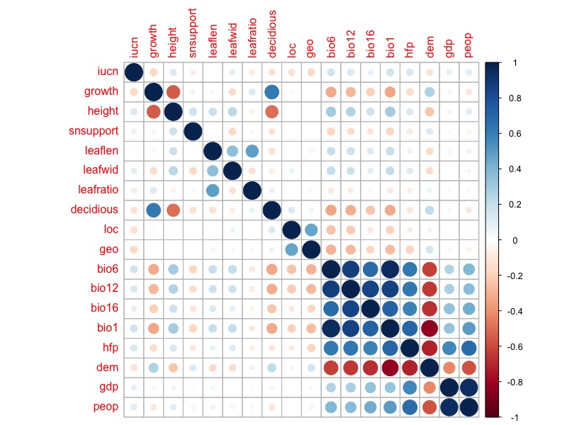
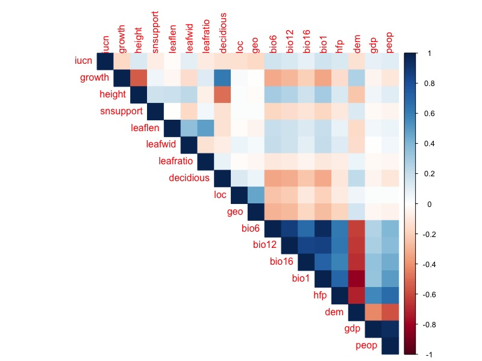
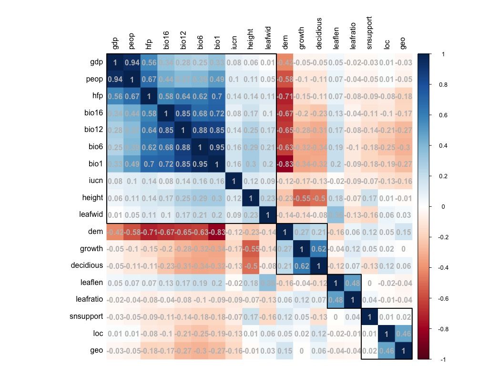
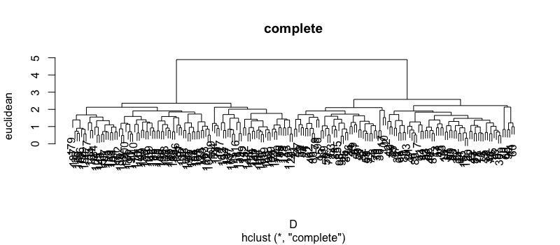

# R语言入门与简单数据分析
## 前言
本科时期用SAS的老师说用Excel做出来的图期刊不会接受，教SPSS的老师说只有标了用SPSS做的数据那些编辑才会相信，而这时候用Matlab的人又站出来说在座的各位都是垃圾。说到底数据科学最终追求的处理工具应当是一种可以在数学处理上有着极其丰富的手段，而在图表输出上有着最大自由的工具，这些，~~Matlab~~R语言都可以做到。但是功能越自由则操作越难，人们总是希望有一个GUI甚至最好是语音操控就可以轻松处理数据，但实际上我们却要在GitHub或者CSDN上苦苦寻找一下午的代码来完成一些简单的回归统计。
R语言在其他学科中属于小角色，但是在生态学中，由于其开源、灵活、免费、简单，因此已经有超过50%的相关学者选择R语言作为他们的研究工具，而当前的生态相关的sci文章中，也有超过50%的文章使用R语言完成其科研分析，其中使用频次最多10个包是lme4, vegan, nlme, ape, MuMIn, MASS, mgcv, ade4, multcomp和car。

因此在这篇R学习当中，我希望
1. 分享学习R语言的进度，同时也是给自己增加一些学习的压力与动力。
2. 避免不求甚解，成为无情的代码搬运工，我希望可以从数学出发，对R语言的分析做一个“面向对象”又“直达底层”的综述。
[TOC]
## 从安装R和Package开始
### 安装R 
不多说
可以安装一下R Studio，这是一个R语言的IDE，它还拥有比较强大的调试功能，也支持纯R脚本和Rmarkdown（这在下载一些R的联系教程时格外有用！），下载时选择免费版即可。
tips：在Rstudio中，我们可以设置断点来分段检查bug。
这里还要推荐一个环境管理软件**Anaconda**。Anaconda可以创建多个互不干扰的环境（类似python的env），分别运行不同版本的软件包。Anaconda还自带了Jupyter Notebook，可以灵活地记笔记，运行与交互，是机器学习的终极伙伴。同时这个软件也自带R studio，几乎集成了你能知道的所有数学分析工具，吹就完事儿了。
### R Packages
R包是R语言的精华，只要会装r包，那恭喜你可以成为数据科学家了
我们通过：
```r
install.packages()
```
在选择适合自己的CRAN镜像后安装我们想要的R包。R包的安装是套娃式的，我们往往装一个R包会提示需要许多前置R包，然后不知不觉就装了几百个R包。我们可以通过：
```r
installed.packages()
```
来单纯看看有什么包，或通过：
```r
rp <- available.packages()
> dim(rp)
```
看看包和他们的版本，不过有时候莫名安装过了而且是最新的但是还是说没有，还得重新装一遍，也挺奇怪的。
那么，如何知道我们想要什么包呢？
1. 在我们阅读的（导师塞给你的）文献中，作者在分析时往往会给出他使用的R包的名称。
2. 我给你们塞一些必备R包orz（不针对特定专业）

**工具类：** readxl包可以直接读取excel的数据，tidyxl和tidyr包可以整理乱七八糟的excel；dplyr包则是归类整理excel等这种数据集的最强包；RMySQL包可以和SQL对接；smartdata包可以做数据预处理（这里推荐基于python的pandas_profiling做数据预览，铁爽).  
**绘图类：** gplots可以做数据可视化，ggplot2包可以用来画你想要的任何图，而ggraph包可以拓展ggplot2的各种功能。vioplot用于制作小提琴图，rainbow用于画彩虹图、箱形图和条形图。rgl包则可以在R中实现3D交互可视化。  
**统计类：** car包用于方差分析、lme4包和nlme包用于实现线性/非线性的混合效应模型，rendomForest包可以实现机器学习中的随机森林模型，multcomp包则可以进行多重比较分析,MuMIn包则可以用来解决混合效应模型。  
**深度学习：** nnet包是最简单的一个单层的神经网络的包，neuralnet则是一个多层多节点的神经网络算法包，keras包则是一个基于TensorFlow的Keras接口（API)，automl则是一个基于元启发的（如蚁群算法、粒子群算法）的深度学习包。

之后我想通过一个个场景的训练/尝试来介绍每个场景中遇到的R包和R包后的数学原理以及这些R包的使用方法。
## R的基本操作
首先，遇事不决就在函数前加问号，可以获得大多数你想要的。
我们可以查看或指定我们R语言的运行空间：可以把我们的数据等等文件放在空间里这样只需要数据的标题就能直接被R引用了。
```r
#查看当前r的运行位置
getwd()
#指定一个运行位置
setwd("你要的什么地方")
```
我们可以在我们的运行位置创建一系列子文件夹便于我们的工作
```r
#比如创建一个临时文件夹
dir.create("Temp")
#也可以用这个函数看看当前工作目录下的所有子文件夹
dir()
#可以直接通过“.."来返回主目录
```
R语言是面向对象的语言，我们有六种对象可以选择：矢量（Vector），因子（Factor），矩阵（Matric），数据框架（data frame），表（list）和函数（functions）：
### Vectors
可以分为数字向量、特征向量和逻辑向量，主要解释一下最后一个这个Logic Vector:
其元素只有3个——True，False，NA（not available）
例如：
```r
a >= 1   # 'a' is higher or equal to 1? (TRUE)
is.factor(ex) # It is a factor? (FALSE)
```
### Matric
因子就不谈了，而矩阵是向量的多重排列。我们可以通过下面的函数来查看/统计/修改矩阵：
```r
#首先创建一个矩阵
matx <- matrix(1:45, nrow = 15)
rownames(matx) <-  LETTERS[1:15]
colnames(matx) <- c("Sample01", "Sample02", "Sample03")
#打开矩阵
matx
#可以看看这是什么样的数据
class(matx)
#通过中括号选择矩阵中某一行和列
matx[, 1]
matx[1, ]
#看看矩阵的首尾
head(matx)
tail(matx)
#紧凑地显示对象的内部结构
str(matx)
#总览
summary(matx)
```
在一般情况下，例如，当我们使用head()探索数据时，该函数将仅返回矩阵的前6行，但是，我们可以在该函数中添加另一个参数。 例如，head(matx，10)，只需在逗号后加上数字10就可以看到前10行。 当矩阵大于500行时，此简单操作特别有用。
### Data frame
Data frame数据帧和矩阵的不同之处在于其可以处理不同类型的向量，感觉上去和excel表格是差不多意思。
```r
#创建一个数据帧
df <- data.frame(species = c("rufus", "cristatus", "albogularis", "paraguayae"), habitat = factor(c("forest", "savanna", "urban", "transition")), high = c(10, 2, 7, 4), distance = c(3, 9, 5, 6))
#按类显示
class(df)
#尝试将上一个矩阵转为数据帧
matx2 <- as.data.frame(matx)
#按类显示看看有什么不同
class(matx2) 
str(df)
```
### List
List是一连串的对象：
```r
lst <- list(data, df, matx)
str(lst)
class(lst)
#使用双括号[[]]即可检查我们list中的对象
lst[[1]]
```
## 水平分析
### 入门单因素方差分析
通过r语言自带的函数（aov）即可进行简单的单因素方差（ANOVA）分析，我们可以比较因素A在r个水平下实验结果的差异究竟是随机的还是与水平相关的。
有这样一组数据：
```r {class=line-numbers}
organ.name<-factor(rep(c("root","stem","leaf","flower"),c(4,6,8,6)))
exp.gen<-
  c(0.5,0.46,0.23,0.29,0.2,0.11,0.14,0.14,0.13,0.19,0.19,0.19,0.34,0.43,0.57,0.75,0.78,0.71,0.88,0.39,0.45,0.28,0.53,0.88)
#可以通过t检验进行均值比较分析
pairwise.t.test(exp.gen,organ.name)
#也可以进行anova分析
aov(exp.gen~organ.name)
#将数据变为data.frame格式以便在ggplot2中打开
d <- data.frame(organ.name,exp.gen)
#打开相关包，似乎直接加载ggpubr就行了？
library("ggplot2")
library("magrittr")
library("ggpubr")
#接下来是标注并导出图片,使用ggplot添加箱型图与数据
p<-ggboxplot(d,x="organ.name",y="exp.gen",palette = c("#00AFBB", "#E7B800", "#FC4E07"))
#添加比较的对象
my_comparisons <- list(c("flower", "leaf"), c("leaf", "root"), c("root", "stem"))
#再添加anova分析，设置y轴高度为1.2（以便显示anova分析的值）
p+stat_compare_means(comparisons = my_comparisons) +
  stat_compare_means(method = "anova",label.y = 1.2)
```

接下来可以根据p值绘制带有标注的anova图：
```r
p + stat_compare_means(method = "anova",label.y = 1) +
  stat_compare_means(label = "p.signif", method = "t.test", ref.group = ".all.")
```

## 相关分析
### cor函数
在R语言中，通常使用cor函数进行相关系数分析，可以分别指定向量，也可以指定给cor函数一个数据框。
```r
cor(x,y=NULL,use="everything",method= c("pearson","kendall","spearman"))
```
其中`use`用来处理缺失值，有`everything`，`all.obs`，`complete.obs`，`pairwise.complete.obs`和`na.or.complete`5种
`method`默认是pearson相关系数，适用于连续变量，kandall适用于分类变量，spearman适用于分类定序变量（如大中小三类等等）。
#### 秩相关检验
```r
cor.test(x, y, alternative = c("two.sided", "less", "greater"), method = "spearman", conf.level = 0.95, ...)
```
### corrplot包
基本语法如下：
```r
corrplot(#需要可视化的相关系数矩阵
        corr,
        #method为可视化的方法
	method = c("circle", "square", "ellipse", "number", "shade", "color", "pie"),
        #展示方式
	type = c("full", "lower", "upper"), add = FALSE,
        #col指定展示的颜色，bg为背景的颜色，is.corr为为相关系数绘图
	col = NULL, bg = "white", title = "",  is.corr = TRUE,		
        #diag为是否显示对角线上的结果，outline为是否绘制轮廓，mar为图形的四边间距
	diag = TRUE, outline = FALSE, mar = c(0,0,0,0),
        #addgrid.col当选择的显示方法为颜色或阴影时默认的网格线为白色，否则为灰色
        #addCoef.col为相关系数添加颜色，默认不添加相关系数，只有方法为number时，该参数才有作用
        #addCoefasPercent为节省空间将相关系数转为百分比格式
	addgrid.col = NULL, addCoef.col = NULL, addCoefasPercent = FALSE, 
        #指定相关系数排序的方法，可以是原始顺序(original)、特征向量角序(AOE)、第一主成分顺序(FPC)、层次聚类顺序(hclust)和字母顺序，一般”AOE”排序结果都比”FPC”要好
	order = c("original", "AOE", "FPC", "hclust", "alphabet"),
        #当order为hclust时，该参数可以是层次聚类中ward法、最大距离法等7种之一
	hclust.method = c("complete", "ward", "single", "average",
                      "mcquitty", "median", "centroid"),
        #当order为hclust时，可以为添加相关系数图添加矩形框，默认不添加，想添加的话=随便一个数，rect.col与lwd指定矩形框的颜色与线框
	addrect = NULL, rect.col = "black", rect.lwd = 2,
        #指定文本标签的位置（lower为左边和对角线，upper为顶与对角线，full为左边和顶部）与大小
	tl.pos = NULL, tl.cex = 1,
        #文本颜色等等
	tl.col = "red", tl.offset = 0.4, tl.srt = 90,
        #图例位置与颜色等等
	cl.pos = NULL, cl.lim = NULL,
	cl.length = NULL, cl.cex = 0.8, cl.ratio = 0.15, 
	cl.align.text = "c",cl.offset = 0.5,
	addshade = c("negative", "positive", "all"),
        #只有当method=shade时，该参数才有用，参数值可以是negtive/positive和all，分表表示对负相关系数、正相关系数和所有相关系数添加阴影。注意：正相关系数的阴影是45度，负相关系数的阴影是135度
	shade.lwd = 1, shade.col = "white",
	p.mat = NULL, sig.level = 0.05,
	insig = c("pch","p-value","blank", "n"),
	pch = 4, pch.col = "black", pch.cex = 3,
	plotCI = c("n","square", "circle", "rect"),
	lowCI.mat = NULL, uppCI.mat = NULL, ...)
```
加载相关程序包，数据为非公开数据
```r
library(corrplot)
```
可以准备一个数据集：
```r
cor <- read.csv("cor.csv", header = T)
```
计算样本间的相关系数：
```r
matrix <- cor(cor)
```
绘图：
```r
#不设置参数
corrplot(corr=matrix)
```

控制单元格形状和内容：
```r
# 换用不同method，分别显示数字和颜色（method can be "circle", "square", "ellipse", "number", "shade", "color", "pie"）
# method 默认为“circle”
corrplot(matrix, method = "number")
#只展示上三角的一半，并且内容改为方块
corrplot(matrix, type = "upper", method = "color")  
```

设置可以混合显示：
```r
corrplot.mixed(matrix, lower = "number", upper = "ellipse",lower.col = "black", number.cex = 1)  
#tl.col 修改对角线的颜色,lower.col 修改下三角的颜色，number.cex修改下三角字体大小
```

对变量进行聚类等：
```r
corrplot(corr=matrix,method = "color",order = "hclust",tl.col="black",addrect=4,addCoef.col = "grey")
```

## 聚类分析
### 系统聚类
将分类的对象按照数据本身的特征的不同进行分类的方法称为聚类分析法。其中对样品进行聚类称为Q型聚类，而对变量进行聚类称为R型聚类。
在聚类分析中我们通过举例与相似系数来对各种数据进行聚类，与距离有关的参数为“马氏距离”，“欧氏距离”，“兰氏距离”，而与相似度有关的参数为“相关系数”和“余弦夹角”，在确定了数据间的这些系数后，我们可以根据最短距离法、最长距离法、中间距离法、离差平方和（ward）法、重心法和类平均法来进行分类。
可以使用一个非发布的R包“mvstats”进行各类聚类计算，数据与包在[我的github](https://github.com/Vendredii/Rstats)中：
```r
#X为数据矩阵/数据框，d为各类计算方法，m为系统聚类方法，proc为是否输出聚类过程，plot为是否绘图
H.clust <- function(X, d = "euc", m = "comp", proc = F, plot = T)
```
我们使用相关数据进行练习：
```r
#导入数据
d1<-read.csv("/Users/desktop/r/comdata.csv", header = T)
#如果这样做的话似乎表头就会自动附带一列行号而且删不掉，不知道为什么，因此我们用其他方式导入数据
#使用openxlsx包
library(openxlsx)
d1 <- read.xlsx("/Users/desktop/r/comdata.xlsx",rowNames = TRUE)
#基于最短距离法画图
H.clust(d1,"euclidean","single",plot = T)
#此时尴尬的发现“极为先进”的osx原生不支持UTF-8中文输出，因此画图出来全是乱码
#用plot函数画图，使用family="STKaiti"来支持中文
plot(H.clust(d1,"euclidean","single"),ylab="euclidean",main="single",family="STKaiti")
```
结果如下：

加下来分别使用其他方法再试试：
```r
#最长距离法
plot(H.clust(d1,"euclidean","complete"),ylab="euclidean",main="single",family="STKaiti")
#中间距离法
plot(H.clust(d1,"euclidean","median"),ylab="euclidean",main="single",family="STKaiti")
#类平均法
plot(H.clust(d1,"euclidean","average"),ylab="euclidean",main="single",family="STKaiti")
#重心法
plot(H.clust(d1,"euclidean","centroid"),ylab="euclidean",main="single",family="STKaiti")
#ward法
plot(H.clust(d1,"euclidean","ward"),ylab="euclidean",main="single",family="STKaiti")
```
比较一番我们即可发现北京、上海、浙江、江苏、广东、天津、福建处在消费能力的第一梯队。
### kmeans聚类
使用系统聚类的方法时一旦样本量数据较大，可能会死机，因此可以使用K均值法进行快速且准确的聚类，该方法是将数据随机分成k个聚类然后根据平方误差准则不断迭代来实现的。但是kmeans只能产生我们制定数量的聚类结果而且其对==噪声==很敏感，而系统聚类法则可以自动产生一系列的聚类结果。
```r
#x为数据框，centers为聚类数/初始聚类中心
kmeans(x,centers,...)
```
下面模拟正态随机变量$x\sim N(\mu ,\sigma ^2)$并进行kmeans聚类：
```r
#模拟一个有1000个均值为0，标准差为0.3的正态分布随机数，它们被分成一个共有10列的矩阵中
x1=matrix(rnorm(1000, mean = 0, sd = 0.3), ncol = 10)
#模拟一个有1000个均值为1...
x2=matrix(rnorm(1000, mean = 1, sd = 0.3), ncol = 10)
#利用rbind()把向量按行合并（cbind()为按列合并
x = rbind(x1, x2)
#先用系统聚类看看
H.clust(x, "euclidean", "complete")
```
这图炸了啊

```r
#再用kmeans看看，分为两类进行聚类
cl = kmeans(x,2)
#pch为point character之意，对第一类我们标记为1，用rep函数循环100次标记在图上
pch1 = rep("1",100)
pch2 = rep("2",100)
#通过col函数按聚类分色，pch函数指定描点的样式，cex函数指定点的大小
plot(x, col = cl$cluster, pch = c(pch1,pch2),cex = 0.7)
#将每类的中心点标出来
points(cl$centers, col = 3, pch = "*", cex = 3)
```
从结果上看kmeans聚类确实能将均值为1的数和均值为0的数有效区分开：

## 主成分分析
对于某一问题可以同时考虑多种变量时，我们通过主成分分析将这些变量放在一起处理并选出做主要的变量。从数学角度而言，求主成分就是寻找$\textup{X}$的线性函数$\theta \textup{X}$，使相应的方差达到最大。
我们将原始数据标准化并求相关矩阵，获得相关矩阵的特征值和特征向量，通过计算方差贡献率和累计方差贡献率来获得每个主成分的贡献率，进而得到综合评价函数。关于主成分分析的原理，详见CSDN上的李春春_的[一篇博文](https://blog.csdn.net/zhongkelee/article/details/44064401)。
```r
#主成分分析函数，x为数据框；cor为是否使用相关阵，默认为协差阵；scores为是否输出成分得分
princomp(x, cor = FALSE, scores = TRUE,...)
#碎石图函数，obj为主成分分析对象，type为图形类型
screeplot(obj, type = c("barplot", "lines"),...)
#自编综合得分函数，需要mvstats包，PCA为主成分对象，m为主成分个数，plot为是否画图
princomp.rank <- function(PCA, m = 2, plot = F)
```
下面使用上面的各省消费数据进行实际使用：
```r {class=line-numbers}
library(mvstats)
library(openxlsx)
#在这里导入csv会报错，好像原因和上面一样...
#一个想法，会不会是我数据以字符串储存而不是以数字储存所以除了问题，可以用data_m$d1 <- as.numeric(data_m$d1)来变换
d1 <- read.xlsx("/Users/calice/desktop/r/comdata.xlsx",rowNames = TRUE)
#计算相关系数
cor(d1)
#主成分分析
PCA = princomp(d1, cor = T)
summary(PCA)
#主成分载荷
PCA $loadings
#绘制流石图
screeplot(PCA, type = "lines")
#选取贡献率占80%的前两个主成分，计算主成分得分
PCA$scores[,1:2]
#主成分排名并绘图
princomp.rank(PCA, m = 2, plot = T)
#但是弱智mac无法显示中文，因此我们先将结果导出为csv，给地区变量价格name的title再加载进来？
d2 <- write.csv(princomp.rank(PCA, m = 2))
d2 <- read.csv("/Users/calice/desktop/PCA.csv", header = T)
#使用theme函数设定的字体对于geom_text并没有用，所以只能在geom_text中单独设置字体为STKaiti才能显示中文
ggplot(d2, aes(x = Comp.1,y = Comp.2))+
  geom_point()+
  geom_text(aes(y = Comp.2 + .2, label = name), family = "STKaiti")
```
流石图：

最后结果：

也可以通过biplot()来绘制更加时尚的主成分分析图：
```r
#osx用户需要设定family，win就不用了
biplot(PCA, family = "STKaiti")
```
就很nb。

## 统计检验
假设检验的目的是看看数据是否有差异，数据、因子、结果等等的不同究竟是真的不同，还是其实就是随机的一些变化呢？如果检验成立，那就说明这些数据之间确实是有显著不同的，不是随便凑数的。
首先是[关于各种分布的解释](https://blog.csdn.net/anshuai_aw1/article/details/82735201)
### 关于分布的检验
#### W检验（Shapiro–Wilk test）
```r
shapiro.test()
```
当p值小于某个显著性水平α(比如0.05)时，则认为样本不是来自正态分布的总体，否则则承认样本来自正态分布的总体。
#### K检验（Kolmogorov-Smirnov test）
```r
ks.test()
```
如果P值很小，说明拒绝原假设，表明数据不符合F(n,m)分布。

### 参数检验
参数假设检验，是指对参数平均值、方差进行的统计检验，条件是总体分布已知（比如已知是正态分布等等）。
#### 学生检验t-test
做t-test的目的是为了检验在符合正态分布的样本中两个平均数是否有显著的差异，且该样本的总体方差也是未知的，否则可以用u检验。适用用样本总数较少的情况，但有研究说样本总数小于20时也尽量避免t检验。
```r
t.test(x, y = NULL,
       alternative = c("two.sided", "less", "greater"),
       mu = 0, paired = FALSE, var.equal = FALSE,
       conf.level = 0.95, ...)
```
其中x（和y）为进行检验的数据，`alternative`为设定的备择假设，默认为双尾，`mu`单样本检验时设定的均值（检验是否超过均值为准）,`var.equal`双样本检验时方差是否相等。

当双样本时：
要比较的两个样本的总体方差未知，但相等时（判断方差是否相等可以借助方差同质性检验**F-test**），可以使用t-test。

#### 方差同质性检验f-test
这是检验两个正态随机变量的总体方差是否相等的一种假设检验方法。
```r
var.test(x, y, ratio = 1,
         alternative = c("two.sided", "less", "greater"),
         conf.level = 0.95, ...)
```
`var.test()`的零假设是x和y的方差比值（ratio）为1（默认），即是x与y的方差相等。

**成组数据**（pooled data）是两个样本的各个变量从各自总体中抽取，也就是说两个样本间的变量没有任何关联，两个抽样样本彼此独立。成组数据的两个样本的容量未必相同，但是**方差需要相等**才能进行t-test。
```r
t.test(x, y, var.equal = T)
```
**配对样本**（paired data）的比较要求两个样本间配偶成对，每一对样本除随机地给予不同处理外，其他实验条件应尽量一致。即为配对，两样本的容量必定相等。
```r
t.test(x, y, var.equal = T, paired = T)
```
#### 二项分布的总体假设检验
```r
#例：某蔬菜种子的发芽率为p=0.85. 现随机抽取500粒种子，
#用药水处理一下，然后测的发芽的种子数为445粒。
#请问药水有没有提高发芽率的作用。
#p值很小，接受对立假说，有好的作用
#95%的置信区间不包括0.85
binom.test(445,500,p=0.85,
           alternative="greater")
```
`alternative`参数中的双边还是单边（大于和小于）就是接受的假设是要双边呢（离假设很远），或者好于假设或者差于假设。
### 非参数检验
#### 皮尔森卡方检验
皮尔森建立了一个准则，以判定一组相关变量与其或然值的偏差，可否被合理地解释为是由于随机抽样所致。
检查两个数据集中的类别分量是否不同，在统计中会碰到离散型数据与计数数据，比如性别分男、女，某个问题的态度分为赞成、反对，成绩可分优良差，能力可分高中低。对这类数据的统计处理的假设检验一般用计数数据的统计方法进行非参数检验。
卡方检验主要用于两个方面，一是对总体分布进行拟合性检验，检验观查次数是否与某种理论次数相一致。
二是独立性检验，用于检验两组或者多组资料相互关联还是彼此独立。
下面就是皮尔逊卡方独立性检验：
```r
chisq.test()
```
p<0.05即为显著差异。有时候会提示不够精确那么就可能需要`fisher.test()`进行费舍尔精确检验了。
#### Kruskal-Wallis检验
秩和检验是一种非参数检验法, 它是一种用样本秩来代替样本值的检验法；秩和检验可以用于样本容量不相等的两个或多个样本。
用于两两检验，看看a（离散？）是否与b有关
例如：
先进行总体的：
```r
library(spdep)
library(pgirmess)
A=c(3.5,4.0,6.7,5.6,8.9,7.8)
B=c(4.5,3.0,8.0,5.4,6.9,2.8,7.7,3.9)
C=c(2.1,4.8,3.3,8.8)
jianyan=list(A,B,C)
kruskal.test(jianyan)
```
再进行两两的：
```r
resp<-c(3.5,4.0,6.7,5.6,8.9,7.8,4.5,3.0,8.0,5.4,6.9,2.8,7.7,3.9,2.1,4.8,3.3,8.8) #将A，B，C三组数据依次放在一个向量里
categ<-factor(rep(1:3,c(6,8,4))) #6,8,4依次为A,B,C对应的样本容量
kruskalmc(resp, categ, probs=0.05)  #②再使用kruskalmc函数做两两样本的比较
```
Kruskal–Wallis秩和检验有时得不到精确的p值，对于Kruskal–Wallis秩和检验差异显著的多个样本，想知道具体差异在哪些样本之间同时又想获得精确的p值，可以采用Nemenyi进行两两样本检验，方法如下：
```r
install.packages("PMCMRplus")
library(PMCMRplus)
library(PMCMR)
posthoc.kruskal.nemenyi.test(jianyan)  #未校正
posthoc.kruskal.nemenyi.test(jianyan,dist="Chisq") #校正
```
对csv数据：
```r
kruskal.test(data, a ~ b)
```
```r
library(pgirmess)
library(coin)
library(multcomp)
kruskalmc(zhi~group, data = cd, probs=0.05)
```
Nemenyi进行两两样本检验
```r
library(PMCMR)
posthoc.kruskal.nemenyi.test(zhi~group,data=cd) #未校正
posthoc.kruskal.nemenyi.test(zhi~group,data=cd,dist="Chisq")
```
#### Wilcoxon秩检验
```r
wilcox.test(x, y = NULL, alternative = c("two.sided", "less", "greater"), mu = 0, paired = FALSE, exact = NULL, correct = TRUE, conf.int = FALSE, conf.level = 0.95, ...)
原假设：中位数大于，小于，不等于mu, p < 0.05 时拒绝原假设
```