# 生物多样性
生物多样性是生态学研究的基础，我们将在系统发育、功能性状、地理分布等方面详细探讨如何研究生物多样性。同时也会涉及许多生物信息学的内容，那么生物信息学非常有用，据说当前生物信息学的平均年薪已经接近10w刀，所以学习相关知识对于我们未来的发展非常重要。
Jesús N. Pinto-Ledezma and Jeannine Cavender-Bares
[TOC]
## 系统发育数据基础
了解数据对于研究生物多样性非常重要，而现在使用的一个常见数据是描述谱系之间以及谱系之间的进化关系的系统发育树。从这里到本简短教程的结尾，我们将尝试解释如何导入/导出和处理系统发育信息的基础知识。
### 一些格式
储存系统发育树的最常见格式是Newick，Nexus(Maddison et al. 1997)。
Newick格式将系统发育关系表示为”**(**“，”**,**“，”**:**“，具体如下：
括号将谱系链接到树的特定节点，而逗号“，”将从该节点下降的谱系分隔开。 节点名称后可以使用冒号标点“：”，后续数字值表示分支长度。 最后，用分号标点“;” 表示系统发育树的末端：
```r
library(ape)
#建树
newick_tree <- "((A:10,B:9)D:5,C:15)F;"
#读树
newick_tree <- read.tree(text = newick_tree)
#画树
plot(newick_tree, show.node.label = TRUE)
```
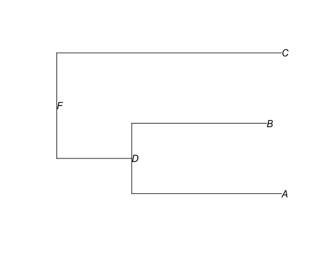
还有一种格式是Nexus，它有着更大的灵活性。
```r
#首先在工作目录里创建一个Nexus文件的树
cat(
 "#NEXUS
 BEGIN TAXA;
 DIMENSIONS NTAXA=3;
 TaxLabels A B C;
 END;
 BEGIN TREES;
 TREE=((A:10,B:9)D:5,C:15)F;
 END;",
file = "Data/Nexus_tree.nex"
)
#读树（使用read.nexus）
nexus_tree <- read.nexus("Data/Nexus_tree.nex")
#画树，图和上面一样，就不放了
plot(nexus_tree, show.node.label = TRUE)
#可以检查我们的树
#概览我们的树
str(nexus_tree)
#List of 5
# $ edge       : int [1:4, 1:2] 4 5 5 4 5 1 2 3
# $ edge.length: num [1:4] 5 10 9 15
# $ Nnode      : int 2 ##节点数？
# $ node.label : chr [1:2] "F" "D"
# $ tip.label  : chr [1:3] "A" "B" "C"
# - attr(*, "class")= chr "phylo"
# - attr(*, "order")= chr "cladewise"
nexus_tree$tip.label
#[1] "A" "B" "C"
#查看枝长
nexus_tree$edge.length
#[1]  5 10  9 15
#nexus_tree$edge
#可以查看发育树的边的矩阵。在此矩阵中，每一行代表树中的一个分支，第一列显示该分支的祖先节点的索引，第二列显示该分支的后代节点。
nexus_tree$edge
#[,1] [,2]
#[1,]    4    5
#[2,]    5    1
#[3,]    5    2
#[4,]    4    3
#这些数据让人摸不着头脑，我们可以在树上显示数字代号以便理解
plot(nexus_tree, show.tip.label = FALSE)
nodelabels()
tiplabels()
```
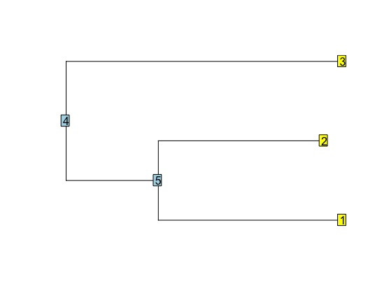
最后，系统发育树也可以列表的形式导入，并且在系统发育比较方法中，系统发育树的列表称为multiPhylo，我们可以两种格式导入/导出这些multiPhylos。
```r
#模拟10个不同的系统发育树，每个系统发育树内有5个种
multitree <- replicate(10, rcoal(5), simplify = FALSE)
#将这些一起保存为一个multiPhylo项目
class(multitree) <- "multiPhylo"
#把其中的第10个发育树画出来
plot(multitree[[10]])
#分成2行2列来显示下面4个发育树
par(mfrow = c(2, 2))
#下面是四个发育树
plot(multitree[[1]])
plot(multitree[[3]])
plot(multitree[[7]])
plot(multitree[[10]])
```
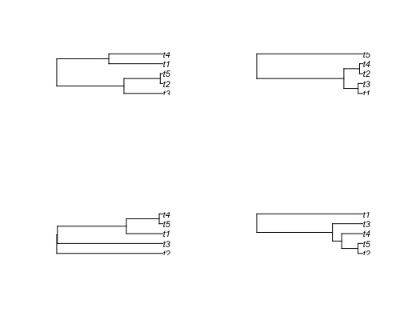
```r
#导入导出这些数据
#作为newick导入
write.tree(phy = multitree, file = "Data/multitree_example_newick.txt")
#导出
multitree_example_newick <- read.tree("Data/multitree_example_newick.txt")
#查看
multitree_example_newick
#10 phylogenetic trees
#作为nexus导入
write.nexus(phy = multitree, file = "Data/multitree_example_nexus.nex")
multitree_example_nexus <- read.nexus("Data/multitree_example_nexus.nex")
multitree_example_nexus
#10 phylogenetic trees
```
### 循环与算法
编程中最重要的就是活用**for**进行循环，其基本结构是：`for (variable in vector 向量中的变量) {execute defined statements执行定义的语句}`
在编程时，通常使用循环变量**i**来确定步数因为**i**是iteration一词的第一个字母，不过你也可以使用任何字母或单词作为循环变量。
```r
#cat函数将里面的数据排排站输出
for (i in 1:10){
    cat(i, sep = '')
}
#12345678910
#让1-10的数据换行输出，结果不列
for (i in 1:10){
  cat(i, sep = '\n')
}
BioSciNames <- c("Jeannine", "Jesús", "Bailey","Kalli", "Ariadna", "Samantha", "Maxell",
                 "Sara", "Nicholas", "Carmen", "Ashley", "Mikkel", "Shana", "Kirsten",
                 "Lucy", "Joe", "Joshua")
for (i in 12:length(BioSciNames)){
  cat("Hi,", BioSciNames[i], ", welcome to the first practice!","\n");
}
#从第12个人开始套娃输出这句话
#Hi, Mikkel , welcome to the first practice! 
#Hi, Shana , welcome to the first practice! 
#Hi, Kirsten , welcome to the first practice! 
#Hi, Lucy , welcome to the first practice! 
#Hi, Joe , welcome to the first practice! 
#Hi, Joshua , welcome to the first practice!
```
[返回目录](#%e7%94%9f%e7%89%a9%e4%bf%a1%e6%81%af%e5%ad%a6)
## 在群落中运用系统发育数据
有关该章节的相关课程：“Modern Phylogenetic Comparative Methods and Their Application in Evolutionary Biology”（Garamszegi，2014）（http://www.mpcm-evolution.org/） 和 “Phylogenies in Ecology”。 （Cadotte and Davies，2016）（https://www.utsc.utoronto.ca/~mcadotte/page-3/）。
需要安装许多包加载许多数据：
```r
package.names <- c('permute', 'picante', 'pez', 'car', 'vegan', 'MASS', 'ecodist', 'FD', 'adephylo', 'phytools') 
if ( ! (package.names[1] %in% installed.packages())) {install.packages(package.names[1], dependencies = T)}
#也可以这样
missing_pkgs <- package.names[which(!package.names %in% installed.packages())]
install.packages(missing_pkgs)
#设置可以搞一个循环
package.names <- c('ape', 'picante', 'pez', 'car', 'vegan', 'MASS', 'ecodist', 'FD', 'adephylo')
for (pkg in package.names) {
  if (!require(pkg, character.only = TRUE, quietly = TRUE)) {
    install.packages(pkg)
    library(pkg, character.only = TRUE)
  } 
}
#加载系统发育数据
trMB <- ape::read.tree("Rstats/ALLMB.CCESR.tre")
#查看数据的一些特征
length(trMB$tip.label)
head(trMB$tip.label)
#加载群落数据，2-5列
BBSraw <- read.csv("Data/BBSpecies.biomass.2014.csv")[2:5]
bio.dat <- BBSraw
head(bio.dat)
#Year Plot Biomass.g.m2                Species
#1 2014    2         1.42     Aristida basiramea
#2 2014    2         0.92            Cyperus sp.
#3 2014    2         0.02          Digitaria sp.
#4 2014    2         0.02 Euphorbia glyptosperma
#5 2014    2       182.12     Lespedeza capitata
#6 2014    2        22.03   Miscellaneous litter
#将空格替换为_
bio.dat$Species <- gsub(" ", "_", bio.dat$Species)
#将Plot和year用；连接起来
bio.dat$Plot.Year <- paste(bio.dat$Plot, bio.dat$Year, sep = ";", collapse = NULL)
#调整列的顺序
bio.dat <- bio.dat[, -c(1, 2)]
bio.dat <- bio.dat[, c(3, 1, 2)]
#修改错误的种名
bio.dat$Species <- gsub("Petalostemum_purpureum", "Dalea_purpurea", bio.dat$Species)
bio.dat$Species <- gsub("Petalostemum_candidum", "Dalea_candida", bio.dat$Species)
bio.dat$Species <- gsub("Petalostemum_villosum", "Dalea_pulchra", bio.dat$Species)
bio.dat$Species <- gsub("Taraxicum_officinalis", "Taraxacum_croceum", bio.dat$Species)
bio.dat$Species <- gsub("Leptoloma_cognatum", "Digitaria_ciliaris", bio.dat$Species)
bio.dat$Species <- gsub("Artemisia_.caudata._campestris", "Artemisia_caudata", bio.dat$Species)
bio.dat$Species <- gsub("Achillea_millefolium.lanulosa.", "Achillea_millefolium", bio.dat$Species)
bio.dat$Species <- gsub("Euphorbia_.supina._maculata", "Euphorbia_supina", bio.dat$Species)
bio.dat$Species <- gsub("Tragopogon_dubius_.major.", "Tragopogon_dubius", bio.dat$Species)
bio.dat$Species <- gsub("Ambrosia_artemisiifolia_elatior", "Ambrosia_artemisiifolia", bio.dat$Species)
bio.dat$Species <- gsub("Andropogon_gerardi", "Andropogon_gerardii", bio.dat$Species)
bio.dat$Species <- gsub("Erigeron_canadensis", "Erigeron_canadense", bio.dat$Species)
#使用循环语句修改错误的种名
oldsp <- c("Petalostemum_purpureum", "Petalostemum_candidum", "Petalostemum_villosum", 
           "Taraxicum_officinalis", "Leptoloma_cognatum", "Artemisia_.caudata._campestris",
           "Achillea_millefolium.lanulosa.", "Euphorbia_.supina._maculata",
           "Tragopogon_dubius_.major.", 
           "Ambrosia_artemisiifolia_elatior","Andropogon_gerardii", "Erigeron_canadensis")

newsp <- c("Dalea_purpurea", "Dalea_candida", "Dalea_pulchra", 
           "Taraxacum_croceum", "Digitaria_ciliaris", "Artemisia_caudata", 
           "Achillea_millefolium", "Euphorbia_supina", "Tragopogon_dubius", 
           "Ambrosia_artemisiifolia", "Andropogon_gerardii", "Erigeron_canadense")

for(i in 1:length(oldsp)){
  cat("FROM", oldsp[i], "TO", newsp[i], "\n")
  bio.dat$Species <- gsub(oldsp[i], newsp[i], bio.dat$Species)
}
```
好，到目前为止，我们已经加载了系统发育并更新了群落数据中的物种名称，但是，系统发育是Smith和Brown（2018）的完整系统发育，总共包括356305种（`length(trMB $ tip.label)`） 。现在，我们将准备一个系统发育系统，以仅包括我们群落中存在的物种。
```r
library("ape")
#获得bigbio的物种名录
#将bio.dat中的Species导为spnames
spnames <- unique(bio.dat$Species)
#用setdiff求向量trMB$tip.label与spnames中不同的元素
#用drop.tip去掉发育树中的特定类群，就实现了树和群落数据中物种的对齐
trMBcom <- drop.tip(trMB, setdiff(trMB$tip.label, spnames))
#看看哪些是Smith树里没有的
setdiff(spnames, trMBcom$tip.label)
#把bio.bat里的NA缺失数据通过na.omit()函数全删了并转为数据框
bio.dat <- data.frame(na.omit(bio.dat))
head(bio.dat)
#安装相关的包
library(nlme)
library(picante)
#将sample文件转变为matrix文件
BBScom <- data.frame(sample2matrix(bio.dat))
BBScom[1:10, 1:10]
#最后，我们拥有计算不同系统发育多样性指标所需的所有数据
```
### 系统发育多样性指标
在继续之前，请再次检查我们的数据（系统发育和社区）是否匹配！ 为此，我们将使用来自picante软件包的强大功能`match.phylo.com()`。
首先需要清理我们乱糟糟的R环境
然后就可以计算各种指标
```r
#获取存储在环境中的对象的名称
is()
rem <- is()
rem
#查看i中的缺失值
is.na(i)
```
```r
#把群落有的但Smith树没有的数据给drop了
matched <- picante::match.phylo.comm(phy = trMBcom, comm = BBScom)
#现在让我们检查存储在匹配对象中的数据。
matched$comm[1:10, 1:10]
#画出整理对齐后的树
plot(matched$phy, show.tip.label = FALSE)
```
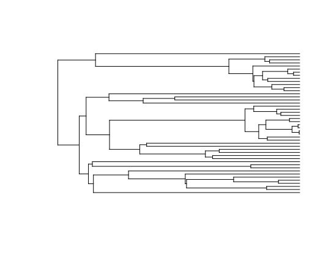
#### PD
PD即为系统发育多样性。现在准备探索一些度量指标以评估群落的表型和系统发育结构。
```r
#群落中总分支长度之和
sum(matched$phy$edge.length)
#计算每个样地的PD
BBSpd <- pd(matched$comm, matched$phy, include.root = FALSE)
head(BBSpd)
#计算相关性，SR为每个样地的物种数量
cor.test(BBSpd$SR, BBSpd$PD)
#物种多样性与系统发育多样性一起作图
plot(BBSpd$SR, BBSpd$PD, xlab = "Species richness", ylab = "PD (millions of years)", pch = 16)
```
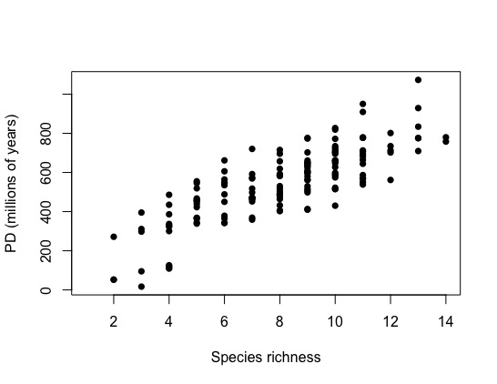
#### MPD与MNTD
两两平均距离(MPD)和两两最近平均距离(MNTD)也是衡量系统发育的重要指标之一。
```r
#计算MPD
dist.trMB <- cophenetic(matched$phy)
#lower.tri()函数可以提取矩阵的下三角部分
dist.trMB <- dist.trMB[lower.tri(dist.trMB, diag = FALSE)]
mean(dist.trMB)
#[1] 224.8141
#计算MNTD
#cophenetic是距离矩阵？
dist.trMB2 <- cophenetic(matched$phy)
#把矩阵的对角线弄成NA
diag(dist.trMB2) <- NA
#通过apply函数，计算dist.trMB2的第2行的最小值
apply(dist.trMB2, 2, min, na.rm = TRUE)
mean(apply(dist.trMB2, 2, min, na.rm = TRUE))
```
可以用picante包更方便地计算MPD和NMTD
```r
#mpd
BBSmpd <- mpd(matched$comm, cophenetic(matched$phy))
head(BBSmpd)
#mntd
BBSmntd <- mntd(matched$comm, cophenetic(matched$phy))
head(BBSmntd)
```
### 群落多样性指标
对群落系统发育的分析可以通过评估本地群落的系统发育来推断构建本地群落的机制。但是，现在可以使用新方法，从而可以将本地和区域范围内的生态过程和历史过程之间更复杂的平衡纳入分析中。
现在，让我们计算一些最常见的指标。
PD-系统发育多样性是一个或多个样品的总系统发育分支长度的总和。它有许多衍生。
#### SES.pd，SES.mpd和SES.mntd
为了消除群落中物种丰富度对系统发育多样性的影响，对系统发育多样性进行标准化即可得到SES.pd指数(standardized effect size of PD)。而对mpd和mntd进行标准化也可以得到相应的指标：SESmpd和SESmntd
```r
BBScdm <- ses.pd(matched$comm, matched$phy, runs = 99)
BBScdm <- BBScdm[, c(1, 2, 6, 7)]
head(BBScdm)
#Rao的二次熵是对生态群落多样性的一种度量，可以选择考虑物种差异（例如系统发生差异）。
#Simpsons，99次零模型得到的结果
BBScdm <- ses.pd(matched$comm, matched$phy, runs = 99)
BBScdm <- BBScdm[, c(1, 2, 6, 7)]
#结果中PDobs表示系统发育多样性的观测值,SES.pd大于0表示群落中较老的物种比较多
head(BBScdm)
#MPD是群落中分类单元的两两平均距离
#SESmpd
BBSsesmpd <- ses.mpd(matched$comm, cophenetic(matched$phy), runs = 99)
BBScdm$MPD <- BBSsesmpd[, c(2)]
BBScdm$sesMPD <- BBSsesmpd[, c(6)]
BBScdm$MPDpval <- BBSsesmpd[, c(7)]
#MNTD是群落中分类单元的两两最近平均距离
#SESmntd
BBSsesmntd <- ses.mntd(matched$comm, cophenetic(matched$phy), runs = 99)
BBScdm$MNTD <- BBSsesmntd[, c(2)]
BBScdm$sesMNTD <- BBSsesmntd[, c(6)]
BBScdm$MNTDpval <- BBSsesmntd[, c(7)]
```
#### PSV，PSR与PSE
谱系变异性指数(PSV)指数能够把群落中全部物种都共同拥有的一个随机性状产生的变异水平进行量化， 并反映出是如何通过系统发育亲缘关系进行变化的。
系统发生物种丰富度（PSR）是样本中物种的数量乘以PSV。
而PSE指数是对PSV指数进行改进的指标，结合了物种丰富度，通过改进能够融合更多的物种信息。
```r
#PSV
BBSpsv <- psv(matched$comm, matched$phy, compute.var = TRUE)
BBScdm$PSV <- BBSpsv[, 1]
#PSR
BBSpsr <- psr(matched$comm, matched$phy, compute.var = TRUE)
BBScdm$PSR <- BBSpsr[, 1]
#PSE
BBSpse <- pse(matched$comm, matched$phy)
BBScdm$PSE <- BBSpse[, 1]
```
#### $_{q}\textrm{D}(p)$
$_{q}\textrm{D}(p)$是一种度量标准，用于衡量社区内物种差异的变化。该指标是对Hill指数的修改，对物种的比例按其系统发育信息进行了加权。
https://onlinelibrary.wiley.com/doi/full/10.1111/j.1600-0706.2012.20607.x
```r
source("RFunctions/qDp.R")
BBSqDp <- qDp(matched$phy, matched$comm, q = 2)
BBScdm$qDP <-	BBSqDp
#最后我们总结上述数据
head(BBScdm, 10)
BBScdm2 <- BBScdm[, c(1, 2, 5, 6, 9, 12, 13, 14, 15)]
names(BBScdm2) <- c("SR", "PD", "RaoD", "MPD", "MNTD", "PSV", "PSR", "PSE", "qDP")
head(BBScdm2)
```
[返回目录](#%e7%94%9f%e7%89%a9%e4%bf%a1%e6%81%af%e5%ad%a6)
## 系统发育与生物多样性
本小结内容与系统发育可视化，为离散和连续性状确定祖源相关信息，性状-发育模型的测试模型，执行回归模型的系统发育校正有关。该课程数据基于Luke Harmon的试验和课程：
http://lukejharmon.github.io/ilhabela/instruction/2015/07/03/PGLS/
我们需要下面这两个数据：
1. anolisDataAppended.csv
2. anolis.phy
这是一组（*Anolis*）安乐蜥属的蜥蜴有关的系统发育数据和性状数据。相关的文件在[我的github](https://github.com/Vendredii/Rstats)可以下载。
### 连续变量：系统发育广义最小二乘法PGLS
来源：R course in Ilhabela, Brazil, June 2015
首先，我们需要安装一些程序包
```r
library(ape)
library(geiger)
library(nlme)
library(maps)
library(phytools)
#打开树
anoleTree <- read.tree('Data/anolis.phy')
#显示一些树的基本信息
anoleTree
#显示分支长度
str(anoleTree)
#显示树内的物种名
anoleTree$tip.label
#树的节点数，完全分支的话会比物种数少一个
anoleTree$Nnode
#所有起点和终点的位置与长度
anoleTree$edge
#显示树的图像
plot(anoleTree)
#树太丑了可以整理一下，把树设为环形，字体大小0.7，填满屏幕
plot.phylo(anoleTree, type="fan", no.margin=T, cex=0.7)
#再加上分支长度和编号变成终极版
plot.phylo(anoleTree, type="fan", no.margin=T, cex=0.7,label.offset=0.1)
nodelabels(cex=0.5)
tiplabels(cex=0.5)
```
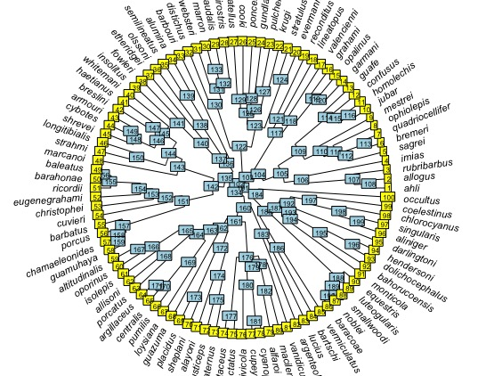
#### 布朗运动模型下的PGLS
在课程中，我们讨论了一种进化模型，称为布朗运动模型。该模型假设特征是根据随机运动从起始状态（z0）演变而来，其随机性由速率参数sigma-squared（sigsq）指定。蜥蜴中的Awesomemess布朗运动的演变是什么样的？
```r
#加入数据
anoleData <- read.csv('Data/anolisDataAppended.csv',row.name = 1)
#可以简单看看数据
View(anoleData)
#Geiger有一个函数可以查看树内的物种是否和数据内的物种名匹配
name.check(anoleTree, anoleData)
#[1] "OK"
#使用awesomeness这一列数据
awe<-anoleData[,"awesomeness"]
#数据向量必须用相关树的尖端名称标记
names(awe)<-rownames(anoleData)
#在课程中，我们讨论了一种进化模型，称为布朗运动模型。该模型假设特征是根据随机运动从起始状态（z0）演变而来，其随机性由速率参数sigma-squared（sigsq）指定。蜥蜴中的Awesomemess布朗运动的演变是什么样的？
brownianModel <- fitContinuous(anoleTree, awe)
brownianModel
#fitted ‘BM’ model parameters:
#	sigsq = 3.943316
#	z0 = 0.246690
```
在这里，您可以看到祖先状态的估计值(z0)和速率参数(sigsq)，以及模型拟合的一些度量。使用最大似然确定模型的拟合，并表示为对数似然。 lnL越高，给定模型的数据就越可能。但是，在比较不同模型时，我们不能使用lnL，因为它不能解决模型之间参数数量的差异。参数更多的模型总会更适合，但它们是否显着更好？例如，一个OU模型具有4个参数(alpha，theta，z0和sigsq)，因此它应比仅包含z0和sigsq的BM模型更好。为了解决这个问题，统计学家开发了另一种适合度的度量标准，称为AIC（赤池信息准则）：AIC =(2xn)-2xlnL，其中n是参数的数量。这对添加参数的似然分数不利。在一组模型中进行选择时，首选AIC最低的模型。我们稍后将在本实验中使用AIC。
除了评估模型适合度之外，我们还可以使用布朗运动模型来重建树上角色的祖先状态。 在树上可视化此特征的BM演变情况。phytools中的contMap()命令估计祖先状态并将其绘制在树上。
根据颜色可以查看awesomeness在进化树上各个物种间的速率变化情况。
```r
contMap(anoleTree, awe, fsize = 0.5, lwd = 3)
```
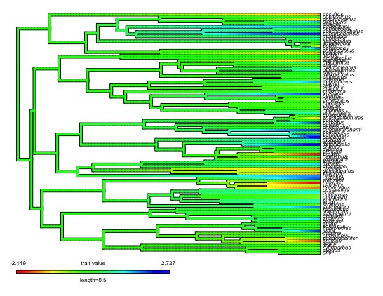
让我们继续测试一些别的假设。敌意是数据矩阵中的另一个特征。让我们评估一下，蜥蜴的敌对程度与它的强大程度之间是否存在相关性？我们将从数据矩阵中提取“敌对性”列，并为其指定物种名称，就像上面对“令人敬畏”所做的一样。
```r
host<-anoleData[,"hostility"]
names(host)<-rownames(anoleData)
#画图查看数据awesomeness和hostility是否关联
plot(host, awe, xlab = "hostility", ylab = "awesomeness")
#我们认为其线性相关
#线性回归
lm_awehost <- lm(awe ~ host)
#绘制趋势线并查看结果
abline(lm_awehost)
summary(lm_awehost)
#lm(formula = awe ~ host)
#Residuals:
#     Min       1Q   Median       3Q      Max 
#-0.66437 -0.32868 -0.04684  0.21507  1.03350 
#
#Coefficients:
#            Estimate Std. Error t value Pr(>|t|)    
#(Intercept)  0.14725    0.04041   3.644 0.000431 ***
#host        -0.97092    0.04030 -24.091  < 2e-16 ***
#---
#Signif. codes:  0 ‘***’ 0.001 ‘**’ 0.01 ‘*’ 0.05 ‘.’ 0.1 ‘ ’ 1
#Residual standard error: 0.3997 on 98 degrees of freedom
#Multiple R-squared:  0.8555,	Adjusted R-squared:  0.8541 
#F-statistic: 580.4 on 1 and 98 DF,  p-value: < 2.2e-16

```
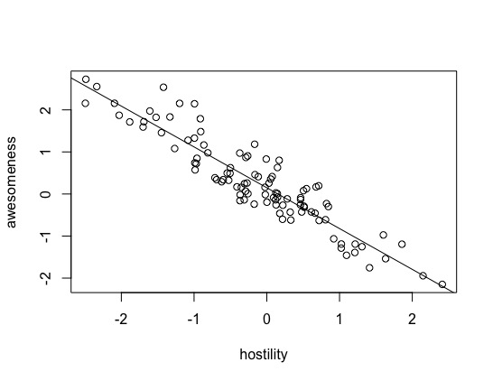
来自summary()命令的系数表显示了线性模型的斜率和截距，该线性模型描述了可怕程度与敌对性的关系。每行显示估计的系数(Estimate)，该估计的标准误差(Std.Error)以及t统计量和关联的p值，以测试这些参数是否等于0。预测变量可以解释响应变量中有多少方差的估计。
但是，我们没有考虑过这些蜥蜴在系统发育上彼此相关的事实。因此，他们可能仅由于其祖先是敌对的或强大的事实而导致自己也有敌意和强大的特性。换句话说，我们需要考虑由于系统发育导致的残差的非独立性。一种方法是使用系统发育广义最小二乘回归（PGLS）
```r
#先尝试手动计算PGLS
#我们可以查看数据awesomeness和hostility是否关联
plot(anoleData[,c("awesomeness", "hostility")])
#两数据关联，那么我们可以检测它们的PIC（多态信息量）
#提取列
host<-anoleData[,"hostility"]
awe<-anoleData[,"awesomeness"]
#赋名
names(host)<-names(awe)<-rownames(anoleData)
#计算PIC
hPic<-pic(host, anoleTree)
aPic<-pic(awe, anoleTree)
#建模（回归）
picModel<-lm(hPic~aPic-1)
#结果
summary(picModel)
#lm(formula = hPic ~ aPic - 1)
#
#Residuals:
#    Min      1Q  Median      3Q     Max 
#-2.1051 -0.4188  0.0103  0.3137  4.9991 
#
#Coefficients:
#     Estimate Std. Error t value Pr(>|t|)    
#aPic -0.97758    0.04516  -21.65   <2e-16 ***
#---
#Signif. codes:  0 ‘***’ 0.001 ‘**’ 0.01 ‘*’ 0.05 ‘.’ #0.1 ‘ ’ 1
#
#Residual standard error: 0.8967 on 98 degrees of freedom
#Multiple R-squared:  0.827,	Adjusted R-squared:  0.8253 
#F-statistic: 468.6 on 1 and 98 DF,  p-value: < 2.2e-16
#绘图
plot(hPic~aPic)
abline(a=0, b=coef(picModel))
```
我们也可以直接用函数包去做。
让我们分解一下下面这个函数。该函数认为强大与敌对线性相关（gls（awesomness〜敌对性，data = anoleData）），同时它将数据中的现有相关结构(correlation =)即协方差指定为基于anolis树(phy = anoleTree)的布朗运动模型(corBrowinan())。然后使用最大似然（方法=“ ML”）拟合模型。结果如下：
```r
pglsModel <- gls(awesomeness ~ hostility, data = anoleData, correlation = corBrownian(phy = anoleTree), method = "ML")
summary(pglsModel)
#Generalized least squares fit by maximum likelihood
#  Model: awesomeness ~ hostility 
#  Data: anoleData 
#       AIC      BIC    logLik
#  176.5222 184.3377 -85.26109
#Coefficients:
#                 Value  Std.Error    t-value p-value
#(Intercept)  0.1700421 0.24412080   0.696549  0.4877
#hostility   -0.8460104 0.03908066 -21.647804  0.0000
# Correlation: 
#          (Intr)
#hostility 0.015 
#Standardized residuals:
#        Min          Q1         Med          Q3         Max 
#-0.88294306 -0.39063739 -0.07057664  0.30315385  1.41114453 
#Residual standard error: 0.8258384 
#Degrees of freedom: 100 total; 98 residual
coef(pglsModel)
#(Intercept)   hostility 
#  0.1700421  -0.8460104 
abline(a = coef(pglsModel)[1], b = coef(pglsModel)[2], col = "red")
```
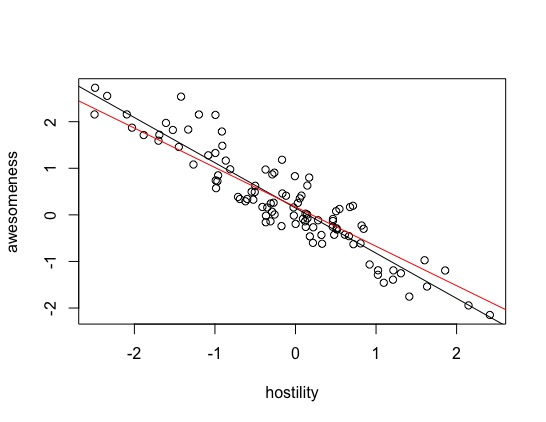
```r
#改良一番
plot(host, awe, xlab = "hostility", ylab = "awesomeness", main = "Awesomeness as a Function of Hostility")
abline(lm_awehost, lty = 2) #uncorrected LM
abline(a = coef(pglsModel)[1], b = coef(pglsModel)[2]) #BM
legend("topright", lty = c(1, 2), legend = c("PGLS", "uncorrected"))
```
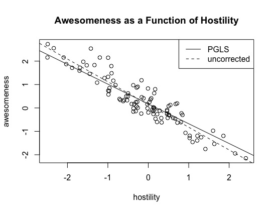
面对这两条线我们可能会发现，这些回归在预测敌对行为带来的强大能力方面是否真的有所不同。换句话说就是这两个回归的斜率有统计学的显著区别吗？我们需要知道，斜率参数的95％置信区间为b（斜率）正负1.96标准误差（这是从正态分布得出的）。那么接下来要计算你的95％置信区间：
```r
awehost.sum <- summary(lm_awehost)
awehost.sum$coef[2, 1]+c(-1, 1)*awehost.sum$coef[2, 2]
coef(pglsModel)[2]+c(-1, 1)*sqrt(pglsModel$varBeta[2, 2])
#确实不大一样
```
PGLS的功能还有很多，我们还可以给数据增加anova分析来判断离散程度,也可以同时模拟多个变量：
```r
pglsModel2<-gls(hostility~ecomorph, correlation=corBrownian(phy=anoleTree), data=anoleData, method="ML")
anova(pglsModel2)
#Denom. DF: 93 
#            numDF    F-value p-value
#(Intercept)     1 0.01986379  0.8882
#ecomorph        6 0.23482069  0.9641
coef(pglsModel2)
#同时拟合多个变量
pglsModel3<-gls(hostility~ecomorph*awesomeness, correlation=corBrownian(phy=anoleTree), data=anoleData, method="ML")
anova(pglsModel3)
#Denom. DF: 86 
#                     numDF  F-value p-value
#(Intercept)              1   0.1416  0.7076
#ecomorph                 6   1.6740  0.1371
#awesomeness              1 549.8314  <.0001
#ecomorph:awesomeness     6   4.5226  0.0005
```
#### OU与EM模型下的PGLS
布朗运动只是连续变量演化的一种模型。另一个模型是**Ornstein-Uhlenbeck(OU)**模型，该模型允许特征均值通过选择力(alpha)向新状态(theta)演化。这两个新参数，加上BM模型的起始状态（z0）和演化速率（sigsq）参数，构成了一个4参数模型。**早期爆发模型(EB)模型**允许整个树的进化速率发生变化，树的早期进化速率很高并且会随时间而下降（大概是在适应性辐射状的扩散过程中，生态位被填满了。进化速率随时间呈指数变化） 并在模型r[t] = r[0] x exp(axt)下指定，其中r[0]是初始速率，a是速率更改参数，t是时间，最大范围设置为-0.000001，代表进化速度的降低，最小范围设置为log（10 ^ -5）/进化树的长度。
让我们评估这三个模型与Awesomeness特征的相对适合度。
```r
#和发育树匹配
brownianModel <- fitContinuous(anoleTree, awe)
OUModel <- fitContinuous(anoleTree, awe, model = "OU")
EBModel <- fitContinuous(anoleTree, awe, model = "EB")
#查看结果
brownianModel
OUModel
EBModel
```
那么，根据AIC，**OU模型**可以更好地拟合这些数据。
```r
#不要收敛，不然难以固定
pglsModelLambda<-gls(hostility~awesomeness, correlation=corPagel(1, phy=anoleTree, fixed=FALSE), data=anoleData, method="ML")
#报错，这是规模问题。我们可以通过增加分支长度来快速固定参数。除了重新调整讨厌的参数外，这不会影响分析。
tempTree<-anoleTree
tempTree$edge.length<-tempTree$edge.length * 100
pglsModelLambda<-gls(hostility~awesomeness, correlation=corPagel(1, phy=tempTree, fixed=FALSE), data=anoleData, method="ML")
summary(pglsModelLambda)
#Generalized least squares fit by maximum likelihood
#  Model: hostility ~ awesomeness 
#  Data: anoleData 
#       AIC      BIC    logLik
#  72.56056 82.98124 -32.28028
#Correlation Structure: corPagel
# Formula: ~1 
# Parameter estimate(s):
#    lambda 
#-0.1585633 
#Coefficients:
#                 Value  Std.Error    t-value p-value
#(Intercept)  0.0612470 0.01581847   3.871868   2e-04
#awesomeness -0.8776519 0.03104246 -28.272628   0e+00
# Correlation: 
#            (Intr)
#awesomeness -1    
#Standardized residuals:
#        Min          Q1         Med          Q3         Max 
#-1.78946302 -0.71477505  0.00309539  0.78509306  2.23215144 
#Residual standard error: 0.3709858 
#Degrees of freedom: 100 total; 98 residual
pglsModelOU<-gls(hostility~awesomeness, correlation=corMartins(1, phy=tempTree), data=anoleData, method="ML")
summary(pglsModelOU)
#Generalized least squares fit by maximum likelihood
#  Model: hostility ~ awesomeness 
#  Data: anoleData 
#       AIC      BIC    logLik
#  96.63478 107.0555 -44.31739
#Correlation Structure: corMartins
# Formula: ~1 
# Parameter estimate(s):
#   alpha 
#4.441625 
#Coefficients:
#                 Value  Std.Error    t-value p-value
#(Intercept)  0.1084258 0.03952884   2.742954  0.0072
#awesomeness -0.8811632 0.03657646 -24.090988  0.0000
# Correlation: 
#            (Intr)
#awesomeness -0.269
#Standardized residuals:
#       Min         Q1        Med         Q3        Max 
#-1.8664557 -0.8132899 -0.1103815  0.6474918  2.0919152 
#Residual standard error: 0.376904 
#Degrees of freedom: 100 total; 98 residual
#看看图
abline(pglsModelOU)
plot(host, awe, xlab = "hostility", ylab = "awesomeness")
abline(a = coef(pglsModelOU)[1], b = coef(pglsModelOU)[2], col = "red")
```
### 离散变量的系统发育匹配
到目前为止，我们一直在处理连续字符，即那些沿某个连续统取值的字符。诸如身高，体重，长度，温度，湿度等是连续变量。 还有另一种类型的变量称为离散变量，该变量具有离散值：颜色（例如红色，蓝色，绿色）； 运动类型（例如，掘土，陆行）是离散变量的几个例子。
在我们的数据矩阵中，已经为每个物种编码了Island。让我们通过重建祖先的岛屿（即起源区域）和散布的历史来研究这些蜥蜴的一些生物地理特征。
我们可以同时使用离散特征映射模型(sym: symmetric model)进行拟合，并使用一种称为随机特征映射的方法来创建一组合理的特征历史记录：该分析产生一个“Q”矩阵，该矩阵显示了状态之间变化的相对概率。对于这个数值，这将代表岛屿之间的分散事件。值越高，该类型的更改的可能性越高。(还有ARD: All Rates Different matrix和ER单参数等速率模型可供选择)
现在，你可以根据上面推断的值绘制此字符变化的随机模拟。
```r
#提取变量
island <- anoleData$island
names(island) <- rownames(anoleData)
island_anc <- make.simmap(anoleTree, island, model = "SYM", nsim = 100)
#100个模拟中的第一个图
plotSimmap(island_anc[[1]], fsize = 0.5)
```
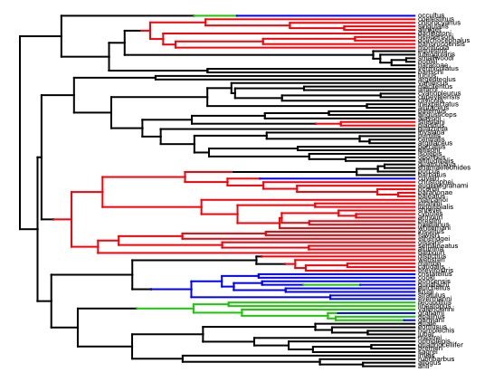
我们可以总结这些模拟并估计每个岛作为系统发育树上每个节点的祖先的相对概率：
```r
island_summary <- summary(island_anc)
plot(island_summary, cex = c(0.5, 0.2), fsize = 0.5, offset = 90)
legend("bottomleft", fill = c("black", "red", "green", "blue"), 
       legend = c("Cuba", "Hispanola", "Jamaica", "PR"))
```
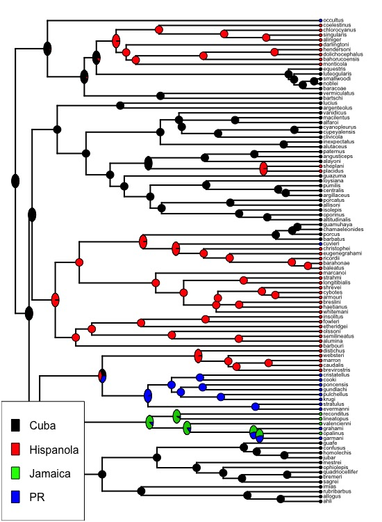
[返回目录](#%e7%94%9f%e7%89%a9%e4%bf%a1%e6%81%af%e5%ad%a6)
## 生态功能与生物多样性
在本节中，我们将探讨有关生物多样性及其对生态系统功能的影响的问题。为此，我们将使用Jake Gorssman提供的数据和脚本（进行一些修改）。
从大佬(Grossman et al. 2017; Ecology 98:2601-14)的”Species richness and traits predict overyielding in stem growth in an early‐successional tree diversity experiment“中获得数据并整理，它们在[我的github](https://github.com/Vendredii/Rstats)中也可以获得：
```r
library(agricolae)
df <- read.csv("Data/BEF_Lesson_Data.csv", header = T)
#查看第一行
names(df)
#看看数据结构，df是一个具有9列140行的数据帧。这些行是FAB实验中的140个实验图。
dim(df)
```
我们需要知道：
1. plot = 每个地块的任意索引
2. SR = 样地的物种丰富度（1、2、5或12种）
3. Comp = 分类代码，对于具有相同成分的图，该代码相同。 M = 单种养殖，B = 双种养殖，F = 5种，T = 12种
4. PSV = 系统发生种的变异性（Helmus et al。2007）: 一种独立于物种丰富度的系统发生多样性的度量
5. FDis = 功能分散度（Laliberte和Legendre，2010年）: 一种独立于物种丰富度的功能多样性指标
6. NBE = 生物多样性净效应: 观察到的生物多样性（d_Y）减去预期生物多样性（基于单一文化（在此示例中未给出））
7. CE = 互补效应（Loreau and Hector 2001）: CE + SE = NBE；使用Forest Isbell中的脚本进行计算-UMN--Twin Cities
8. SE = 选择效应（Loreau and Hector 2001），见上文
9. d_Y = 地块生物量: 给定地块中树木茎生物量的平均变化量（kg）
重要提示-请注意，对于纯林(?)而言，NBE，CE和SE没有价值，因为它们**只能计算得出混交林(?)的数值**。
### 地块组成与物种丰富度对生物的影响
**Q1：茎生物量产量是否取决于地块组成和丰富度？**
首先，设置颜色方案以按颜色区分构图，然后绘制数据以查看是否存在可见趋势：
```r
#设置颜色
comp.cols <- c(rep("red", 12), rep("orange", 28), rep("yellow", 10), rep("green", 1))
with(df, plot(Comp, d_Y, col = comp.cols))
```
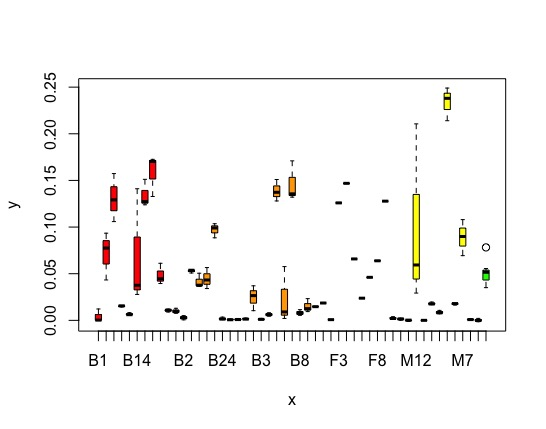
接下来可以进行一些数学分析
```r
#线性回归
m1 <- lm(d_Y ~ Comp, data = df)
summary(m1)
#anova
anova(m1)
#HSD
m1.df <- HSD.test(m1, "Comp", group = TRUE, console = TRUE)
```
**Q2:那么这些超额收益（overyield，NBE）是否取决于地块的组成和丰富程度？**
请记住，现在的响应变量不是该地块产生多少生物量，而是该数字减去如果该地块中的某树的纯林的情况下的预期值。因此，这需要调整每种物种的“先天”生产力。
这时不同地块的情况如何呢？
```r
#绘图
with(df, plot(Comp, NBE, col = comp.cols))
#回归
m3 <- lm(NBE ~ Comp, data = df) 
summary(m3)
#anova
anova(m3)
#HSD
m3.df <- HSD.test(m3, "Comp", group = TRUE, console = TRUE)
```
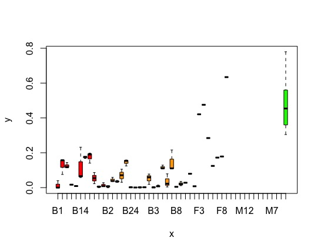
所以，根据事后检验，那一块地的产量最高呢？
在评估超额收益与物种丰富度的关系时，我们又会发现什么？可以比较m4与上面m2的结果：
```r
with(df, plot(SR, NBE))
m4 <- lm(NBE ~ SR, data = df)
summary(m4)
anova(m4)
m4.df <- HSD.test(m4, "SR", group = TRUE, console = TRUE)
```
这有助于解释单变量控制试验在生物多样性研究中的重要性。
### 生物多样性的互补与选择
**Q3:如何在互补性和选择性方面比较不同级别的物种丰富度？**
我们现在很熟悉这一套了：首先，以图形方式进行分析；然后建立线性模型，并使用ANOVA进行评估（如果ANOVA显着），最后使用事后测试HSD：
```r
#首先查看互补效应
with(df, plot(SR, CE))
m5 <- lm(CE ~ SR, data = df)
summary(m5)
anova(m5)
m5.df <- HSD.test(m5, "SR", group = TRUE, console = TRUE)
#接着查看选择效应
with(df, plot(SR, SE))
m6 <- lm(SE ~ SR, data = df)
summary(m6)
anova(m6)
m6.df <- HSD.test(m6, "SR", group = TRUE, console = TRUE)
#还可以把CE和SE的图放在一块比较，使之更易看出正负相关
with(df, plot(SR, CE, col = "blue"))
with(df, points(SR, SE, col = "red"))
abline(h = 0)
```
那么。
1. CE和SE如何与NBE（超额收益overyield）进行比较？
2. CE阳性是什么意思？CE阴性意味着什么？
3. SE的正值和负值如何？（这可能会造成混淆。）
你是否发现超乎寻常的超额收益的证据？
```r
#回到问题1的图
with(df, plot(SR, d_Y, ylim = c(-0.05, 0.25)))
#加条分界线
abline(h = 0)
```
就很明显：
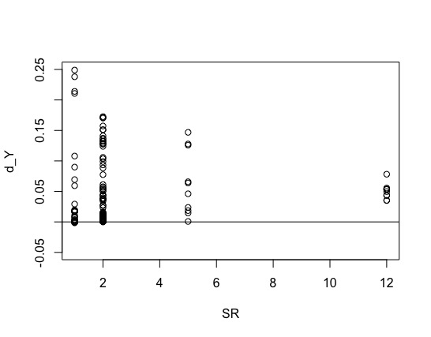
**Q4:那么生产力最低（或平均）的混交林是否比生产力最高的单一纯林更高？**
可以将所有纯林编码为“0”，并将所有混交林编码为“1”，然后进行t检验...
### 生物多样性的维度与其生产力
**Q5:哪个方面的生物多样性维度？物种、功能性状还是系统发育可以确定最高的生产力呢？**
为了解决这个问题，我们将看到每个维度解释了多少超额收益（NBE）。对于单变量回归模型，我们可以仅使用线性模型输出中的R^2进行模型比较。结果如下：
```r
#这是物种多样性
m4 <- lm(NBE ~ SR, data = df)
summary(m4)
#Adjusted R-squared:  0.643
#这是系统发育多样性
m7 <- lm(NBE ~ PSV, data = df) 
summary(m7)
#Adjusted R-squared:  0.02538
#这是功能多样性
m8 <- lm(NBE ~ FDis, data = df) 
summary(m8)
#Adjusted R-squared:  0.1768
```
[返回目录](#%e7%94%9f%e7%89%a9%e4%bf%a1%e6%81%af%e5%ad%a6)