# 生物地理学
生物地理学结合了GIS技术、遥感和生态学的知识，不学就亏了。
[TOC]
## 物种分布与生物多样性
在本实验中，你将学习R中的基本工具，以可视化物种分布，建立地理范围，以测试不同方法下生物多样性梯度的驱动力。
你将需要三个数据集，它们都在[我的github](https://github.com/Vendredii/Rstats)中：
   1.物种分布数据点-live.oaks.txt
   2.物种地理范围-Furnarii_ranges_geo.shp
   3.环境预测因子-bio1.bil和bio12.bil
### 数据的准备与地理可视化
首先是准备必要的包和地理分布数据。
```r
#加载相关的包
library(maptools)
library(rgdal)
library(raster)
library(sp)
library(rangeBuilder)
library(sf)
library(spdep)
library(ncf)
library(ape)
library(geiger)
library(dismo)
library(spatialreg)
#加载物种分布数据
oaks <- read.table("Data/live.oaks.txt", header = TRUE)
#看一下发现都是坐标
head(oaks)
#使用maptools包将点绘制在地图（这里是简单版世界地图）上
data(wrld_simpl)
{plot(oaks[c(2:3)], col = "blue", pch = 19)
plot(wrld_simpl, add = TRUE)}
```
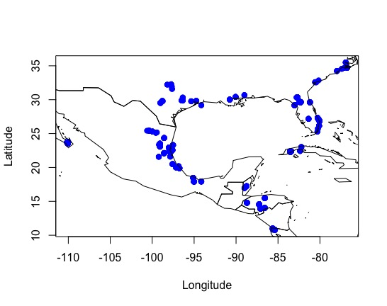
可以在图中显示其中的一个物种，如*Quercus virginiana*
```r
#提取物种列表
unique(oaks$Species)
#找到我们要的种
que_vir <- subset(oaks, oaks$Species == "Quercus_virginiana")
#绘图
{plot(que_vir$Longitude, que_vir$Latitude, pch = 15)
plot(wrld_simpl, add = TRUE)}
```
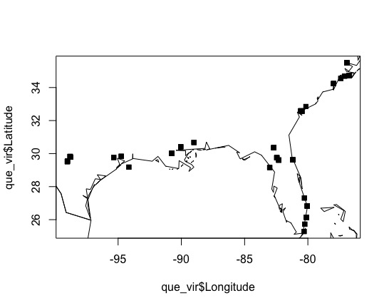
接下来我们可以检查是否有重复的点：
```r
oaks_dups <- duplicated(oaks[, c(2:3)])
length(which(oaks_dups == TRUE))
#看看有多少不重复的
length(which(oaks_dups == FALSE))
oaks_dups_row <- which(oaks_dups == TRUE)
length(oaks_dups_row)
#挑选出不重复的
oaks_nodups <- oaks[-oaks_dups_row,]
#查看数据纬度
dim(oaks_nodups)
head(oaks_nodups)
#不同颜色绘制看看区别
{plot(oaks$Longitude, oaks$Latitude, pch = 19, col = "red", cex = 2)
points(oaks_nodups$Longitude, oaks_nodups$Latitude, pch = 16, col = "black")}
```
### 获得点数据的简单范围
该部分可用于基于几何形状（例如最小凸多边形等）创建“简单”范围图，而无需考虑环境变量（不包括ENM或SDM）。
#### 基于最小凸多边形（Convex hull）
```r
#在物种的记录周围创建一个多边形
oaks_hull <- convHull(oaks_nodups[, c(2:3)])
#把这个多边形画出来
{plot(oaks_hull)
points(oaks_nodups$Longitude, oaks_nodups$Latitude, pch = 16, col = "black")}
```
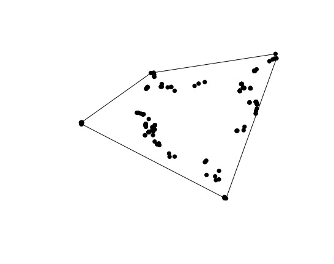
```r
#只对一个种绘制简单边界
que_vir <- subset(oaks_nodups, oaks_nodups$Species == "Quercus_virginiana")
que_vir_hull <- convHull(que_vir[, c(2:3)])
{plot(que_vir_hull)
points(que_vir$Longitude, que_vir$Latitude, pch = 16, col = "black")}
```
最后可以画一个综合大图
```r
#把所有树的点用黑色画出来
{plot(oaks_hull)
points(oaks_nodups$Longitude, oaks_nodups$Latitude, pch = 16, col = "black")
#把Quecus virginiana的分布用红色标出
plot(que_vir_hull, add = TRUE)
points(que_vir$Longitude, que_vir$Latitude, pch = 16, col = "red")
#加入世界地图
plot(wrld_simpl, add = TRUE)}
#注意，上面是套娃式的一整句语句
```
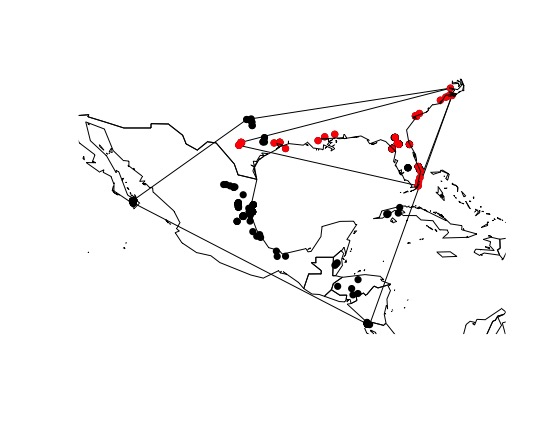
但明眼人都看得出来这样绘制物种范围显然太弱智了。
#### 基于动态Alpha的边界
好的，使用简单的凸包似乎不是活橡树的好工具，现在让我们尝试另一种方法。现在，我们将使用软件包rangeBuilder中的动态alpha包。
```r
#先画一个普通的，和上面没区别的
que_vir_alphahull <- getDynamicAlphaHull(que_vir, fraction = 0.95, coordHeaders = c("Longitude", "Latitude"),clipToCoast = 'no')[[1]]
#再来个动态Alpha的
{plot(que_vir_alphahull, lwd = 2, col = "red") 
plot(que_vir_hull, add = TRUE, lwd = 2, lty = 2)
points(que_vir$Longitude, que_vir$Latitude, pch = 16, col = "green")
plot(wrld_simpl, add = TRUE, lwd = 2)}
```
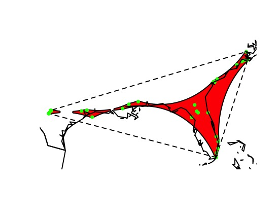
好像还是很扯淡。
### 多样性的梯度（点数据的范围（不简单）
在此之前，我们探讨了如何使用事件来绘制，清理和建立物种地理范围。 现在将使用最大的大陆性区域性辐射值(?)（Furnariides）结合物种地理范围来探索物种多样性的地理梯度。
我们使用的地理范围数据是*Infraorder Furnariides*（鸟类雀形目火炉亚目下的某个）。该数据可通过[BirdLife International](http://datazone.birdlife.org/species/requestdis)获得。当然可以使用IUCN或BIEN上的任何其他组。无论如何，你首先需要以shapefile格式下载它们的多边形。
要加载这些地理分布需要用到R包maptools的函数readShapePoly。我们可以通过设置方块（栅格）然后切出每块区域的物种丰富度。
**备注：以下操作均可在ArcGIS上完成**
```r
franges <- readShapePoly("Data/Franges/Furnarii_ranges_geo.shp")
str(franges)
#通过@来访问这些数据
head(franges@data)
#首先在1º纬度的空间分辨率下，使用这个鸟类的范围，在新热带区域创建一个空栅格。
neo_ras <- raster()
#extent函数可以确定空间范围
extent(neo_ras) <- extent(franges)
res(neo_ras) <- 1
neo_ras
values(neo_ras) <- 0
#使用空栅格，我们将对每个像元或像素中的物种标识进行“栅格化”。最终的栅格将是新热带地区这种鸟类的物种丰富度。
f_sr_raster <- rasterize(franges, neo_ras, field = "SCINAME", 
                         fun = function(x,...){length(unique(na.omit(x)))})
#在地图上显示
{plot(f_sr_raster)
plot(wrld_simpl, add = T)}
```
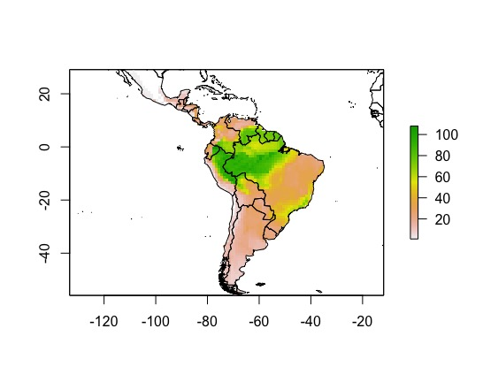
```r
#换颜色
colfuncYellows <- colorRampPalette(c("#d7191c", "#fdae61", "#ffffbf", "#abd9e9", "#2c7bb6"))
{plot(f_sr_raster, col = rev(colfuncYellows(100)), axes = FALSE, box = FALSE, 
     zlim = c(minValue(f_sr_raster), maxValue(f_sr_raster)), 
     xlab = "Furnariides richness", legend.width = 2)
plot(wrld_simpl, add = T)}
```
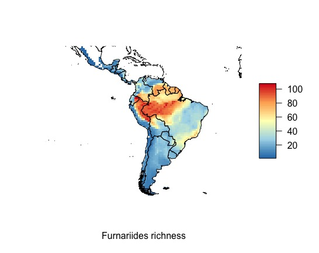
让我们尝试栅格化来自shp数据集的其他信息。我们将使用“RD”列中的信息，此数据对应于从尖端到系统树根部的节点数或**根距(RD)**（系统发育分支间的距离？），因此，将使用RD计算**平均根距离(MRD)**，用于衡量一个群落中物种的进化衍生性(Kerr＆Currie, 1999)，也可用于确定本地动物群主要是由早生物种还是近来起源的物种组成(Hawkins et al, 2012)。
```r
head(franges@data)
f_MRD_raster <- rasterize(franges, neo_ras, field = "RD", fun = mean)
{plot(f_MRD_raster)
plot(wrld_simpl, add = T)}
#换颜色加标题
{plot(f_MRD_raster, col = rev(colfuncYellows(100)), axes = FALSE, box = FALSE, 
     zlim = c(minValue(f_MRD_raster), maxValue(f_MRD_raster)), 
     xlab = "Furnariides mean root distance", legend.width = 2)
plot(wrld_simpl, add = T)}
```
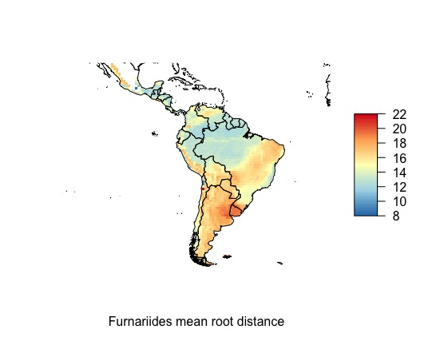
```r
#把两张图合并
{par(mfrow = c(1, 2))
plot(f_sr_raster, col = rev(colfuncYellows(100)), axes = FALSE, box = FALSE, 
     zlim = c(minValue(f_sr_raster), maxValue(f_sr_raster)), 
     xlab = "Furnariides richness", legend.width = 2)

plot(f_MRD_raster, col = rev(colfuncYellows(100)), axes = FALSE, box = FALSE, 
     zlim = c(minValue(f_MRD_raster), maxValue(f_MRD_raster)), 
     xlab = "Furnariides mean root distance", legend.width = 2)}
```
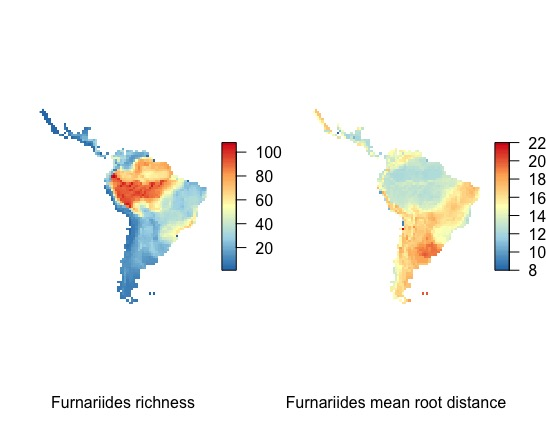
#### 尺度依赖问题
现在，我们将探讨生态和进化中最古老的问题之一，即数据中的“尺度依赖性”。 因此，要探索这种尺度相关性，我们将对*Furnariides*属的范围进行栅格化，但要使用从2到4度的纬度的不同空间分辨率。
```r
#设置2°和4°的格网
#2º
neo_ras_2dg <- raster()
extent(neo_ras_2dg) <- extent(franges)
res(neo_ras_2dg) <- 2
neo_ras_2dg
values(neo_ras_2dg) <- 0
#4º
neo_ras_4dg <- raster()
extent(neo_ras_4dg) <- extent(franges)
res(neo_ras_4dg) <- 4
neo_ras_4dg
values(neo_ras_4dg) <- 0
#分别套数据得到不同大小尺度的物种多样性
f_sr_2dg_raster <- rasterize(franges, neo_ras_2dg, field = "SCINAME", fun = function(x,...){length(unique(na.omit(x)))})
f_sr_4dg_raster <- rasterize(franges, neo_ras_4dg, field = "SCINAME", fun = function(x,...){length(unique(na.omit(x)))})
#画在一个图里
{par(mfrow = c (1, 3))
plot(f_sr_raster, main = "Furnariides richness 1dg")
plot(wrld_simpl, add = T)

plot(f_sr_2dg_raster, main = "Furnariides richness 2dg")
plot(wrld_simpl, add = T)

plot(f_sr_4dg_raster, main = "Furnariides richness 4dg")
plot(wrld_simpl, add = T)}
```
看看有什么区别呢？
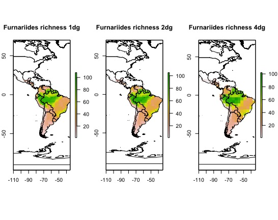
### 物种分布模型？
加载与bio1（年平均温度）和bio12（年降水量）相对应的环境变量。这些数据对应于[WorldClim](http://www.worldclim.org/current)中19个变量中的两个。我们将仅出于教育目的使用这两个变量，而不是对物种与环境的关系进行完整的评估。
```r
#加载并绘制2个气候因子
bio1 <- raster("Data/Envi/bio1.bil")
bio1
bio12 <- raster("Data/Envi/bio12.bil")
bio12
#显示一下这是全球的气候数据
{par(mfrow = c(2, 1))
plot(bio1)
plot(bio12)}
#按这个属的鸟类的分布区域进行裁剪
bio1_neo <- crop(bio1, extent(franges))
bio12_neo <- crop(bio12, extent(franges))
#绘制
{par(mfrow = c(1, 2))
plot(bio1_neo, main = "Annual Mean Temperature")
plot(bio12_neo, main = "Annual Precipitation")}
```
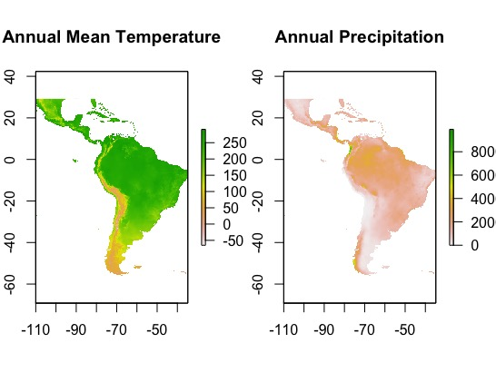
现在，我们将从*Furnariides*属的栅格中获取坐标。 然后，将使用这些坐标从bio1和bio12气候层中提取信息。
```r
#提取物种坐标
f_ras_coords <- xyFromCell(f_sr_raster, 1:length(values(f_sr_raster)))
#提取坐标对应气候数据
f_ras_bio1 <- extract(bio1_neo, f_ras_coords)
f_ras_bio12 <- extract(bio12_neo, f_ras_coords)
#提取物种多样性数据
f_ras_rich <- values(f_sr_raster)
#合到一起
fdata <- na.omit(data.frame(f_ras_coords, f_ras_rich, f_ras_bio1, f_ras_bio12))
#f_ras_rich_noNA <- ifelse(is.na(f_ras_rich), 0, f_ras_rich)
#f_ras_bio1_noNA <- ifelse(is.na(f_ras_bio1), 0, f_ras_bio1)
#f_ras_bio12_noNA <- ifelse(is.na(f_ras_bio12), 0, f_ras_bio12)
#fdata_noNA <- data.frame(f_ras_coords, f_ras_rich_noNA, f_ras_bio1_noNA, f_ras_bio12_noNA)
```
之后可以简单分析一下，看看相关系数什么的：
```r
cor.test(fdata$f_ras_rich, fdata$f_ras_bio1)
cor.test(fdata$f_ras_rich, fdata$f_ras_bio12)
{par(mfrow = c(1, 2))
plot(fdata$f_ras_bio1, fdata$f_ras_rich, xlab = "Bio 1", ylab = "Richness")
plot(fdata$f_ras_bio12, fdata$f_ras_rich, xlab = "Bio 12", ylab = "Richness")}
```
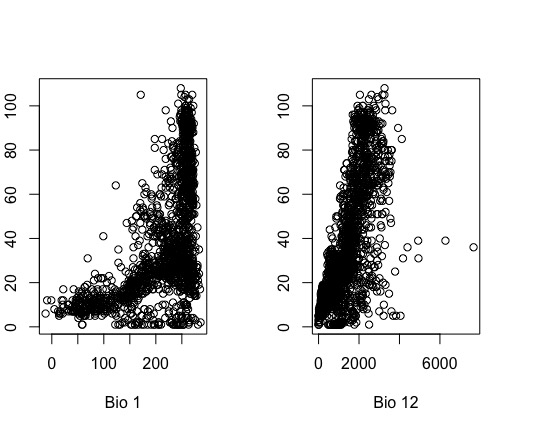
#### 空间自相关
现在，我们认为相关性不是简单的因果关系，因此要探索这种关系，我们需要构建拟合模型。为了探索这种关系，我们将首先探索一个简单的**普通最小二乘回归**（OLS）。（就是利用最小二乘法进行线性回归）
```r
fols <- lm(f_ras_rich ~ f_ras_bio1 + f_ras_bio12, data = fdata)
summary(fols)
#Adjusted R-squared:  0.493
```
接着计算它们物种丰富度以及残差之间的空间相关性：
```r
#计算空间自相关
autocor_SR <- ncf::correlog(fdata$x, fdata$y, z = fdata$f_ras_rich, na.rm = T, 
                         increment = 1, resamp = 1)
#绘图
{plot(autocor_SR$correlation[1:50], type = "b", pch = 1, cex = 1.2, lwd = 1.5,
     ylim = c(-1, 1), xlab = "Distance class", ylab = "Moran's I", cex.lab = 1.2, 
     cex.axis = 1.2)
     abline(h = 0)}
#接下来考察残差中的空间自相关
coords <- fdata[1:2]
coords <- as.matrix(coords)
#通过距离计算领域间的连续性
nb1.5 <- dnearneigh(coords, 0, 1.5)
#通过领域连续性为相邻列表建立空间权重
nb1.5.w <- nb2listw(nb1.5, glist = NULL, style = "W", zero.policy = TRUE)
#从OLS中提取残差
residuals_ols <- residuals(fols)
#绘图
plot(residuals_ols)
#计算单变量空间相关图。
autocor_ols_res <- correlog(fdata$x, fdata$y, z = residuals(fols), 
                            increment = 1, resamp = 1)
#并绘制残差的自相关图
{plot(autocor_ols_res$correlation[1:50], type = "b", pch = 1, cex = 1.2, lwd = 1.5,
     ylim = c(-0.5, 1), xlab = "distance", ylab = "Moran's I", cex.lab = 1.5, 
     cex.axis = 1.2)
abline(h = 0)
title(main = "OLS residuals", cex = 1.5)}
```
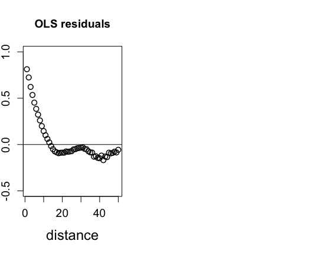
似乎残差具有很强的空间自相关，这是一个问题，因为如果我们在残差中发现自相关，我们获得的大部分解释都可能会产生偏差。那我们接着检查这两个自相关的图。
```r
{par(mfrow = c(2, 1))

plot(autocor_SR$correlation[1:50], type = "b", pch = 1, cex = 1.2, lwd = 1.5,
     ylim = c(-1, 1), xlab = "Distance class", ylab = "Moran's I", cex.lab = 1.2, 
     cex.axis = 1.2)
abline(h = 0)
title(main = "OLS model", cex = 1.5)
plot(autocor_ols_res$correlation[1:50], type = "b", pch = 1, cex = 1.2, lwd = 1.5,
     ylim = c(-0.5, 1), xlab = "Distance class", ylab = "Moran's I", cex.lab = 1.5, 
     cex.axis = 1.2)
abline(h = 0)
title(main = "OLS residuals", cex = 1.5)}
```
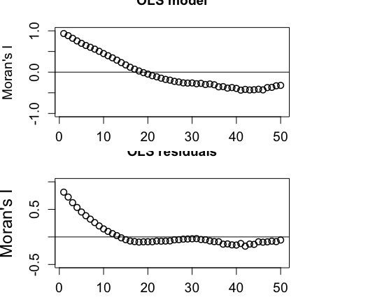
存在很强的空间自相关，因此使用OLS模型的任何结论都可能存在偏差。为了尝试解决这个重要问题，我们将使用**空间同时自回归误差模型估计（Aka SAR模型）**，该模型通过以空间权重矩阵的形式添加额外的项（自回归）来说明空间自相关。其会指定每个单元格或像素的邻域以及每个邻居的相对权重。
```r
#Aka SAR模型
sar_nb1.5.w <- errorsarlm(fols, listw = nb1.5.w, data = fdata, quiet = FALSE, 
                          zero.policy = TRUE)
summary(sar_nb1.5.w)
#AIC: 10931, (AIC for lm: 14495)
residuals_sar_nb1.5.w <- residuals(sar_nb1.5.w)
```
那么它的空间自相关结果怎么样呢？
```r
#计算
autocor_sar_nb1.5.w <- correlog(fdata$x, fdata$y, z = residuals(sar_nb1.5.w), 
                                na.rm = T, increment = 1, resamp = 1)
#绘图
{plot(autocor_sar_nb1.5.w$correlation[1:50], type = "b", pch = 4, cex = 1.2, lwd = 1.5,
     ylim = c(-0.5, 1), xlab = "distance", ylab = "Moran's I", cex.lab = 1.5, 
     cex.axis = 1.2)
abline(h = 0)
title(main = "Correlogram SARerr", cex = 1.5)}
#和线性回归的一起比较绘图
{par(mfrow = c(2, 1))
plot(autocor_ols_res$correlation[1:50], type = "b", pch = 1, cex = 1.2, lwd = 1.5,
     ylim = c(-0.5, 1), xlab = "distance", ylab = "Moran's I", cex.lab = 1.5, 
     cex.axis = 1.2)
abline(h = 0)
title(main = "OLS residuals", cex = 1.5)

plot(autocor_sar_nb1.5.w$correlation[1:50], type = "b", pch = 4, cex = 1.2, lwd = 1.5,
     ylim = c(-0.5, 1), xlab = "distance", ylab = "Moran's I", cex.lab = 1.5, 
     cex.axis = 1.2)
abline(h = 0)
title(main = "Correlogram SARerr", cex = 1.5)}
```
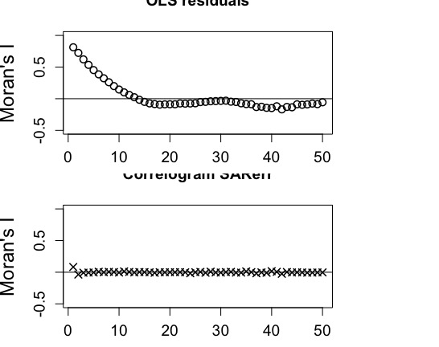
那是真的没有相关。
但是很奇怪的是，SAR模型没有R square，因此我们使用别的函数：
```r
#加载来源不明的函数
source("https://raw.githubusercontent.com/jesusNPL/BetaDivNA/master/SARr2.R")
SARr2(Lfull = sar_nb1.5.w$LL, Lnull = sar_nb1.5.w$logLik_lm.model, N = nrow(fdata))
#'log Lik.' 0.8852386 (df=4)
```
[返回目录](#%e7%94%9f%e7%89%a9%e5%9c%b0%e7%90%86%e5%ad%a6)
## 物种分布与生态位模型
在本实验中，我们将探索一些相关模型，这些模型使用物种级别的数据（地理分布）和大空间尺度的环境数据。我们将使用世界上最大的金刚鹦鹉——风信子金刚鹦鹉（*Anodorhynchus hyacinthinus*）的地理分布数据，该数据分布在玻利维亚和巴西的潘塔纳尔湿地和巴西的塞拉多之间。环境数据可从**Ecoclimate**（http://ecoclimate.org）获得。也可以从WorldClim获取环境数据。
首先准备程序与数据：
```r
#加载包
library(permute)
library(lattice)
library(vegan)
library(sp)
library(raster)
library(psych)
library(maps)
library(maptools)
library(kernlab)
library(dismo)
#加载气候数据
datoG0 <- read.table("Data/Environment/bio_var_CCSM_0k_global.txt", h = T)
#查看气候数据结构
head(datoG0)
datoG0[1:5, 1:5]
dim(datoG0)
str(datoG0)
summary(datoG0)
class(datoG0)
names(datoG0)
#把data.frame的数据变成raster栅格
gridded(datoG0) <- ~long+lat
class(datoG0)
#stake()函数可以改为栅格
clima0k <- stack(datoG0)
#绘制在世界地图上
plot(clima0k$bio.1)
map(add = T)
```
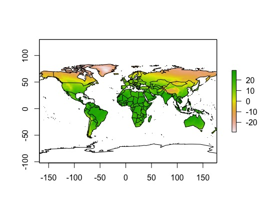
上图对应世界各地的环境变量的年平均温度即BIO1。
但是，我们不需要世界各地的所有环境信息，因为我们的重点物种仅在南美分布（如果该物种位于美国或欧洲的动物园中，并不意味着该物种就存在于那些地方）。
```r
#按经纬度裁剪
e <- extent(c(-90, -30, -60, 15))
clima0k.SA <- crop(clima0k, e)
plot(clima0k.SA$bio.9)
map(add = T)
#看看里面有几个小格子(grid)
ncell(clima0k.SA)
```
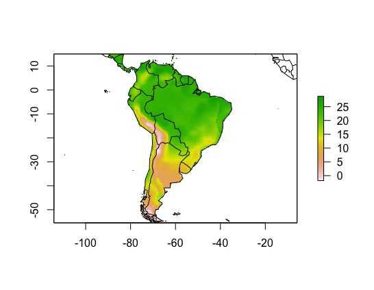
```r
SA0k <- values(clima0k.SA)
class(SA0k)
#获得每个小格的经纬度坐标
coord.SA <- xyFromCell(clima0k.SA, 1:ncell(clima0k.SA))
#将这些小格的坐标和气候对应
SA0k <- cbind(coord.SA, SA0k)
#看看数据
SA0k[1:5,]
SA0k[1:5, 1:5]
```
现在，我们需要确定需要哪些变量来建模风信子金刚鹦鹉的生态位（格林纳利生态位或基础生态位）。在这里，我们可以依靠专家进行选择或使用统计工具或同时使用这两种工具。
在这种情况下，我们将使用心理学中通常使用的阶乘分析。
```r
#执行阶乘分析
fa.parallel(SA0k[, -c(1:3)])
```
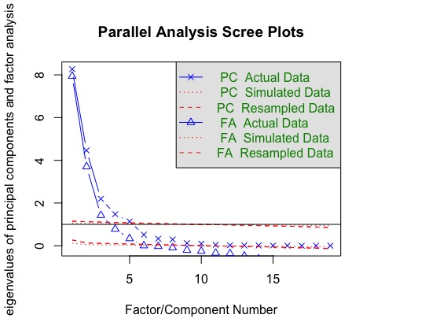
平行分析表明，因子的数量= 5和组件的数量= 5足以进行进一步分析。
```r
SA0k.fa <- fa(SA0k[, -c(1:3)], nfactors = 5, rotate = "varimax")
SA0k.fa
loadings(SA0k.fa)
```
根据FA(阶乘)的结果和专业知识，我们可以选择进行计算变量：bio1，bio2，bio15，bio4，bio2。接着我们保存变量并加载物种数据：（从**GBIF**中）
```r
#保存我们选出的变量
write.table(SA0k[, c("x", "y", "bio.1", "bio.2", "bio.4", "bio.12", "bio.15")],
            row.names = FALSE, "Data/Environment/climaSA0k.txt", sep = "\t")
#作为栅格保存
writeRaster(clima0k.SA, "Data/Environment/climaSA0k.asc", format = "ascii", bylayer = T)
#清理r环境
rm(list = ls())
#直接从R中从GBIF获取我们物种的一些发生数据。考虑到所选物种的发生次数，这可能需要一些时间和网速。
hyacinth <- gbif("anodorhynchus", "hyacinthinus*", geo = FALSE)
#查看并选择有经纬度的数据列
dim(hyacinth)
colnames(hyacinth)
#整理数据
#去NA
hyacinth <- subset(hyacinth, !is.na(lon) & !is.na(lat))
dim(hyacinth)
hyacinth[1:4, c(1:5, 7:10)]
#其次，仅选择建模对象所需的列。
#请注意，使用colnames(风信子鹦鹉)可以获取列的位置，并且114、84和77列（按此顺序）分别是对应于物种名称，经度和纬度的列，这就是我们所需要的。
hyacinth_coords <- hyacinth[, c(114, 84, 77)]
head(hyacinth_coords)
#保存
dir.create("Data/OCC")
write.csv(hyacinth_coords, "Data/OCC/hyacinth_data.csv")
#再清理一下运行环境
rm(list = ls())
#合并物种分布与环境数据
hyacinth <- read.csv("Data/OCC/hyacinth_data.csv")
head(hyacinth)
#只有一个物种，就不要物种名字了
hyacinth_coords <- hyacinth[, c(3, 4)]
head(hyacinth_coords)
#加载环境数据
climSA0k <- read.table("Data/Environment/climaSA0k.txt", h = T)
class(climSA0k)
gridded(climSA0k) <- ~x + y
climSA0k <- stack(climSA0k)
climSA0k
#将其绘制在地图上
plot(climSA0k$bio.1)
points(hyacinth_coords[, "lon"], hyacinth_coords[, "lat"])
#匹配物种分布数据和气象数据
hyacinth_var <- extract(climSA0k, hyacinth_coords, cellnumbers = T)
head(hyacinth_var)
hyacinth_var <- cbind(hyacinth_coords, hyacinth_var)
hyacinth_var[1:5, ]
#把NA数据去了
hyacinth_var <- na.omit(hyacinth_var) # remove NA's
dim(hyacinth_var)
#删除单元格中重复的值
duplicated(hyacinth_var[,"cells"])
a <- which(duplicated(hyacinth_var[, "cells"]) == T)
a
hyacinth_var <- hyacinth_var[-a, ]
dim(hyacinth_var)
#保存
write.table(hyacinth_var, row.names = FALSE, "Data/OCC/hyacinth_var.txt", sep = "\t")
#画在地图上
plot(climSA0k$bio.1)
points(hyacinth_var[, "lon"], hyacinth_var[, "lat"])
#整理数据作为背景数据集
clima0k <- read.table("Data/Environment/climaSA0k.txt", h = T)
dim(clima0k)
#123就是有123个分布点
id.back <- sample(1:nrow(clima0k), 123) 
length(id.back)
dim(background)
names(background)
#保存
write.table(background, "Data/Environment/background.txt", row.names = F, sep = "\t")
```
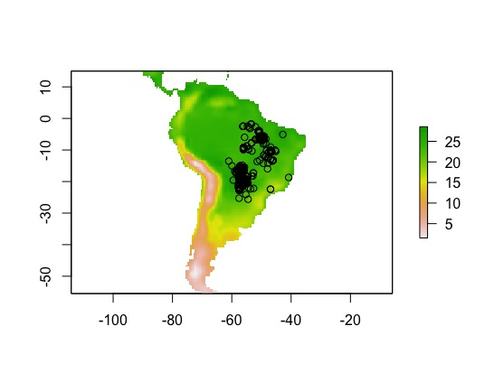
### 生态位模型的拟合与预测
有了这些数据我们就可以开始演算了。
先通过环境背景数据和物种分布数据设置测试集合训练集.
```r
#准备数据
id.ocur <- sample(1:nrow(hyacinth_var), round(0.75*nrow(hyacinth_var)))
length(id.ocur)
id.back <- sample(1:nrow(background), round(0.75*nrow(background)))
length(id.back)
#准备训练集
training <- prepareData(x = climSA0k, 
                             p = hyacinth_var[id.ocur, 1:2], 
                             b = background[id.back, 1:2], xy = T)
#准备测试集
test <- prepareData(x = climSA0k, 
                      p = hyacinth_var[-id.ocur, 1:2], 
                      b = background[-id.back,1:2], xy = T)
```
接着我们用不同的模型用训练集去预测其生态位分布:
可以使用各种模型来探索物种如何对这些特定变量做出响应（基于我们使用的特定算法以及地理和环境空间之间的关系），使用一个为每个变量创建响应图的响应函数，以及其他函数变量的中位数。
同时，我们将评估每个模型的性能。为了评估模型的性能，我们将使用测试数据。对所有四个模型重复以上操作。
使用存在/不存在数据对模型进行交叉验证。给定存在向量和不存在值的向量（或模型以及存在和不存在点以及预测变量），将计算混淆矩阵（针对变化的阈值），并为每个混淆矩阵/阈值计算模型评估统计量。
最后可以为每个模型设置阈值，阈值（截止值）用于将模型预测（概率，距离或相似值）转换为二进制分数（存在或不存在）。
#### Bioclim模型
BIOCLIM算法通过将任意位置的环境变量的值与已知发生位置（“训练地点”）的值的百分比分布进行比较，来计算位置的相似度。
```r
Bioclim.model <- bioclim(x = training[training[, "pb"] == 1, -c(1:3)]) 
Bioclim.model
plot(Bioclim.model)
```
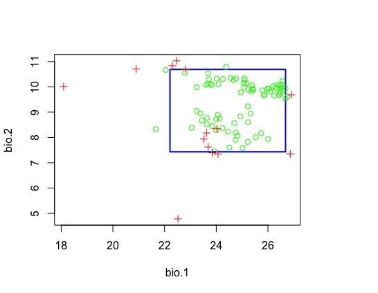
让我们绘制模型的响应变量或单个变量响应曲线。
```r
response(Bioclim.model)
```
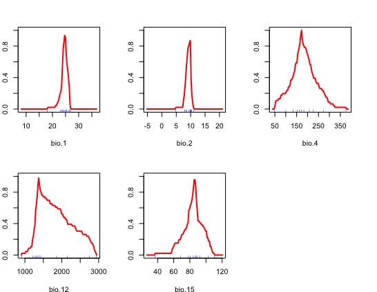
进行分布区预测
```r
Bioclim0k <- predict(object = Bioclim.model, x = climSA0k)
plot(Bioclim0k)
#加入现在的实际分布点
points(training[training[, "pb"]==1,"x"], training[training[, "pb"]==1,"y"])
```
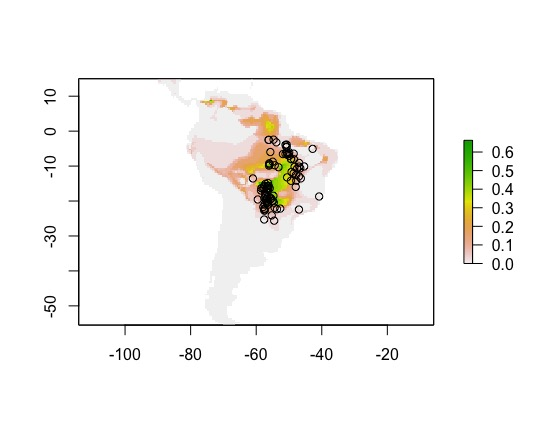
测试数据
```r
Bioclim.eval <- evaluate(p = test[test[, "pb"] == 1, 1:2], 
                         a = test[test[, "pb"] == 0, 1:2], 
                         model = Bioclim.model, 
                         x = climSA0k)
Bioclim.eval
#AUC: 0.8319892 
str(Bioclim.eval)
#设置阈值
Bioclim.thr <- threshold(Bioclim.eval)
Bioclim.thr
```
“thr”对象中有不同的列，每个列都是阈值的度量，在本示例中，我们将使用“ spec_sens”列（物种敏感度）。
在spec_sens中，阈值为灵敏度（真阳性率）和特异性（真阴性率）之和最高的值。
```r
bio <- Bioclim.thr$spec_sens
```
#### Gower模型
域算法计算任何位置的环境变量与已知的任何发生位置（“训练地点”）之间的高尔距离。对于每个变量，均采用站点与任何训练点之间的最小距离。
```r
Gower.model <- domain(x = training[training[, "pb"] == 1, -c(1:3)])
Gower.model
response(Gower.model)
#预测
Gower0k <- predict(climSA0k, Gower.model)
plot(Gower0k)
#验证
Gower.eval <- evaluate(p = test[test[, "pb"] == 1, 1:2], 
                       a = test[test[, "pb"] == 0, 1:2], 
                       model = Gower.model, 
                       x = climSA0k)
#查看阈值
Gower.thr <- threshold(Gower.eval)
gow <- Gower.thr$spec_sens
```
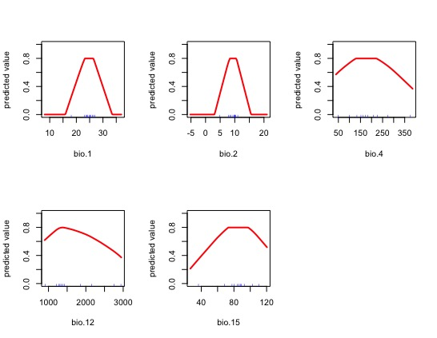
#### 支持向量机SVM
支持向量机是用于分类，独立性检测和回归的出色工具。
支持向量机（SVMs;Vapnik,1998）将简单的线性方法应用于数据，但是在与输入空间非线性相关的高维特征空间中，但实际上，它不涉及该高维中的任何计算空间。这种简单性与在许多学习问题（分类，回归和独立性检测）上的先进技术相结合，促进了SVM的普及（Karatzoglou等，2006）。
```r
svm.model <- ksvm(pb ~ bio.1 + bio.2 + bio.4 + bio.12 + bio.15, data = training)
#预测
svm0k <- predict(climSA0k, svm.model)
plot(svm0k)
#验证
svm.eval <- evaluate(p = test[test[, "pb"] == 1, 1:2], 
                     a = test[test[, "pb"] == 0, 1:2], 
                     model = svm.model, 
                     x = climSA0k)
#查看阈值
svm.thr <- threshold(svm.eval)
s <- svm.thr$spec_sens
```
#### 广义线性模型
广义线性模型（GLM）是普通最小二乘回归的广义。 使用最大似然并通过允许线性模型通过链接函数与响应变量相关以及通过允许每次测量的方差大小为其预测值的函数来拟合模型。根据GLM的指定方式，它可以等同于（多次）线性回归，逻辑回归或泊松回归。
```r
glm.model <- glm(pb ~ bio.1 + bio.2 + bio.4 + bio.12 + bio.15, 
                  data = training, family = binomial(link = "logit"))
#预测
GLM0k <- predict(climSA0k, glm.model)
plot(GLM0k)
#验证
glm.eval <- evaluate(p = test[test[, "pb"] == 1, 1:2], 
                     a = test[test[, "pb"] == 0, 1:2], 
                     model = glm.model, 
                     x = climSA0k)
#查看阈值
glm.thr <- threshold(glm.eval)
g <- glm.thr$spec_sens
```
比较4张图
```r
par(mfrow = c(2, 2))
plot(Bioclim0k, main = "bioclim")
plot(Gower0k, main = "Gower")
plot(svm0k, main = "svm")
plot(GLM0k, main = "glm")
```
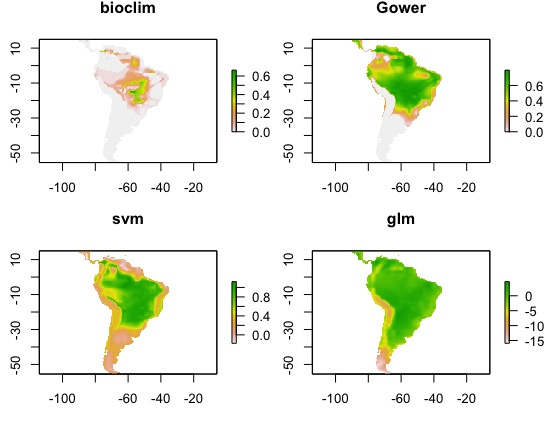
比较四个模型的ROC值
```r
par(mfrow = c(2, 2))
plot(Bioclim.eval, "ROC")
plot(Gower.eval, "ROC")
plot(svm.eval, "ROC")
plot(glm.eval, "ROC")
```
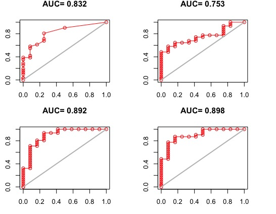
添加了阈值限制后的物种适宜分布区
```r
par(mfrow = c(2, 2))
plot(Bioclim0k > bio, main = "Bioclim")
plot(GLM0k > g, main = "GLM")
plot(Gower0k > gow, main = "Gower")
plot(svm0k > s, main = "SVM")
```
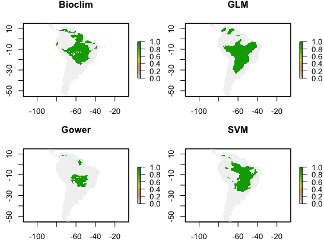
可以综合这四个数值以获得平均的结果/综合的结果
```r
thrs <- (bio + gow + s + g)
#stack()为堆叠函数
tmp <- stack(Bioclim0k, Gower0k, GLM0k, svm0k)
map.sum <- sum(tmp)
par(mfrow = c(2, 2))
plot(map.sum)
plot(map.sum > thrs)
plot(map.sum > 2)
plot(map.sum > 3)
```
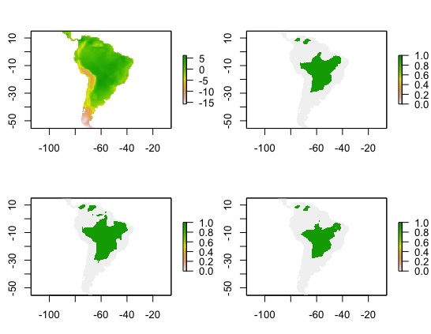
也可以查看他们的平均结果
```r
map.mean <- mean(tmp)
map.sd <- calc(tmp, sd)
par(mfrow = c(2, 2))
plot(map.mean)
plot(map.mean > thrs)
plot(map.mean > 0.2)
plot(map.mean > 0.3)
```
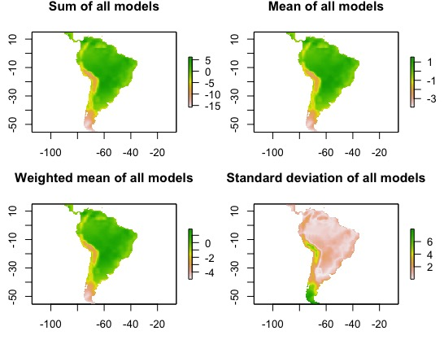
但是，这是一个有问题的方法，因为模型预测的值并不都在相同的范围（0到1）之间。所以您可能要先解决它。解决方案是添加权重。让我们结合按其AUC分数加权的四个模型。在这里，为了创建权重，我们减去0.5（随机期望）并将结果平方，以为更高的AUC值赋予更多权重。
```r
auc <- sapply(list(Bioclim.eval, Gower.eval, svm.eval, glm.eval), function(x) x@auc)
w <- (auc-0.5)^2
map.mean.weight <- weighted.mean(tmp[[c("layer.1", "layer.2", "layer.3", "layer.4")]], w)
plot(map.mean.weight)
par(mfrow = c(2, 2))
plot(map.sum, main = "Sum of all models")
plot(map.mean, main = "Mean of all models")
plot(map.mean.weight, main = "Weighted mean of all models")
plot(map.sd, main = "Standard deviation of all models")
```

[返回目录](#%e7%94%9f%e7%89%a9%e5%9c%b0%e7%90%86%e5%ad%a6)