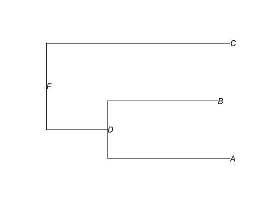
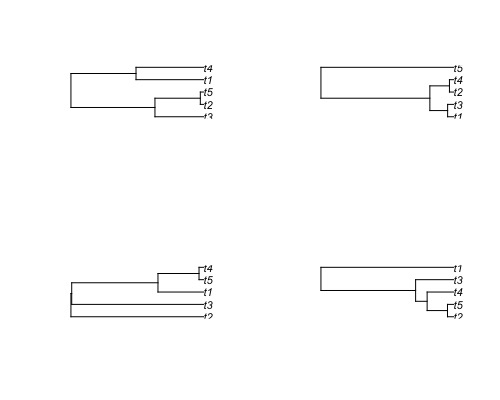

# 生物信息学
生物信息学非常有用，据说当前生物信息学的平均年薪已经接近10w刀，那么学习相关知识对于我们未来的发展非常重要。
[TOC]
## 系统发育数据
原作者：Jesús N. Pinto-Ledezma and Jeannine Cavender-Bares
了解数据对于研究生物多样性非常重要，而现在使用的一个常见数据是描述谱系之间以及谱系之间的进化关系的系统发育树。从这里到本简短教程的结尾，我们将尝试解释如何导入/导出和处理系统发育信息的基础知识。
### 格式
储存系统发育树的最常见格式是Newick，Nexus(Maddison et al. 1997)。
Newick格式将系统发育关系表示为”**(**“，”**,**“，”**:**“，具体如下：
括号将谱系链接到树的特定节点，而逗号“，”将从该节点下降的谱系分隔开。 节点名称后可以使用冒号标点“：”，后续数字值表示分支长度。 最后，用分号标点“;” 表示系统发育树的末端：
```r
library(ape)
#建树
newick_tree <- "((A:10,B:9)D:5,C:15)F;"
#读树
newick_tree <- read.tree(text = newick_tree)
#画树
plot(newick_tree, show.node.label = TRUE)
```

还有一种格式是Nexus，它有着更大的灵活性。
```r
#首先在工作目录里创建一个Nexus文件的树
cat(
 "#NEXUS
 BEGIN TAXA;
 DIMENSIONS NTAXA=3;
 TaxLabels A B C;
 END;
 BEGIN TREES;
 TREE=((A:10,B:9)D:5,C:15)F;
 END;",
file = "Data/Nexus_tree.nex"
)
#读树（使用read.nexus）
nexus_tree <- read.nexus("Data/Nexus_tree.nex")
#画树，图和上面一样，就不放了
plot(nexus_tree, show.node.label = TRUE)
#可以检查我们的树
#概览我们的树
str(nexus_tree)
#List of 5
# $ edge       : int [1:4, 1:2] 4 5 5 4 5 1 2 3
# $ edge.length: num [1:4] 5 10 9 15
# $ Nnode      : int 2 ##节点数？
# $ node.label : chr [1:2] "F" "D"
# $ tip.label  : chr [1:3] "A" "B" "C"
# - attr(*, "class")= chr "phylo"
# - attr(*, "order")= chr "cladewise"
nexus_tree$tip.label
#[1] "A" "B" "C"
#查看枝长
nexus_tree$edge.length
#[1]  5 10  9 15
#nexus_tree$edge
#可以查看发育树的边的矩阵。在此矩阵中，每一行代表树中的一个分支，第一列显示该分支的祖先节点的索引，第二列显示该分支的后代节点。
nexus_tree$edge
#[,1] [,2]
#[1,]    4    5
#[2,]    5    1
#[3,]    5    2
#[4,]    4    3
#这些数据让人摸不着头脑，我们可以在树上显示数字代号以便理解
plot(nexus_tree, show.tip.label = FALSE)
nodelabels()
tiplabels()
```

最后，系统发育树也可以列表的形式导入，并且在系统发育比较方法中，系统发育树的列表称为multiPhylo，我们可以两种格式导入/导出这些multiPhylos。
```r
#模拟10个不同的系统发育树，每个系统发育树内有5个种
multitree <- replicate(10, rcoal(5), simplify = FALSE)
#将这些一起保存为一个multiPhylo项目
class(multitree) <- "multiPhylo"
#把其中的第10个发育树画出来
plot(multitree[[10]])
#分成2行2列来显示下面4个发育树
par(mfrow = c(2, 2))
#下面是四个发育树
plot(multitree[[1]])
plot(multitree[[3]])
plot(multitree[[7]])
plot(multitree[[10]])
```

```r
#导入导出这些数据
#作为newick导入
write.tree(phy = multitree, file = "Data/multitree_example_newick.txt")
#导出
multitree_example_newick <- read.tree("Data/multitree_example_newick.txt")
#查看
multitree_example_newick
#10 phylogenetic trees
#作为nexus导入
write.nexus(phy = multitree, file = "Data/multitree_example_nexus.nex")
multitree_example_nexus <- read.nexus("Data/multitree_example_nexus.nex")
multitree_example_nexus
#10 phylogenetic trees
```
### 循环
编程中最重要的就是活用**for**进行循环，其基本结构是：`for (variable in vector 向量中的变量) {execute defined statements执行定义的语句}`
在编程时，通常使用循环变量**i**来确定步数因为**i**是iteration一词的第一个字母，不过你也可以使用任何字母或单词作为循环变量。
```r
#cat函数将里面的数据排排站输出
for (i in 1:10){
    cat(i, sep = '')
}
#12345678910
#让1-10的数据换行输出，结果不列
for (i in 1:10){
  cat(i, sep = '\n')
}
BioSciNames <- c("Jeannine", "Jesús", "Bailey","Kalli", "Ariadna", "Samantha", "Maxell",
                 "Sara", "Nicholas", "Carmen", "Ashley", "Mikkel", "Shana", "Kirsten",
                 "Lucy", "Joe", "Joshua")
for (i in 12:length(BioSciNames)){
  cat("Hi,", BioSciNames[i], ", welcome to the first practice!","\n");
}
#从第12个人开始套娃输出这句话
#Hi, Mikkel , welcome to the first practice! 
#Hi, Shana , welcome to the first practice! 
#Hi, Kirsten , welcome to the first practice! 
#Hi, Lucy , welcome to the first practice! 
#Hi, Joe , welcome to the first practice! 
#Hi, Joshua , welcome to the first practice!
```
## 系统发育广义最小二乘法（PGLS）
来源：R course in Ilhabela, Brazil, June 2015
首先，我们需要安装一些程序包
```r
library(ape)
library(geiger)
library(nlme)
library(maps)
library(phytools)
```
然后我们需要一些数据进行处理，这里可以使用安乐蜥属（*Anolis*）的数据和系统发育树进行尝试。相关的文件在[我的github](https://github.com/Vendredii/Rstats)。
```r
anoleData <- read.csv('/Users/desktop/r/anolisDataAppended.csv',row.name = 1)
anoleTree <- read.tree('/Users/desktop/r/anolis.phy')
#显示树
plot(anoleTree)
#Geiger有一个函数可以查看树内的物种是否和数据内的物种名匹配
name.check(anoleTree, anoleData)
#[1] "OK"
#我们可以查看数据awesomeness和hostility是否关联
plot(anoleData[,c("awesomeness", "hostility")])
#如果关联，那么我们可以检测它们的PIC（多态信息量）
#提取列
host<-anoleData[,"hostility"]
awe<-anoleData[,"awesomeness"]
#赋名
names(host)<-names(awe)<-rownames(anoleData)
#计算PIC
hPic<-pic(host, anoleTree)
aPic<-pic(awe, anoleTree)
#建模（回归）
picModel<-lm(hPic~aPic-1)
#结果
summary(picModel)
#lm(formula = hPic ~ aPic - 1)
#
#Residuals:
#    Min      1Q  Median      3Q     Max 
#-2.1051 -0.4188  0.0103  0.3137  4.9991 
#
#Coefficients:
#     Estimate Std. Error t value Pr(>|t|)    
#aPic -0.97758    0.04516  -21.65   <2e-16 ***
#---
#Signif. codes:  0 ‘***’ 0.001 ‘**’ 0.01 ‘*’ 0.05 ‘.’ #0.1 ‘ ’ 1
#
#Residual standard error: 0.8967 on 98 degrees of freedom
#Multiple R-squared:  0.827,	Adjusted R-squared:  0.8253 
#F-statistic: 468.6 on 1 and 98 DF,  p-value: < 2.2e-16
#绘图
plot(hPic~aPic)
abline(a=0, b=coef(picModel))
```
以上全部的过程就是PGLS的流程，我们可以用PGLS将它们很简单地完成：
```r
pglsModel<-gls(hostility~awesomeness, correlation=corBrownian(phy=anoleTree), data=anoleData, method="ML")
summary(pglsModel)
#Generalized least squares fit by maximum likelihood
#  Model: hostility ~ awesomeness 
#  Data: anoleData 
#       AIC     BIC    logLik
#  190.9775 198.793 -92.48875
#
#Correlation Structure: corBrownian
# Formula: ~1 
# Parameter estimate(s):
#numeric(0)
#
#Coefficients:
#                 Value  Std.Error    t-value p-value
#(Intercept)  0.1505613 0.26262709   0.573289  0.5678
#awesomeness -0.9775847 0.04515861 -21.647804  0.0000
#
# Correlation: 
#            (Intr)
#awesomeness -0.042
#
#Standardized residuals:
#        Min          Q1         Med          Q3         Max 
#-0.76019997 -0.39056977 -0.04941607  0.19596725  1.07373699 
#
#Residual standard error: 0.8877372 
#Degrees of freedom: 100 total; 98 residual
#读取之前的回归系数
coef(pglsModel)
plot(host~awe)
abline(a=coef(pglsModel)[1], b=coef(pglsModel)[2])
```
但是PGLS的功能更多，我们还可以给数据增加anova分析来判断离散程度,也可以同时模拟多个变量：
```r
pglsModel2<-gls(hostility~ecomorph, correlation=corBrownian(phy=anoleTree), data=anoleData, method="ML")
anova(pglsModel2)
#Denom. DF: 93 
#            numDF    F-value p-value
#(Intercept)     1 0.01986379  0.8882
#ecomorph        6 0.23482069  0.9641
coef(pglsModel2)
#(Intercept)  ecomorphGB   ecomorphT  ecomorphTC  ecomorphTG  ecomorphTW 
#  0.4843515  -0.6315992  -1.0585278  -0.8558138  -0.4085610  -0.4039460 
#  ecomorphU 
# -0.7021719
#同时拟合多个变量
pglsModel3<-gls(hostility~ecomorph*awesomeness, correlation=corBrownian(phy=anoleTree), data=anoleData, method="ML")
anova(pglsModel3)
#Denom. DF: 86 
#                     numDF  F-value p-value
#(Intercept)              1   0.1416  0.7076
#ecomorph                 6   1.6740  0.1371
#awesomeness              1 549.8314  <.0001
#ecomorph:awesomeness     6   4.5226  0.0005
```
我们还可以假设错误结构遵循OU模型而不是布朗运动：
```r
#不要收敛，不然难以固定
pglsModelLambda<-gls(hostility~awesomeness, correlation=corPagel(1, phy=anoleTree, fixed=FALSE), data=anoleData, method="ML")
#这是规模问题。我们可以通过增加分支长度来快速固定参数。除了重新调整讨厌的参数外，这不会影响分析。
tempTree<-anoleTree
tempTree$edge.length<-tempTree$edge.length * 100
pglsModelLambda<-gls(hostility~awesomeness, correlation=corPagel(1, phy=tempTree, fixed=FALSE), data=anoleData, method="ML")
summary(pglsModelLambda)
#Generalized least squares fit by maximum likelihood
#  Model: hostility ~ awesomeness 
#  Data: anoleData 
#       AIC      BIC    logLik
#  72.56056 82.98124 -32.28028
#
#Correlation Structure: corPagel
# Formula: ~1 
# Parameter estimate(s):
#    lambda 
#-0.1585633 
#
#Coefficients:
#                 Value  Std.Error    t-value p-value
#(Intercept)  0.0612470 0.01581847   3.871868   2e-04
#awesomeness -0.8776519 0.03104246 -28.272628   0e+00
#
# Correlation: 
#            (Intr)
#awesomeness -1    
#
#Standardized residuals:
#        Min          Q1         Med          Q3         Max 
#-1.78946302 -0.71477505  0.00309539  0.78509306  2.23215144 
#
#Residual standard error: 0.3709858 
#Degrees of freedom: 100 total; 98 residual
pglsModelOU<-gls(hostility~awesomeness, correlation=corMartins(1, phy=tempTree), data=anoleData, method="ML")
summary(pglsModelOU)
#Generalized least squares fit by maximum likelihood
#  Model: hostility ~ awesomeness 
#  Data: anoleData 
#       AIC      BIC    logLik
#  96.63478 107.0555 -44.31739
#
#Correlation Structure: corMartins
# Formula: ~1 
# Parameter estimate(s):
#   alpha 
#4.441625 
#
#Coefficients:
#                 Value  Std.Error    t-value p-value
#(Intercept)  0.1084258 0.03952884   2.742954  0.0072
#awesomeness -0.8811632 0.03657646 -24.090988  0.0000
#
# Correlation: 
#            (Intr)
#awesomeness -0.269
#
#Standardized residuals:
#       Min         Q1        Med         Q3        Max 
#-1.8664557 -0.8132899 -0.1103815  0.6474918  2.0919152 
#
#Residual standard error: 0.376904 
#Degrees of freedom: 100 total; 98 residual
```