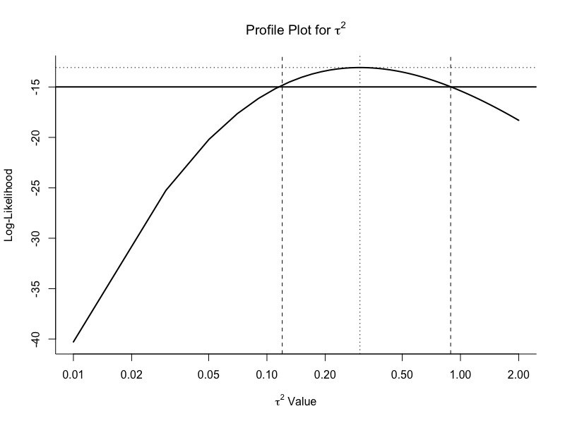
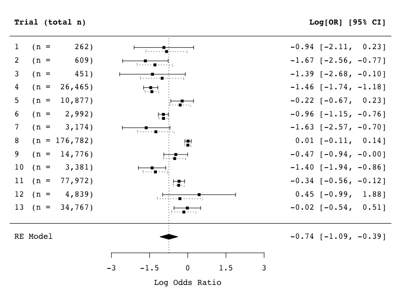
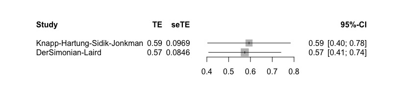

# Meta分析
Meta分析（荟萃分析）是什么呢...感觉就是研究别人的研究，因为对于许多单独进行的研究而言，样本观察组太小可能会对结论产生影响。所以荟萃分析是将系统评价中的不同结果的同类研究合并为一个量化指标的统计学方法，算是一种系统评价的方法。既然是所谓的systematic review，那就有着严格的纳入标准与全面的系统检索，因此其实要说简单那也不能算简单：

1. 文献检索与筛选：Web of Science高级检索
2. 数据提取：制作特征表：整合所有文献的信息；接着制作质量评价表：对入选文献打分（Cochrane手册？）
3. 统计学分析：数据有两种形式：二分类（好/坏），或者连续变量（也可以是离散的？），分析后制作为
   1）森林图，一个指标一个图，看看有效性，异质性（$I^2>50?$），效应尺度？
   2）漏斗图，对称表示满意发表性偏倚。
   如果存在异质性，还需要进行敏感性分析/亚组分析.
接着就是R语言基于metafor包进行meta分析了！
## 相关函数包
首推metafor和meta包
这些软件包使用户能够计算出在荟萃分析（escalc()函数）中经常使用的各种效应大小和结果度量，包括：（不懂这些是啥，翻译了放上去就完事儿了）
1. 2×2表格数据的风险差异RD，风险比RR和优势比（Odds Ratio），
2. 两组人时数据的发生率比率和差异，
3. 原始和标准化的均值差和响应率（均值比），
4. Raw和Fisher的r-z转换相关系数，
5. 原始，对数，logit，反正弦和Freeman-Tukey双反正弦变换比例，
6. 原始，对数和平方根转换的发生率，
7. 原始均值，均值变化和标准均值变化，
8. 原始和转换后的Cronbach的alpha值。

也提供了多种模型与分析方法：
1. 使用反方差方法（rma()函数）的固定，随机和混合效应模型，
2. Mantel-Haenszel和Peto的（一步式）方法用于2×2表格和两组人时数据（rma.mh()和rma.peto()功能），
3. 用于分析2×2表数据，两组人时数据，比例和发生率（rma.glmm()函数）的广义线性（混合效应）模型（即混合效应（条件）对数模型和Poisson回归模型），
4. 多层次和多元荟萃分析（rma.mv()功能）的模型，
5. 网络荟萃分析和混合治疗比较（rma.mv()功能）的模型，
6. 系统发育荟萃分​​析的模型（rma.mv()功能），
7. 时空荟萃分析模型（rma.mv()函数），
8. 分组和（混合效应）元回归分析，
9. 具有用户定义的权重的模型。

图片与表格的绘制：
1. 漏斗图（funnel()函数），
2. 森林图（forest()和addpoly()功能），
3. Baujat图（baujat()函数），
4. L'Abbé图（labbe()函数），
5. 径向（Galbraith）图（radial()函数），
6. GOSH图（gosh()函数），
7. 轮廓似然图（profile()函数），
8. 正常分位数（QQ）图（qqnorm()函数）。

发表性偏倚，可以通过多种方法来检查是否存在发布偏差（或更准确地说，是漏斗图不对称或“小研究效应”）及其对结果的潜在影响，包括：
1. 等级相关检验（ranktest()函数），
2. Egger回归测试（regtest()函数），
3. 修剪和填充方法（trimfill()功能），
4. Henmi和Copas方法（hc()函数），
5. 使用Rosenthal，Orwin和Rosenberg方法（fsn()功能）进行文件抽屉分析（故障安全N计算），
6. 重要性检验（tes()功能）。

该软件包提供了标准和高级方法，用于基于元分析数据得出推论并评估模型拟合，包括：
1. 似然比和Wald型检验（anova()函数），
2. 异质性统计量（confint()函数）的置信区间，
3. 排列测试（permutest()功能），
4. （集群）健壮测试和置信区间（robust()函数），
5. 累积荟萃分析（cumul()函数），
6. 拟合和预测的结果（fitted()和predict()功能），
7. 最佳线性无偏预测（ranef()和blup()函数），
8. 使用Knapp和Hartung方法改善了测试/置信区间，
9. 模型拟合标准（logLik()和deviance()函数），
10. 信息标准（AIC()，BIC()和fitstats()功能），
11. 模拟来自拟合模型（simulate()功能）的数据。

该软件包还可以兼容glmulti和MuMIn包进行模型选择和（多）模型推理，可以在boot包进行bootstrapping，并在mice和Amelia包进行多重插补。

离群值/影响诊断，有多种方法可用于识别异常值和/或有影响力的研究，以及进行敏感性分析，包括：
1. 生/标准化/学生化残差（residuals()，rstandard()，和rstudent()函数），
2. DFFITS值，库克距离，协方差比和DFBETAS值（influence()函数），
3. 模型权重和帽子值（weights()和hatvalues()函数），
4. 留一法分析（leave1out()和influence()功能）。


计算结果变量：
主函数：
```r
escalc(measure, ai, bi, ci, di, n1i, n2i, m1i, m2i, sd1i, sd2i, xi, mi, ri, ni, data = NULL, add = 1/2, to = "only0", vtype = "LS", append = FALSE)
```
其中`measure`是一个字符串，指定应计算哪个结果度量值（参见下面的各种选项），参数`ai`到`ni`用于提供计算各种度量值所需的信息（取决于`measure`下指定的结果度量值，需要提供不同的参数），`data`可用于指定一个数据帧，其中包含给前面参数的变量，`add`和`to`是处理2×2表格数据（可能包含带零单元格）时所需的参数，`vtype`是一个参数，指定应计算的采样方差估计值（见下文）。当设置`append=TRUE`时，通过`data`参数指定的数据帧将与效果大小估计值和相应的采样方差一起返回。
## 教程
[运用R语言进行Meta分析](https://github.com/MathiasHarrer/Doing-Meta-Analysis-in-R)

## 实例
van Houwelingen, H. C., Arends, L. R., & Stijnen, T. (2002). Advanced methods in meta-analysis: Multivariate approach and meta-regression. Statistics in Medicine, 21(4), 589-624.

加载数据
```r
library(metafor)
dat <- dat.colditz1994
dat
```
(我将数据集复制到“dat”中，它更短一些，因此更容易在下面输入)。数据集中的变量tpos和tneg表示接种(治疗)组中结核阳性和阴性的个体数量，而cpos和cneg表示未接种(对照组)组中结核阳性和阴性的个体数量。
我们可以计算单个对数比值比和相应的抽样方差:
```r
dat <- escalc(measure="OR", ai=tpos, bi=tneg, ci=cpos, di=cneg, data=dat)
```
此外，我们还可以将年份变量重新编码如下表所示：
```r
dat$year <- dat$year - 1900
```
建立混合效应模型：
```r
res <- rma(yi, vi, data=dat, method="FE")
res
```
为便于解释，可将这些结果反向转换为比值比尺度:
```r
predict(res, transf=exp, digits=3)
```
对于相同的数据，可以拟合一个随机效应模型(使用最大似然估计):
```r
res <- rma(yi, vi, data=dat, method="ML")
res
```
同样，我们可以将这些结果反向转换为优势比尺度:
```r
predict(res, transf=exp, digits=3)
```
下图给出了试间方差的似然函数曲线。可以得到相同的图:
```r
profile(res, xlim=c(0.01,2), steps=100, log="x", cex=0, lwd=2)
abline(h=logLik(res) - 1.92, lwd=2)
abline(v=c(0.12, 0.89), lty="dashed")
```

基于概率的95%轮廓置信区间的边界也被添加到数字。然而，利用最大似然获得的ci为$\tau ^2$经常达不到名义上的覆盖概率，特别是当基于ML估计。在这种情况下，间隔可能太窄。另一方面，用Q-profile方法得到的ci为$\tau ^2$，通常可以达到名义覆盖概率。这样的CI很容易通过以下方法得到:
```r
confint(res)
```
为平均处理效果(即$\mu$)构建一个似然曲线(见文章中的图2)和相应的CI则稍微复杂一些(见第598页)。然而，作为另一种选择，我建议使用Knapp和Hartung方法为$\mu$构建CI。众所周知，它在大多数情况下基本上实现名义上的覆盖。该CI可由以下得出，数值会宽一点:
```r
res <- rma(yi, vi, data=dat, method="ML", test="knha")
predict(res, transf=exp, digits=3)
```
下图显示了在95% ci下观察到的对数比值比和相应的95%后验置信区间的经验贝叶斯估计。通过一些工作，同样的图形可以创建与:
```r
res <- rma(yi, vi, data=dat, method="ML")
sav <- blup(res)
 
par(family="mono", mar=c(5,4,1,2))
forest(res, refline=res$b, addpred=TRUE, xlim=c(-7,8), alim=c(-3,3), slab=1:13, psize=0.8,
       ilab=paste0("(n = ", formatC(apply(dat[,c(4:7)], 1, sum), width=7, big.mark=","), ")"),
       ilab.xpos=-3.5, ilab.pos=2, rows=13:1+0.15, header="Trial (total n)")
arrows(sav$pi.lb, 13:1 - 0.15, sav$pi.ub, 13:1 - 0.15, length=0.03, angle=90, code=3, lty="dotted")
points(sav$pred, 13:1 - 0.15, pch=15, cex=0.8)
```

底部显示的预测区间(通过总结多边形的虚线)比本文中报告的略宽，因为它也考虑到了$\hat{\mu}$中的不确定性。这个区间(即-1.875到.391)也可以通过:
```r
predict(res, digits=3)
```
接下来可以考虑多变量的情景：
在文章的下一部分，作者介绍了元分析的二元模型。为此，以不同的方式处理数据集，每个研究为分析贡献两个数据点，即接种(处理)组的结果(即log odds)和未接种(对照组)组的结果(即log odds)。L’abbe的图使这个想法很明确:
```r
res <- rma(measure="OR", ai=tpos, bi=tneg, ci=cpos, di=cneg, data=dat, method="ML")
labbe(res, xlim=c(-7,-1), ylim=c(-7,-1), xlab="ln(odds) not-vaccinated group", ylab="ln(odds) vaccinated group")
```
虚线表示基于模型的估计效果:

对应的长格式数据集可以通过:
```r
dat.long <- to.long(measure="OR", ai=tpos, bi=tneg, ci=cpos, di=cneg, data=dat.colditz1994)
```
具有相应采样方差的特定结果(即log odds)可以添加到数据集:
```r
dat.long <- escalc(measure="PLO", xi=out1, mi=out2, data=dat.long)
dat.long$tpos <- dat.long$tneg <- dat.long$cpos <- dat.long$cneg <- NULL
levels(dat.long$group) <- c("EXP", "CON")
dat.long$group <- relevel(dat.long$group, ref="CON")
dat.long
```
由于用于计算这些特定结果的数据没有重叠，观察到的结果是(有条件的)独立的。然而，相应的真实结果可能是相关的。双变量模型允许我们估计两组真实结果的方差和相关性:
```r
res <- rma.mv(yi, vi, mods = ~ group - 1, random = ~ group | trial, struct="UN", data=dat.long, method="ML")
res
```
不去除截距(将对照组作为组因子的参考水平)，直接从该模型得到估计的(平均)对数比值比:
```r
res <- rma.mv(yi, vi, mods = ~ group, random = ~ group | trial, struct="UN", data=dat.long, method="ML")
```
$\mu$的估计数(即-0.74)与之前基于(log)优势比的随机效应模型得到的估计数基本相同。同时，基于二元模型，我们可以通过以下方法来估计真实对数比值比的异质性程度:
```r
res$tau2[1] + res$tau2[2] - 2*res$rho*sqrt(res$tau2[1]*res$tau2[2])
```
这个值与之前得到的$\tau ^2$的估计值非常接近。

### 数据处理与导入
```r
load("_data/Meta_Analysis_Data.RData")
madata <- Meta_Analysis_Data
colnames(madata)[6:12] = c("Intervention_Duration", "Intervention_Type", "Population",
                          "Type_of_Students", "Prevention_Type", "Gender", "Mode_of_Delivery")
#干预持续时间，干预的类型，被试类型，预防的类型，性别，交付方式？
madata <- Meta_Analysis_Data
#删除一些列
madata$`ROB streng`=NULL
madata$`ROB superstreng`=NULL
#查看数据结构
str(madata)
```
虽然这个输出看起来有点乱，但它已经提供了很多信息。它显示了我的数据结构。在本例中，我使用的数据已经计算出了效应大小。这就是变量TE和seTE出现的原因。我还看到了许多其他变量，它们对应于为这个数据集编码的子组。
接下来可以以表格的形式查看数据：
```r
library(kableExtra)
library(magrittr)
madata.s<-madata[,1:7]
madata.s$population=NULL
madata.s %>% 
  kable("html") %>%
  kable_styling(font_size = 10)
```
现在我们在RStudio中有了荟萃分析数据，让我们对数据做一些操作。当我们稍后进行分析时，这些函数可能会派上用场。
假设我们有偏倚风险亚组(其中偏倚评级风险被编码)，并希望它是一个具有两个不同级别的因素:“低”和“高”。
要做到这一点，我们需要变量ROB作为一个因子。但是，这个变量当前存储为字符(chr)。我们可以通过键入数据集的名称来查看这个变量，然后添加选择器$，然后添加我们想查看的变量。滞后我们把这些高（high）和低（low）变量都转为数字变量（1和2）。
```r
madata = Meta_Analysis_Data
madata$ROB<-madata$`ROB streng`
madata$ROB
str(madata$ROB)
madata$ROB<-factor(madata$ROB)
madata$ROB
str(madata$ROB)
```
现在让我们来看看干预类型亚组变量。该列目前也是作为character(chr)变量存储的。
假设我们想要一个变量它只包含一个研究是否是正念干预的信息。logical类型的数据非常适合于此。为了将数据转换为逻辑数据，我们使用`as.logical`。我们将创建一个包含此信息的新变量，称为`intervention.type.logical`。为了告诉我们哪些为`TRUE`，哪些为`FALSE`，我们必须使用`==`命令定义特定的干预类型。
```r
intervention.type.logical<-as.logical(madata$`intervention type`=="mindfulness")
intervention.type.logical
```
我们看到R已经为我们将字符信息转换成正确和错误两种形式。为了检查这个操作是否正确，让我们比较原始变量和新变量。
```r
n <- data.frame(intervention.type.logical,madata$`intervention type`)
names <- c("New", "Original")
colnames(n) <- names
kable(n)
```
选择某些研究进行进一步的分析，或者在进一步的分析中排除某些研究(例如，如果它们是异常值)，这通常是有用的。为此，我们可以使用dplyrpackage中的过滤器函数，它是我们之前安装的tidyverse包的一部分:
```r
library(dplyr)
#筛选这三个人的数据
madata.new <- dplyr::filter(madata, Author %in% c("Cavanagh et al.",
                                                  "Frazier et al.",
                                                  "Phang et al."))
#并查看
madata.new %>% 
  kable("html") %>% 
  kable_styling(font_size = 9)
#只选择那些被编码为正念研究的研究
madata.new.mf <- dplyr::filter(madata,`intervention type` %in% c("mindfulness"))
#排除特定的研究
madata.new.excl <- dplyr::filter(madata,!Author %in% c("Cavanagh et al.",
                                                     "Frazier et al.",
                                                     "Phang et al."))
#查看行列并修改
madata[6,1]
madata[6,1] <- "Frogelli et al."
```
### 合并效应量
这是为了得到一个对研究总体效应大小的估计：
在荟萃分析中汇聚效应规模时，我们可以使用两种方法:固定效应模型或随机效应模型。关于哪种模式在哪种背景下最适合，存在着广泛的争论，目前尚无明确的共识。虽然在临床心理学和健康科学中建议只使用随机效应池模型，但我们将在这里描述如何在R中进行。

这两个模型只需要每个研究的效应大小，和一个离散(方差)估计，两者取反比。这就是为什么这些方法通常被称为泛型反方差方法。

### 固定效应模型
我们首先要用一般的心理测量数据和心理测量数据来描述这些差异。稍后，我们将把这些知识扩展到使用多变量数据的荟萃分析，如果你专注于预防试验，这可能很重要。
对于所有的meta分析，我们将使用`meta`包。在第2.1节中，我们展示了如何安装包。从库开始加载程序包。
```r
library(meta)
library(tidyverse)
library(knitr)
```
固定效应模型假设所有的研究以及它们的效应大小都来自一个单一的同质群体。因此，为了计算整体效应，我们平均所有效应大小，但给予研究更高精度更高的权重。在这种情况下，更高的精度意味着研究有一个更大的N，这导致其效应大小估计的标准误差较小。

为了获得权重，我们必须使用每个研究$k$的逆方差 $1/\hat\sigma^2_k$。然后我们计算所有研究的加权平均值，即我们的固定效应大小估计值$\hat\theta_F$:
$$\hat\theta_F = \frac{\sum\limits_{k=1}^K \hat\theta_k/ \hat\sigma^2_k}{\sum\limits_{k=1}^K 1/\hat\sigma^2_k}$$
* 它可以存储为**原始数据**（包括每个研究的平均值M、参与数N和标准差SD）
* 或者它只包含**计算的效果大小和标准误差（SE）**。
```r
load("_data/Meta_Analysis_Data.RData")
madata<-Meta_Analysis_Data
str(madata)

```
此数据集中的效果大小基于**连续结果数据**。因为我们的效果大小已经计算好了，所以我们可以使用`meta::metagen`函数。对于这个函数，我们可以指定参数的加载，所有这些参数都可以通过输入`?metagen`包后显示。
让我们先分析一下这个荟萃代码的影响。我们将给出这个分析结果的简单名称`m`:
```r
m <- metagen(TE,
             seTE,
             data=madata,
             studlab=paste(Author),
             comb.fixed = TRUE,
             comb.random = FALSE,
             prediction=TRUE,
             sm="SMD")
m
#                          SMD            95%-CI %W(fixed)
#Call et al.            0.7091 [ 0.1979; 1.2203]       3.6
#Cavanagh et al.        0.3549 [-0.0300; 0.7397]       6.3
#DanitzOrsillo          1.7912 [ 1.1139; 2.4685]       2.0
#de Vibe et al.         0.1825 [-0.0484; 0.4133]      17.5
#Frazier et al.         0.4219 [ 0.1380; 0.7057]      11.6
#Frogeli et al.         0.6300 [ 0.2458; 1.0142]       6.3
#Gallego et al.         0.7249 [ 0.2846; 1.1652]       4.8
#Hazlett-Stevens & Oren 0.5287 [ 0.1162; 0.9412]       5.5
#Hintz et al.           0.2840 [-0.0453; 0.6133]       8.6
#Kang et al.            1.2751 [ 0.6142; 1.9360]       2.1
#Kuhlmann et al.        0.1036 [-0.2781; 0.4853]       6.4
#Lever Taylor et al.    0.3884 [-0.0639; 0.8407]       4.6
#Phang et al.           0.5407 [ 0.0619; 1.0196]       4.1
#Rasanen et al.         0.4262 [-0.0794; 0.9317]       3.6
#Ratanasiripong         0.5154 [-0.1731; 1.2039]       2.0
#Shapiro et al.         1.4797 [ 0.8618; 2.0977]       2.4
#SongLindquist          0.6126 [ 0.1683; 1.0569]       4.7
#Warnecke et al.        0.6000 [ 0.1120; 1.0880]       3.9
#
#Number of studies combined: k = 18
#
#                       SMD            95%-CI    z  p-value
#Fixed effect model  0.4805 [ 0.3840; 0.5771] 9.75 < 0.0001
#Prediction interval        [-0.0344; 1.1826]              
#
#Quantifying heterogeneity:
# tau^2 = 0.0752 [0.0357; 0.3046]; tau = 0.2743 [0.1891; 0.5519];
# I^2 = 62.6% [37.9%; 77.5%]; H = 1.64 [1.27; 2.11]
#
#Test of heterogeneity:
#     Q d.f. p-value
# 45.50   17  0.0002
#
#Details on meta-analytical method:
#- Inverse variance method
#- DerSimonian-Laird estimator for tau^2
#- Jackson method for confidence interval of tau^2 and tau
```
我们现在看到了meta分析的结果，包括
* 每个研究的个体效应大小**individual effect sizes**及他们的权重
* 研究的总数**number of included studies** ($k$)
* 总体效应**overall effect** (本例中 $g$ = 0.48) 及置信区间与$p$-value
* 不同研究异质性的度量**between-study heterogeneity**, 如$tau^2$或$I^2$或者 异质性的$Q$-test
使用`$`命令，我们还可以直接查看各种输出。例如：
```r
#95%置信区间的下限
m$lower.I2
```
可以把结果保存为一个txt
```r
sink("results.txt")
print(m)
sink()
```

要从原始数据进行固定效果模型荟萃分析，我们必须使用meta:：metacont()函数。然而，代码的结构看起来非常相似。
```r
#加载并查看数据
load("_data/metacont_data.RData")
metacont$Ne<-as.numeric(metacont$Ne)
metacont$Me<-as.numeric(metacont$Me)
metacont$Se<-as.numeric(metacont$Se)
metacont$Mc<-as.numeric(metacont$Mc)
metacont$Sc<-as.numeric(metacont$Sc)
str(metacont)
```
进行Meta分析：
```r
m.raw <- metacont(Ne,
                  Me,
                  Se,
                  Nc,
                  Mc,
                  Sc,
                  data=metacont,
                  studlab=paste(Author),
                  comb.fixed = TRUE,
                  comb.random = FALSE,
                  prediction=TRUE,
                  sm="SMD")
m.raw
#             SMD             95%-CI %W(fixed)
#Cavanagh -0.4118 [-0.8081; -0.0155]      13.8
#Day      -0.2687 [-0.6154;  0.0781]      18.0
#Frazier  -0.7734 [-1.0725; -0.4743]      24.2
#Gaffney  -0.7303 [-1.2542; -0.2065]       7.9
#Greer    -0.7624 [-1.0992; -0.4256]      19.1
#Harrer   -0.1669 [-0.5254;  0.1916]      16.9
#
#Number of studies combined: k = 6
#
#                        SMD             95%-CI     z  p-value
#Fixed effect model  -0.5245 [-0.6718; -0.3773] -6.98 < 0.0001
#Prediction interval         [-1.1817;  0.1494]               
#
#Quantifying heterogeneity:
# tau^2 = 0.0441 [0.0000; 0.4236]; tau = 0.2101 [0.0000; 0.6509];
# I^2 = 56.1% [0.0%; 82.3%]; H = 1.51 [1.00; 2.38]
#
#Test of heterogeneity:
#     Q d.f. p-value
# 11.39    5  0.0441
#
#Details on meta-analytical method:
#- Inverse variance method
#- DerSimonian-Laird estimator for tau^2
#- Jackson method for confidence interval of tau^2 and tau
#- Hedges' g (bias corrected standardised mean difference)
```
如您所见，所有计算的效果大小现在都是负数，包括总效应。然而，所有的研究都报告了一个积极的结果，这意味着干预组的症状（如抑郁症）减轻了。消极取向的结果是，在许多临床试验中，较低的分数表示更好的结果（例如，更少的抑郁）。像这样报告价值是没有问题的：事实上，这是传统的。
然而，一些不熟悉荟萃分析的读者可能会对此感到困惑，所以你可以考虑在你的论文中报告之前改变你的价值取向。
### 随机效应模型
之前，我们展示了如何使用`metagen`和`metacont`函数执行固定效果模型的荟萃分析。

然而，我们只能在假设**所有包含的研究来自同一人群**时使用固定效应模型。在实践中，几乎没有这种情况：干预措施可能在某些特征上有所不同，每个研究中使用的样本可能略有不同，或者其方法也可能略有不同。在这种情况下，我们不能假设所有的研究都来自同一个假设的“总体”研究。

一旦我们在固定效应模型meta分析中检测到**统计异质性**，情况也是如此，$I^{2}>0\%$。
你很可能会用荟萃模型来分析。谢天谢地，当我们在*R*中进行随机效应模型元分析而不是固定效应模型荟萃分析时，我们不需要考虑太多。

在随机效应模型中，我们想解释我们的假设，即研究效果估计值比从单个总体得出的结果显示出更多的方差。随机效应模型是在所谓的交换性假设下工作的。这意味着，在随机效应模型的元分析中，我们不仅假设个别研究的效果因抽样误差而偏离所有研究的真实干预效果，而且还有另一个方差来源，即研究并非来自一个单一群体，而是来自于一个“大范围的”种群。
因此，我们假设不仅存在一个真实效应大小，而且**一个真实效应大小的分布**。因此，我们要估计真实效应大小分布的平均值。固定效应模型假设，当单个研究$k$的观测效应大小$\hat\theta_k$与真实效应大小$\theta_F$有偏差时，唯一的原因是估计值受到（抽样）误差$\epsilon_k$的负担。
$$\hat\theta_k = \theta_F + \epsilon_k$$
而随机效应模型假设，除此之外，还有**第二个误差源**$\zeta_k$。这第二个误差源是由这样一个事实引入的：即使我们的研究$k$的真实效应大小$\theta_k$也只是真实效应大小平均值$\mu$的过度分布的一部分。
因此，随机效应模型的公式如下所示：
$$\hat\theta_k = \mu + \epsilon_k + \zeta_k$$
因此，在计算随机效应模型元分析时，我们还必须考虑误差$\zeta_k$。要做到这一点，我们必须**估计真实效果大小分布的方差**，它用$\tau^{2}$，或tau^2^表示。$\tau^{2}$有几个估值器，其中许多是在“meta”中实现的。我们将在下一节中为您提供更多有关它们的详细信息。
尽管在心理结果研究中使用随机效应模型元分析是**传统的**方法，但应用该模型并不是**无可争议的**。随机效应模型在荟萃分析中综合总体效应时**更注重小规模研究**。然而，特别是小型研究往往充满了偏见(bias)。这就是为什么有些人认为固定效应模型几乎总是更可取的。

随机效应模型中$\tau^2$的估计量:

在操作上，在*R*中进行随机效应模型元分析与进行固定效应模型元分析没有太大区别。但是，我们确实为$\tau^{2}$选择了一个估计量。在这里，我们可以选择使用`method.tau`:

所有这些估计量都使用稍微不同的方法得出$\tau ^{2}$，从而导致不同的合并效应大小估计和置信区间。如果这些方法中有一种或多或少有失偏颇，通常取决于背景和参数，例如研究的数量$k$、每个研究中的参与者数量$n$、每个研究的$n$有多大以及$\tau^{2}$有多大。
Veroniki及其同事的一篇综述性论文提供了一个关于当前证据的极好总结，即在何种情况下，估计量可能或多或少会有偏差。这篇文章是公开的，你可以[在这里阅读它](https://www.ncbi.nlm.nih.gov/pmc/articles/PMC4950030/).
特别是在医学和心理学研究中，迄今为止最常用的估计量是**D-L estimator**。这种广泛使用的部分原因可能是，像*RevMan*或*Comprehensive Meta Analysis*（旧版本）这样的程序只使用这个估计器。它也是*R*中“meta”包中的默认选项。然而，在模拟研究中，**最大似然**、**Sidik Jonkman**和**经验Bayes**估计在估计研究间方差方面具有更好的性质。

Hartung-Knapp-Sidik-Jonkman法：
批评**D-L**方法的研究者认为，当估计我们的集合效应$var（\hat\theta_F）$的方差时，这种方法容易产生假阳性。尤其是当**研究的数量**很小，并且存在大量**异质性**时。不幸的是，当我们在医学领域做元分析的时候，我们经常这样做。这是一个相当大的问题，因为我们不想发现集合效应在统计学上是显著的，而事实上它们并不显著！
因此，**Hartung-Knapp-Sidik-Jonkman（HKSJ）方法**被提出一种产生更稳健的$var（\hat\theta_F）$估计值的方法。结果表明，在许多情况下，这种方法大大优于德西蒙尼亚莱德方法。HKSJ方法也可以很容易地在R中应用，而其他程序还没有这个选项。这是在*R*中进行元分析的另一大好处。香港证券交易所通常会产生更为**保守**的结果，这是由更宽的置信区间表示的。

然而，应该指出的是，HKSJ方法并非没有争议。一些作者认为，在HKSJ之外，其他(标准)联营模型也应该被用作敏感性分析**。Jackson和他的同事提出了这个方法的四个剩余问题，你可以在选择元分析方法之前考虑这些问题。本文可在[此处阅读](https://onlinelibrary.wiley.com/doi/pdf/10.1002/sim.7411)。

预先计算的效应大小数据:
在所有这些输入之后，您将看到，即使是随机效应模型元分析也很容易用*R*编写代码。与固定效应模型相比，我们只需要定义三个额外的参数。特别是，如前所述，我们必须告诉*R*我们要使用哪种**研究间方差估计量**（$\tau^{2}$），以及是否要使用**Knapp-Hartung（-Sidik-Jonkman）**调整。
我将再次使用我的`madata`数据集进行meta分析。为了便于说明，让我们使用Sidik-Jonkman估计量（`“SJ”`）和HKSJ方法。要进行此分析，请确保在*R*中加载了`meta`和`metafor`。
加载包并导入数据
```r
library(meta)
library(metafor)
load("_data/Meta_Analysis_Data.RData")
madata<-Meta_Analysis_Data
```
进行分析：
```r
m.hksj <- metagen(TE,
                  seTE,
                  data = madata,
                  studlab = paste(Author),
                  comb.fixed = FALSE,
                  comb.random = TRUE,
                  method.tau = "SJ",
                  hakn = TRUE,
                  prediction = TRUE,
                  sm = "SMD")
m.hksj
#                          SMD            95%-CI %W(random)
#Call et al.            0.7091 [ 0.1979; 1.2203]        5.2
#Cavanagh et al.        0.3549 [-0.0300; 0.7397]        6.1
#DanitzOrsillo          1.7912 [ 1.1139; 2.4685]        4.2
#de Vibe et al.         0.1825 [-0.0484; 0.4133]        7.1
#Frazier et al.         0.4219 [ 0.1380; 0.7057]        6.8
#Frogeli et al.         0.6300 [ 0.2458; 1.0142]        6.1
#Gallego et al.         0.7249 [ 0.2846; 1.1652]        5.7
#Hazlett-Stevens & Oren 0.5287 [ 0.1162; 0.9412]        5.9
#Hintz et al.           0.2840 [-0.0453; 0.6133]        6.5
#Kang et al.            1.2751 [ 0.6142; 1.9360]        4.3
#Kuhlmann et al.        0.1036 [-0.2781; 0.4853]        6.1
#Lever Taylor et al.    0.3884 [-0.0639; 0.8407]        5.6
#Phang et al.           0.5407 [ 0.0619; 1.0196]        5.4
#Rasanen et al.         0.4262 [-0.0794; 0.9317]        5.3
#Ratanasiripong         0.5154 [-0.1731; 1.2039]        4.1
#Shapiro et al.         1.4797 [ 0.8618; 2.0977]        4.5
#SongLindquist          0.6126 [ 0.1683; 1.0569]        5.7
#Warnecke et al.        0.6000 [ 0.1120; 1.0880]        5.4
#
#Number of studies combined: k = 18
#
#                        SMD            95%-CI    t  p-value
#Random effects model 0.5935 [ 0.3891; 0.7979] 6.13 < 0.0001
#Prediction interval         [-0.2084; 1.3954] 
#
#Quantifying heterogeneity:
# tau^2 = 0.1337 [0.0295; 0.3533]; tau = 0.3657 [0.1717; 0.5944];
# I^2 = 62.6% [37.9%; 77.5%]; H = 1.64 [1.27; 2.11]
#
#Test of heterogeneity:
#     Q d.f. p-value
# 45.50   17  0.0002
#
#Details on meta-analytical method:
#- Inverse variance method
#- Sidik-Jonkman estimator for tau^2
#- Q-profile method for confidence interval of tau^2 and tau
#- Hartung-Knapp adjustment for random effects model
```
结果表明，我们的估计效果是$g=0.59$，95%的置信区间从$g=0.39$延伸到$0.80$（四舍五入）。我们也很清楚，这种效应与我们在之前固定效应模型荟萃分析中发现的效应不同（而且更大）（$g=0.48$）。
让我们将其与使用**DerSimonian Laird**估计器以及设置`hakn=FALSE`时的输出进行比较。由于这个估计器是**默认**，所以我不必定义`tau方法`这次。
```r
m.dl <- metagen(TE,
                seTE,
                data=madata,
                studlab=paste(Author),
                comb.fixed = FALSE,
                comb.random = TRUE,
                hakn = FALSE,
                prediction=TRUE,
                sm="SMD")
m.dl
```
我们看到，使用该估计量的总体效应大小估计值与前一个估计值（$g=0.57$）相似，但置信区间**较窄，因为我们没有使用HKSJ方法对其进行调整**。
```r
TE<-c(m.hksj$TE.random,m.dl$TE.random)
seTE<-c(m.hksj$seTE.random,m.dl$seTE.random)
Method<-c("Knapp-Hartung-Sidik-Jonkman","DerSimonian-Laird")
frst.data<-data.frame(Method,TE,seTE)
m.frst<-metagen(TE,
        seTE,
        data=frst.data,
        studlab=paste(Method),
        comb.fixed = FALSE,
        comb.random = FALSE,
        hakn = FALSE,
        prediction=FALSE)
meta::forest.meta(m.frst,xlim = c(0.34,0.85))
```


原始的效应大小数据：
```r
load("_data/metacont_data.RData")
metacont$Ne<-as.numeric(metacont$Ne)
metacont$Me<-as.numeric(metacont$Me)
metacont$Se<-as.numeric(metacont$Se)
metacont$Mc<-as.numeric(metacont$Mc)
metacont$Sc<-as.numeric(metacont$Sc)
save(metacont, file = "_data/metacont_data.RData")
m.hksj.raw <- metacont(Ne,
                       Me,
                       Se,
                       Nc,
                       Mc,
                       Sc,
                       data = metacont,
                       studlab = paste(Author),
                       comb.fixed = FALSE,
                       comb.random = TRUE,
                       method.tau = "SJ",
                       hakn = TRUE,
                       prediction = TRUE,
                       sm = "SMD")
m.hksj.raw
```
#### 二元变量的输出
在某些情况下，研究人员将不得不使用二元结果数据（例如，死亡/活着、抑郁障碍/无抑郁障碍）而不是连续的结果数据。在这种情况下，你可能会对合并优势比、相对风险（Cochrane手册建议使用该方法代替优势比，因为它们更容易解释）或发病率比率等结果更感兴趣。有两种常见的二进制结果数据类型：
* **事件率数据**。在这些数据中，我们只处理每个组中经历事件的人数，以及每个组中的总样本量。从这些数据中我们可以计算出的效应大小是优势比、相对风险或风险差异等。
* **发病率数据**。事件率数据通常不包含事件发生或未发生的时间跨度的任何信息。考虑到研究通常有完全不同的随访时间（例如，8周vs.2年），通常还需要考虑事件发生的时间间隔。在流行病学中，发病率通常用来表示在标准时间范围内（例如一年）发生了多少事件。相应的影响大小是发病率比率（IRR），它将干预组和对照组的发病率进行比较。

For both event rate data and incidence rate data, there are again two options to pool effect sizes using the `meta` package:

对于事件率数据和发生率数据，同样有两个选项可以使用meta包集中效果大小：
* 效果大小已经计算出来了。在这种情况下，我们可以像以前一样使用metagen函数，并使用一些其他规范。我们将在第4.3.3章中描述如何使用metagen函数来处理预先计算的二进制结果数据。
* 我们只有原始的结果数据。如果是这种情况，我们将不得不使用meta::metain()或meta:：metainc()函数。我们将在下面向您演示如何执行此操作。
