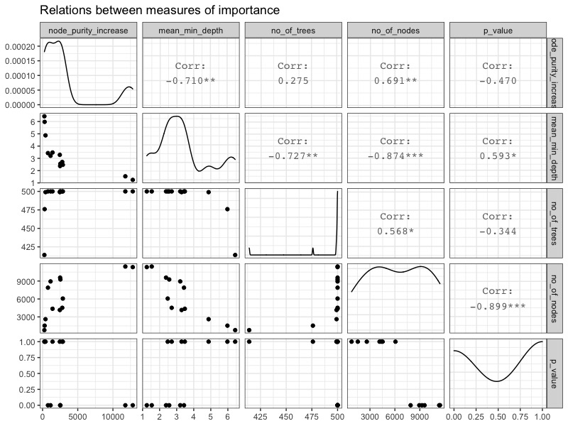

# R语言与复杂数学分析
也许叫R语言与机器学习？
数模大赛开始力，所以赶工学习模型中
其实我觉得这一个新的单元应该称为r语言与复杂数学模型/黑箱的玩意，机器学习（Machine Learning）算是一个老生常谈的话题，也是一个论文灌水的重灾区，但随着时间的迁移，一些新的方法逐渐成为了灌水的大趋势，如遗传算法，神经网络，这些东西非常玄学，如果要应用其皮毛的话，大概要再开一章称为R语言与超级复杂数学模型。因此这里还是简单介绍一些难度相对不大，可能属于机器学习但也可能不是的数学模型，这些模型可以解决许多复杂的生态学问题或者是别的什么问题，各种问题。
[TOC]
## 随机森林
### 定义与介绍
随机森林（Random Forest）是一种集成学习（Ensemble Learning）中的套袋算法（bagging），具体说来是一种Bootstrap方法。

Bootstrap是一种非参数统计蒙特卡洛方法，原理就是通过抽样来对总体特征进行统计推断。其通过大量的重抽样（Re-sample）来获得大量的新样本，根据大量新样本的方差和协方差来推断出原先样本的均值与标准误等统计量。

那么套袋算法又是什么呢？简单来说就是在原始数据中用Bootstrap抽取指定（n）个训练样本，进行k轮抽取，得到k个相互独立的训练集（如有1000个数据，我们以5个数据作为一个训练集，抽500次）。接着我们利用这k个训练集训练k个模型（模型由具体问题而定，如决策树（*备注，一般是决策树，很多很多决策树组成了森林所以叫随机森林*）或者knn），那么对于分类问题，由投票表决产生分类结果，而对于回归问题，则通过k个模型的结果的均值作为预测结果。

优点：很准，缺点：算是个黑箱。

随机森林在大部分分类问题中的训练速度和精度远大于knn和svm。knn易于实现但是预测缓慢，是惰性学习算法。svm的优势是效果不错且稳定，预测速度快（只需要和支持向量进行比较，支持向量往往很少）。 大部分竞赛中，随机森林比knn和svm用的要多。
### 基于R包的随机森林实现
我们主要通过R包randomForest和它的优化包randomForestExplainer来实现。
来源: [vignettes/randomForestExplainer.Rmd](https://github.com/ModelOriented/randomForestExplainer/blob/master/vignettes/randomForestExplainer.Rmd)
```r
#安装并启动相关包
library(randomForest)
#此包在git上下载
#devtools::install_github("MI2DataLab/randomForestExplainer")
library(randomForestExplainer)
```
在这里用于演示随机森林模型运算的数据来自R包MASS中的Boston数据，这是波士顿郊区的房价数据，其中```crim```为按城镇划分的犯罪率，```zn```为25000尺以上面积的豪宅的比例，```indus```为每个城镇的非零售业务的商业用地比例，```chas```为是否在查理河边，1为在，0为不在，```nox```为氮氧化物浓度，```rm```为每间房屋的平均房间数，```age```1940年前就住在这里的自建房户数的比例，```dis```距离五个就业中心的加权平均数，```rad```公路可达性指数，```tax```每10000美元的增值税率，```ptratio```按城镇划分的教师比例，```black```黑人比例，```lstat```底层人口比例，```medv```房价的中值。
```r
#提取数据
data(Boston, package = "MASS")
#将chas转为逻辑变量，即FALSE和TURE
Boston$chas <- as.logical(Boston$chas)
#显示数据
str(Boston)
```
接下来可以使用randomForest包进行随机森林的拟合
```r
#mtry函数为指定随机森林的训练次数，默认是500
forest <- randomForest(medv ~ ., data = Boston, localImp = TRUE)
forest
#Call:
# randomForest(formula = medv ~ ., data = Boston, localImp = TRUE) 
#               Type of random forest: regression
#                     Number of trees: 500
#No. of variables tried at each split: 4
#
#          Mean of squared residuals: 9.671408
#endregion                    % Var explained: 88.54
```
这就是随机森林模型的简单实现了
### 基于R包的随机森林扩展
#### 随机森林的决策树
决策树是一个递归过程，即通过对变量（节点）进行不断分类，细分出最符合结果的特征。在决策树的基本算法中，有三种情形会导致递归返回：(1)当前的节点所包含的样本全属于同一类别，无需划分；(2)当前属性集为空或是所有样本在所有属性上取值相同，无需划分；(3)当前节点包含的样本集合为空，不能划分。

另外，我们还可以看到决策树学习的关键是算法，即如何选择最优划分属性？一般而言，随着划分过程不断进行，我们希望决策树的分支节点所包含的样本尽可能属于同一类别，即节点的“纯度”越来越高。

变量重要性是通过考虑节点纯度的平均增加程度决定的（该变量导致的分裂）来计算的。哪个变量的分裂导致节点纯度的更大增加在这一指标中显得尤为重要。一般而言第一次分裂通常会导致节点纯度的最大增加因此往往这个变量的重要性最高。而最小深度表示此变量首次用于拆分树的时间是什么。如果是这种情况，则有意义的是，更重要的变量具有较低的最小深度值。导致纯度增加较大的分裂较早发生，因此重要变量会在早期分裂，因此最小深度较低的变量有着更高的重要性。
#### 最小深度分布
函数```plot_min_depth_distribution```用于绘制随机森林的最小深度分布，其在默认设置下根据随机森林使用的顶部树（mean_sample = "top_trees"）计算的平均最小深度来获得前十个变量的最小深度分布图。我们也可以将随机森林的直接传递给绘图函数，但是如果要制作多个深度最小分布图，则将传递```min_depth_frame```给绘图函数更有效，这样就不会为每个绘图再次计算。
```r
#显示决策树的最小深度分布
min_depth_frame <- min_depth_distribution(forest)
save(min_depth_frame, file = "min_depth_frame.rda")
load("min_depth_frame.rda")
head(min_depth_frame, n = 10)
#绘制最小分布图像
#也可以这样：plot_min_depth_distribution(forest)
plot_min_depth_distribution(min_depth_frame)
```

函数 `plot_min_depth_distribution` 计算平均最小深度时，该函数提供了三种可能性，它们的不同之处在于，它们处理在不使用变量在树的分支时出现的缺失值。它们可以描述如下：
- `mean_sample = "relevant_trees" `：这仅考虑存在交互作用的树。
- `mean_sample = "all_trees"` ：relevant_trees存在一个主要问题，即对于仅出现在少量树中的交互，采用条件最小深度的平均值会忽略这种交互并不那么重要的事实。在这种情况下，较小的平均条件最小深度并不意味着交互是重要的。为了解决这个问题，该函数用根变量的最大子树的平均深度替换相关的有交互作用的条件最小深度。基本上，如果我们查看x1：x2的交互作用，则表示对于不存在这种交互作用的树，请为其提供根为x1的最深树的值。这为mean_min_depth交互提供了一个（希望是很大的）数值，以免因为x1:x2的交互作用使其重要性下降。
- `mean_sample = "top_trees"` : 这是的默认选项，它类似于all_trees，但是尝试降低替换缺失值的贡献。原因是当有许多参数但观测不足时，即树的长度比较浅时，all_trees将其拉近mean_min_depth相同的值。为了减少替换缺失值的影响，top_trees仅计算子树n的平均条件最小深度，其中n是存在与指定根的任何交互的树数。
下面我们只查看有交互作用的树产生的结果：
```r
#添加k参数可以控制绘制的最大变量数，mean_scale可以将平均最小深度的值缩放至[0,1]
#main可以调整图的标题，mean_round调整平均最小深度的小数点位数
plot_min_depth_distribution(min_depth_frame, mean_sample = "relevant_trees", k = 15, mean_round = 1, main = "plot", mean_scale = 1)
```

#### 变量重要性
使用```measure_importance```函数获得变量的各种重要性。
```r
importance_frame <- measure_importance(forest)
#储存计算结果，以免以后调动时占用cpu资源
save(importance_frame, file = "importance_frame.rda")
load("importance_frame.rda")
# importance_frame
#    variable mean_min_depth no_of_nodes mse_increase node_purity_increase
# 1       age       3.208000        8934    4.0855711            1134.2629
# 2     black       3.428000        7889    1.4867754             765.1144
# 3      chas       6.428656         789    1.1975552             258.2084
# 4      crim       2.376000        9571    9.2249340            2493.8493
# 5       dis       2.562000        9261    7.9411435            2534.7189
# 6     indus       3.287496        4151    6.2116244            2449.1251
# 7     lstat       1.248000       11331   57.2785166           12817.6106
# 8       nox       2.474000        6069   10.3533262            2879.2618
# 9   ptratio       2.708000        4521    8.2257481            2798.4201
# 10      rad       4.871496        2618    1.6589265             416.1605
# 11       rm       1.538000       11424   32.9913736           11762.1410
# 12      tax       3.478000        4361    4.2818940            1417.1772
# 13       zn       5.973904        1536    0.4787724             292.5830
#    no_of_trees times_a_root       p_value
# 1          500            1 1.078759e-225
# 2          500            1  3.641439e-85
# 3          414            0  1.000000e+00
# 4          500           16  0.000000e+00
# 5          500            0 3.453578e-282
# 6          499           65  1.000000e+00
# 7          500          141  0.000000e+00
# 8          500           49  9.998443e-01
# 9          500           61  1.000000e+00
# 10         499            5  1.000000e+00
# 11         500          126  0.000000e+00
# 12         500           29  1.000000e+00
# 13         476            6  1.000000e+00
```
关于上述数据的解释，其每列均为一个重要性的衡量指标：
1. accuracy_decrease（分类问题中会出现） 变量被排序后的预测准确率的平均下降程度
2. gini_decrease（分类问题中会出现） 变量分裂后节点杂质的平均减少程度
3. mse_increase（回归问题中出现，比如这次）变量被排序后的均方误差（MSE）
4. node_purity_increase（回归问题中出现）变量分裂后节点纯度的平均增加值，以平方和的减少表示
5. mean_minimal_depth 平均最小深度，不谈
6. no_of_trees 变量被排序完成后所使用的决策树的数量
7. no_of_nodes 变量排序后决策树的节点总数（树很浅的时候往往等于树的数量）
8. times_a_root 变量用于拆分根节点所用的树的总数（第一次二分类或者n分类所用的树）（**一般这个就是指重要性值**）
9. p_value 似乎也不用解释？

接下来我们可以绘制重要性指标图：
```r
#也可以用最上面的forest这个最早的随机森林的结果来绘图，是一样的
plot_multi_way_importance(importance_frame, size_measure = "no_of_nodes")
```

显然由图可以得知底层人口数量和住宅的房间数量与房价显著相关，但可以更进一步，看一看树的结构相关的数据与变量的关系
```r
#x/y_measure指定坐标轴类型，size_measure指定颜色，no_of_labels指定显示前5个优秀的变量的名称
plot_multi_way_importance(importance_frame, x_measure = "mse_increase", y_measure = "node_purity_increase", size_measure = "p_value", no_of_labels = 5)
```

#### 选择合适的重要性指标
一般来说，多向重要性图提供了多种可能性，因此很难选择最重要的那一个。克服这一障碍的一个想法是，首先探索不同重要性指标之间的关系，然后选择三个最不一致的指标，并将它们运用到多因素重要性图中，以选择最重要的变量。第一种方法很容易实现，方法是使用下面的`plot_importance_ggpairs`函数将选定的重要性度量成对地绘制出来。当然，我们可以在图中包含所有七个度量值，但默认情况下，p值和树的数量被排除在外，因为它们携带的信息与节点数相似。
```r
#plot_importance_ggpairs(forest)
plot_importance_ggpairs(importance_frame)
```

我们可以看到，所有描述的测量值都是高度相关的（当然，任何测量值与平均最小深度的相关性都是负相关），但是有些测量值比其他测量值低。此外，无论我们比较哪种度量，似乎总有两个点是突出的，而这两个点最有可能对应于`lstat`和`rm`，它们可以是主要的预测因子/重要的影响因子。
#### 变量的交互作用
这里我们可以使用有条件的最小深度来衡量基于交互作用修正后的各个因子之间的最小深度。
在选择了一组最重要的变量之后，我们可以研究它们之间的相互作用，即在最大子树中出现的与所选变量之一相关的分裂。为了根据变量出现的树的平均最小深度和树数，我们提取5个最重要变量，将我们的重要性评价系统传递给函数重要变量。
```r
#(vars <- important_variables(forest, k = 5, measures = c("mean_min_depth", "no_of_trees")))
(vars <- important_variables(importance_frame, k = 5, measures = c("mean_min_depth", "no_of_trees")))
```
结果：`[1] "lstat" "rm"    "crim"  "nox"   "dis"  `
我们将结果和研究出的forest一起传递给`min_depth_interactions`函数，以获得一个东西，其中包含关于变量的每个元素的变量的平均条件最小深度的信息（缺失值与无条件最小深度类似地填充，用`mean_sample`指定的三种方式之一）。如果我们不指定`vars`参数，那么默认情况下，条件变量的向量将使用重要变量`measure_importance（forest）`获得。
```r
#interactions_frame <- min_depth_interactions(forest, vars)
#save(interactions_frame, file = "interactions_frame.rda")
load("interactions_frame.rda")
head(interactions_frame[order(interactions_frame$occurrences, decreasing = TRUE), ])
```
然后，我们将我们的`interactions_frame`传递给绘图函数`plot_min_depth_interactions`，得到以下结果：
```r
# plot_min_depth_interactions(forest)
plot_min_depth_interactions(interactions_frame)
```

交互作用是通过减少出现次数来排序的,即为最频繁的一次，所以lstat和rm有最小平均条件最小深度。值得注意的是，以lstat为根变量，rm在森林中的无条件平均最小深度几乎等于其在最大子树上的最小平均深度。
需要注意的是，使用默认的“top_trees”会惩罚出现频率低于最频繁的交互。所以如果在计算最小深度时设置`mean_sample = "relevant_trees" `会有不一样的结果。
#### 利用随机森林进行预测
预测的话很简单，如下
```r
#仅用于演示，实际上没有testdata
predict(forest, newdata = testdata)
```
但为了进一步研究房价和最相关的两个变量rm与lstat之间的关系，我们使用函数`plot_predict_interaction`来绘制我们的随机森林预测结果图像。该函数需要随机森林本体，训练集与x和y轴所用的变量。在内存不足的情况下，可以使用参数`grid`从默认值100开始减少网格的两个维度中的点数
```r
plot_predict_interaction(forest, Boston, "rm", "lstat")
```

在上面的图中我们可以清楚地看到相互作用的影响：当lstat较低时，预测的中间状态（模糊？）最高，反之则为rm的高低。为了进一步研究交互作用的影响，我们可以在网格上绘制其他频繁的交互作用。
#### 随机森林可视化
可以直接输出上述的所有结果，通过网页的形式：(**非常占用计算资源与内存！！！**)
```r
explain_forest(forest, interactions = TRUE, data = Boston)
```
## 灰色预测
一般适用于一些社会、经济、生态学等让人摸不着头脑的地方，就是一个系统，一个因素，受到很多已知条件的影响，也受到很多未知条件...就可以用灰色预测来进行预测（不知所云中）
接下来是GM11灰色预测的R程序：
来源：[DATAKilimanjaro的CSDN博客](https://blog.csdn.net/qq_38742877/article/details/101700392)
灰色预测的执行
```r
gm <- function(x0,t)	#gm(xO,t)，其中xO是向量，为原始数据，t为表示预测到第几个数据
{
  xl <- cumsum(x0) #读原始数列xO,并用cumsum(xO)累加生成数列文1;步骤1完成
  b <- numeric(length (x0)-1)
  #lengthO计算xO的长度，numericO生成指定长度的0向量，这里生成比xO长度少1的0向量，记作b，实质是向量b的初始化
  n <- length(x0)-1	#向量xO的长度减1，记作n
  for(i in 1:n){	#循环语句i从1到n循环，步进为1
    b[i]<--(xl[i] + xl[i+1])/2
    }#b[i]:向量b的第i个元素
    d <- numeric(length(b)) # 向量 d 初始化
    d[] <- 1#向量d的元素全部赋值1，即单位向量
    B <- cbind(b,d)	#cbind(,)以列方式将向量b和d合并成矩阵B;步骤2中矩阵B生成
    BT <- t(B)	#t(),将矩阵B的转置，记作BT
    M <- solve(BT%*%B)
    #solve(A，b),解方程Ax=b，返回x的值，如果b缺失，则返回A的逆矩阵，这里M是BT * B的逆矩阵* %是乘法运箅符记作BT
    yn<-numeric(length(x0)-1)	# 向量 yn 初始化
    yn<-x0[2:length(x0)] #将原始向量xO除第一个外的其余元素赋与yn步骤2的yn生成
    alpha<-M%*%BT%*%yn #最小二乘法计算微分方程参数,a和u赋予向量alpha
    alpha2<-matrix(alpha, ncol =1)
    a<-alpha2[1]	#提取参数a似乎直接从alpha提也行
    u<-alpha2[2]	#提取参数u步骤3完成
         y<-numeric(length(c(1:t))) # 向量 y 初始化
         y[1]<-x0[1]	#原数列的第一个数值付给y的第一个数值
         for(w in 1:(t-1))
         {
         y[w+1]<-(x0[1]-u/a)*exp(-a*w) + u/a
         }            #建模生成模型计算值完成步骤4

         xy<-numeric(length(y))	#向量xy 初始化
         xy[1]<-y[1] #向量xy的第1个与y的第1个值不变,初始化
         for(o in 2:t)
         {
         xy[o]<-y[o]-y[o-1]
         }	#数据还原xy为还原值。完成步骤5
xy<-round(xy,4)
         m<-length(x0)
         e<-numeric(length(x0)) #残差向量 e 初始化
for(L in 1 :m)
{
  e[L]<-xy[L]-x0[L]
}	#循环语句计算残差向量e
e<-round(e,4)
q<-numeric(length(x0))	#相对误差向量初始化
for(L in 1:m){
    q[L]<-(e[L]/x0[L]) * 100
    }	#循环语句计算相对误差向量q完成步骤6
q<-round(q,4)
se<-sd(e)	#计算残差向量e标准差
sx<-sd(x0)	#计算原数列xO标准差
cv<-se/sx	#计算后验差比值C
#窗口打印后验差比值
pe<-abs(e-mean(e))#小频率误差 P
i<-length(pe)
accumulator=0
for(L in 1:i){
  if (pe[L]<0.6745 * sx) accumulator = accumulator+1
}
pv=accumulator/i #小频率误差P，完成步骤7
if((pv>0.95)&(cv<0.35)) d<-c("predictions is Good")
else if((pv>0.8)&(cv<0.4)) d<-c("predictions is Qualified")
else if((pv>0.7)&(cv<0.45)) d<-c("predictions is Reluctantly")
else d<-c("predictions is not good")
list(model=paste("a=",round(a,4),"u=",round(u,4)),original.data=x0,
      lAGO.predictions=y,predict.values=xy,Residuals=e,relative.error=q,C=cv,P=pv,test.re=d)
 }
```
绘图函数
```r
plot.gm<-function(list,start=1,frequency=0)#plot.gm(上面的结果)
{
m1<-list
x0<-m1$original.data
xy<-m1$predict.values
lonx0<-length(x0)
lonxy<-length(xy)
mx<-max(max(xy),max(x0))
mn<-min(min(xy),min(x0))
one<-(mx-mn)/25
if((start&TRUE)&(frequency&TRUE)){
  x1<-seq(start,start+(lonxy-1)*frequency,frequency)
  x2<-seq(start,start+(lonx0-1)*frequency,frequency)
  plot(x1,xy,col='blue',type='b',pch= 16,xlab='Time series',ylab='Values',ylim = c(mn-one,mx+one))
  points(x2,x0,col='red',type='b',pch=18)
  legend(locator(1),c('Predictions','Raw data'),pch = c(16,18),lty=1,col = c('blue','red'))}
  else if((start&T)&(frequency==F)){
    frequency<-1
    x1<-seq(start,start+(lonxy-1)*frequency,frequency)
    x2<-seq(start,start+(lonx0-1)*frequency,frequency)
    plot(x1,xy,col='blue',type='b',pch= 16,xlab='Time series',ylab='Values',ylim = c(mn-one,mx+one))
    points(x2,x0,col='red',type='b',pch=18)
    legend(locator(1),c('Predictions','Raw data'),pch = c(16,18),lty=1,col = c('blue','red'))
  }
  else{plot(xy,col='blue',type='b',pch= 16,xlab='Time series',ylab='Values',ylim = c(mn-one,mx+one))
    points(x0,col='red',type='b',pch=18)
    legend(locator(1),inset = 0.5,c('Predictions','Raw data'),pch = c(16,18),lty=1,col = c('blue','red')) }

}
```
结果输出为excel
```r
putout.gm<-function(list,file="")
{
  m1<-list
  x0<-m1$original.data
  xy<-m1$predict.values
  e<-m1$Residuals
  q<-m1$relative.error
  t<-length(xy)
original.data<-numeric(t) # 结果输出阶段
original.data[]<-'NA'#全缺失值填充向量
original.data[1:length(x0)]<-x0	#原数据填充向量前端，[length(x0)5 t]的元素值缺失
predict.values<-round(xy,4)
Residuals<-numeric(t)
Residuals[]<-'NA'
Residuals[1:length(e)]<-round(e,4)	# 误差数据填充向量前端，[length(x0)： t]的元素值缺失
Relative.error<-numeric(t)
Relative.error[]<-'NA'
Relative.error[1:length(e)]<- round(q,4)#相对误差数据填充向量前端，[length(xO) : t]的元素值缺失
result<-cbind(original.data,predict.values,Residuals,Relative.error)#合并输出原数据、预测值、残差、相对误差
colnames(result)<-c("原始数据","预测值","残差","相对误差")

if(file == ""){
  wd<-getwd()
  wd2<-paste(wd,"result.csv",sep="/")
  print(wd2)
  write.table(result,file=wd2,sep=",",row.names = F)
  }
else{
  write.table(result,file=file,sep=",",row.names = F)
  print(file)
}
}
```
## 结构方程模型
基于Yves Rosseel的论文，doi: [10.18637/jss.v048.i02](https://www.jstatsoft.org/article/view/v048i02)
据说有本书叫Latent Variable Modeling Using R，没看过，先mark

该结构方程模型（SEM）基于R语言的lavaan函数包运行。lavaan是潜在变量分析的缩写，它的名字揭示了长期目标：提供一系列工具，可用于探索、估计和理解各种潜在变量模型，包括因子分析、结构方程、纵向、多级、潜在类、项目反应和缺失数据模型。

```r
#为了获得与商业软件相似的输出，lavaan开发了下面的功能
#lavan将努力产生与Mplus的输出相似的输出，无论是在数字上还是视觉上
mimic = “Mplus”
#lavan产生的输出接近EQS的输出，至少在数字上（不是视觉上），
simic= “EQS”
```
### SEM之前
首先了解测量模型（measurement model）和结构模型（structural model），测量模型关注的是因子的载荷和结构（EFA和CFA），结构模型则关注的是跨因子间的预测和解释（回归，相关等等）。
CFA是结构强度（Confirmatory Factor Analysis），是确定当前设定的变量之间是有关系的，如果CFA通过，那可以把模型继续下去了。
那么所有的SEM模型都是这几个步骤：
1. CFA通过，就是保证结构
2. 路径分析（ANOVA & Correlation），显示相关分析，**零阶相关**矩阵要显著相关才能进入下一步，然后就是共同方法偏差检验，如测量方式相同就要做这个，就是对所有变量做单因素的CFA，如果没有拟合，说明不怎么出现共同方法偏差，就比较好了。接着是路径分析，就是画一个饱和模型然后删到仅存的路径的效应量和sig都比较好了。然后可以多做几个算是竞争模型看看情况。
3. 中介及调节检验，做bootstrap什么的，然后就好了

### 关于SEM
路径图通常是研究人员寻求拟合SEM模型的起点。非正式地说，路径图是一种示意图，它代表了研究人员要拟合的模型的简明概述。它包括所有相关的观察变量（通常用方框表示）和潜在变量（用圆圈表示），并用箭头说明这些变量之间的（假设的）关系。一个变量对另一个变量的直接影响用单箭头表示，而变量之间（未解释的）相关性用双头箭头表示。研究者的主要问题通常是将此图转换为SEM程序所期望的适当输入。此外，研究人员必须格外小心，以确保模型是可识别和可估计的。
在lavan软件包中，模型是通过一种功能强大、易于使用的基于文本的语法（称为“lavan模型语法”）来指定的。考虑一个简单的回归模型，其中有一个连续的因变量$y$，以及四个自变量$x_1$、$x_2$、$x_3$和$x_4$。通常的回归模型可以写如下：
$$y_{i}=\beta _{0}+\beta _{1}x_{1i}+\beta _{2}x_{2i}+\beta _{3}x_{3i}+\beta _{4}x_{4i}+\varepsilon _{i}$$
其中$β_0$被称为截距，$β_1$到$β_4$是四个变量中每一个的回归系数，$ε_i$是观测值i的残差。R环境的一个吸引人的特点是我们可以用紧凑的方式来表达一个类似于上述的回归公式：
```r
y ~ x1 + x2 + x3 + x4
```
在这个公式中，`~`是回归运算符。在运算符的左侧，我们有因变量`y`，在右侧，我们有自变量，用`+`分隔。注意，公式中没有明确包含截距与残差项。但是当这个模型被拟合时（例如使用`lm()`函数），残差的截距和方差都将被估计。当然，其基本逻辑是截距和残差项（几乎）总是（线性）回归模型的一部分，而且在回归公式中不需要提及它们。只需要指定结构部分（因变量和自变量），其余部分由`lm()`函数负责。
看待SEM模型的一种方法是，它们只是线性回归的扩展。第一个扩展是可以同时拥有多个回归方程。第二个扩展是，一个方程中的自变量（外生变量）可以是另一个方程中的因变量（内生变量）。使用与R中单个方程相同的语法来指定这些回归方程似乎很自然；我们只有一个以上的回归方程。例如，我们可以有一组三个回归方程：
```r
y1 ~ x1 + x2 + x3 + x4
y2 ~ x5 + x6 + x7 + x8
y3 ~ y1 + y2
```
SEM模型的第三个扩展是它们包含连续的潜在变量。在lavaan中，任何回归公式都可以包含作为因变量或自变量的潜在变量。例如，在下面显示的语法中，以`f`开头的变量是潜在变量：
```r
y1 ~ f1 + f2 + x1 + x2
f1 ~ x1 + x2
```
模型语法的这一部分与SEM模型的“结构部分”相对应。为了描述模型的“测量部分”，我们需要为每个潜在变量指定（观察到的或潜在的）指标。在lavaan中，这是用特殊运算符'=~'来完成的，这可以从中看出。此公式的左侧包含潜在变量的名称。右侧包含此潜在变量的指示符，用“+”运算符分隔。例如：
```r
f1 =~ item1 + item2 + item3
f2 =~ item4 + item5 + item6 + item7
f3 =~ f1 + f2
```
在本例中，变量`item1`到`item7`是观察变量。因此，潜在变量f1和f2是一阶因子。潜在变量f3是一个二阶因子，因为它的所有指标本身都是潜在变量。
为了在模型语法中指定（残差）方差和协方差，lavaan提供了`~~`运算符。如果左右两侧的变量名相同，则为方差(var)。如果名字不同，那就是协方差(covar)。残差(协)方差和非残差(协)方差之间的区别是自动进行的。例如：
```r
item1 ~~ item1 # variance 
item1 ~~ item2 # covariance
```
最后，观察变量和潜在变量的截距是简单的回归公式（使用“~”运算符），只有一个截距（用数字“1”明确表示）作为唯一的预测因子：
```r
item1 ~ 1 # intercept of an observed variable 
f1 ~ 1 # intercept of a latent variable
```
描述SEM模型的典型模型语法将包含多个公式类型。在lavaan中，要将它们粘在一起，必须将它们指定为文本字符串。环境中可以用单引号括起来。例如:
```r
myModel <- '# regressions 
            y ~ f1 + f2 
            y ~ x1 + x2
            f1 ~ x1 + x2
            # latent variables
            f1 =~ item1 + item2 + item3
            f2 =~ item4 + item5 + item6 + item7
            f3 =~ f1 + f2
            # (residual) variances and covariances item1 ~~ item1
            item1 ~~ item2
            # intercepts 
            item1 ~ 1 
            f1 ~ 1'
```
这段代码将生成一个名为myModel的模型语法对象，稍后在调用一个函数时可以使用该对象来估计给定数据集的\模型，它说明了lavaan模型语法的几个特性。公式可以拆分为多行，您可以在单引号内使用注释（以“#”字符开头）和空行，以提高模型语法的可读性。公式的指定顺序无关紧要。因此，即使在使用“=~”运算符定义回归公式之前，也可以使用它们。最后，由于这个模型语法只不过是一个文本字符串，所以您可以在单独的文本文件中键入语法，然后使用readLines()之类的函数来读入它。或者，R的文本处理基础设施可以用来为各种模型生成语法。
### 应用lavaan进行CFA
lavaan包包含一个名为HolzingerSwineford1939的内置数据集。1939年Holzinger&Swineford数据集是一个“经典”数据集，已在许多关于结构方程建模的论文和书籍中使用，包括一些商业SEM软件包的手册。数据包括来自两所不同学校（巴斯德和格兰特怀特）的七年级和八年级儿童的智力测试分数。在我们的数据集版本中，最初26个测试中只有9个包含在内。通常针对这9个变量提出的CFA模型由三个相关的潜在变量（或因子）组成，每个变量都有三个指标：
1. 视觉相关的因素由3个变量决定: x1, x2, x3,
2. 文本相关的因素由3个变量决定: x4, x5, x6,
3. 速度相关的因素由3个变量决定: x7, x8, x9.
因此，我们从装载Lavaan包与数据开始：
```r
library("lavaan")
```
在下面的内容中，我们将把这个三因素模型称为“H&S模型”，图1以图形方式表示。注意，图中的路径图是简化的：它不表示观测变量的残差方差或外生潜在变量的方差。不过，它抓住了模型的本质。在讨论该模型的lavan模型语法之前，首先需要确定该模型中的自由参数。在这个模型中有三个潜在变量（因子），每个变量有三个指标，因此需要估计九个因子的负荷。潜在变量之间还有三个协方差-另外三个参数。这些参数分别用双头箭头和双头箭头表示。此外，我们还需要估计9个观测变量的残差方差和潜在变量的方差，从而得到12个额外的自由参数。我们总共有24个参数。但是模型还没有确定，因为我们需要设置潜在变量的度量。通常有两种方法可以做到这一点：（1）对于每个潜在变量，将其中一个指标（通常是第一个）的因子负荷固定为常数（通常为1.0），或（2）标准化潜在变量的方差。不管怎样，我们修复了其中的三个参数，并且有21个参数仍然是自由的。由parTable（）方法生成的表2包含了该模型所有相关参数的概述，包括三个固定因子荷载。表中的每一行对应于一个参数。“rhs”、“op”和“lhs”列唯一地定义了模型的参数。所有带有“=~”运算符的参数都是因子加载，而带有“~~”运算符的所有参数都是方差或协方差。“free”列中的非零元素是模型的自由参数。“free”列中的零元素对应于固定参数，其值在“ustart”列中找到。“用户”栏的含义将在下面解释。
Lavaan有三种方法来指定模型。在第一种方法中，用户对模型的最小描述由程序自动添加其余元素。这种“用户友好”的方法在fitting函数`cfa()`和`sem()`中实现。在第二种方法中，所有模型参数的完整说明必须由用户提供，不会自动添加任何内容。这是“超级用户”方法，在函数`lavaan()`中实现。最后，在第三种方法中，通过在模型语法中提供对模型的不完整描述，但使用lavan函数的`auto.*`参数添加选定的参数组，从而混合了最简方法和完整方法。我们依次说明和讨论这些方法。
#### cfa()和sem()的方法
在第一种方法中，用户提供的模型语法应该尽可能简洁易懂。为了实现这一点，模型语法中通常只包含潜在变量（使用“=~”运算符）和回归（使用“~”运算符）。其他模型参数（对于该模型：观测变量的残差方差、因子的方差和因子之间的协方差）是自动添加的。由于H&S示例包含三个潜在变量，但没有回归，因此最简语法非常简短：
```r
HS.model <- 'visual =~ x1 + x2 + x3
             textual =~ x4 + x5 + x6
             speed =~ x7 + x8 + x9'
```
我们导入数据：
```r
fit <- cfa(HS.model, data = HolzingerSwineford1939)
```
函数cfa()是用于拟合验证性因子分析(cfa)模型的专用函数。第一个参数是包含lavaan模型语法的对象。第二个参数是包含观察到的变量的数据集。下表中的“user”列显示哪些参数显式包含在用户指定的模型语法（=1）中，哪些参数是由cfa()函数（=0）添加的。如果已安装模型，则始终可以（且信息量很大）使用以下命令检查此参数表：
```r
parTable(fit)
```
```r
   id     lhs op     rhs user block group free ustart exo label plabel start   est    se
1   1  visual =~      x1    1     1     1    0      1   0         .p1. 1.000 1.000 0.000
2   2  visual =~      x2    1     1     1    1     NA   0         .p2. 0.778 0.554 0.100
3   3  visual =~      x3    1     1     1    2     NA   0         .p3. 1.107 0.729 0.109
4   4 textual =~      x4    1     1     1    0      1   0         .p4. 1.000 1.000 0.000
5   5 textual =~      x5    1     1     1    3     NA   0         .p5. 1.133 1.113 0.065
6   6 textual =~      x6    1     1     1    4     NA   0         .p6. 0.924 0.926 0.055
7   7   speed =~      x7    1     1     1    0      1   0         .p7. 1.000 1.000 0.000
8   8   speed =~      x8    1     1     1    5     NA   0         .p8. 1.225 1.180 0.165
9   9   speed =~      x9    1     1     1    6     NA   0         .p9. 0.854 1.082 0.151
10 10      x1 ~~      x1    0     1     1    7     NA   0        .p10. 0.679 0.549 0.114
11 11      x2 ~~      x2    0     1     1    8     NA   0        .p11. 0.691 1.134 0.102
12 12      x3 ~~      x3    0     1     1    9     NA   0        .p12. 0.637 0.844 0.091
13 13      x4 ~~      x4    0     1     1   10     NA   0        .p13. 0.675 0.371 0.048
14 14      x5 ~~      x5    0     1     1   11     NA   0        .p14. 0.830 0.446 0.058
15 15      x6 ~~      x6    0     1     1   12     NA   0        .p15. 0.598 0.356 0.043
16 16      x7 ~~      x7    0     1     1   13     NA   0        .p16. 0.592 0.799 0.081
17 17      x8 ~~      x8    0     1     1   14     NA   0        .p17. 0.511 0.488 0.074
18 18      x9 ~~      x9    0     1     1   15     NA   0        .p18. 0.508 0.566 0.071
19 19  visual ~~  visual    0     1     1   16     NA   0        .p19. 0.050 0.809 0.145
20 20 textual ~~ textual    0     1     1   17     NA   0        .p20. 0.050 0.979 0.112
21 21   speed ~~   speed    0     1     1   18     NA   0        .p21. 0.050 0.384 0.086
22 22  visual ~~ textual    0     1     1   19     NA   0        .p22. 0.000 0.408 0.074
23 23  visual ~~   speed    0     1     1   20     NA   0        .p23. 0.000 0.262 0.056
24 24 textual ~~   speed    0     1     1   21     NA   0        .p24. 0.000 0.173 0.049
```
当使用cfa()或sem()函数时，default会包含多组参数。这些参数集的完整列表为：
1. `auto.fix.first`默认true，将第一个指标的系数荷载固定为1
2. `auto.fix.single`默认true，将单个指标的残差方差固定为0
3. `int.ov.free`默认true，自由估计观测变量的截距
（仅当包含平均结构时）
4. `int.lv.free`默认false，自由估计潜在变量的截获（仅
如果包括平均结构）
在我们的例子中，只使用了第一个函数（固定第一个指标的因子负荷）。第二个仅当模型包含由单个指标表示的潜在变量时才需要。第三和第四个只有在向模型中添加平均结构时才需要。
在我们继续下一个方法之前，必须强调所有这些“自动”操作都可以被覆盖。模型语法始终优先于自动生成的操作。例如，如果不希望固定第一个指标的因子负荷，而是要固定潜在方差的方差，则模型语法将调整如下：
```r
HS.model.bis <- 'visual =~ NA*x1 + x2 + x3
                 textual =~ NA*x4 + x5 + x6
                 speed =~ NA*x7 + x8 + x9
                 visual ~~ 1*visual
                 textual ~~ 1*textual
                 speed ~~ 1*speed'
```
如上所示，通过将模型参数与数值相乘来固定模型参数，否则通过将固定参数与`NA`相乘来释放固定参数。上面的模型语法覆盖了固定第一个因子加载和估计因子方差的默认行为。然而，在实践中，使用此参数化的一个更方便的方法是保留原始语法，通过添加`std.lv = TRUE`到`cfa()`函数中即可：
```r
fit <- cfa(HS.model, data = HolzingerSwineford1939, std.lv = TRUE)
```
#### lavaan()的方法
在许多情况下，将简洁的模型语法与cfa()和sem()函数结合使用非常方便，特别是对于许多传统模型。但有时，这些自动操作可能会妨碍工作，特别是当需要指定非标准模型时。对于这些情况，用户可能更喜欢使用lavaan()数。lavaan()函数的“特性”是，默认情况下它不会向模型添加任何额外的参数，也不会尝试使模型可识别。如果在不使用auto.*参数的情况下调用lavaan()函数，则用户有责任指定正确的模型语法。这可能导致更长的型号规格，但用户可以完全控制。对于H&S模型，完整的Lavan模型语法为：
```r
HS.model.full <- '# latent variables
                    latent variables visual=~1*x1+x2+x3
                    textual =~ 1*x4 + x5 + x6
                    speed =~ 1*x7 + x8 + x9
                  # residual variances observed variables
                    x1~~x1
                    x2~~x2
                    x3~~x3
                    x4~~x4
                    x5~~x5
                    x6~~x6
                    x7~~x7
                    x8~~x8
                    x9~~x9
                  # factor variances
                    visual ~~ visual
                    textual ~~ textual
                    speed ~~ speed
                    factor covariances
                    visual ~~ textual + speed
                    textual ~~ speed'
fit <- lavaan(HS.model.full, data = HolzingerSwineford1939)
```
也可以结合auto.*参数一起使用：
当使用lavan()函数时，用户可以完全控制，但模型语法可能很长，并且包含许多可以轻松自动添加的公式。为了在使用Lavan语法的完整模型规范和自动添加某些参数之间进行比较，lavan()函数提供了几个可选参数，这些参数可用于向模型中添加一组特定参数，或固定一组特定参数。例如，在下面的模型语法中，第一个因子的加载显式地固定为1，并且因子之间的协方差是手动添加的。然而，在模型语法中省略残差方差和因子方差会更方便和简洁。以下模型语法和对lavan()的调用实现了这一点：
```r
HS.model.mixed <- '# latent variables
                     visual =~1*x1+x2+x3
                     textual =~ 1*x4 + x5 + x6
                     speed =~ 1*x7 + x8 + x9
                   # factor covariances
                     visual ~~ textual + speed
                     textual ~~ speed'
fit <- lavaan(HS.model.mixed, data = HolzingerSwineford1939, auto.var = TRUE)
```
#### 检查结果
上述三种方法都适用于同一模型。cfa()、sem()和lavan()拟合函数都返回一个`lavan`类的对象，对于这个对象，有几种方法可用于检查模型拟合统计信息和参数估计值:
1. `summary()`可以通过`fit.measures`, `standardized`和`rsquare`进行进一步设定，这个会输出一个关于模型的超长总结
2. `show()`输出一个短的总结
3. `coef()`以命名的数值向量的形式返回模型中自由参数的估计值
4. `fitted()`返回模型的隐含矩（协方差矩阵和平均向量）
5. `resid()`返回原始的、标准化的或标准化的残差（隐含和观察到的力矩之间的差异）
6. `vcov()`返回估计参数的协方差矩阵
7. `predict()`计算因子得分
8. `logLik()`返回拟合模型的对数似然（如果使用了最大似然估计）
9. `AIC()``BIC()`计算信息准则（如果使用最大似然估计）
10. `update()`更新为合适的的Lavaan对象
11. `inspect()`窥视模型的内部；默认情况下，它返回计算模型中自由参数的模型矩阵列表；还可用于提取起始值、渐变值等
如果其中一个或多个设置为TRUE，输出将分别使用因变量的附加拟合测量、标准化估计和$R^{2}$值来丰富。在下面的示例中，我们只请求附加的拟合度:
```r
HS.model <- 'visual =~ x1 + x2 + x3
             textual =~ x4 + x5 + x6
             speed  =~x7+x8+x9'
fit <- cfa(HS.model, data = HolzingerSwineford1939)
summary(fit, fit.measures = TRUE)
```
输出包括三个部分。第一部分（前6行）包含包版本号、模型是否收敛（以及迭代次数）以及分析中使用的有效观察数。接下来，打印模型$χ^2$检验统计量、自由度和$p$值。如果fit.measures = TRUE，则导出第二部分，其中包含基线模型的测试统计数据（假设所有观测变量都不相关）和几个常用拟合指数。如果使用最大似然估计，本节还将包含关于对数似然、AIC和BIC的信息。第三部分概述了参数估计，包括使用的标准误差类型，以及是否使用观测或预期信息矩阵来计算标准误差。然后，对于每个模型参数，显示估计值和标准误差，如果合适，还显示基于Wald检验的z值和相应的双侧p值。为了便于参数估计值的读取，它们被分为三个部分：（1）因子负荷，（2）因子协方差，（3）观测变量和因子的残差方差。

我们也可以使用`parameterEstimates()`函数。
尽管summary()方法提供了一个很好的模型结果摘要，但它只对数据的可视化有用。另一种方法是parameterEstimates()方法，它将参数估计值作为数据帧，使信息易于访问以进行进一步处理。默认情况下，parameterEstimates()方法包括所有模型参数的估计值、标准误差、z值、p值和95%置信区间。
```r
parameterEstimates(fit)
```
通过设置level参数可以更改置信级别。设置`ci=FALSE`会抑制置信区间。此函数的另一个用途是通过设置`standardized=TRUE`来获得估算的几个标准版本：
```r
Est <- parameterEstimates(fit, ci = FALSE, standardized = TRUE)
subset(Est, op == "=~")
```
这里只显示系数荷载。相对于先前的输出，添加了三列具有标准化值。在第一列(std.lv)，只有潜在变量被标准化；在第二列(std.all)，潜在变量和观察变量均已标准化；在第三列(std.nox)中，除外生观测变量外，潜变量和观测变量均已标准化。如果外生观测变量的标准化意义不大（例如，二元协变量），那么最后一个选项可能会有用。由于此模型中没有外部协变量，因此最后两列在输出中是相同的。

还可以使用`modificationIndices()`函数。
如果模型拟合度不高，检查修正指数（MIs）及其相应的期望参数变化（EPCs）可能是有益的。本质上，修正指数提供了一个粗略的估计，如果一个特定的参数是无约束的，模型的χ2检验统计量将如何改善。预期的参数更改是此参数作为自由参数包含时的值。modificationIndices()方法（或具有较短名称的别名modifications()）将打印出一长串参数作为`data.frame`. 在下面的输出中，我们只显示修改指数为10或更高的那些参数:
```r
MI <- modificationIndices(fit)
subset(MI, mi >10)
```
最后三列包含标准化的epc，使用与普通参数估计相同的标准化约定。