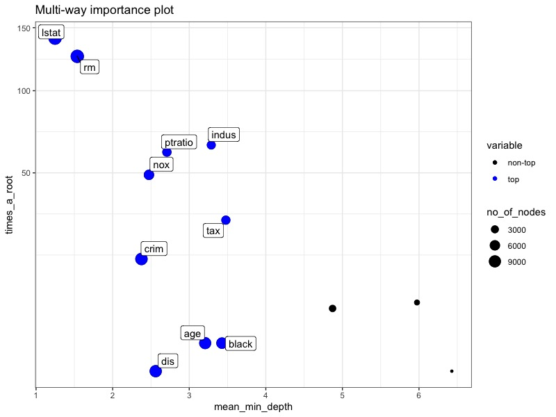
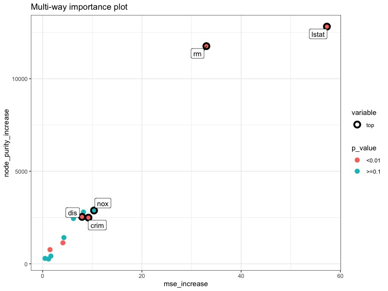
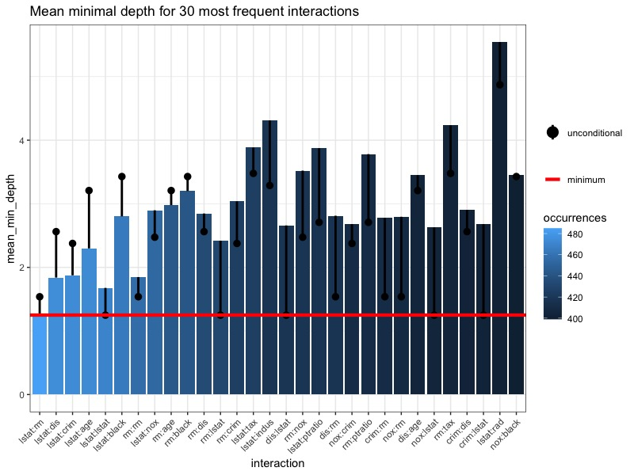
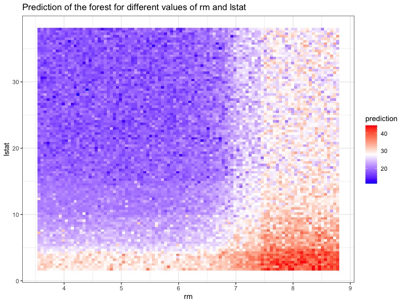
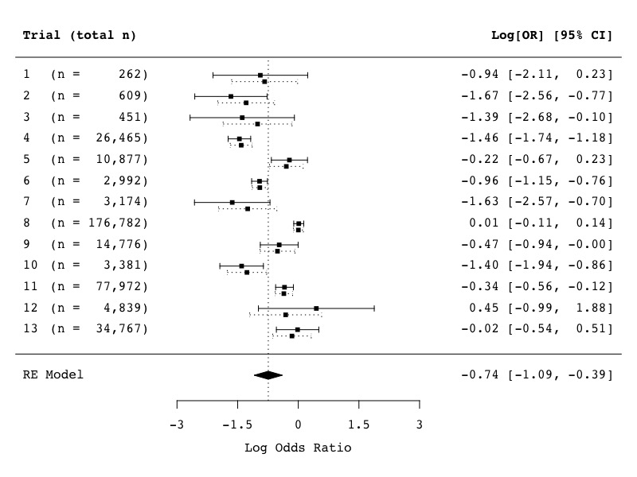

#  R语言与复杂数学分析
  
也许叫R语言与机器学习？
数模大赛开始力，所以赶工学习模型中
其实我觉得这一个新的单元应该称为r语言与复杂数学模型/黑箱的玩意，机器学习（Machine Learning）算是一个老生常谈的话题，也是一个论文灌水的重灾区，但随着时间的迁移，一些新的方法逐渐成为了灌水的大趋势，如遗传算法，神经网络，这些东西非常玄学，如果要应用其皮毛的话，大概要再开一章称为R语言与超级复杂数学模型。因此这里还是简单介绍一些难度相对不大，可能属于机器学习但也可能不是的数学模型，这些模型可以解决许多复杂的生态学问题或者是别的什么问题，各种问题。
  
- [R语言与复杂数学分析](#r语言与复杂数学分析 )
  - [随机森林](#随机森林 )
    - [定义与介绍](#定义与介绍 )
    - [基于R包的随机森林实现](#基于r包的随机森林实现 )
    - [基于R包的随机森林扩展](#基于r包的随机森林扩展 )
      - [随机森林的决策树](#随机森林的决策树 )
      - [最小深度分布](#最小深度分布 )
      - [变量重要性](#变量重要性 )
      - [选择合适的重要性指标](#选择合适的重要性指标 )
      - [变量的交互作用](#变量的交互作用 )
      - [利用随机森林进行预测](#利用随机森林进行预测 )
      - [随机森林可视化](#随机森林可视化 )
  - [灰色预测](#灰色预测 )
  - [结构方程模型](#结构方程模型 )
    - [SEM之前](#sem之前 )
    - [关于SEM](#关于sem )
    - [应用lavaan进行CFA](#应用lavaan进行cfa )
      - [cfa()和sem()的方法](#cfa和sem的方法 )
      - [lavaan()的方法](#lavaan的方法 )
      - [检查结果](#检查结果 )
    - [应用lavaan进行SEM建模](#应用lavaan进行sem建模 )
    - [其他功能](#其他功能 )
      - [渐进无分布估计（ADF）](#渐进无分布估计adf )
      - [Satorra-Bentler标度检验统计量与稳健标准差](#satorra-bentler标度检验统计量与稳健标准差 )
      - [Bootstrapping：naıve Bootstrap和Bollen-Stine Bootstrap](#bootstrappingnaıve-bootstrap和bollen-stine-bootstrap )
      - [缺失值](#缺失值 )
      - [线性和非线性等式和不等式约束](#线性和非线性等式和不等式约束 )
      - [间接效应与中介分析](#间接效应与中介分析 )
  - [词云分析](#词云分析 )
    - [jiebaR包](#jiebar包 )
    - [wordcloud2包](#wordcloud2包 )
  - [Meta分析](#meta分析 )
    - [metafor包](#metafor包 )
      - [实例](#实例 )
  
##  随机森林
  
###  定义与介绍
  
随机森林（Random Forest）是一种集成学习（Ensemble Learning）中的套袋算法（bagging），具体说来是一种Bootstrap方法。
  
Bootstrap是一种非参数统计蒙特卡洛方法，原理就是通过抽样来对总体特征进行统计推断。其通过大量的重抽样（Re-sample）来获得大量的新样本，根据大量新样本的方差和协方差来推断出原先样本的均值与标准误等统计量。
  
那么套袋算法又是什么呢？简单来说就是在原始数据中用Bootstrap抽取指定（n）个训练样本，进行k轮抽取，得到k个相互独立的训练集（如有1000个数据，我们以5个数据作为一个训练集，抽500次）。接着我们利用这k个训练集训练k个模型（模型由具体问题而定，如决策树（*备注，一般是决策树，很多很多决策树组成了森林所以叫随机森林*）或者knn），那么对于分类问题，由投票表决产生分类结果，而对于回归问题，则通过k个模型的结果的均值作为预测结果。
  
优点：很准，缺点：算是个黑箱。
  
随机森林在大部分分类问题中的训练速度和精度远大于knn和svm。knn易于实现但是预测缓慢，是惰性学习算法。svm的优势是效果不错且稳定，预测速度快（只需要和支持向量进行比较，支持向量往往很少）。 大部分竞赛中，随机森林比knn和svm用的要多。
###  基于R包的随机森林实现
  
我们主要通过R包randomForest和它的优化包randomForestExplainer来实现。
来源: [vignettes/randomForestExplainer.Rmd](https://github.com/ModelOriented/randomForestExplainer/blob/master/vignettes/randomForestExplainer.Rmd )
```r
#安装并启动相关包
library(randomForest)
#此包在git上下载
#devtools::install_github("MI2DataLab/randomForestExplainer")
library(randomForestExplainer)
```
在这里用于演示随机森林模型运算的数据来自R包MASS中的Boston数据，这是波士顿郊区的房价数据，其中```crim```为按城镇划分的犯罪率，```zn```为25000尺以上面积的豪宅的比例，```indus```为每个城镇的非零售业务的商业用地比例，```chas```为是否在查理河边，1为在，0为不在，```nox```为氮氧化物浓度，```rm```为每间房屋的平均房间数，```age```1940年前就住在这里的自建房户数的比例，```dis```距离五个就业中心的加权平均数，```rad```公路可达性指数，```tax```每10000美元的增值税率，```ptratio```按城镇划分的教师比例，```black```黑人比例，```lstat```底层人口比例，```medv```房价的中值。
```r
#提取数据
data(Boston, package = "MASS")
#将chas转为逻辑变量，即FALSE和TURE
Boston$chas <- as.logical(Boston$chas)
#显示数据
str(Boston)
```
接下来可以使用randomForest包进行随机森林的拟合
```r
#mtry函数为指定随机森林的训练次数，默认是500
forest <- randomForest(medv ~ ., data = Boston, localImp = TRUE)
forest
#Call:
# randomForest(formula = medv ~ ., data = Boston, localImp = TRUE) 
#               Type of random forest: regression
#                     Number of trees: 500
#No. of variables tried at each split: 4
#
#          Mean of squared residuals: 9.671408
#endregion                    % Var explained: 88.54
```
这就是随机森林模型的简单实现了
###  基于R包的随机森林扩展
  
####  随机森林的决策树
  
决策树是一个递归过程，即通过对变量（节点）进行不断分类，细分出最符合结果的特征。在决策树的基本算法中，有三种情形会导致递归返回：(1)当前的节点所包含的样本全属于同一类别，无需划分；(2)当前属性集为空或是所有样本在所有属性上取值相同，无需划分；(3)当前节点包含的样本集合为空，不能划分。
  
另外，我们还可以看到决策树学习的关键是算法，即如何选择最优划分属性？一般而言，随着划分过程不断进行，我们希望决策树的分支节点所包含的样本尽可能属于同一类别，即节点的“纯度”越来越高。
  
变量重要性是通过考虑节点纯度的平均增加程度决定的（该变量导致的分裂）来计算的。哪个变量的分裂导致节点纯度的更大增加在这一指标中显得尤为重要。一般而言第一次分裂通常会导致节点纯度的最大增加因此往往这个变量的重要性最高。而最小深度表示此变量首次用于拆分树的时间是什么。如果是这种情况，则有意义的是，更重要的变量具有较低的最小深度值。导致纯度增加较大的分裂较早发生，因此重要变量会在早期分裂，因此最小深度较低的变量有着更高的重要性。
####  最小深度分布
  
函数```plot_min_depth_distribution```用于绘制随机森林的最小深度分布，其在默认设置下根据随机森林使用的顶部树（mean_sample = "top_trees"）计算的平均最小深度来获得前十个变量的最小深度分布图。我们也可以将随机森林的直接传递给绘图函数，但是如果要制作多个深度最小分布图，则将传递```min_depth_frame```给绘图函数更有效，这样就不会为每个绘图再次计算。
```r
#显示决策树的最小深度分布
min_depth_frame <- min_depth_distribution(forest)
save(min_depth_frame, file = "min_depth_frame.rda")
load("min_depth_frame.rda")
head(min_depth_frame, n = 10)
#绘制最小分布图像
#也可以这样：plot_min_depth_distribution(forest)
plot_min_depth_distribution(min_depth_frame)
```

函数 `plot_min_depth_distribution` 计算平均最小深度时，该函数提供了三种可能性，它们的不同之处在于，它们处理在不使用变量在树的分支时出现的缺失值。它们可以描述如下：
- `mean_sample = "relevant_trees" `：这仅考虑存在交互作用的树。
- `mean_sample = "all_trees"` ：relevant_trees存在一个主要问题，即对于仅出现在少量树中的交互，采用条件最小深度的平均值会忽略这种交互并不那么重要的事实。在这种情况下，较小的平均条件最小深度并不意味着交互是重要的。为了解决这个问题，该函数用根变量的最大子树的平均深度替换相关的有交互作用的条件最小深度。基本上，如果我们查看x1：x2的交互作用，则表示对于不存在这种交互作用的树，请为其提供根为x1的最深树的值。这为mean_min_depth交互提供了一个（希望是很大的）数值，以免因为x1:x2的交互作用使其重要性下降。
- `mean_sample = "top_trees"` : 这是的默认选项，它类似于all_trees，但是尝试降低替换缺失值的贡献。原因是当有许多参数但观测不足时，即树的长度比较浅时，all_trees将其拉近mean_min_depth相同的值。为了减少替换缺失值的影响，top_trees仅计算子树n的平均条件最小深度，其中n是存在与指定根的任何交互的树数。
下面我们只查看有交互作用的树产生的结果：
```r
#添加k参数可以控制绘制的最大变量数，mean_scale可以将平均最小深度的值缩放至[0,1]
#main可以调整图的标题，mean_round调整平均最小深度的小数点位数
plot_min_depth_distribution(min_depth_frame, mean_sample = "relevant_trees", k = 15, mean_round = 1, main = "plot", mean_scale = 1)
```

####  变量重要性
  
使用```measure_importance```函数获得变量的各种重要性。
```r
importance_frame <- measure_importance(forest)
#储存计算结果，以免以后调动时占用cpu资源
save(importance_frame, file = "importance_frame.rda")
load("importance_frame.rda")
# importance_frame
#    variable mean_min_depth no_of_nodes mse_increase node_purity_increase
# 1       age       3.208000        8934    4.0855711            1134.2629
# 2     black       3.428000        7889    1.4867754             765.1144
# 3      chas       6.428656         789    1.1975552             258.2084
# 4      crim       2.376000        9571    9.2249340            2493.8493
# 5       dis       2.562000        9261    7.9411435            2534.7189
# 6     indus       3.287496        4151    6.2116244            2449.1251
# 7     lstat       1.248000       11331   57.2785166           12817.6106
# 8       nox       2.474000        6069   10.3533262            2879.2618
# 9   ptratio       2.708000        4521    8.2257481            2798.4201
# 10      rad       4.871496        2618    1.6589265             416.1605
# 11       rm       1.538000       11424   32.9913736           11762.1410
# 12      tax       3.478000        4361    4.2818940            1417.1772
# 13       zn       5.973904        1536    0.4787724             292.5830
#    no_of_trees times_a_root       p_value
# 1          500            1 1.078759e-225
# 2          500            1  3.641439e-85
# 3          414            0  1.000000e+00
# 4          500           16  0.000000e+00
# 5          500            0 3.453578e-282
# 6          499           65  1.000000e+00
# 7          500          141  0.000000e+00
# 8          500           49  9.998443e-01
# 9          500           61  1.000000e+00
# 10         499            5  1.000000e+00
# 11         500          126  0.000000e+00
# 12         500           29  1.000000e+00
# 13         476            6  1.000000e+00
```
关于上述数据的解释，其每列均为一个重要性的衡量指标：
1. accuracy_decrease（分类问题中会出现） 变量被排序后的预测准确率的平均下降程度
2. gini_decrease（分类问题中会出现） 变量分裂后节点杂质的平均减少程度
3. mse_increase（回归问题中出现，比如这次）变量被排序后的均方误差（MSE）
4. node_purity_increase（回归问题中出现）变量分裂后节点纯度的平均增加值，以平方和的减少表示
5. mean_minimal_depth 平均最小深度，不谈
6. no_of_trees 变量被排序完成后所使用的决策树的数量
7. no_of_nodes 变量排序后决策树的节点总数（树很浅的时候往往等于树的数量）
8. times_a_root 变量用于拆分根节点所用的树的总数（第一次二分类或者n分类所用的树）（**一般这个就是指重要性值**）
9. p_value 似乎也不用解释？
  
接下来我们可以绘制重要性指标图：
```r
#也可以用最上面的forest这个最早的随机森林的结果来绘图，是一样的
plot_multi_way_importance(importance_frame, size_measure = "no_of_nodes")
```

显然由图可以得知底层人口数量和住宅的房间数量与房价显著相关，但可以更进一步，看一看树的结构相关的数据与变量的关系
```r
#x/y_measure指定坐标轴类型，size_measure指定颜色，no_of_labels指定显示前5个优秀的变量的名称
plot_multi_way_importance(importance_frame, x_measure = "mse_increase", y_measure = "node_purity_increase", size_measure = "p_value", no_of_labels = 5)
```

####  选择合适的重要性指标
  
一般来说，多向重要性图提供了多种可能性，因此很难选择最重要的那一个。克服这一障碍的一个想法是，首先探索不同重要性指标之间的关系，然后选择三个最不一致的指标，并将它们运用到多因素重要性图中，以选择最重要的变量。第一种方法很容易实现，方法是使用下面的`plot_importance_ggpairs`函数将选定的重要性度量成对地绘制出来。当然，我们可以在图中包含所有七个度量值，但默认情况下，p值和树的数量被排除在外，因为它们携带的信息与节点数相似。
```r
#plot_importance_ggpairs(forest)
plot_importance_ggpairs(importance_frame)
```

我们可以看到，所有描述的测量值都是高度相关的（当然，任何测量值与平均最小深度的相关性都是负相关），但是有些测量值比其他测量值低。此外，无论我们比较哪种度量，似乎总有两个点是突出的，而这两个点最有可能对应于`lstat`和`rm`，它们可以是主要的预测因子/重要的影响因子。
####  变量的交互作用
  
这里我们可以使用有条件的最小深度来衡量基于交互作用修正后的各个因子之间的最小深度。
在选择了一组最重要的变量之后，我们可以研究它们之间的相互作用，即在最大子树中出现的与所选变量之一相关的分裂。为了根据变量出现的树的平均最小深度和树数，我们提取5个最重要变量，将我们的重要性评价系统传递给函数重要变量。
```r
#(vars <- important_variables(forest, k = 5, measures = c("mean_min_depth", "no_of_trees")))
(vars <- important_variables(importance_frame, k = 5, measures = c("mean_min_depth", "no_of_trees")))
```
结果：`[1] "lstat" "rm"    "crim"  "nox"   "dis"  `
我们将结果和研究出的forest一起传递给`min_depth_interactions`函数，以获得一个东西，其中包含关于变量的每个元素的变量的平均条件最小深度的信息（缺失值与无条件最小深度类似地填充，用`mean_sample`指定的三种方式之一）。如果我们不指定`vars`参数，那么默认情况下，条件变量的向量将使用重要变量`measure_importance（forest）`获得。
```r
#interactions_frame <- min_depth_interactions(forest, vars)
#save(interactions_frame, file = "interactions_frame.rda")
load("interactions_frame.rda")
head(interactions_frame[order(interactions_frame$occurrences, decreasing = TRUE), ])
```
然后，我们将我们的`interactions_frame`传递给绘图函数`plot_min_depth_interactions`，得到以下结果：
```r
# plot_min_depth_interactions(forest)
plot_min_depth_interactions(interactions_frame)
```

交互作用是通过减少出现次数来排序的,即为最频繁的一次，所以lstat和rm有最小平均条件最小深度。值得注意的是，以lstat为根变量，rm在森林中的无条件平均最小深度几乎等于其在最大子树上的最小平均深度。
需要注意的是，使用默认的“top_trees”会惩罚出现频率低于最频繁的交互。所以如果在计算最小深度时设置`mean_sample = "relevant_trees" `会有不一样的结果。
####  利用随机森林进行预测
  
预测的话很简单，如下
```r
#仅用于演示，实际上没有testdata
predict(forest, newdata = testdata)
```
但为了进一步研究房价和最相关的两个变量rm与lstat之间的关系，我们使用函数`plot_predict_interaction`来绘制我们的随机森林预测结果图像。该函数需要随机森林本体，训练集与x和y轴所用的变量。在内存不足的情况下，可以使用参数`grid`从默认值100开始减少网格的两个维度中的点数
```r
plot_predict_interaction(forest, Boston, "rm", "lstat")
```

在上面的图中我们可以清楚地看到相互作用的影响：当lstat较低时，预测的中间状态（模糊？）最高，反之则为rm的高低。为了进一步研究交互作用的影响，我们可以在网格上绘制其他频繁的交互作用。
####  随机森林可视化
  
可以直接输出上述的所有结果，通过网页的形式：(**非常占用计算资源与内存！！！**)
```r
explain_forest(forest, interactions = TRUE, data = Boston)
```
##  灰色预测
  
一般适用于一些社会、经济、生态学等让人摸不着头脑的地方，就是一个系统，一个因素，受到很多已知条件的影响，也受到很多未知条件...就可以用灰色预测来进行预测（不知所云中）
接下来是GM11灰色预测的R程序：
来源：[DATAKilimanjaro的CSDN博客](https://blog.csdn.net/qq_38742877/article/details/101700392 )
灰色预测的执行
```r
gm <- function(x0,t)	#gm(xO,t)，其中xO是向量，为原始数据，t为表示预测到第几个数据
{
  xl <- cumsum(x0) #读原始数列xO,并用cumsum(xO)累加生成数列文1;步骤1完成
  b <- numeric(length (x0)-1)
  #lengthO计算xO的长度，numericO生成指定长度的0向量，这里生成比xO长度少1的0向量，记作b，实质是向量b的初始化
  n <- length(x0)-1	#向量xO的长度减1，记作n
  for(i in 1:n){	#循环语句i从1到n循环，步进为1
    b[i]<--(xl[i] + xl[i+1])/2
    }#b[i]:向量b的第i个元素
    d <- numeric(length(b)) # 向量 d 初始化
    d[] <- 1#向量d的元素全部赋值1，即单位向量
    B <- cbind(b,d)	#cbind(,)以列方式将向量b和d合并成矩阵B;步骤2中矩阵B生成
    BT <- t(B)	#t(),将矩阵B的转置，记作BT
    M <- solve(BT%*%B)
    #solve(A，b),解方程Ax=b，返回x的值，如果b缺失，则返回A的逆矩阵，这里M是BT * B的逆矩阵* %是乘法运箅符记作BT
    yn<-numeric(length(x0)-1)	# 向量 yn 初始化
    yn<-x0[2:length(x0)] #将原始向量xO除第一个外的其余元素赋与yn步骤2的yn生成
    alpha<-M%*%BT%*%yn #最小二乘法计算微分方程参数,a和u赋予向量alpha
    alpha2<-matrix(alpha, ncol =1)
    a<-alpha2[1]	#提取参数a似乎直接从alpha提也行
    u<-alpha2[2]	#提取参数u步骤3完成
         y<-numeric(length(c(1:t))) # 向量 y 初始化
         y[1]<-x0[1]	#原数列的第一个数值付给y的第一个数值
         for(w in 1:(t-1))
         {
         y[w+1]<-(x0[1]-u/a)*exp(-a*w) + u/a
         }            #建模生成模型计算值完成步骤4
  
         xy<-numeric(length(y))	#向量xy 初始化
         xy[1]<-y[1] #向量xy的第1个与y的第1个值不变,初始化
         for(o in 2:t)
         {
         xy[o]<-y[o]-y[o-1]
         }	#数据还原xy为还原值。完成步骤5
xy<-round(xy,4)
         m<-length(x0)
         e<-numeric(length(x0)) #残差向量 e 初始化
for(L in 1 :m)
{
  e[L]<-xy[L]-x0[L]
}	#循环语句计算残差向量e
e<-round(e,4)
q<-numeric(length(x0))	#相对误差向量初始化
for(L in 1:m){
    q[L]<-(e[L]/x0[L]) * 100
    }	#循环语句计算相对误差向量q完成步骤6
q<-round(q,4)
se<-sd(e)	#计算残差向量e标准差
sx<-sd(x0)	#计算原数列xO标准差
cv<-se/sx	#计算后验差比值C
#窗口打印后验差比值
pe<-abs(e-mean(e))#小频率误差 P
i<-length(pe)
accumulator=0
for(L in 1:i){
  if (pe[L]<0.6745 * sx) accumulator = accumulator+1
}
pv=accumulator/i #小频率误差P，完成步骤7
if((pv>0.95)&(cv<0.35)) d<-c("predictions is Good")
else if((pv>0.8)&(cv<0.4)) d<-c("predictions is Qualified")
else if((pv>0.7)&(cv<0.45)) d<-c("predictions is Reluctantly")
else d<-c("predictions is not good")
list(model=paste("a=",round(a,4),"u=",round(u,4)),original.data=x0,
      lAGO.predictions=y,predict.values=xy,Residuals=e,relative.error=q,C=cv,P=pv,test.re=d)
 }
```
绘图函数
```r
plot.gm<-function(list,start=1,frequency=0)#plot.gm(上面的结果)
{
m1<-list
x0<-m1$original.data
xy<-m1$predict.values
lonx0<-length(x0)
lonxy<-length(xy)
mx<-max(max(xy),max(x0))
mn<-min(min(xy),min(x0))
one<-(mx-mn)/25
if((start&TRUE)&(frequency&TRUE)){
  x1<-seq(start,start+(lonxy-1)*frequency,frequency)
  x2<-seq(start,start+(lonx0-1)*frequency,frequency)
  plot(x1,xy,col='blue',type='b',pch= 16,xlab='Time series',ylab='Values',ylim = c(mn-one,mx+one))
  points(x2,x0,col='red',type='b',pch=18)
  legend(locator(1),c('Predictions','Raw data'),pch = c(16,18),lty=1,col = c('blue','red'))}
  else if((start&T)&(frequency==F)){
    frequency<-1
    x1<-seq(start,start+(lonxy-1)*frequency,frequency)
    x2<-seq(start,start+(lonx0-1)*frequency,frequency)
    plot(x1,xy,col='blue',type='b',pch= 16,xlab='Time series',ylab='Values',ylim = c(mn-one,mx+one))
    points(x2,x0,col='red',type='b',pch=18)
    legend(locator(1),c('Predictions','Raw data'),pch = c(16,18),lty=1,col = c('blue','red'))
  }
  else{plot(xy,col='blue',type='b',pch= 16,xlab='Time series',ylab='Values',ylim = c(mn-one,mx+one))
    points(x0,col='red',type='b',pch=18)
    legend(locator(1),inset = 0.5,c('Predictions','Raw data'),pch = c(16,18),lty=1,col = c('blue','red')) }
  
}
```
结果输出为excel
```r
putout.gm<-function(list,file="")
{
  m1<-list
  x0<-m1$original.data
  xy<-m1$predict.values
  e<-m1$Residuals
  q<-m1$relative.error
  t<-length(xy)
original.data<-numeric(t) # 结果输出阶段
original.data[]<-'NA'#全缺失值填充向量
original.data[1:length(x0)]<-x0	#原数据填充向量前端，[length(x0)5 t]的元素值缺失
predict.values<-round(xy,4)
Residuals<-numeric(t)
Residuals[]<-'NA'
Residuals[1:length(e)]<-round(e,4)	# 误差数据填充向量前端，[length(x0)： t]的元素值缺失
Relative.error<-numeric(t)
Relative.error[]<-'NA'
Relative.error[1:length(e)]<- round(q,4)#相对误差数据填充向量前端，[length(xO) : t]的元素值缺失
result<-cbind(original.data,predict.values,Residuals,Relative.error)#合并输出原数据、预测值、残差、相对误差
colnames(result)<-c("原始数据","预测值","残差","相对误差")
  
if(file == ""){
  wd<-getwd()
  wd2<-paste(wd,"result.csv",sep="/")
  print(wd2)
  write.table(result,file=wd2,sep=",",row.names = F)
  }
else{
  write.table(result,file=file,sep=",",row.names = F)
  print(file)
}
}
```
##  结构方程模型
  
基于Yves Rosseel的论文，doi: [10.18637/jss.v048.i02](https://www.jstatsoft.org/article/view/v048i02 )
据说有本书叫Latent Variable Modeling Using R，没看过，先mark
  
该结构方程模型（SEM）基于R语言的lavaan函数包运行。lavaan是潜在变量分析的缩写，它的名字揭示了长期目标：提供一系列工具，可用于探索、估计和理解各种潜在变量模型，包括因子分析、结构方程、纵向、多级、潜在类、项目反应和缺失数据模型。
  
```r
#为了获得与商业软件相似的输出，lavaan开发了下面的功能
#lavan将努力产生与Mplus的输出相似的输出，无论是在数字上还是视觉上
mimic = “Mplus”
#lavan产生的输出接近EQS的输出，至少在数字上（不是视觉上），
simic= “EQS”
```
###  SEM之前
  
首先了解测量模型（measurement model）和结构模型（structural model），测量模型关注的是因子的载荷和结构（EFA和CFA），结构模型则关注的是跨因子间的预测和解释（回归，相关等等）。
CFA是结构强度（Confirmatory Factor Analysis），是确定当前设定的变量之间是有关系的，如果CFA通过，那可以把模型继续下去了。
那么所有的SEM模型都是这几个步骤：
1. CFA通过，就是保证结构
2. 路径分析（ANOVA & Correlation），显示相关分析，**零阶相关**矩阵要显著相关才能进入下一步，然后就是共同方法偏差检验，如测量方式相同就要做这个，就是对所有变量做单因素的CFA，如果没有拟合，说明不怎么出现共同方法偏差，就比较好了。接着是路径分析，就是画一个饱和模型然后删到仅存的路径的效应量和sig都比较好了。然后可以多做几个算是竞争模型看看情况。
3. 中介及调节检验，做bootstrap什么的，然后就好了
  
###  关于SEM
  
路径图通常是研究人员寻求拟合SEM模型的起点。非正式地说，路径图是一种示意图，它代表了研究人员要拟合的模型的简明概述。它包括所有相关的观察变量（通常用方框表示）和潜在变量（用圆圈表示），并用箭头说明这些变量之间的（假设的）关系。一个变量对另一个变量的直接影响用单箭头表示，而变量之间（未解释的）相关性用双头箭头表示。研究者的主要问题通常是将此图转换为SEM程序所期望的适当输入。此外，研究人员必须格外小心，以确保模型是可识别和可估计的。
在lavan软件包中，模型是通过一种功能强大、易于使用的基于文本的语法（称为“lavan模型语法”）来指定的。考虑一个简单的回归模型，其中有一个连续的因变量，以及四个自变量、、和。通常的回归模型可以写如下：
<p align="center"></p>  
  
其中被称为截距，到是四个变量中每一个的回归系数，是观测值i的残差。R环境的一个吸引人的特点是我们可以用紧凑的方式来表达一个类似于上述的回归公式：
```r
y ~ x1 + x2 + x3 + x4
```
在这个公式中，`~`是回归运算符。在运算符的左侧，我们有因变量`y`，在右侧，我们有自变量，用`+`分隔。注意，公式中没有明确包含截距与残差项。但是当这个模型被拟合时（例如使用`lm()`函数），残差的截距和方差都将被估计。当然，其基本逻辑是截距和残差项（几乎）总是（线性）回归模型的一部分，而且在回归公式中不需要提及它们。只需要指定结构部分（因变量和自变量），其余部分由`lm()`函数负责。
看待SEM模型的一种方法是，它们只是线性回归的扩展。第一个扩展是可以同时拥有多个回归方程。第二个扩展是，一个方程中的自变量（外生变量）可以是另一个方程中的因变量（内生变量）。使用与R中单个方程相同的语法来指定这些回归方程似乎很自然；我们只有一个以上的回归方程。例如，我们可以有一组三个回归方程：
```r
y1 ~ x1 + x2 + x3 + x4
y2 ~ x5 + x6 + x7 + x8
y3 ~ y1 + y2
```
SEM模型的第三个扩展是它们包含连续的潜在变量。在lavaan中，任何回归公式都可以包含作为因变量或自变量的潜在变量。例如，在下面显示的语法中，以`f`开头的变量是潜在变量：
```r
y1 ~ f1 + f2 + x1 + x2
f1 ~ x1 + x2
```
模型语法的这一部分与SEM模型的“结构部分”相对应。为了描述模型的“测量部分”，我们需要为每个潜在变量指定（观察到的或潜在的）指标。在lavaan中，这是用特殊运算符'=~'来完成的，这可以从中看出。此公式的左侧包含潜在变量的名称。右侧包含此潜在变量的指示符，用“+”运算符分隔。例如：
```r
f1 =~ item1 + item2 + item3
f2 =~ item4 + item5 + item6 + item7
f3 =~ f1 + f2
```
在本例中，变量`item1`到`item7`是观察变量。因此，潜在变量f1和f2是一阶因子。潜在变量f3是一个二阶因子，因为它的所有指标本身都是潜在变量。
为了在模型语法中指定（残差）方差和协方差，lavaan提供了`~~`运算符。如果左右两侧的变量名相同，则为方差(var)。如果名字不同，那就是协方差(covar)。残差(协)方差和非残差(协)方差之间的区别是自动进行的。例如：
```r
item1 ~~ item1 # variance 
item1 ~~ item2 # covariance
```
最后，观察变量和潜在变量的截距是简单的回归公式（使用“~”运算符），只有一个截距（用数字“1”明确表示）作为唯一的预测因子：
```r
item1 ~ 1 # intercept of an observed variable 
f1 ~ 1 # intercept of a latent variable
```
描述SEM模型的典型模型语法将包含多个公式类型。在lavaan中，要将它们粘在一起，必须将它们指定为文本字符串。环境中可以用单引号括起来。例如:
```r
myModel <- '# regressions 
            y ~ f1 + f2 
            y ~ x1 + x2
            f1 ~ x1 + x2
            # latent variables
            f1 =~ item1 + item2 + item3
            f2 =~ item4 + item5 + item6 + item7
            f3 =~ f1 + f2
            # (residual) variances and covariances item1 ~~ item1
            item1 ~~ item2
            # intercepts 
            item1 ~ 1 
            f1 ~ 1'
```
这段代码将生成一个名为myModel的模型语法对象，稍后在调用一个函数时可以使用该对象来估计给定数据集的\模型，它说明了lavaan模型语法的几个特性。公式可以拆分为多行，您可以在单引号内使用注释（以“#”字符开头）和空行，以提高模型语法的可读性。公式的指定顺序无关紧要。因此，即使在使用“=~”运算符定义回归公式之前，也可以使用它们。最后，由于这个模型语法只不过是一个文本字符串，所以您可以在单独的文本文件中键入语法，然后使用readLines()之类的函数来读入它。或者，R的文本处理基础设施可以用来为各种模型生成语法。
###  应用lavaan进行CFA
  
lavaan包包含一个名为HolzingerSwineford1939的内置数据集。1939年Holzinger&Swineford数据集是一个“经典”数据集，已在许多关于结构方程建模的论文和书籍中使用，包括一些商业SEM软件包的手册。数据包括来自两所不同学校（巴斯德和格兰特怀特）的七年级和八年级儿童的智力测试分数。在我们的数据集版本中，最初26个测试中只有9个包含在内。通常针对这9个变量提出的CFA模型由三个相关的潜在变量（或因子）组成，每个变量都有三个指标：
1. 视觉相关的因素由3个变量决定: x1, x2, x3,
2. 文本相关的因素由3个变量决定: x4, x5, x6,
3. 速度相关的因素由3个变量决定: x7, x8, x9.
因此，我们从装载Lavaan包与数据开始：
```r
library("lavaan")
```
在下面的内容中，我们将把这个三因素模型称为“H&S模型”，图1以图形方式表示。注意，图中的路径图是简化的：它不表示观测变量的残差方差或外生潜在变量的方差。不过，它抓住了模型的本质。在讨论该模型的lavan模型语法之前，首先需要确定该模型中的自由参数。在这个模型中有三个潜在变量（因子），每个变量有三个指标，因此需要估计九个因子的负荷。潜在变量之间还有三个协方差-另外三个参数。这些参数分别用双头箭头和双头箭头表示。此外，我们还需要估计9个观测变量的残差方差和潜在变量的方差，从而得到12个额外的自由参数。我们总共有24个参数。但是模型还没有确定，因为我们需要设置潜在变量的度量。通常有两种方法可以做到这一点：（1）对于每个潜在变量，将其中一个指标（通常是第一个）的因子负荷固定为常数（通常为1.0），或（2）标准化潜在变量的方差。不管怎样，我们修复了其中的三个参数，并且有21个参数仍然是自由的。由parTable（）方法生成的表2包含了该模型所有相关参数的概述，包括三个固定因子荷载。表中的每一行对应于一个参数。“rhs”、“op”和“lhs”列唯一地定义了模型的参数。所有带有“=~”运算符的参数都是因子加载，而带有“~~”运算符的所有参数都是方差或协方差。“free”列中的非零元素是模型的自由参数。“free”列中的零元素对应于固定参数，其值在“ustart”列中找到。“用户”栏的含义将在下面解释。
Lavaan有三种方法来指定模型。在第一种方法中，用户对模型的最小描述由程序自动添加其余元素。这种“用户友好”的方法在fitting函数`cfa()`和`sem()`中实现。在第二种方法中，所有模型参数的完整说明必须由用户提供，不会自动添加任何内容。这是“超级用户”方法，在函数`lavaan()`中实现。最后，在第三种方法中，通过在模型语法中提供对模型的不完整描述，但使用lavan函数的`auto.*`参数添加选定的参数组，从而混合了最简方法和完整方法。我们依次说明和讨论这些方法。
####  cfa()和sem()的方法
  
在第一种方法中，用户提供的模型语法应该尽可能简洁易懂。为了实现这一点，模型语法中通常只包含潜在变量（使用“=~”运算符）和回归（使用“~”运算符）。其他模型参数（对于该模型：观测变量的残差方差、因子的方差和因子之间的协方差）是自动添加的。由于H&S示例包含三个潜在变量，但没有回归，因此最简语法非常简短：
```r
HS.model <- 'visual =~ x1 + x2 + x3
             textual =~ x4 + x5 + x6
             speed =~ x7 + x8 + x9'
```
我们导入数据：
```r
fit <- cfa(HS.model, data = HolzingerSwineford1939)
```
函数cfa()是用于拟合验证性因子分析(cfa)模型的专用函数。第一个参数是包含lavaan模型语法的对象。第二个参数是包含观察到的变量的数据集。下表中的“user”列显示哪些参数显式包含在用户指定的模型语法（=1）中，哪些参数是由cfa()函数（=0）添加的。如果已安装模型，则始终可以（且信息量很大）使用以下命令检查此参数表：
```r
parTable(fit)
```
```r
   id     lhs op     rhs user block group free ustart exo label plabel start   est    se
1   1  visual =~      x1    1     1     1    0      1   0         .p1. 1.000 1.000 0.000
2   2  visual =~      x2    1     1     1    1     NA   0         .p2. 0.778 0.554 0.100
3   3  visual =~      x3    1     1     1    2     NA   0         .p3. 1.107 0.729 0.109
4   4 textual =~      x4    1     1     1    0      1   0         .p4. 1.000 1.000 0.000
5   5 textual =~      x5    1     1     1    3     NA   0         .p5. 1.133 1.113 0.065
6   6 textual =~      x6    1     1     1    4     NA   0         .p6. 0.924 0.926 0.055
7   7   speed =~      x7    1     1     1    0      1   0         .p7. 1.000 1.000 0.000
8   8   speed =~      x8    1     1     1    5     NA   0         .p8. 1.225 1.180 0.165
9   9   speed =~      x9    1     1     1    6     NA   0         .p9. 0.854 1.082 0.151
10 10      x1 ~~      x1    0     1     1    7     NA   0        .p10. 0.679 0.549 0.114
11 11      x2 ~~      x2    0     1     1    8     NA   0        .p11. 0.691 1.134 0.102
12 12      x3 ~~      x3    0     1     1    9     NA   0        .p12. 0.637 0.844 0.091
13 13      x4 ~~      x4    0     1     1   10     NA   0        .p13. 0.675 0.371 0.048
14 14      x5 ~~      x5    0     1     1   11     NA   0        .p14. 0.830 0.446 0.058
15 15      x6 ~~      x6    0     1     1   12     NA   0        .p15. 0.598 0.356 0.043
16 16      x7 ~~      x7    0     1     1   13     NA   0        .p16. 0.592 0.799 0.081
17 17      x8 ~~      x8    0     1     1   14     NA   0        .p17. 0.511 0.488 0.074
18 18      x9 ~~      x9    0     1     1   15     NA   0        .p18. 0.508 0.566 0.071
19 19  visual ~~  visual    0     1     1   16     NA   0        .p19. 0.050 0.809 0.145
20 20 textual ~~ textual    0     1     1   17     NA   0        .p20. 0.050 0.979 0.112
21 21   speed ~~   speed    0     1     1   18     NA   0        .p21. 0.050 0.384 0.086
22 22  visual ~~ textual    0     1     1   19     NA   0        .p22. 0.000 0.408 0.074
23 23  visual ~~   speed    0     1     1   20     NA   0        .p23. 0.000 0.262 0.056
24 24 textual ~~   speed    0     1     1   21     NA   0        .p24. 0.000 0.173 0.049
```
当使用cfa()或sem()函数时，default会包含多组参数。这些参数集的完整列表为：
1. `auto.fix.first`默认true，将第一个指标的系数荷载固定为1
2. `auto.fix.single`默认true，将单个指标的残差方差固定为0
3. `int.ov.free`默认true，自由估计观测变量的截距
（仅当包含平均结构时）
4. `int.lv.free`默认false，自由估计潜在变量的截获（仅
如果包括平均结构）
在我们的例子中，只使用了第一个函数（固定第一个指标的因子负荷）。第二个仅当模型包含由单个指标表示的潜在变量时才需要。第三和第四个只有在向模型中添加平均结构时才需要。
在我们继续下一个方法之前，必须强调所有这些“自动”操作都可以被覆盖。模型语法始终优先于自动生成的操作。例如，如果不希望固定第一个指标的因子负荷，而是要固定潜在方差的方差，则模型语法将调整如下：
```r
HS.model.bis <- 'visual =~ NA*x1 + x2 + x3
                 textual =~ NA*x4 + x5 + x6
                 speed =~ NA*x7 + x8 + x9
                 visual ~~ 1*visual
                 textual ~~ 1*textual
                 speed ~~ 1*speed'
```
如上所示，通过将模型参数与数值相乘来固定模型参数，否则通过将固定参数与`NA`相乘来释放固定参数。上面的模型语法覆盖了固定第一个因子加载和估计因子方差的默认行为。然而，在实践中，使用此参数化的一个更方便的方法是保留原始语法，通过添加`std.lv = TRUE`到`cfa()`函数中即可：
```r
fit <- cfa(HS.model, data = HolzingerSwineford1939, std.lv = TRUE)
```
####  lavaan()的方法
  
在许多情况下，将简洁的模型语法与cfa()和sem()函数结合使用非常方便，特别是对于许多传统模型。但有时，这些自动操作可能会妨碍工作，特别是当需要指定非标准模型时。对于这些情况，用户可能更喜欢使用lavaan()数。lavaan()函数的“特性”是，默认情况下它不会向模型添加任何额外的参数，也不会尝试使模型可识别。如果在不使用auto.*参数的情况下调用lavaan()函数，则用户有责任指定正确的模型语法。这可能导致更长的型号规格，但用户可以完全控制。对于H&S模型，完整的Lavan模型语法为：
```r
HS.model.full <- '# latent variables
                    latent variables visual=~1*x1+x2+x3
                    textual =~ 1*x4 + x5 + x6
                    speed =~ 1*x7 + x8 + x9
                  # residual variances observed variables
                    x1~~x1
                    x2~~x2
                    x3~~x3
                    x4~~x4
                    x5~~x5
                    x6~~x6
                    x7~~x7
                    x8~~x8
                    x9~~x9
                  # factor variances
                    visual ~~ visual
                    textual ~~ textual
                    speed ~~ speed
                    factor covariances
                    visual ~~ textual + speed
                    textual ~~ speed'
fit <- lavaan(HS.model.full, data = HolzingerSwineford1939)
```
也可以结合auto.*参数一起使用：
当使用lavan()函数时，用户可以完全控制，但模型语法可能很长，并且包含许多可以轻松自动添加的公式。为了在使用Lavan语法的完整模型规范和自动添加某些参数之间进行比较，lavan()函数提供了几个可选参数，这些参数可用于向模型中添加一组特定参数，或固定一组特定参数。例如，在下面的模型语法中，第一个因子的加载显式地固定为1，并且因子之间的协方差是手动添加的。然而，在模型语法中省略残差方差和因子方差会更方便和简洁。以下模型语法和对lavan()的调用实现了这一点：
```r
HS.model.mixed <- '# latent variables
                     visual =~1*x1+x2+x3
                     textual =~ 1*x4 + x5 + x6
                     speed =~ 1*x7 + x8 + x9
                   # factor covariances
                     visual ~~ textual + speed
                     textual ~~ speed'
fit <- lavaan(HS.model.mixed, data = HolzingerSwineford1939, auto.var = TRUE)
```
####  检查结果
  
上述三种方法都适用于同一模型。cfa()、sem()和lavan()拟合函数都返回一个`lavan`类的对象，对于这个对象，有几种方法可用于检查模型拟合统计信息和参数估计值:
1. `summary()`可以通过`fit.measures`, `standardized`和`rsquare`进行进一步设定，这个会输出一个关于模型的超长总结
2. `show()`输出一个短的总结
3. `coef()`以命名的数值向量的形式返回模型中自由参数的估计值
4. `fitted()`返回模型的隐含矩（协方差矩阵和平均向量）
5. `resid()`返回原始的、标准化的或标准化的残差（隐含和观察到的力矩之间的差异）
6. `vcov()`返回估计参数的协方差矩阵
7. `predict()`计算因子得分
8. `logLik()`返回拟合模型的对数似然（如果使用了最大似然估计）
9. `AIC()``BIC()`计算信息准则（如果使用最大似然估计）
10. `update()`更新为合适的的Lavaan对象
11. `inspect()`窥视模型的内部；默认情况下，它返回计算模型中自由参数的模型矩阵列表；还可用于提取起始值、渐变值等
如果其中一个或多个设置为TRUE，输出将分别使用因变量的附加拟合测量、标准化估计和值来丰富。在下面的示例中，我们只请求附加的拟合度:
```r
HS.model <- 'visual =~ x1 + x2 + x3
             textual =~ x4 + x5 + x6
             speed  =~x7+x8+x9'
fit <- cfa(HS.model, data = HolzingerSwineford1939)
summary(fit, fit.measures = TRUE)
```
输出包括三个部分。第一部分（前6行）包含包版本号、模型是否收敛（以及迭代次数）以及分析中使用的有效观察数。接下来，打印模型检验统计量、自由度和值。如果fit.measures = TRUE，则导出第二部分，其中包含基线模型的测试统计数据（假设所有观测变量都不相关）和几个常用拟合指数。如果使用最大似然估计，本节还将包含关于对数似然、AIC和BIC的信息。第三部分概述了参数估计，包括使用的标准误差类型，以及是否使用观测或预期信息矩阵来计算标准误差。然后，对于每个模型参数，显示估计值和标准误差，如果合适，还显示基于Wald检验的z值和相应的双侧p值。为了便于参数估计值的读取，它们被分为三个部分：（1）因子负荷，（2）因子协方差，（3）观测变量和因子的残差方差。
  
我们也可以使用`parameterEstimates()`函数。
尽管summary()方法提供了一个很好的模型结果摘要，但它只对数据的可视化有用。另一种方法是parameterEstimates()方法，它将参数估计值作为数据帧，使信息易于访问以进行进一步处理。默认情况下，parameterEstimates()方法包括所有模型参数的估计值、标准误差、z值、p值和95%置信区间。
```r
parameterEstimates(fit)
```
通过设置level参数可以更改置信级别。设置`ci=FALSE`会抑制置信区间。此函数的另一个用途是通过设置`standardized=TRUE`来获得估算的几个标准版本：
```r
Est <- parameterEstimates(fit, ci = FALSE, standardized = TRUE)
subset(Est, op == "=~")
```
这里只显示系数荷载。相对于先前的输出，添加了三列具有标准化值。在第一列(std.lv)，只有潜在变量被标准化；在第二列(std.all)，潜在变量和观察变量均已标准化；在第三列(std.nox)中，除外生观测变量外，潜变量和观测变量均已标准化。如果外生观测变量的标准化意义不大（例如，二元协变量），那么最后一个选项可能会有用。由于此模型中没有外部协变量，因此最后两列在输出中是相同的。
  
还可以使用`modificationIndices()`函数。
如果模型拟合度不高，检查修正指数（MIs）及其相应的期望参数变化（EPCs）可能是有益的。本质上，修正指数提供了一个粗略的估计，如果一个特定的参数是无约束的，模型的χ2检验统计量将如何改善。预期的参数更改是此参数作为自由参数包含时的值。modificationIndices()方法（或具有较短名称的别名modifications()）将打印出一长串参数作为`data.frame`. 在下面的输出中，我们只显示修改指数为10或更高的那些参数:
```r
MI <- modificationIndices(fit)
subset(MI, mi >10)
```
最后三列包含标准化的epc，使用与普通参数估计相同的标准化约定。
###  应用lavaan进行SEM建模
  
在我们的第二个例子中，我们将探讨“工业化和政治民主”数据集，该数据集以前由Bollen在1989年出版的《结构方程建模》（Bollen 1989）一书中使用，并包含在Lavaan中.  数据集包含了发展中国家政治民主和工业化的各种衡量标准。在模型中，定义了三个潜在变量。分析的重点是模型的结构部分（即潜在变量之间的回归）。
```r
model <- '
    # measurement model
      ind60 =~ x1 + x2 + x3
      dem60 =~ y1 + y2 + y3 + y4
      dem65 =~ y5 + y6 + y7 + y8
    # regressions
      dem60 ~ ind60
      dem65 ~ ind60 + dem60
    # residual covariances
      y1~~y5
      y2~~y4 +y6
      y3~~y7
      y4 ~~ y8
      y6 ~~ y8'
fit <- sem(model, data = PoliticalDemocracy) 
summary(fit, standardized = TRUE)
```
可以给定参数标签和进行简单的等式约束：
在lavaan中，每个参数都有一个名称，称为“参数标签(parameter label)”。命名方案是自动的，遵循一组简单的规则。每个标签由三个组件组成，它们描述了定义参数的相关公式。第一部分是显示在公式运算符左侧的变量名。第二部分是公式的运算符类型，第三部分是运算符右侧与参数对应的变量。要查看实际的命名机制，我们可以使用coef()函数，该函数返回自由参数的（估计）值及其相应的参数标签。
```r
coef(fit)
```
用户可以在模型语法中通过预先将变量名与该标签相乘来提供自定义标签。例如，考虑以下回归公式：
```r
y ~ b1*x1 + b2*x2 + b3*x3 + b4*x4
```
这里我们将四个回归系数命名为b1、b2、b3和b4。自定义标签很方便，因为您可以在模型语法的其他地方引用它们。特别是，标签可用于对某些参数施加相等约束。如果两个参数具有相同的名称，那么它们将被视为相同的，并且只为它们计算一个值（即，一个简单的等式约束）。为了说明这一点，我们将重新指定政治民主数据的模型语法。在博伦书中的原始示例中，dem60因子的因子载荷被约束为等于dem65因子的因子载荷。这是有意义的，因为这是在两个时间点上测量的同一个结构。为了执行这些等式约束，我们将dem60因子的因子加载（任意）标记为d1、d2和d3。注意，我们没有标记第一个因子加载，因为它是一个固定参数（等于1.0）。接下来，我们对dem65因子的因子加载使用相同的标签，有效地施加了三个等式约束:
```r
model.equal <- '# measurement model
                     ind60 =~ x1 + x2+x3
                     dem60 =~ y1 + d1*y2 + d2*y3 + d3*y4
                     dem65 =~ y5 + d1*y6 + d2*y7 + d3*y8
                   # regressions
                     dem60 ~ ind60
                     dem65 ~ ind60 + dem60
                   # residual covariances
                     y1~~y5
                     y2~~y4 +y6
                     y3~~y7
                     y4~~y8
                     y6 ~~ y8'
fit.equal <- sem(model.equal, data = PoliticalDemocracy) 
summary(fit.equal)
```
与无约束模型相比，约束模型的拟合稍差。但情况是否明显更糟？为了比较两个嵌套模型，我们可以使用`anova()`函数，该函数将计算差异检验：
```r
anova(fit, fit.equal)
```
接下来可以提取拟合测度：
带有参数的`summary()`方法合适的措施=TRUE将输出多个拟合度量值。如果进一步处理需要fit统计信息，则首选`fitMeasures()`方法。`fitMeasures()`的第一个参数是fitted对象，第二个参数是包含要提取的fit度量值名称的字符向量。例如，如果我们只需要CFI和RMSEA值，我们可以使用：
```r
fitMeasures(fit, c("cfi", "rmsea"))
```
为了完成我们的SEM示例，我们将简要介绍`inspect()`方法，该方法允许用户从lavaan对象的引擎盖下窥视。默认情况下，对已安装的Lavan对象调用`inspect()`将返回一个模型矩阵列表，这些矩阵在内部用于表示模型。自由参数是非零整数。
```r
inspect(fit)
```
输出显示，lavaan目前使用的是LISREL矩阵表示法，尽管没有区分内生变量和外生变量。这就是所谓的“all-y”表示法。在将来的版本中，我计划考虑替代矩阵表示，包括Bentler-Weeks和网状作用模型（RAM）方法（Bollen 1989，第9章）。要查看每个模型矩阵中参数的起始值，请键入
```r
inspect(fit, what = "start")
```
Lavaan软件包完全支持多组SEM。要请求多组分析，可以将数据集中定义组成员身份的变量传递给`cfa()`、`sem()`或`lavaan()`函数调用的group参数。默认情况下，在所有组中都会拟合同一个模型，而对模型参数没有任何相等约束。在下面的例子中，我们将H&S模型应用于这两所学校（Pasteur和Grant-White）:
```r
HS.model <- 'visual =~ x1 + x2 + x3
             textual =~ x4 + x5 + x6
            speed =~ x7 + x8 + x9'
fit <- cfa(HS.model, data = HolzingerSwineford1939, group = "school")
```
`summary()`输出相当长，此处未显示。基本上，它显示了巴斯德群的一组参数估计值，然后是格兰特怀特群的另一组参数估计值。如果我们希望跨组对模型参数施加相等约束，可以使用组。相等争论。例如，`group.equal = c(“loading”, “intercepts”)`将约束系数荷载和观测变量截距在各组之间相等。可以包含在组。相等参数在拟合函数的帮助页中进行了描述。作为一个简单的例子，我们将拟合两个学派的H&S模型，但约束因子载荷和截距相等。方差分析函数可以用来比较两种模型的拟合:
```r
fit.metric <- cfa(HS.model, data = HolzingerSwineford1939,
+ group = "school", group.equal = c("loadings", "intercepts"))
anova(fit, fit.metric)
```
如果group.equal参数用于约束组之间的因子加载，所有因子加载都会受到影响。如果需要一些异常，可以使用`group.partial`参数，它接受一个参数标签向量，指定哪些参数将在组之间重新自由使用。因此，结合`group.equal`以及`group.partial`参数为用户提供了一种灵活的机制来指定跨组相等约束。
###  其他功能
  
####  渐进无分布估计（ADF）
  
在lavaan中，可以通过在一个拟合函数中使用估计器自变量来设置估计器。默认为最大似然估计，或`estimator=“ML”`。要切换到ADF estimator，可以设置`estimator=“WLS”`。
  
####  Satorra-Bentler标度检验统计量与稳健标准差
  
另一种策略是使用最大似然（ML）来估计模型参数，即使已知数据是非正态的。在这种情况下，参数估计仍然是一致的（如果模型被识别并正确指定），但是标准误差往往太小（高达25–50%），这意味着我们可能会过多地拒绝零假设（参数为零）。另外，模型（）检验统计量往往过大，这意味着我们可能会经常拒绝模型。
在SEM文献中，一些作者扩展了ML方法来产生标准误差，这些标准误差对于任意分布（具有有限的四阶矩）是渐近正确的，并且其中重新缩放的检验统计量用于整体模型评估。
在lavaan中，test参数可用于在不同的测试统计之间切换。设置`test=“Satorra-Bentler"`用标度版补充标准模型试验。在`summary()`方法生成的输出中，缩放和未缩放的模型测试（以及相应的拟合指数）都显示在相邻的列中。因为人们通常需要稳健的标准误差和标度检验统计量，所以指定`estimator=“MLM”`可以使用标准最大似然来估计模型参数，但要使用稳健的标准误差和Satorra-Bentler标度检验统计量来拟合模型。
```r
fit <- cfa(HS.model, data = HolzingerSwineford1939, missing = "listwise", + estimator = "MLM", mimic = "Mplus")
summary(fit, estimates = FALSE, fit.measures = TRUE)
```
在这个例子中，`simic=“Mplus”`参数被用来模拟Mplus程序计算Satorra Bentler标度测试统计的方式。默认情况下（即，当省略模拟参数时），Lavan将使用EQS程序使用的方法。为了模拟由EQS程序报告的Satorra-Bentler标度检验统计量的准确值，可以使用:
```r
fit <- cfa(HS.model, data = HolzingerSwineford1939, estimator = "MLM", mimic = "EQS")
fit
```
####  Bootstrapping：naıve Bootstrap和Bollen-Stine Bootstrap
  
在lavaan中，通过设置`se=“bootstrap”`可以获得引导标准误差。在这种情况下，`parameterEstimates()`方法生成的置信区间将是基于引导的置信区间。如果`test=“bootstrap”`或`test=“bollen.stine"`，首先转换数据以执行基于模型的“Bollen-Stine”引导。bootstrap标准误差也基于这些基于模型的bootstrap绘图，并用bootstrap概率值来补充χ2检验统计量的标准p值，该值是通过计算引导样本中的检验统计量超过原始（父）样本的检验统计量值的比例得到的。
默认情况下，lavaan生成的引导绘制，但是这个数字可以通过设置bootstrap参数来更改。设置`verbose=TRUE`以监视引导过程可能会提供信息。
####  缺失值
  
如果数据包含缺失值，lavan中的默认行为是列表删除。如果缺失机制是MCAR（随机完全缺失）或MAR（随机缺失），则Lavan软件包提供了case-wise（或“full info”）最大似然（FIML）估计。在调用fitting函数时，可以通过指定参数`missing=“ml”`（或其别名`missing=“FIML”`）来启用FIML估计。一个非限制（h1）模型将被自动估计，以便所有常用拟合指数都可用。稳健的标准误差也可用，如果数据是不完整的和非正态的，则是标度检验统计量。
####  线性和非线性等式和不等式约束
  
在许多应用中，需要对一些模型参数施加约束。例如，可以强制要求方差参数严格为正。对于某些模型，重要的是指定一个参数等于其他参数的某个（线性或非线性）函数。lavaan包的目的是使用lavaan模型语法使这些约束易于指定。一个简短的例子将说明lavaan中的约束语法。考虑以下回归：
```r
y ~ b1*x1 + b2*x2 + b3*x3
```
其中我们明确地将回归系数标记为、和。我们创建一个包含这四个变量的演示数据集，并拟合回归模型：
```r
set.seed(1234)
Data <- data.frame(y = rnorm(100), x1 = rnorm(100), x2 = rnorm(100), + x3 = rnorm(100))
model <- 'y ~ b1*x1 + b2*x2 + b3*x3'
fit <- sem(model, data = Data)
coef(fit)
```
假设我们希望对b1施加两个（非线性）约束：和。第一个约束是等式约束，而第二个约束是不等式约束。这两个约束都是非线性的。在lavaan，这是通过以下方式实现的：
```r
model.constr <- '# model with labeled parameters
                   y ~ b1*x1 + b2*x2 + b3*x3
                 # constraints
                  b1 == (b2 + b3)^2
                  b1 > exp(b2 + b3)' 
fit <- sem(model.constr, data = Data) 
summary(fit)
```
####  间接效应与中介分析
  
一旦对模型参数进行了拟合，我们就可以对模型的原始函数值进行估计。一个例子是两个（或更多）回归系数的乘积的间接效应。考虑一个具有三个变量的经典中介设置：Y是因变量，X是预测因子，M是中介变量。为了说明这一点，我们再次创建一个包含这三个变量的演示数据集，并拟合一个包含X对Y的直接作用和X通过M对Y的间接作用:
```r
set.seed(1234)
X <- rnorm(100)
M <- 0.5 * X + rnorm(100)
Y <- 0.7 * M + rnorm(100)
Data <- data.frame(X = X, Y = Y, M = M) R> model <- '# direct effect
            Y ~ c*X
          # mediator
            M ~ a*X
            Y ~ b*M
          # indirect effect (a*b)
            ab := a*b
          # total effect
            total := c + (a*b)' 
fit <- sem(model, data = Data) 
summary(fit)
```
该示例说明了lavaan模型语法中`:=`运算符的用法。此运算符“定义”新参数，这些参数采用原始模型参数的任意函数。但是，必须根据模型语法中明确提到的参数标签来指定函数。默认情况下，这些定义参数的标准误是使用delta方法计算的。与其他模型一样，只需在fitting函数中指定`se = “bootstrap”`，就可以请求引导标准误。
##  词云分析
  
也就是关键词分析（TF-IDF），需要下面这两个包：
```r
#加载包
library(jiebaR)
library(wordcloud2)
```
###  jiebaR包
  
其主体为worker函数：
```r
worker(type = "mix", #type就是选择模型，其中mix是混合模型，mp是最大概率法，hmm是隐式马尔科夫模型，query是索引模型，tag是标记模型，simhash是simhash模型，keywords是关键词模型，根据IDF搞
       dict = DICTPATH, #系统词典
       hmm = HMMPATH, 
       user = USERPATH, #用户词典
       idf = IDFPATH, #IDF词典
       stop_word = STOPPATH, #关键词用停止词库
       write = T, #是否将文件分词结果写入文件，默认FALSE
       qmax = 20, 
       topn = 5, #关键词数,默认5个
       encoding = "UTF-8", detect = T, symbol = F, lines = 1e+05,
       output = NULL, bylines = F, user_weight = "max" #用户权重
       )
```
使用方法：
```r
wk = worker()
#wk["这里放文字，或者txt"]
segment("这里放文字，或者txt",wk)
```
该函数可以自动****计算频数：
```r
wk = worker()
words = "数模竞赛不会真出这么难的题目吧，不会吧不会吧"
freq(segment(words,wk))
```
处理文件的词频需要加行代码：
```r
out=file("like_segment.txt")
freq <- freq(strsplit(readLines(out,encoding="UTF-8")," ")[[1]])
```
也可以**提取关键词**：
```r
wk = worker(type = "keywords", topn = 2)
wk <= words
```
###  wordcloud2包
  
这个包可以绘制词云分析的结果：
```r
#去除数字
freq <- freq[!grepl('[0-9]+',names(freq))]
#去除字母
freq <- freq[!grepl('a-zA-Z',names(freq))]
#查看处理完后剩余的词数
length(freq)
#降序排序，并提取出现次数最多的前100个词语
freq <- sort(freq, decreasing = TRUE)[1:100]
#查看100个词频最高的
freq
#提取前150个结果
freq <- f[1:150,]
#形状设置为一颗五角星等等
wordcloud2(f2, size = 0.8, shape = "star") #或者"cardioid"或"diamond"
```
可以基于JavaScript定义词云的颜色：
```r
js_color_fun = "function (word, weight) {
  return (weight > 2000) ? '#f02222' : '#c09292';
}"
wordcloud2(demoFreqC, color = htmlwidgets::JS(js_color_fun), 
           backgroundColor = 'black')
#也可以这样：
wordcloud2(demoFreqC, color = ifelse(demoFreqC[, 2] > 2000, '#f02222', '#c09292')
```
一个小小的实现：基于淘宝搜索的词云分析
关于tf-idf：
```
TF-IDF = TF(词频) * 逆文档频率(IDF)
```
```r
library(jiebaR)
readChineseWords <- function (path) {
  # 读取网页或文件 去除标点和英文
  rawstring = readLines(path)
  rawstring = paste0(rawstring, collapse = ' ')
  s = gsub('\\w', '', rawstring, perl=TRUE)
  s = gsub('[[:punct:]]', ' ', s)
  return(s)
}
  
# 淘宝首页搜索'男'和'女'对应的网页链接
male_link = 'https://s.taobao.com/search?q=%E7%94%B7&search_type=item&sourceId=tb.index'
female_link = 'https://s.taobao.com/search?q=%E5%A5%B3&search_type=item&sourceId=tb.index'
  
male_str = readChineseWords(male_link)
female_str = readChineseWords(female_link)
# 分词
cc = worker()
new_user_word(cc,'打底裤','ddk')
male_words = cc[male_str]
female_words = cc[female_str]
# 计算tf-idf 
idf = get_idf(list(male_words, female_words))
get_tf_idf <- function(words){
  words_freq = table(words)
  df = data.frame(name=names(words_freq), freq=as.numeric(words_freq))
  df = merge(df, idf, all.x = TRUE)
  wc_df = data.frame(words=df$name, freq=ceiling(df$count * df$freq * 10))
  # 缺失和0值替换成1 
  wc_df$freq[wc_df$freq == 0 | is.na(wc_df$freq)] = 1
  return(wc_df)
}
  
# 绘制词云
male_df = get_tf_idf(male_words)
female_df = get_tf_idf(female_words)
wordcloud2(male_df,
           backgroundColor = 'black', color = 'random-light')
wordcloud2(female_df, 
           backgroundColor = 'black', color = 'random-light')
```
##  Meta分析
  
Meta分析（荟萃分析）是什么呢...感觉就是研究别人的研究，因为对于许多单独进行的研究而言，样本观察组太小可能会对结论产生影响。所以荟萃分析是将系统评价中的不同结果的同类研究合并为一个量化指标的统计学方法，算是一种系统评价的方法。既然是所谓的systematic review，那就有着严格的纳入标准与全面的系统检索，因此其实要说简单那也不能算简单：
  
1. 文献检索与筛选：Web of Science高级检索
2. 数据提取：制作特征表：整合所有文献的信息；接着制作质量评价表：对入选文献打分（Cochrane手册？）
3. 统计学分析：数据有两种形式：二分类（好/坏），或者连续变量（也可以是离散的？），分析后制作为
   1）森林图，一个指标一个图，看看有效性，异质性（），效应尺度？
   2）漏斗图，对称表示满意发表性偏倚。
   如果存在异质性，还需要进行敏感性分析/亚组分析.
接着就是R语言基于metafor包进行meta分析了！
###  metafor包
  
该软件包使用户能够计算出在荟萃分析（escalc()函数）中经常使用的各种效应大小和结果度量，包括：（不懂这些是啥，翻译了放上去就完事儿了）
1. 2×2表格数据的风险差异RD，风险比RR和优势比（Odds Ratio），
2. 两组人时数据的发生率比率和差异，
3. 原始和标准化的均值差和响应率（均值比），
4. Raw和Fisher的r-z转换相关系数，
5. 原始，对数，logit，反正弦和Freeman-Tukey双反正弦变换比例，
6. 原始，对数和平方根转换的发生率，
7. 原始均值，均值变化和标准均值变化，
8. 原始和转换后的Cronbach的alpha值。
  
也提供了多种模型与分析方法：
1. 使用反方差方法（rma()函数）的固定，随机和混合效应模型，
2. Mantel-Haenszel和Peto的（一步式）方法用于2×2表格和两组人时数据（rma.mh()和rma.peto()功能），
3. 用于分析2×2表数据，两组人时数据，比例和发生率（rma.glmm()函数）的广义线性（混合效应）模型（即混合效应（条件）对数模型和Poisson回归模型），
4. 多层次和多元荟萃分析（rma.mv()功能）的模型，
5. 网络荟萃分析和混合治疗比较（rma.mv()功能）的模型，
6. 系统发育荟萃分​​析的模型（rma.mv()功能），
7. 时空荟萃分析模型（rma.mv()函数），
8. 分组和（混合效应）元回归分析，
9. 具有用户定义的权重的模型。
  
图片与表格的绘制：
1. 漏斗图（funnel()函数），
2. 森林图（forest()和addpoly()功能），
3. Baujat图（baujat()函数），
4. L'Abbé图（labbe()函数），
5. 径向（Galbraith）图（radial()函数），
6. GOSH图（gosh()函数），
7. 轮廓似然图（profile()函数），
8. 正常分位数（QQ）图（qqnorm()函数）。
  
发表性偏倚，可以通过多种方法来检查是否存在发布偏差（或更准确地说，是漏斗图不对称或“小研究效应”）及其对结果的潜在影响，包括：
1. 等级相关检验（ranktest()函数），
2. Egger回归测试（regtest()函数），
3. 修剪和填充方法（trimfill()功能），
4. Henmi和Copas方法（hc()函数），
5. 使用Rosenthal，Orwin和Rosenberg方法（fsn()功能）进行文件抽屉分析（故障安全N计算），
6. 重要性检验（tes()功能）。
  
该软件包提供了标准和高级方法，用于基于元分析数据得出推论并评估模型拟合，包括：
1. 似然比和Wald型检验（anova()函数），
2. 异质性统计量（confint()函数）的置信区间，
3. 排列测试（permutest()功能），
4. （集群）健壮测试和置信区间（robust()函数），
5. 累积荟萃分析（cumul()函数），
6. 拟合和预测的结果（fitted()和predict()功能），
7. 最佳线性无偏预测（ranef()和blup()函数），
8. 使用Knapp和Hartung方法改善了测试/置信区间，
9. 模型拟合标准（logLik()和deviance()函数），
10. 信息标准（AIC()，BIC()和fitstats()功能），
11. 模拟来自拟合模型（simulate()功能）的数据。
  
该软件包还可以兼容glmulti和MuMIn包进行模型选择和（多）模型推理，可以在boot包进行bootstrapping，并在mice和Amelia包进行多重插补。
  
离群值/影响诊断，有多种方法可用于识别异常值和/或有影响力的研究，以及进行敏感性分析，包括：
1. 生/标准化/学生化残差（residuals()，rstandard()，和rstudent()函数），
2. DFFITS值，库克距离，协方差比和DFBETAS值（influence()函数），
3. 模型权重和帽子值（weights()和hatvalues()函数），
4. 留一法分析（leave1out()和influence()功能）。
  
  
计算结果变量：
主函数：
```r
escalc(measure, ai, bi, ci, di, n1i, n2i, m1i, m2i, sd1i, sd2i, xi, mi, ri, ni, data = NULL, add = 1/2, to = "only0", vtype = "LS", append = FALSE)
```
其中`measure`是一个字符串，指定应计算哪个结果度量值（参见下面的各种选项），参数`ai`到`ni`用于提供计算各种度量值所需的信息（取决于`measure`下指定的结果度量值，需要提供不同的参数），`data`可用于指定一个数据帧，其中包含给前面参数的变量，`add`和`to`是处理2×2表格数据（可能包含带零单元格）时所需的参数，`vtype`是一个参数，指定应计算的采样方差估计值（见下文）。当设置`append=TRUE`时，通过`data`参数指定的数据帧将与效果大小估计值和相应的采样方差一起返回。
  
####  实例
  
  
van Houwelingen, H. C., Arends, L. R., & Stijnen, T. (2002). Advanced methods in meta-analysis: Multivariate approach and meta-regression. Statistics in Medicine, 21(4), 589-624.
  
加载数据
```r
library(metafor)
dat <- dat.colditz1994
dat
```
(我将数据集复制到“dat”中，它更短一些，因此更容易在下面输入)。数据集中的变量tpos和tneg表示接种(治疗)组中结核阳性和阴性的个体数量，而cpos和cneg表示未接种(对照组)组中结核阳性和阴性的个体数量。
我们可以计算单个对数比值比和相应的抽样方差:
```r
dat <- escalc(measure="OR", ai=tpos, bi=tneg, ci=cpos, di=cneg, data=dat)
```
此外，我们还可以将年份变量重新编码如下表所示：
```r
dat$year <- dat$year - 1900
```
建立混合效应模型：
```r
res <- rma(yi, vi, data=dat, method="FE")
res
```
为便于解释，可将这些结果反向转换为比值比尺度:
```r
predict(res, transf=exp, digits=3)
```
对于相同的数据，可以拟合一个随机效应模型(使用最大似然估计):
```r
res <- rma(yi, vi, data=dat, method="ML")
res
```
同样，我们可以将这些结果反向转换为优势比尺度:
```r
predict(res, transf=exp, digits=3)
```
下图给出了试间方差的似然函数曲线。可以得到相同的图:
```r
profile(res, xlim=c(0.01,2), steps=100, log="x", cex=0, lwd=2)
abline(h=logLik(res) - 1.92, lwd=2)
abline(v=c(0.12, 0.89), lty="dashed")
```

基于概率的95%轮廓置信区间的边界也被添加到数字。然而，利用最大似然获得的ci为经常达不到名义上的覆盖概率，特别是当基于ML估计。在这种情况下，间隔可能太窄。另一方面，用Q-profile方法得到的ci为，通常可以达到名义覆盖概率。这样的CI很容易通过以下方法得到:
```r
confint(res)
```
为平均处理效果(即mu)构建一个似然曲线(见文章中的图2)和相应的CI则稍微复杂一些(见第598页)。然而，作为另一种选择，我建议使用Knapp和Hartung方法为mu构建CI。众所周知，它在大多数情况下基本上实现名义上的覆盖。该CI可由以下得出，数值会宽一点:
```r
res <- rma(yi, vi, data=dat, method="ML", test="knha")
predict(res, transf=exp, digits=3)
```
下图显示了在95% ci下观察到的对数比值比和相应的95%后验置信区间的经验贝叶斯估计。通过一些工作，同样的图形可以创建与:
```r
res <- rma(yi, vi, data=dat, method="ML")
sav <- blup(res)
  
par(family="mono", mar=c(5,4,1,2))
forest(res, refline=res$b, addpred=TRUE, xlim=c(-7,8), alim=c(-3,3), slab=1:13, psize=0.8,
       ilab=paste0("(n = ", formatC(apply(dat[,c(4:7)], 1, sum), width=7, big.mark=","), ")"),
       ilab.xpos=-3.5, ilab.pos=2, rows=13:1+0.15, header="Trial (total n)")
arrows(sav$pi.lb, 13:1 - 0.15, sav$pi.ub, 13:1 - 0.15, length=0.03, angle=90, code=3, lty="dotted")
points(sav$pred, 13:1 - 0.15, pch=15, cex=0.8)
```

底部显示的预测区间(通过总结多边形的虚线)比本文中报告的略宽，因为它也考虑到了中的不确定性。这个区间(即-1.875到.391)也可以通过:
```r
predict(res, digits=3)
```
接下来可以考虑多变量的情景：
  
  
  
  
  
  
  
  
  
  
  