# 基于R语言的冗余分析（RDA）
本教程使用了在Evolutionary Applications[(Jenkins et al.，2019)](https://onlinelibrary.wiley.com/doi/full/10.1111/eva.12849)上发表的欧洲龙虾（Homarus gammarus）种群遗传学研究中的双等位基因SNP基因型数据，数据可通过以下链接[下载](https://doi.org/10.5061/dryad.2v1kr38)
原版教程来自[Tom-Jenkins](https://github.com/Tom-Jenkins/seascape_rda_tutorial)
本教程使用的相关R环境的下载可以前往[我的github](https://github.com/Vendredii/Rstats/rda)
在使用本教材进行RDA实践操作及基于此利用RDA方法撰写论文时，请按如下格式引用[该文献](https://onlinelibrary.wiley.com/doi/full/10.1111/eva.12849)
Jenkins, T. L., Ellis, C. D., & Stevens, J. R. (2019). SNP discovery in European lobster (Homarus gammarus) using RAD sequencing. *Conservation Genetics Resources*, 11, 253– 257.
[TOC]
## 数据准备
### 准备遗传学数据
加载相关R包与环境
```r
# adegenet包加载失败就把所有包更新一下，再重启一下
library(adegenet)
library(poppr)
library(tidyverse)
# setwd('/Users/calice/desktop/Rstats/rda')
load("lobster_1278ind_79snps_40pop.RData")
```
探索相关数据
```r
data_filt
nLoc(data_filt) # number of loci
nPop(data_filt) # number of sites
nInd(data_filt) # number of individuals
summary(data_filt$pop) # sample size
```
整理数据
```r
# 结合撒丁岛的时间样本
popNames(data_filt) = gsub("Sar13", "Sar", popNames(data_filt))
popNames(data_filt) = gsub("Sar17", "Sar", popNames(data_filt))
# 合并拉齐奥的样本
popNames(data_filt) = gsub("Tar", "Laz", popNames(data_filt))
# 合并Idr的时间样本
popNames(data_filt) = gsub("Idr16", "Idr", popNames(data_filt))
popNames(data_filt) = gsub("Idr17", "Idr", popNames(data_filt))
# 新数据
data_filt
nPop(data_filt) # number of sites
nInd(data_filt) # number of individuals
summary(data_filt$pop) # sample size
```
计算变量
```r
# 计算等位基因频率
allele_freqs = data.frame(rraf(
# 为每个地点计算等位基因频率
allele_freqs = data.frame(rraf(data_filt, by_pop=TRUE, correction = FALSE), check.names = FALSE)
# 每个SNP只保留两个等位基因中的第一个（p = 1-q）
allele_freqs = allele_freqs[, seq(1, dim(allele_freqs)[2], 2)]
# 导出
write.csv(allele_freqs, file = "allele_freqs.csv", row.names = TRUE)
# 计算次等位基因频率
# 按地点分离genind对象
site_list = seppop(data_filt)
names(site_list)
# 为每个地点计算次等位基因频率
maf_list = lapply(site_list, FUN = minorAllele)
# 将它们加入数据框
maf = as.data.frame(maf_list) %>% t() %>% as.data.frame()
head(maf)
# 导出
write.csv(maf, file = "minor_allele_freqs.csv", row.names = TRUE)
```
可视化等位基因频率
```r
# 添加地点记号
allele_freqs$site = rownames(allele_freqs)
# 在数据框中添加区域
addregion = function(x){
  # If pop label is present function will output the region
  if(x=="Ale"|x=="The"|x=="Tor"|x=="Sky") y = " Aegean Sea "
  if(x=="Sar"|x=="Laz") y = " Central Mediterranean "
  if(x=="Vig"|x=="Brd"|x=="Cro"|x=="Eye"|x=="Heb"|x=="Iom"|x=="Ios"|x=="Loo"|x=="Lyn"|x=="Ork"|x=="Pad"|x=="Pem"|x=="She"|x=="Sbs"|x=="Sul") y = " Atlantic "
  if(x=="Jer"|x=="Idr"|x=="Cor"|x=="Hoo"|x=="Kil"|x=="Mul"|x=="Ven") y = " Atlantic "
  if(x=="Hel"|x=="Oos"|x=="Tro"|x=="Ber"|x=="Flo"|x=="Sin"|x=="Gul"|x=="Kav"|x=="Lys") y = " Scandinavia "
  return(y)
}
# 增加区域记号
allele_freqs$region = sapply(rownames(allele_freqs), addregion)
# 将数据帧转换为长格式
allele_freqs.long = allele_freqs %>%
  pivot_longer(cols = 1:79, names_to = "allele", values_to = "frequency")
allele_freqs.long
# 使用factor中的levels参数定义地点的顺序
unique(allele_freqs.long$site)
site_order =  c("Tro","Ber","Flo","Gul","Kav","Lys","Sin","Hel","Oos",
                "Cro","Brd","Eye",
                "She","Ork","Heb","Sul","Cor","Hoo","Iom","Ios","Jer","Kil",
                "Loo","Lyn","Mul","Pad","Pem","Sbs","Ven",
                "Idr","Vig",
                "Sar","Laz","Ale","Sky","The","Tor")
allele_freqs.long$site_ord = factor(allele_freqs.long$site, levels = site_order)
# 定义区域顺序
region_order = c(" Scandinavia "," Atlantic "," Central Mediterranean ", " Aegean Sea ")
allele_freqs.long$region = factor(allele_freqs.long$region, levels = region_order)
# 创建配色方案
# blue=#377EB8, green=#7FC97F, orange=#FDB462, red=#E31A1C
col_scheme = c("#7FC97F","#377EB8","#FDB462","#E31A1C")
# SNP位点到子集的向量
desired_loci = c("7502","25608","31462","35584","42395","53314","58053","65064","65576")
desired_loci_ID = sapply(paste(desired_loci, "..", sep = ""),
                         grep,
                         unique(allele_freqs.long$allele),
                         value = TRUE) %>% as.vector()
# 绘制所需SNP位点的子集数据集
allele_freqs.sub = allele_freqs.long %>% filter(allele %in% desired_loci_ID)
# 设置ggplot2主题
ggtheme = theme(
  axis.text.x = element_blank(),
  axis.text.y = element_text(colour="black", size=6),
  axis.title = element_text(colour="black", size=15),
  panel.background = element_rect(fill="white"),
  panel.grid.minor = element_blank(),
  panel.grid.major = element_blank(),
  panel.border = element_rect(colour="black", fill=NA, size=0.5),
  plot.title = element_text(hjust = 0.5, size=18),
  legend.title = element_blank(),
  legend.text = element_text(size=15),
  legend.position = "top",
  legend.justification = "centre",
  # facet labels
  strip.text = element_text(colour="black", size=14)
)
# 绘制柱状图
ggplot(data = allele_freqs.sub, aes(x = site_ord, y = frequency, fill = region))+
  geom_bar(stat = "identity", colour = "black", size = 0.3)+
  facet_wrap(~allele, scales = "free")+
  scale_y_continuous(limits = c(0,1), expand = c(0,0))+
  scale_fill_manual(values = col_scheme)+
  ylab("Allele frequency")+
  xlab("Site")+
  ggtheme
# ggsave("allele_freq.png", width=10, height=8, dpi=600)
# ggsave("allele_freq.pdf", width=10, height=8)
```
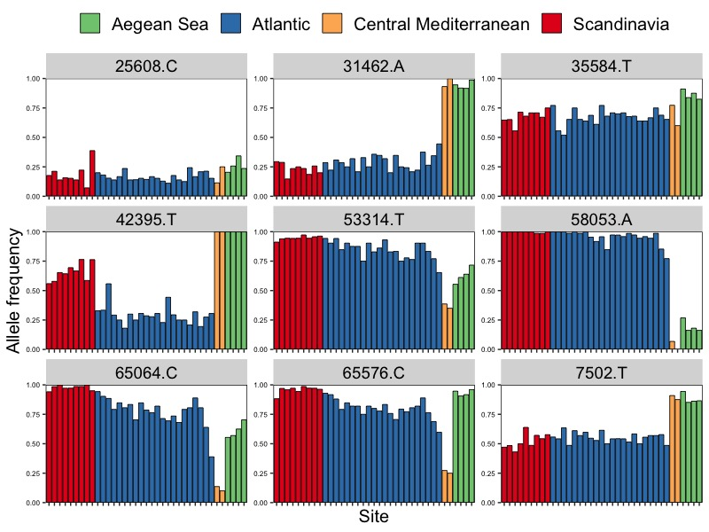
### 准备空间数据
准备运行环境
```r
library(marmap)
library(tidyverse)
library(ade4)
library(adespatial)
library(SoDA)
```
```r
# 计算最小耗费距离
# 使用marmap软件包从NOAA获取水深数据
bathydata = getNOAA.bathy(lon1 = -15,
                          lon2 = 30,
                          lat1 = 35,
                          lat2 = 65,
                          resolution = 2)
# 输入各个采样区的坐标
coords = read.csv("coordinates.csv")
head(coords)
coords.gps = dplyr::select(coords, Lon, Lat)
# 获取坐标处的水深
depths = cbind(site = coords$Site, get.depth(bathydata, coords.gps, locator = FALSE))
depths
# 看看水深是否大于10m
depths$depth <= -10
# 绘制水深数据与坐标
plot(bathydata)
points(coords$Lon, coords$Lat, pch = 21, bg = "yellow", col = "black", cex = 2)
```
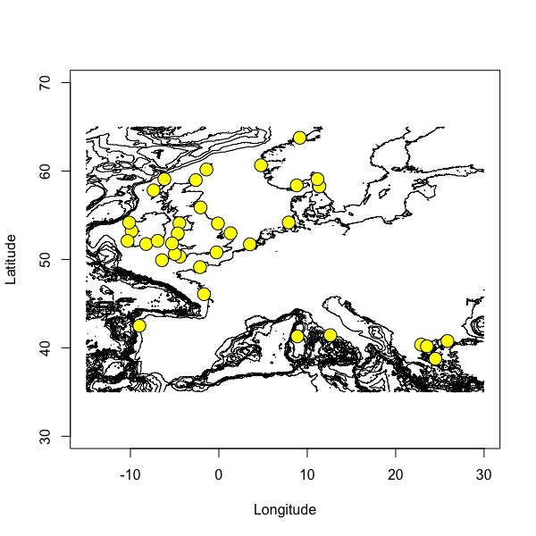

Tips:
marmap作者的推荐：
使用最小深度-10来避免路径穿过陆地块；使用最大深度-200来限制通往大陆架的路径
```r
# trans1 = trans.mat(bathydata, min.depth = -10, max.depth = NULL)
# save(trans1, file = "transition_object.RData")
# load("transition_object.RData")
# Compute least-cost paths [long run time]
# lc_paths = lc.dist(trans1, coords.gps, res = "path")
# save(lc_paths, file = "least_cost_paths.RData")
```
在地图上绘制距离（很慢）
```r
load("least_cost_paths.RData")
# 底图
plot.bathy(bathydata, image= TRUE, land = TRUE, n = 0,
           bpal = list(c(0, max(bathydata), "grey"),
                       c(min(bathydata), 0, "royalblue")))
# 轨迹
lapply(lc_paths, lines, col = "orange", lwd = 2, lty = 1)
```
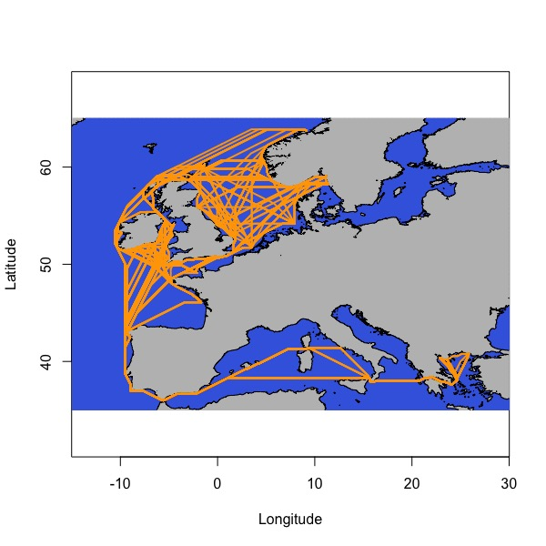
计算最小耗费距离矩阵
```r
lc_dist = lc.dist(trans1, coords.gps, res = "dist")
# 转换为矩阵，重命名列和行，并导出为csv文件
lc_mat = as.matrix(lc_dist)
colnames(lc_mat) = as.vector(coords$Site)
rownames(lc_mat) = as.vector(coords$Site)
lc_mat
# write.csv(lc_mat, file="lc_distances_km.csv")
```
计算基于距离的Moran特征向量映射（空间相关矩阵？
```r
# 查看学习资料
vignette("tutorial", package = "adespatial")
# 将地理坐标转换为笛卡尔坐标
# 计算欧几里得距离(km)
# cart = geoXY(coords$Lat, coords$Lon, unit = 1000)
# euclidian_distances = dist(cart, method = "euclidean") 
dbmems = dbmem(lc_dist, MEM.autocor = "non-null")
dbmems
# write.csv(dbmems, file = "dbmems.csv", row.names = FALSE)
```
### 准备环境数据
数据如下：
平均海面温度(SST):当前(摄氏)
平均海底温度(SBT):当前(摄氏度)
平均海表盐度(SSS):当前(实际盐度标)
平均海底盐度(SBS):当前(实际盐度标)
平均海面叶绿素浓度(SSC):当前(mg/m3)
平均海面钙含量(SSCa):当前(mol/m3)
数据来源：http://www.bio-oracle.org
具体asc数据也可以发邮件找我要
加载环境
```r
library(raster)
library(dplyr)
# devtools::install_github("ropenscilabs/rnaturalearth")
# devtools::install_github("ropenscilabs/rnaturalearthdata")
# devtools::install_github("ropenscilabs/rnaturalearthhires")
library(rnaturalearth)
library(rnaturalearthdata)
library(rnaturalearthhires)
library(ggplot2)
library(RColorBrewer)
library(ggpubr)
```
加载数据
```r
sst.present = raster("Present.Surface.Temperature.Mean.asc")
sbt.present = raster("Present.Benthic.Max.Depth.Temperature.Mean.asc")
sss.present = raster("Present.Surface.Salinity.Mean.asc")
sbs.present = raster("Present.Benthic.Max.Depth.Salinity.Mean.asc")
ssc.present = raster("Present.Surface.Chlorophyll.Mean.asc")
ssca.present = raster("Present.Surface.Calcite.Mean.asc")
```
提取环境数据
```r
# 导入坐标
coords = read.csv("coordinates.csv")
names(coords)
# 用坐标创建空间点
points = SpatialPoints(subset(coords, select = c("Lon","Lat")))
# 利用坐标提取环境数据
df = data.frame(site = coords$Site,
                sst_mean = extract(sst.present, points),
                sbt_mean = extract(sbt.present, points),
                sss_mean = extract(sss.present, points),
                sbs_mean = extract(sbs.present, points),
                ssc_mean = extract(ssc.present, points),
                ssca_mean = extract(ssca.present, points)
)
# write.csv(df, file="environmental_data.csv", row.names = FALSE)
```
绘制热力图
```r
#设置图的边界 (xmin, xmax, ymin, ymax)
extent(points)
boundary = extent(-20, 30, 35, 65)
boundary
# 裁剪栅格到边界并转换成点的数据框
sst.df = crop(sst.present, y = boundary) %>% rasterToPoints() %>% data.frame()
sbt.df = crop(sbt.present, y = boundary) %>% rasterToPoints() %>% data.frame()
sss.df = crop(sss.present, y = boundary) %>% rasterToPoints() %>% data.frame()
sbs.df = crop(sbs.present, y = boundary) %>% rasterToPoints() %>% data.frame()
ssc.df = crop(ssc.present, y = boundary) %>% rasterToPoints() %>% data.frame()
ssca.df = crop(ssca.present, y = boundary) %>% rasterToPoints() %>% data.frame()
# 加载基础底图
basemap = ne_countries(scale = "large")
# 裁剪到边界并转换为数据框
basemap = crop(basemap, y = boundary) %>% fortify()
```
准备ggplot主题
```r
# 准备ggplot主题
ggtheme = theme(axis.title = element_text(size = 12),
                axis.text = element_text(size = 10, colour = "black"),
                panel.border = element_rect(fill = NA, colour = "black", size = 0.5),
                legend.title = element_text(size = 13),
                legend.text = element_text(size = 12),
                plot.title = element_text(size = 15, hjust = 0.5),
                panel.grid = element_blank())
# 准备颜色
temp.cols = colorRampPalette(c("blue","white","red"))
sal.cols = colorRampPalette(c("darkred","white"))
chlor.cols = colorRampPalette(c("white","green"))
calct.cols = colorRampPalette(c("white","#662506"))
```
绘制海洋表明温度
```r
sst.plt = ggplot()+
  geom_tile(data = sst.df, aes(x = x, y = y, fill = sst.df[, 3]))+
  geom_polygon(data = basemap, aes(x = long, y = lat, group = group))+
  coord_quickmap(expand = F)+
  xlab("Longitude")+
  ylab("Latitude")+
  ggtitle("Sea surface temperature (present-day)")+
  scale_fill_gradientn(expression(~degree~C), colours = temp.cols(10), limits = c(-1.5,24))+
  ggtheme
sst.plt
ggsave("1.sst_heatmap.png", width = 10, height = 9, dpi = 600)
# ggsave("Rplot15.png", width = 10, height = 9, dpi = 300)
```
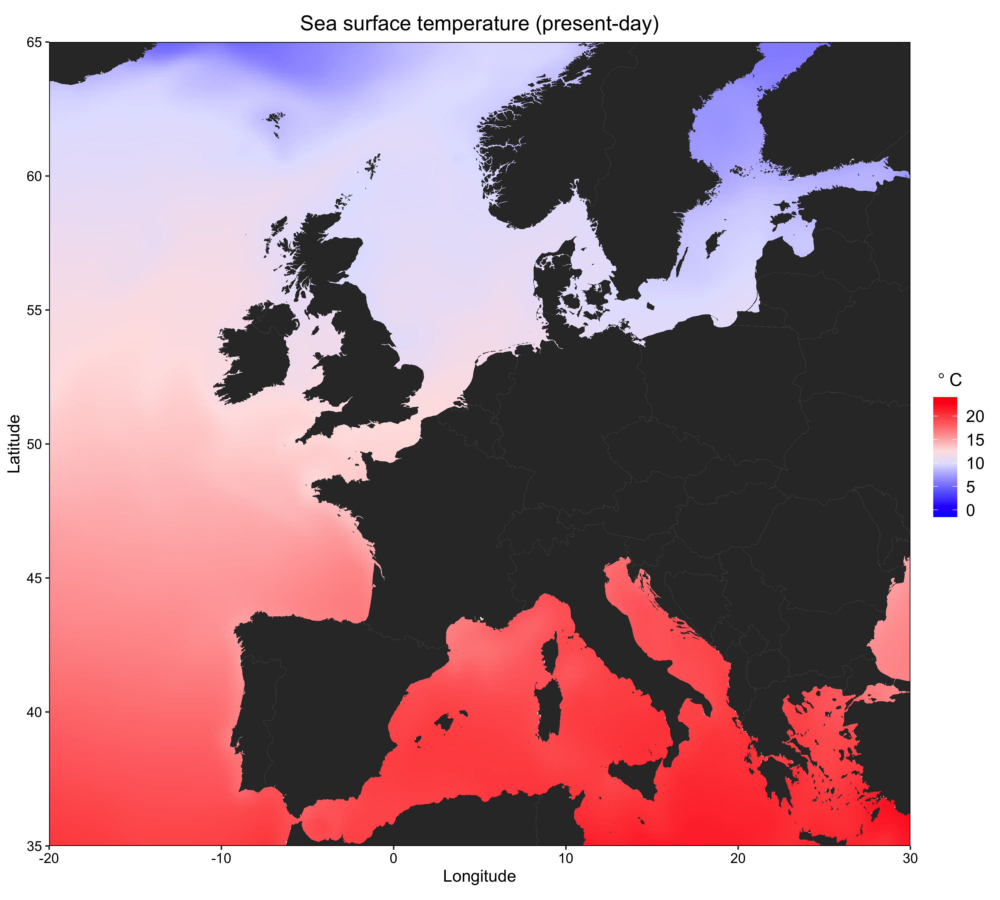
绘制海底温度
```r
sbt.plt = ggplot()+
  geom_tile(data = sbt.df, aes(x = x, y = y, fill = sbt.df[, 3]))+
  geom_polygon(data = basemap, aes(x = long, y = lat, group = group))+
  coord_quickmap(expand = F)+
  xlab("Longitude")+
  ylab("Latitude")+
  ggtitle("Sea bottom temperature (present-day)")+
  scale_fill_gradientn(expression(~degree~C), colours = temp.cols(10), limits = c(-1.5,24))+
  ggtheme
sbt.plt
ggsave("2.sbt_heatmap.png", width = 10, height = 9, dpi = 600)
```
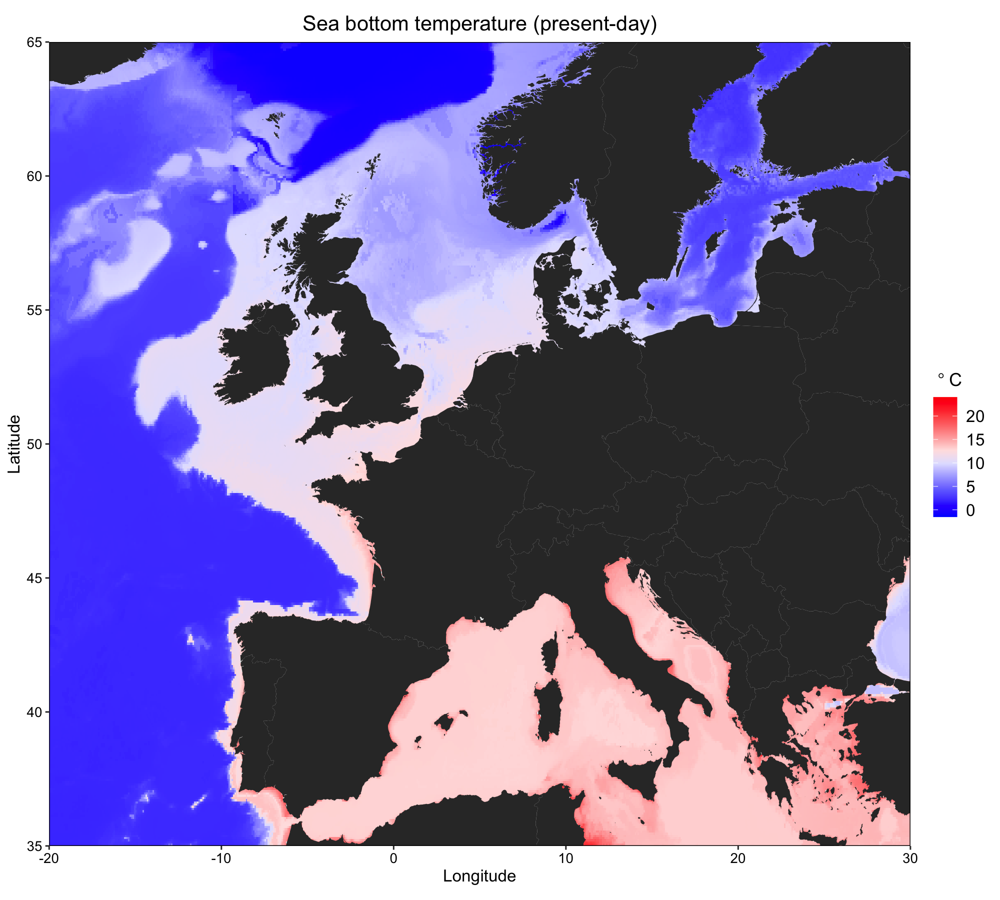
绘制海面盐度
```r
sss.plt = ggplot()+
  geom_tile(data = sss.df, aes(x = x, y = y, fill = sss.df[, 3]))+
  geom_polygon(data = basemap, aes(x = long, y = lat, group = group))+
  coord_quickmap(expand = F)+
  xlab("Longitude")+
  ylab("Latitude")+
  ggtitle("Sea surface salinity (present-day)")+
  scale_fill_gradientn("PPS", colours = sal.cols(10), limits = c(1,40))+
  ggtheme
sss.plt
ggsave("3.sss_heatmap.png", width = 10, height = 9, dpi = 600)
```
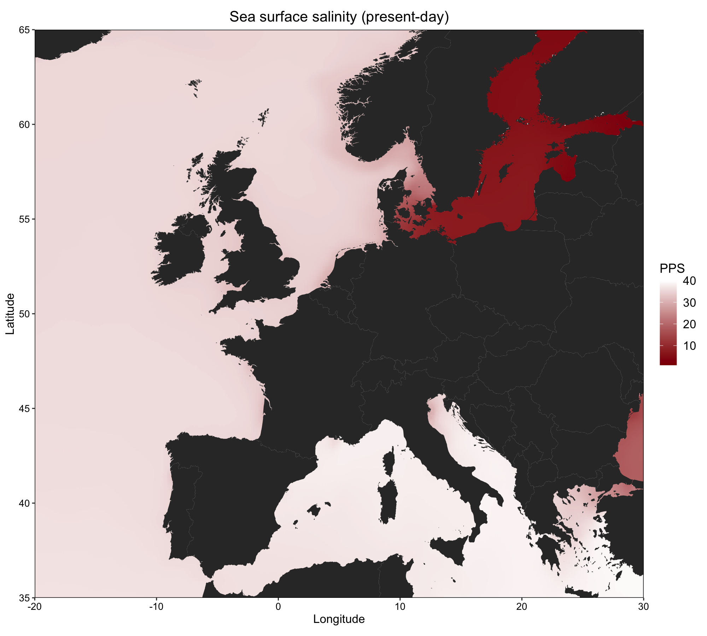
绘制海底盐度
```r
sbs.plt = ggplot()+
  geom_tile(data = sbs.df, aes(x = x, y = y, fill = sbs.df[, 3]))+
  geom_polygon(data = basemap, aes(x = long, y = lat, group = group))+
  coord_quickmap(expand = F)+
  xlab("Longitude")+
  ylab("Latitude")+
  ggtitle("Sea bottom salinity (present-day)")+
  scale_fill_gradientn("PPS", colours = sal.cols(10), limits = c(1,40))+
  ggtheme
sbs.plt
ggsave("4.sbs_heatmap.png", width = 10, height = 9, dpi = 600)
```
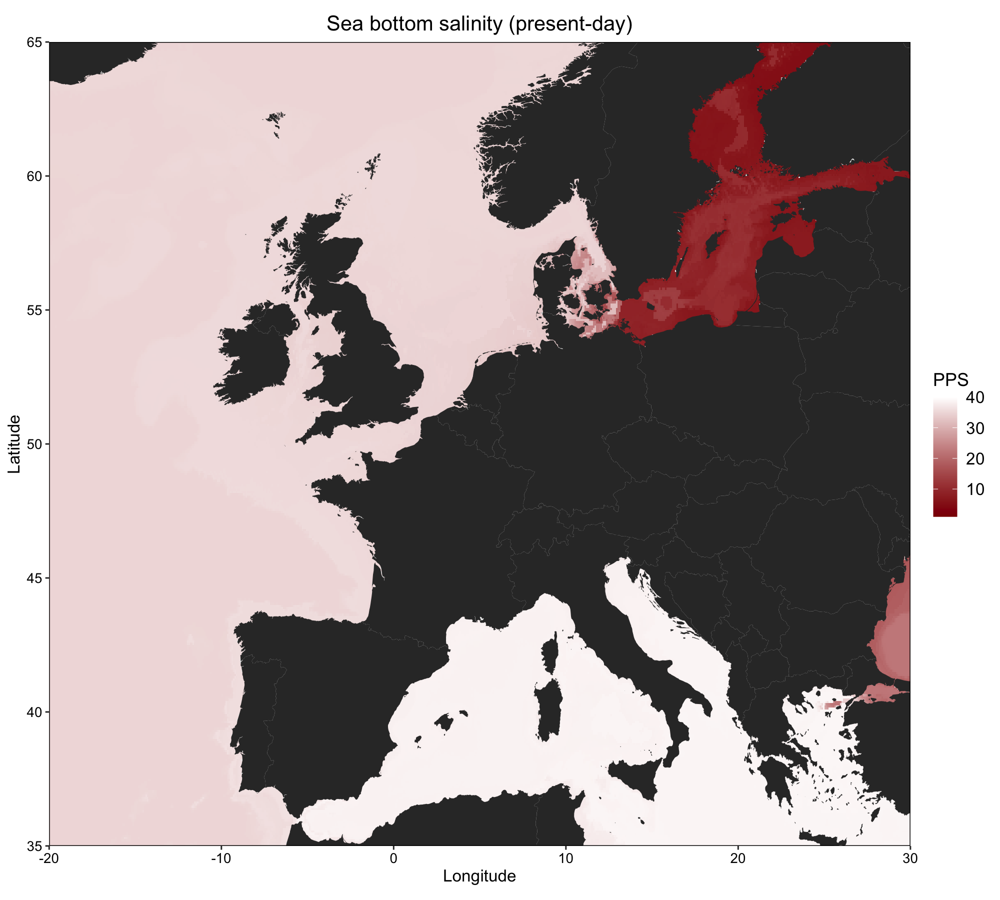
绘制海面叶绿体浓度
```r
ssc.plt = ggplot()+
  geom_tile(data = ssc.df, aes(x = x, y = y, fill = ssc.df[, 3]))+
  geom_polygon(data = basemap, aes(x = long, y = lat, group = group))+
  coord_quickmap(expand = F)+
  xlab("Longitude")+
  ylab("Latitude")+
  ggtitle("Sea surface chlorophyll (present-day)")+
  scale_fill_gradientn(expression(paste("mg/m"^"3")), colours = chlor.cols(10))+
  ggtheme
ssc.plt
ggsave("5.ssc_heatmap.png", width = 10, height = 9, dpi = 600)
```
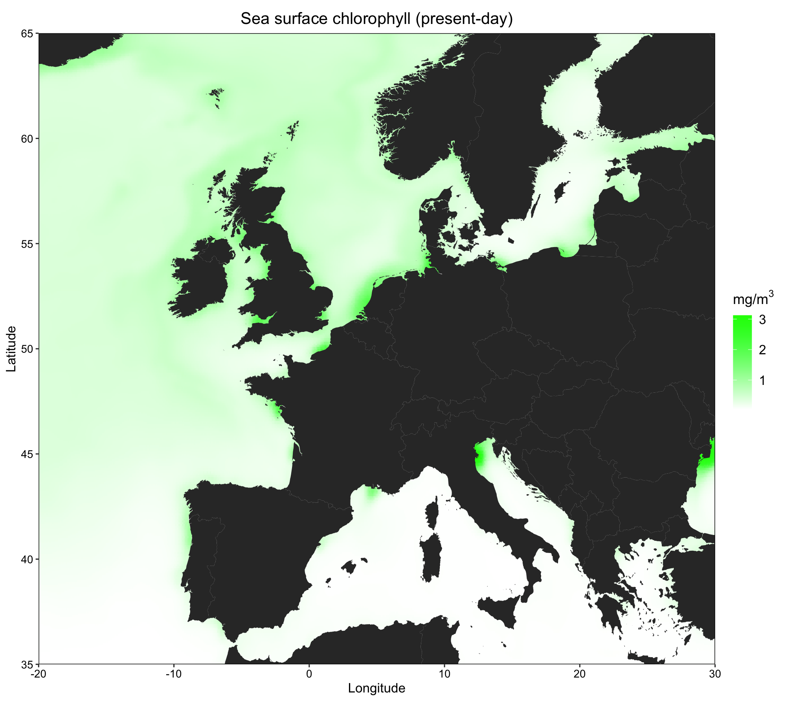
绘制海面钙含量
```r
ssca.plt = ggplot()+
  geom_tile(data = ssca.df, aes(x = x, y = y, fill = ssca.df[, 3]))+
  geom_polygon(data = basemap, aes(x = long, y = lat, group = group))+
  coord_quickmap(expand = F)+
  xlab("Longitude")+
  ylab("Latitude")+
  ggtitle("Sea surface calcite (present-day)")+
  scale_fill_gradientn(expression(paste("mol/m"^"3")), colours = calct.cols(10))+
  ggtheme
ssca.plt
ggsave("6.ssca_heatmap.png", width = 10, height = 9, dpi = 600)
```
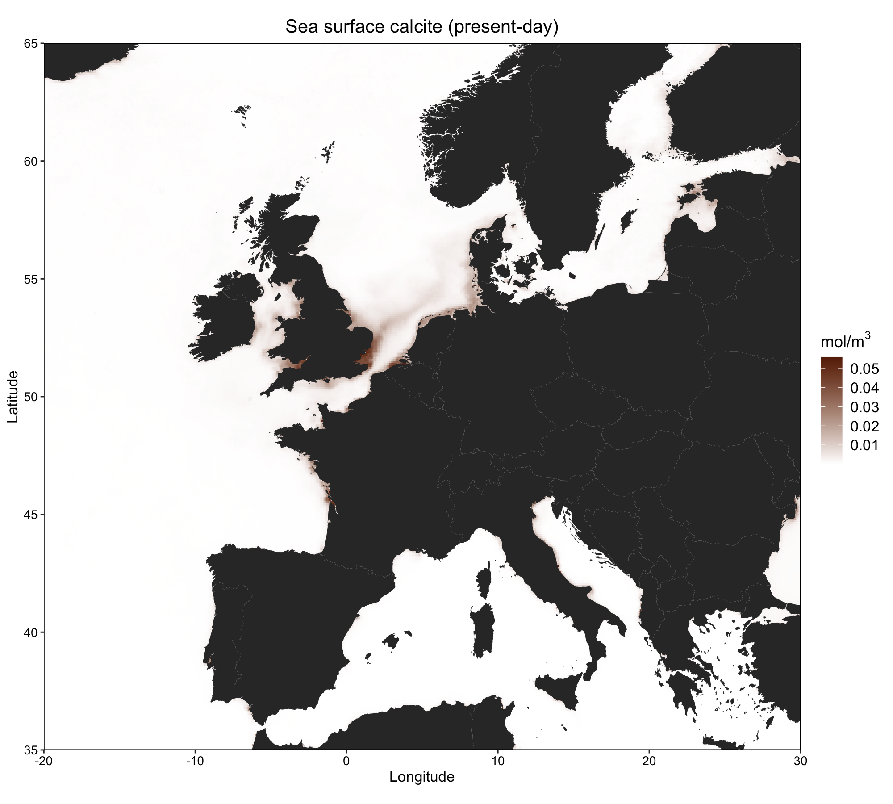
组合图片
```r
# 组合两张关于温度的
figAB = ggarrange(sst.plt + labs(tag = "A") + ggtheme + theme(axis.title.y = element_blank()),
                  sbt.plt + labs(tag = "B") + ggtheme + theme(axis.title.y = element_blank()),
                  ncol = 2, common.legend = TRUE, legend = "right")
figAB = annotate_figure(figAB,
                        left = text_grob("Latitude", size = 12, rot = 90))

# 组合两张关于盐分的
figCD = ggarrange(sss.plt + labs(tag = "C") + ggtheme + theme(axis.title.y = element_blank()),
                  sbs.plt + labs(tag = "D") + ggtheme + theme(axis.title.y = element_blank()),
                  ncol = 2, common.legend = TRUE, legend = "right")
figCD = annotate_figure(figCD,
                        left = text_grob("Latitude", size = 12, rot = 90))

# 把他们加起来
fig = ggarrange(figAB, figCD, nrow = 2)
ggsave("7.temp_sal_heatmap.png", width = 10, height = 10, dpi = 600)
# ggsave("7.temp_sal_heatmap.pdf", width = 10, height = 10)
```
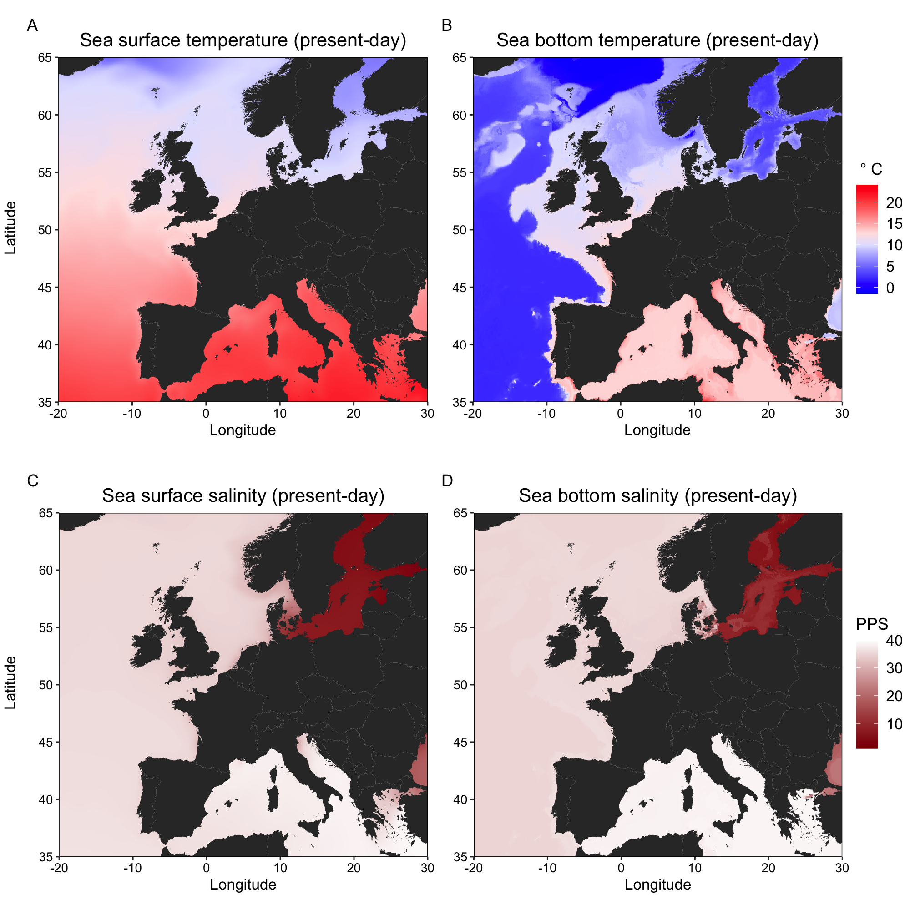
## 进行冗余分析
加载环境与数据
```r
library(tidyverse)
library(psych)
library(adespatial)
library(vegan)
# 加载基因数据
allele_freqs = read.csv("allele_freqs.csv", row.names = 1, check.names = FALSE)
# 加载空间数据
dbmem.raw = read.csv("dbmems.csv")
# 加载环境数据
env.raw = read.csv("environmental_data.csv", row.names = 1)
# 加载随机种子
set.seed(123)
```
多重共线性检验
```r
# 对环境变量进行相关检验
pairs.panels(env.raw, scale = TRUE)
# 移除相关性强的变量
env.data = subset(env.raw, select = -c(sst_mean, sbs_mean))
pairs.panels(env.data, scale = TRUE)
```
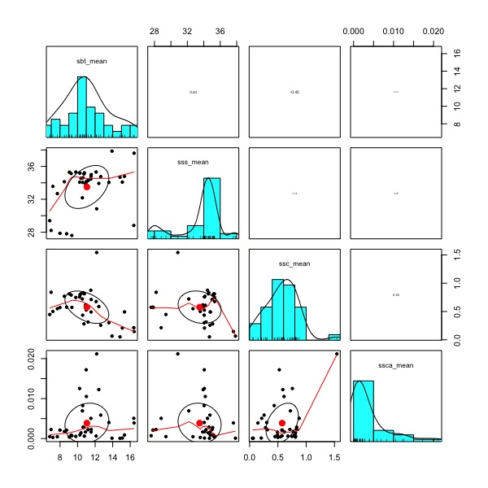
识别重要变量
```r
# 使用前向选择来确定重要的环境变量
env.for = forward.sel(Y = allele_freqs, X = env.data, alpha = 0.01)
env.for
#  variables order         R2     R2Cum  AdjR2Cum         F pvalue
# 1  sbt_mean     1 0.31150411 0.3115041 0.2918328 15.835453  0.001
# 2  sss_mean     2 0.09469125 0.4061954 0.3712657  5.421821  0.001
# 3 ssca_mean     4 0.07470387 0.4808992 0.4337083  4.749035  0.005
# 使用前向选择来确定重要的dbmems
dbmem.for = forward.sel(Y = allele_freqs, X = dbmem.raw, alpha = 0.01)
dbmem.for
#   variables order         R2     R2Cum  AdjR2Cum         F pvalue
# 1      MEM1     1 0.51661196 0.5166120 0.5028009 37.405598  0.001
# 2      MEM2     2 0.08518943 0.6018014 0.5783780  7.273860  0.001
# 3      MEM5     5 0.08000465 0.6818060 0.6528793  8.297309  0.001
# 4      MEM3     3 0.04720013 0.7290062 0.6951319  5.573574  0.001
# 5      MEM6     6 0.02189658 0.7509028 0.7107258  2.725016  0.010
```
我们只将重要的自变量子集包含在RDA中
```r
env.sig = subset(env.data, select = env.for$variables)
str(env.sig)
dbmem.sig = subset(dbmem.raw, select = dbmem.for$variables)
str(dbmem.sig)
# 组合这些变量
env.dbmems = cbind(env.sig, dbmem.sig)
str(env.dbmems)
```
进行冗余分析
```r
# 为所有变量进行冗余分析
rda1 = rda(allele_freqs ~ ., data = env.dbmems, scale = TRUE)
rda1
# Call: rda(formula = allele_freqs ~ sbt_mean + sss_mean +
# ssca_mean + MEM1 + MEM2 + MEM5 + MEM3 + MEM6, data = env.dbmems,
# scale = TRUE)

#               Inertia Proportion Rank
# Total         79.0000     1.0000     
# Constrained   44.9918     0.5695    8
# Unconstrained 34.0082     0.4305   28
# Inertia is correlations 

# Eigenvalues for constrained axes:
#   RDA1   RDA2   RDA3   RDA4   RDA5   RDA6   RDA7   RDA8 
# 22.319 10.537  3.837  2.995  2.540  1.194  0.966  0.604 

# Eigenvalues for unconstrained axes:
#   PC1   PC2   PC3   PC4   PC5   PC6   PC7   PC8 
# 4.940 3.197 2.488 2.400 2.121 1.732 1.655 1.617 
# (Showing 8 of 28 unconstrained eigenvalues)
```
### Model summaries
adjusted Rsquared 
```r
RsquareAdj(rda1)
# $r.squared
# [1] 0.5695167
# $adj.r.squared
# [1] 0.4465215
```
方差膨胀因子
```r
# variance inflation factor (<10 OK)
vif.cca(rda1)
```
全模型
```r
anova.cca(rda1, permutations = 1000)
# sbt_mean  sss_mean ssca_mean      MEM1      MEM2      MEM5      MEM3 
#  8.590561  1.791776  1.979065  7.012236  2.107733  1.105811  2.055020 
#      MEM6 
#  1.078194 
```
每个变量
```r
anova.cca(rda1, permutations = 1000, by="margin")
# Permutation test for rda under reduced model
# Marginal effects of terms
# Permutation: free
# Number of permutations: 1000

# Model: rda(formula = allele_freqs ~ sbt_mean + sss_mean + ssca_mean + MEM1 + MEM2 + MEM5 + MEM3 + MEM6, data = env.dbmems, scale = TRUE)
#           Df Variance      F   Pr(>F)    
# sbt_mean   1    0.913 0.7513 0.662338    
# sss_mean   1    1.868 1.5381 0.125874    
# ssca_mean  1    1.948 1.6040 0.082917 .  
# MEM1       1    4.059 3.3418 0.001998 ** 
# MEM2       1    1.771 1.4579 0.182817    
# MEM5       1    7.091 5.8379 0.000999 ***
# MEM3       1    1.814 1.4934 0.102897    
# MEM6       1    2.973 2.4479 0.038961 *  
# Residual  28   34.008                    
# ---
# Signif. codes:  0 ‘***’ 0.001 ‘**’ 0.01 ‘*’ 0.05 ‘.’ 0.1 ‘ ’ 1
```
每个标准轴的解释方差
```r
summary(eigenvals(rda1, model = "constrained"))
screeplot(rda1)
```
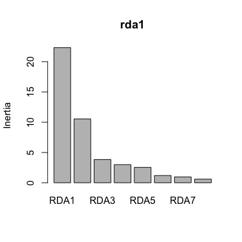
### RDA的可视化
```r
# 创建一个数据框来正确地为区域着色
col_dframe = data.frame("site" = rownames(allele_freqs))
# 一个函数将区域标签添加到数据帧
addregion = function(x){
  # If pop label is present function will output the region
  if(x=="Ale"|x=="The"|x=="Tor"|x=="Sky") y = "Aegean Sea"
  if(x=="Sar"|x=="Laz") y = "Central Mediterranean"
  if(x=="Vig"|x=="Brd"|x=="Cro"|x=="Eye"|x=="Heb"|x=="Iom"|x=="Ios"|x=="Loo"|x=="Lyn"|x=="Ork"|x=="Pad"|x=="Pem"|x=="She"|x=="Sbs"|x=="Sul") y = "Atlantic"
  if(x=="Jer"|x=="Idr"|x=="Cor"|x=="Hoo"|x=="Kil"|x=="Mul"|x=="Ven") y = "Atlantic"
  if(x=="Hel"|x=="Oos"|x=="Tro"|x=="Ber"|x=="Flo"|x=="Sin"|x=="Gul"|x=="Kav"|x=="Lys") y = "Scandinavia"
  return(y)
}
# 增加区域标记
col_dframe$region = sapply(col_dframe$site, addregion)
# 增加因子水平
region_order = c("Scandinavia","Atlantic","Central Mediterranean", "Aegean Sea")
col_dframe$region = factor(col_dframe$region, levels = region_order)
# 创建调色板
# blue=#377EB8, green=#7FC97F, orange=#FDB462, red=#E31A1C
cols = c("#7FC97F","#377EB8","#FDB462","#E31A1C")
```
RDA的可视化
```r
png("rda.png", width = 8, height = 7, units = "in", res = 600)
plot(rda1, type="n", scaling = 3)
title("Seascape redundancy analysis")
# SITES
points(rda1, display="sites", pch=21, scaling=3, cex=1.5, col="black",
       bg=cols[col_dframe$region]) # sites
# text(rda1, display="sites", scaling = 3, col="black", font=2, pos=4)
# PREDICTORS
text(rda1, display="bp", scaling=3, col="red1", cex=1, lwd=2)
# SNPS
# text(rda1, display="species", scaling = 3, col="blue", cex=0.7, pos=4) # SNPs
# LEGEND
legend("bottomleft", legend=levels(col_dframe$region), bty="n", col="black",
       pch=21, cex=1.2, pt.bg=cols)
# OTHER LABELS
adj.R2 = round(RsquareAdj(rda1)$adj.r.squared, 3)
mtext(bquote(italic("R")^"2"~"= "~.(adj.R2)), side = 3, adj = 0.5)
dev.off()
```
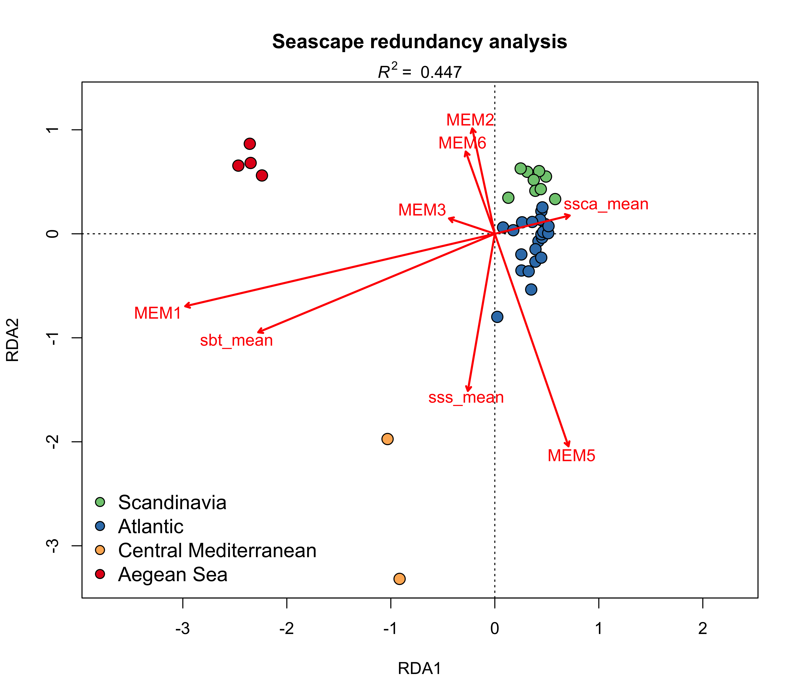
### 部分冗余分析
Partial redundancy analysis
在控制地理位置的同时执行RDA
```r
pRDA = rda(allele_freqs ~ sbt_mean + sss_mean + ssca_mean + Condition(MEM1+MEM2+MEM3+MEM5),
           data = env.dbmems, scale = TRUE)
pRDA
RsquareAdj(pRDA) # adjusted Rsquared 
vif.cca(pRDA) # variance inflation factor (<10 OK)
anova.cca(pRDA, permutations = 1000) # full model
anova.cca(pRDA, permutations = 1000, by = "margin") # per variable
```
可视化
```r
png("partial_rda.png", width = 9, height = 7, units = "in", res = 600)
plot(pRDA, type="n", scaling = 3)
title("Seascape partial redundancy analysis")
# SITES
points(pRDA, display="sites", pch=21, scaling=3, cex=1.5, col="black",
       bg=cols[col_dframe$region]) # sites
text(pRDA, display="sites", scaling = 3, col="black", font=2, pos=4)
# PREDICTORS
text(pRDA, display="bp", scaling=3, col="red1", cex=1, lwd=2)
# SNPS
# text(pRDA, display="species", scaling = 3, col="blue", cex=0.7, pos=4) # SNPs
# LEGEND
legend("topleft", legend=levels(col_dframe$region), bty="n", col="black",
       pch=21, cex=1.2, pt.bg=cols)
# OTHER LABELS
adj.R2 = round(RsquareAdj(pRDA)$adj.r.squared, 3)
mtext(bquote(italic("R")^"2"~"= "~.(adj.R2)), side = 3, adj = 0.5)
dev.off()
```
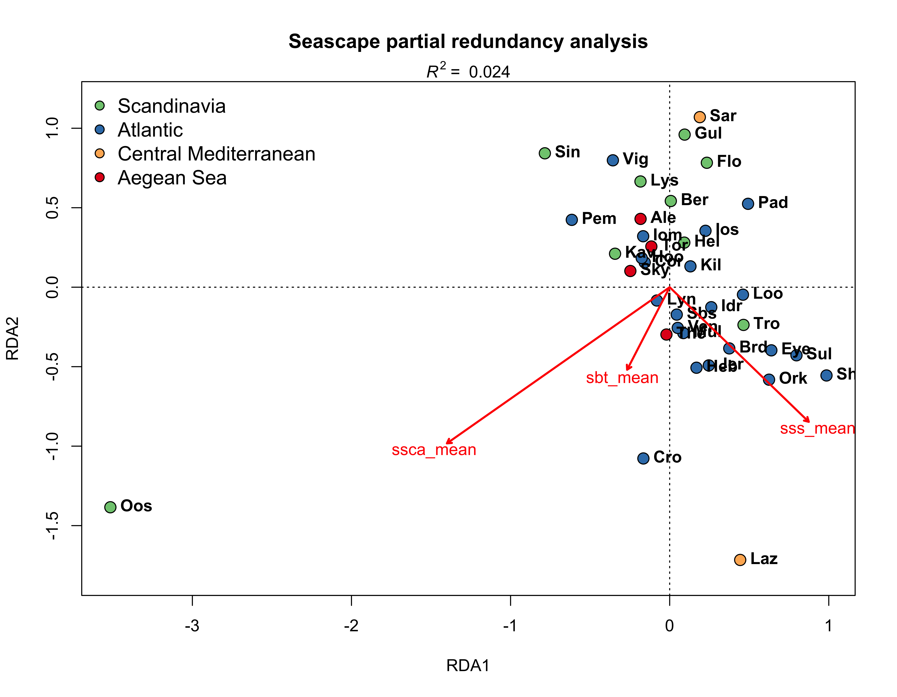
Candidate SNPs for local adaptation？
考察候选核苷酸多态性和当地适宜性的关系
```r
# 在图中，哪个轴比较重要呢？
anova.cca(pRDA, permutations = 1000, by = "axis")
# 提取带显著性的SNP的载荷轴
snp.load = scores(pRDA, choices = 1, display = "species")
# 绘制SNP载荷直方图
hist(snp.load, main = "SNP loadings on RDA1")
```
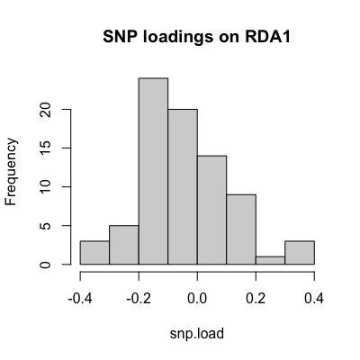
确定分布尾部的SNP
Function from https://popgen.nescent.org/2018-03-27_RDA_GEA.html
```r
outliers = function(x,z){
  lims = mean(x) + c(-1, 1) * z * sd(x) # find loadings +/-z sd from mean loading     
  x[x < lims[1] | x > lims[2]]          # locus names in these tails
}
# x = loadings vector, z = number of standard deviations to use
candidates = outliers(x = snp.load, z = 2.5)
 Convert matric to dataframe
snp.load.df = snp.load %>% as.data.frame
snp.load.df$SNP_ID = rownames(snp.load.df)
str(snp.load.df)

# Extract locus ID
snp.load.df %>% dplyr::filter(RDA1 %in% candidates)
```


