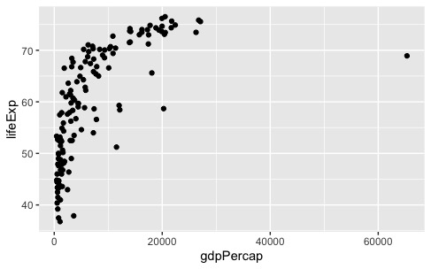

# 各种各样的回归分析
## 从lm( )开始进行简单一元线性回归
首先需要从gapminder上获得一些练习数据，gapminder是一个有着全球各种数据的公益网站，我们可以通过R包“gapminder”去下载(http://github.com/jennybc/gapminder)。
我们先加载一些必要的包和数据：
```r
library(tidyverse)
library(broom)
d <- gapminder::gapminder
```
tidyverse包是个合集，里面有dplyr实现数据整理，tidyr实现数据筛选，stringr实现字符串操作，还有ggplot2去作图。
broom包接受R中内置函数的杂乱输出（如lm和nls），并将它们转为整齐的数据帧。
第三行中我们使用双冒号在不打开包的情况下加载包中的某一功能，其语法为packagename::functionname。同时双冒号还可以在多个包下有同名函数时指定我们需要的包。
接下来我们打开d，这是一个6列1704行的表格
```r
d
```
然后我们对数据进行绘图：
```r
x = ggplot(d, aes(year,lifeExp))+
  geom_point(alpha = 0.5, position = position_jitter(width = 0.6))
x
```
可以得到这样一张图：  
  

接着我们来尝试进行寿命与年份间的简单线性回归：最简单的lm模型可以表示为df <- lm(a<-b)，即为用b去拟合a，并将结果输出到df里，然后我们输入`summary(df)`就能看到拟合结果了。我们可以利用coef()函数读取回归系数，并通过tidy()函数将回归结果整理成表格。
```r
lm1 <- lm(lifeExp ~ year, data = d)
summary(lm1)
coef(lm1)
tidy(lm1)
##得到结果如下
#Residuals:
#    Min      1Q  Median      3Q     Max 
#-39.949  -9.651   1.697  10.335  22.158 
#
#Coefficients:
#              Estimate Std. Error t value Pr(>|t|)    
#(Intercept) -585.65219   32.31396  -18.12   <2e-16 ***
#year           0.32590    0.01632   19.96   <2e-16 ***
#---
#Signif. codes:  0 ‘***’ 0.001 ‘**’ 0.01 ‘*’ 0.05 ‘.’ 0.1 ‘ ’ 1
#
#Residual standard error: 11.63 on 1702 degrees of freedom
#Multiple R-squared:  0.1898,	Adjusted R-squared:  0.1893 
#F-statistic: 398.6 on 1 and 1702 DF,  p-value: < 2.2e-16
```
如何理解这里面的各种玩意儿呢？我们直接看Coefficients部分：
其中Estimate为估值，Std.Error为标准误差，t value为T值，Pr为P值，一般而言，P<0.05以为数据有显著差异，我们认为这些数据通过了显著性检验，可以用了，有了统计学意义，而P<0.001意为数据有极显著差异（现在一般不提这个，误导性比较强）。
接下来可以看看Multiple R-squared（拟合优度）和Adjusted R-squared（修正的拟合优度），就是所谓的R方了，数值越高说明拟合程度越好。
而F-statistic则是F检验，是用来检验方程的整体显著性的，我们通过观察它的P值去看看方程整体是否显著。
### 关于P-value和R^2
以前一直说什么显著差异极显著差异的，这时候我tm就要问了，我们线性回归为什么要扯什么显著差异，又不是做因素分析。所以P值有什么P用呢？
P-value是拒绝原假设犯第一类假设错误的概率（？），百度说是“原假设是正确的，但我们却拒绝了原假设”（？）。举个例子就是假设抛均匀硬币正面的概率是50%（P=0.5），那么现在抛5次硬币都是正面的概率显然为0.5^5=0.03125，如果我抛5次硬币都是正面，那么P=0.03125<0.05，有统计学意义了，就可以得出结论推翻原先的关于均匀硬币的说法了，我们据此可以认为这个硬币是不均匀的。
那么在线性回归中，原假设即为“其实这些数据是随机的，根本不存在什么线性”，我们通过P值检验推翻了这一原假设，即可正面“这些数据真不是随机的，而是有关系的”。
R方是什么，在SPSS中我们可以看到R-squared = SSR/TSS = 1-RSS/TSS，其中SSR为解释方差，RSS为残差平方和，TSS为固有方差。那么显然，可以用公式来表示这个R-squared：
$$R^{2}=1-\frac{\sum_{i}\left (y^{(i)}-\hat{y}^{(i)}\right )^2}{\sum_{i}\left (y^{(i)}-\bar{y}\right )^2}$$
对于$\sum_{i}\left (y^{(i)}-\hat{y}^{(i)}\right )^2$，我们已经很熟悉了([见生态学数学原理线性代数章节](./MathPrinciples.html))，而对于$\sum_{i}\left (y^{(i)}-\bar{y}\right )^2$，这就是使用平均数来预测产生的错误（损失函数）（在ML中称为基准模型（Baseline Model），那么如果说我们辛辛苦苦回归来的错误甚至多于随便求个平均值的错误，$R^2$就会小于0，就白给了。所以R方的值应当在0-1之间，且越大说明预测越准确。
那么调整R方又是什么呢？在R方的计算中，不断增加变量会提升模型的效果，但是其实并没有什么效果，而调整R方可以惩罚那些不显著的变量，来略微调低原先的R方。

回到正题，我们继续对gapminder数据进行一些处理并回归，在tidyverse包中，我们可以通过管道符%>%将前一个命令的输出作为后一个命令的输入，而不是使用嵌套函数搞一堆简称出来：
```r {class=line-numbers}
#我们先将上面的数据d称为life（套娃），然后按国家进行分类
life <- d %>% 
  group_by(country) %>%
#接着把分类完的数据使用summarise这个统计描述函数，将lifeExp定义为算术平均寿命，将gdpPercap定义为算术平均gdp。
  summarise(lifeExp = mean(lifeExp), gdpPercap = mean(gdpPercap)) 
#对数据带了log，取了对数，然后画成散点图
ggplot(life, aes(log(gdpPercap), log(lifeExp))) + geom_point()
#回归
lm2 <- lm(log(lifeExp) ~ log(gdpPercap), data = life)
summary(lm2)
##接着系统会生成结果：
#lm(formula = log(lifeExp) ~ log(gdpPercap), data = life)
#
#Residuals:
#     Min       1Q   Median       3Q      Max 
#-0.42480 -0.05350  0.01827  0.05729  0.23078 
#
#Coefficients:
#               Estimate Std. Error t value Pr(>|t|)    
#(Intercept)    2.920294   0.060789   48.04   <2e-16 ***
#log(gdpPercap) 0.139064   0.007296   19.06   <2e-16 ***
#---
#Signif. codes:  0 ‘***’ 0.001 ‘**’ 0.01 ‘*’ 0.05 ‘.’ 0.1 ‘ ’ 1
#
#Residual standard error: 0.1036 on 140 degrees of freedom
#Multiple R-squared:  0.7219,	Adjusted R-squared:  0.7199 
#F-statistic: 363.3 on 1 and 140 DF,  p-value: < 2.2e-16
```

我们注意一下现在的$R^2$是**0.7219**，结果很好，所以……
### 为什么要取对数？
我们先试试上面的数据不取对数会如何？
代码就不列了，结果如下：
```r
#lm(formula = lifeExp ~ gdpPercap, data = life)
#
#Residuals:
#    Min      1Q  Median      3Q     Max 
#-42.058  -5.709   1.995   6.082  12.468 
#
#Coefficients:
#             Estimate Std. Error t value Pr(>|t|)    
#(Intercept) 5.308e+01  9.106e-01   58.29   <2e-16 ***
#gdpPercap   8.862e-04  8.192e-05   10.82   <2e-16 ***
#---
#Signif. codes:  0 ‘***’ 0.001 ‘**’ 0.01 ‘*’ 0.05 ‘.’ 0.1 ‘ ’ 1
#
#Residual standard error: 8.255 on 140 degrees of freedom
#Multiple R-squared:  0.4553,	Adjusted R-squared:  0.4514 
#F-statistic:   117 on 1 and 140 DF,  p-value: < 2.2e-16
```

此时不仅仅是图丑出天际的问题了，而是$R^2$变成了**0.4553**，数据的拟合程度都下降了好多！
首先要说明的是对数函数在其定义域内单调增，所以取对数后不会改变数据的相对关系，因此不用担心取了对数后数据不严谨了，乱了之类的。
接下来我尝试解释一下为什么取对数后我们的R方会提高，这也许可以从百度搜索引擎的机制开始讲起：
如果要搜索我们想要的信息，比如想去搜“薛定谔的猫”，那么搜索引擎是这么找到目标的呢？我们易得如果一个词在网页中出现的次数越少那么它越重要，因为显然我们搜索出的结果中肯定是首先与“薛定谔”有关的，而不是与“的”有关的，或者与“猫”有关的。也就是说如果一个关键词只在很少的网页中出现，我们通过它就容易锁定搜索目标，它的权重也就应该大。反之如果一个词在大量网页中出现，我们看到它仍然不很清楚要找什么内容，因此它应该小。概括地讲，假定一个关键词$w$在$Dw$个网页中出现过，那么$Dw$越大，$w$的权重越小，反之亦然。
这里就引入了“逆文本频率指数”（Inverse document frequency缩写为IDF）的概念，它的公式为
$$IDF=log(D/Dw)$$
<center>（lgo就是ln）,其中D是全部网页数。</center>
假定现在有D=10亿个网页，且“的”在所有网页中都出现，那么IDF(的)=log(10亿/1o亿)=0。而“薛定谔”只在200万个网页中出现，那么IDF(薛定谔)=6.2，而我们假设猫在其中1亿个网页都出现了，所以IDF(猫)=2.3，那么我们可以认为在“薛定谔的猫”中，“薛定谔”贡献最大，“猫”也有贡献，而“的”其实没用，这也是符合我们现实逻辑的。
由此我们可以得知，取对数可以将数据在整个值域中因不同区间而带来的差异降到最小。而且可以改变变量的尺度，使得数据更加平稳。

## 分位数回归
分位数回归可以用R包quantreg实现：
```r
library(SparseM)
library(quantreg)
data("engel")
#engel是quantreg中的自由数据，有235条，2个变量，一个是income收入，一个是foodexp食品支出，我们可以借此考察收入与食品支出的关系
#建立一个0.5分位数回归，rq函数就是quantreg里进行分位数回归的函数，tau即为分位数值
#是不是可以这么理解：所谓的α分位数回归，就是希望回归曲线之下能够包含α（一个百分数）的数据点？
fit1 <- rq(foodexp ~ income, tau = .5, data = engel)
fit1
summary(fit1)
##可得到：
#Call: rq(formula = foodexp ~ income, tau = 0.5, data = engel)
#
#tau: [1] 0.5
##coefficient列给出了估计的截距和斜率
##lower bd和upper bd则是估计的置信区间
#Coefficients:
#            coefficients lower bd  upper bd 
#(Intercept)  81.48225     53.25915 114.01156
#income        0.56018      0.48702   0.60199
```
```r {class=line-numbers}
#接着使用其内置的函数计算模型拟合残差，并绘制残差图
r1 <- resid(fit1)
plot(r1)
#得到结果表明残差均匀分布在(-200,200)区间内，说明拟合效果还不错
#绘制income和foodexp的散点图，并绘制不同分位数的分位数回归曲线：
#attach命令可以避免通过$来每次调用数据框中的变量
attach(engel)
#绘制散点图
plot(income, foodexp, cex = 0.25, type = "n", xlab ="Household Income", ylab ="Food Expenditure")
points(income,foodexp , cex = 0.25, col = "blue")
#通过abline绘制直线，这里绘制0.5分位回归线
abline(rq(foodexp ~income , tau = 0.5), col = "blue")
#绘制线性回归线
abline(lm(foodexp ~income  ), lty = 2, col = "red")
#给定下列分位数
taus <- c(0.05, 0.1, 0.25, 0.75, 0.9, 0.95)
#分别分位数回归
for (i in 1:length(taus)) {
  abline(rq(foodexp ~income  , tau = taus[i]), col = "gray")
}
#接触attach()的绑定
detach(engel)
```

接下来探讨分位数回归与恩格尔系数的关系：
```r
#使用within函数添加一列xx变量，xx为不同人群不同收入的占比
engel<-within(engel,xx <- income - mean(income))
fit1 <- summary(rq(foodexp~xx,tau=2:98/100,data = engel))
#通过mfrow功能实现1页放2幅图
plot(fit1,mfrow = c(1:2))
```

上图绘制了0.02到0.98这个区间中，每隔0.01做一次分位回归，其中黑色实心点代表回归曲线的截距值，阴影部分代表95%置信区间，红色实线和虚线分别代表的是，线性回归曲线的截距值和置信区间。从图中可以看出，收入对于0.02分位的foodexp的影响在0.35左右，对于0.98分位的影响在0.7左右。即为不同的分位数回归对应着不同的置信区间。
不同分位数的分位回归的截距值是否是由于抽样误差造成的，我们同样需要假设检验进行验证，那么我们使用Wald检验进行验证。得到如下结果，P值小于0.05可以认为不同分位数回归的截距之间值是有差异的。
```r
fit1 <- rq(foodexp ~ income, tau = .25, data = engel)
fit2 <- rq(foodexp ~ income, tau = .5, data = engel)
fit3 <- rq(foodexp ~ income, tau = .75, data = engel)
anova(fit1, fit2, fit3)
```
结果有显著差异。
## 混合线性模型lmm
### 固定因子与随机因子
混合线性模型考察既有随机因子，又有固定因子的模型的线性回归问题。而关于固定因子和随机因子，可参考csdn上的一篇博文：[固定效应模型与随机效应模型](https://blog.csdn.net/fjsd155/article/details/94313748)
固定效应和随机效应的选择是大家做面板数据常常要遇到的问题，一个常见的方法是做huasman检验，即先估计一个随机效应，然后做检验，如果拒绝零假设，则可以使用固定效应，反之如果接受零假设，则使用随机效应。但这种方法往往得到事与愿违的结果。另一个想法是在建立模型前根据数据性质确定使用那种模型，比如数据是从总体中抽样得到的，则可以使用随机效应，比如从N个家庭中抽出了M个样本，则由于存在随机抽样，则建议使用随机效应，反之如果数据是总体数据，比如31个省市的Gdp，则不存在随机抽样问题，可以使用固定效应。同时，从估计自由度角度看，由于固定效应模型要估计每个截面的参数，因此随机效应比固定效应有较大的自由度.
***
### 混合线性回归-lme4
我们还是使用之前的[加拉帕戈斯地雀模型](http://bioquest.org/birdd/morph.php)作为练习数据，对此进行预处理：
```r {class=line-numbers}
library(tidyverse)
morph <- read.csv("data/raw/Morph_for_Sato.csv", stringsAsFactors = FALSE, strip.white = TRUE)
#使用tolower函数改成小写
names(morph) <- tolower(names(morph))
morph <- morph %>%
  dplyr::select(islandid, taxonorig, genusl69, speciesl69, sex, wingl, beakh, ubeakl) %>%
  dplyr::rename(taxon = taxonorig, genus = genusl69, species = speciesl69)
morph <- data.frame(na.omit(morph))
morph <- dplyr::filter(morph, genus == "Geospiza") %>% as_data_frame()
d <- morph
#把数据保存为RDS格式
saveRDS(d, file = "data/generated/morph-geospiza.rds")
```
我们希望看一看喙长和翅膀长度有什么关系没有：
```r
#取对数缩小范围，并直接在图里进行线性回归，geom_smooth是添加平滑曲线
ggplot(d, aes(log(wingl), log(beakh))) +
  geom_point(aes(colour = taxon)) +
  geom_smooth(method = "lm")
```

但如果我们把`aes(colour = taxon)`移到上面会把我们默认的回归对象变成每个种
```r
ggplot(d, aes(log(wingl), log(beakh), colour = taxon)) +
  geom_point() +
#se指置信区间
  geom_smooth(method = "lm", se = FALSE)
```

接下来使用R包“lme4”来对数据进行混合线性回归，我们要建立一个混合效应模型，让每个分类单元都有自己的随机截距：
```r
library(tidyr)
library(Matrix)
library(lme4)
#先普通地线性回归看一看
m_lm <- lm(log(beakh) ~ log(wingl), data = d)
summary(m_lm)
#进行混合线性模型，1表示截距而taxon为随机因子
m_lmer <-  lmer(log(beakh) ~ log(wingl) + (1 | taxon), data = d)
#利用这个混合模型进行预测，再拿预测值画回归线
d$predict_lmer <- predict(m_lmer)
ggplot(d, aes(log(wingl), log(beakh), colour = taxon)) +
  geom_point(alpha = 0.1) + 
  geom_line(aes(y = predict_lmer))
```

我们可以将这些线条合并，从群落结构去考察：
```r
#使用re.form = NA函数来合并taxon数据
d$predict_lmer_population <- predict(m_lmer, re.form = NA)
ggplot(d, aes(log(wingl), log(beakh), colour = taxon)) +
  geom_point(alpha = 0.1) +
  geom_line(aes(y = predict_lmer)) +
  geom_line(aes(y = predict_lmer_population), colour = "black", size = 1)
```

最后我们可以查看回归效果：
```r
summary(m_lmer)
##关于数据的查看上文已经提及，不再赘述：
#Linear mixed model fit by REML ['lmerMod']
#Formula: log(beakh) ~ log(wingl) + (1 | taxon)
#   Data: d
#
#REML criterion at convergence: -3656.1
#
#Scaled residuals: 
#    Min      1Q  Median      3Q     Max 
#-6.2724 -0.6086 -0.0306  0.6211  3.6835 
#
#Random effects:
# Groups   Name        Variance Std.Dev.
# taxon    (Intercept) 0.050586 0.22491 
# Residual             0.004278 0.06541 
#Number of obs: 1434, groups:  taxon, 15
#
#Fixed effects:
#            Estimate Std. Error t value
#(Intercept) -2.60848    0.18819  -13.86
#log(wingl)   1.18318    0.04232   27.96
#
#Correlation of Fixed Effects:
#           (Intr)
#log(wingl) -0.951
```
一个小技巧，可以通过`arm::display(m_lmer)`(这里使用了arm包）命令来让我们的结果更加直观：
```r
#lmer(formula = log(beakh) ~ log(wingl) + (1 | taxon),data = d)
#            coef.est coef.se
#(Intercept) -2.61     0.19  
#log(wingl)   1.18     0.04  
#
#Error terms:
# Groups   Name        Std.Dev.
# taxon    (Intercept) 0.22    
# Residual             0.07    
#---
#number of obs: 1434, groups: taxon, 15
#AIC = -3648.1, DIC = -3672.8
#deviance = -3664.4 
```
### 混合线性回归-lmerTest
R语言中实现混合线性模型可以使用lme4包或lmerTest包，这里以lmerTest包为例，其基本表达式为：
```r
fit = lmer(data = , formula = DV ~ Fixed_Factor + (Random_intercept + Random_Slope | Random_Factor))
```
其中data为我们要处理的数据集，formula为表达式，DV是因变量，Fixed_Factor是固定因子（自变量），Random_intercept是随机截距（可以理解为因变量分布的不同？），Random_Slope是随机斜率，即认为不同群体受固定因子的影响不同，Random_Factor是随机因子。
我们以politeness数据为例进行计算：
politeness数据可以在github：<https://github.com/usplos/Eye-movement-related/blob/master/politeness_data.csv>中获得，本篇关于混合线性的模型的计算也源自该项目。该数据收集了若干被试（subject）的性别（gender），以及用不同的态度（attitude）在不同场合（scenario）下说话的音高（frequency）。 这是一个典型的被试内设计（7 * 2设计）。
先打开数据并加载相关r包：
```r
politeness = readr::read_csv('/Users/desktop/r/politeness_data.csv')
library(lme4)
library(Matrix)
library(lmerTest)
#将scenairo变为因子型变量（离散型，原来是字符型）
politeness$scenario = factor(politeness$scenario)
politeness
```
进行混合线性计算：
```r
#音高与固定因子态度和场合的关系，随机因子是性别与被试，它们基于的设计矩阵是态度，即为我们认为性别和被试对回归的影响的随机的
fit1 = lmer(frequency ~ scenario * attitude + attitude|subject + attitude|gender, data = politeness)
```
这时候系统提示：`boundary (singular) fit: see ?isSingular`这表明有些效应是彼此的线性组合或者某个地方的方差是0。当p>>n(比样本更多的参数)时也会发生这种情况。这也意味着模型可能被过度拟合和/或遭受数值稳定性问题。
```r
summary(fit1)
##得到结果：
#Linear mixed model fit by REML. t-tests use #Satterthwaite's method ['lmerModLmerTest']
#Formula: frequency ~ scenario * attitude + (1 + attitude | subject) +  
#    (1 + attitude | gender)
#   Data: politeness
#
#REML criterion at convergence: 680.1
#
#Scaled residuals: 
#     Min       1Q   Median       3Q      Max 
#-1.65342 -0.68640 -0.03677  0.50256  2.85422 
##这里是随机效应的结果，variance为方差，Std.Dev为标准差，可以看出确实对不同的被试组合性别组而言，态度的影响是不同的
#Random effects:
# Groups   Name        Variance  Std.Dev. Corr 
# subject  (Intercept) 6.037e+02 24.5696       
#          attitudepol 1.076e-02  0.1037  1.00 
# gender   (Intercept) 6.467e+03 80.4167       
#          attitudepol 1.118e+02 10.5749  -1.00
# Residual             6.101e+02 24.7001       
#Number of obs: 83, groups:  subject, 6; gender, 2
##固定效应的结果如下，我们发现场合3和4的音高是较显著的
#Fixed effects:
#                      Estimate Std. Error      df t value Pr(>|t|)   
#(Intercept)            180.767     58.615   1.065   3.084  0.18720   
#scenario2               17.450     14.261  63.998   1.224  0.22557   
#scenario3               46.667     14.261  63.998   3.272  0.00172 **
#scenario4               44.833     14.261  63.998   3.144  0.00253 **
#scenario5               16.800     14.261  63.998   1.178  0.24313   
#scenario6                8.867     14.261  63.998   0.622  0.53631   
#scenario7               18.133     14.261  63.998   1.272  0.20813   
#attitudepol             -9.717     16.102   9.583  -0.603  0.56023   
#scenario2:attitudepol   15.133     20.168  63.998   0.750  0.45578   
#scenario3:attitudepol  -31.283     20.168  63.998  -1.551  0.12579   
#scenario4:attitudepol   -4.650     20.168  63.998  -0.231  0.81839   
#scenario5:attitudepol   -4.783     20.168  63.998  -0.237  0.81327   
#scenario6:attitudepol  -14.703     20.701  64.030  -0.710  0.48011   
#scenario7:attitudepol  -30.033     20.168  63.998  -1.489  0.14135   
#---
#Signif. codes:  0 ‘***’ 0.001 ‘**’ 0.01 ‘*’ 0.05 ‘.’ 0.1 ‘ ’ 1
#Correlation matrix not shown by default, as p = 14 > 12.
#Use print(x, correlation=TRUE)  or
#    vcov(x)        if you need it
#
#convergence code: 0
#boundary (singular) fit: see ?isSingular
```
但是这里的固定效应不是主效应和交互作用，要查看主效应和交互作用需要用anova()函数得到；
```r
anova(fit1)
#Type III Analysis of Variance Table with #Satterthwaite's method
#                   Sum Sq Mean Sq NumDF  DenDF F value   Pr(>F)    
#scenario          19400.1  3233.4     6 64.006  5.2998 #0.000173 ***
#attitude           2789.7  2789.7     1  1.143  4.5725 0.253068    
#scenario:attitude  4985.4   830.9     6 64.006  1.3619 0.243577    
#---
#Signif. codes:  0 ‘***’ 0.001 ‘**’ 0.01 ‘*’ 0.05 ‘.’ 0.1 ‘ ’ 1
```
可见只有场景的主效应显著，态度的主效应和交互作用都不显著。在上面建立的模型中，包含随机斜率和随机截距，但是注意到，有两个固定效应，是把两个固定效应及其交互作用全都作为随机效应，还是选其中部分作为随机效应呢？这里我们课题组的标准是：首先考虑全模型，即如下命令：
```r
fitAll = lmer(frequency ~ scenario * attitude + (attitude * scenario|subject) + (attitude * scenario|gender), data = politeness)
```
然后报错，观测量的个数少于随机因子的个数，因此移除交互作用：
```r
fitAll2 = lmer(frequency ~ scenario * attitude + (attitude + scenario|subject) + (attitude + scenario|gender), data = politeness)
```
结果模型似乎炸了，变成金字塔了，于是我们尝试移除一些随机因子：同时设立一个只有随机截距的零模型：
```r
fitAll3_1 = lmer(frequency ~ scenario * attitude + (attitude|subject) + (attitude + scenario|gender), data = politeness);
fitAll3_2 = lmer(frequency ~ scenario * attitude + (scenario|subject) + (attitude + scenario|gender), data = politeness);
fitAll3_3 = lmer(frequency ~ scenario * attitude + (attitude+ scenario|subject) + (attitude|gender), data = politeness);
fitAll3_4 = lmer(frequency ~ scenario * attitude + (attitude + scenario|subject) + (scenario|gender), data = politeness)
fitZero = lmer(frequency ~ scenario * attitude + (1|subject) + (1|gender), data = politeness)
```
使用`anova()`分别比较各个模型和零模型的P值，发现都不显著，这时选取P值最小的作为实际在论文中使用的模型，即选取fitAll3_3。
## 广义线性模型glm
在R语言中可以通过`glm()`函数解决广义线性模型，此处我们运用logistic模型进行广义线性回归：
```r
glm(formula,family = gaussian,data,...)
```
其中formula为要拟合的模型，而family为分布族，包括正态分布、泊松分布、二项分布等...分布族可以通过link=来选择连接函数，data为数据框。
首先导入数据，数据来源于[我的github](https://github.com/Vendredii/Rstats)，最初源于教材《多元线性回归与R》：
```r
data = readr::read_csv('/Users/desktop/r/result.csv')
#其中x1为视力状况，1是好0是不好；x2为年龄；x3为驾车教育，1是有0是没有；y为是否出过事故，1是有0是没有
data
```
在这里y是因变量，只有两个值，因此我们可以把它看作是成功概率为$p$的Bernoulli试验的结果（这种方法在进行二分类问题时很有用！），现在用Logistic回归模型进行分析：
假定模型为：
$$\textup{ln}(\frac{p}{1-p})=\beta _0+\beta _1x_1+\beta _2x_2+\beta _3x_3$$
有：
```r
logit.glm <- glm(y ~ X1 + X2 + X3, family = binomial,data = data)
summary(logit.glm)
#glm(formula = y ~ X1 + X2 + X3, family = binomial, data = data)
#
#Deviance Residuals: 
#    Min       1Q   Median       3Q      Max  
#-1.5636  -0.9131  -0.7892   0.9637   1.6000  
#
#Coefficients:
#             Estimate Std. Error z value Pr(>|z|)  
#(Intercept)  0.597610   0.894831   0.668   0.5042  
#X1          -1.496084   0.704861  -2.123   0.0338 *
#X2          -0.001595   0.016758  -0.095   0.9242  
#X3           0.315865   0.701093   0.451   0.6523  
#---
#Signif. codes:  0 ‘***’ 0.001 ‘**’ 0.01 ‘*’ 0.05 ‘.’ 0.1 ‘ ’ 1
#
#(Dispersion parameter for binomial family taken to be 1)
#
#    Null deviance: 62.183  on 44  degrees of freedom
#Residual deviance: 57.026  on 41  degrees of freedom
#AIC: 65.026
#
#Number of Fisher Scoring iterations: 4
```
由此得到初步的Logistic回归模型：
$$p=\frac{\textup{exp}(0.598-1.496x_1-0.002x_2+0.316x_3)}{1+\textup{exp}(0.598-1.496x_1-0.002x_2+0.316x_3)}$$
即为：
$$\textup{Logit}(p)=0.598-1.496x_1-0.002x_2+0.316x_3$$
由于参数$\beta _2$和$\beta _3$没有通过P值检验，可通过`step()`作变量筛选，不断筛选出AIC值最小的结果：
```r
logit.step <- step(logit.glm, direction = "both")
summary(logit.step)
#glm(formula = y ~ X1, family = binomial, data = data)
#
#Deviance Residuals: 
#    Min       1Q   Median       3Q      Max  
#-1.4490  -0.8782  -0.8782   0.9282   1.5096  
#
#Coefficients:
#            Estimate Std. Error z value Pr(>|z|)  
#(Intercept)   0.6190     0.4688   1.320   0.1867  
#X1           -1.3728     0.6353  -2.161   0.0307 *
#---
#Signif. codes:  0 ‘***’ 0.001 ‘**’ 0.01 ‘*’ 0.05 ‘.’ 0.1 ‘ ’ 1
#
#(Dispersion parameter for binomial family taken to be 1)
#
#    Null deviance: 62.183  on 44  degrees of freedom
#Residual deviance: 57.241  on 43  degrees of freedom
#AIC: 61.241
#
#Number of Fisher Scoring iterations: 4
```
可以得到新的回归方程为：
$$p=\frac{\textup{exp}(0.619-1.373x_1)}{1+\textup{exp}(0.619-1.373x_1)}$$
可见$p_1=0.32,p_2=0.65$，即实力有问题的司机发生交通事故的概率是正常司机的两倍！
### 函数的拟合优度：从熵到AIC
信息熵反映了一个系统的有序化程度，一个系统越是有序，那么它的信息熵就越低，反之就越高，以下为熵的定义：
如果一个随机变量$X$的可能取值为$X=\left \{x_1,x_2,...,x_n\right \}$，对应的概率为$p(X=x_i)(i=1,2,...,n)$，则随机变量X的熵为：
$$H(x)=-\sum_{i=1}^{n}p(x_i)\textup{log}p(x_i)$$
那么相对熵又称交叉熵，Kullback-Leible散度（KL散度），设$p(x)$和$q(x)$式X取值的两个概率分布，则$p$对$q$的相对熵为：
$$D(p||q)=\sum_{i=1}^{n}p(x)\textup{log}\frac{p(x)}{q(x)}$$
在一定程度上，熵可以度量两个随机变量的距离，KL散度是衡量两个概率分布$p$和$q$的非对称性度量。
该相对熵有以下两个性质：
1.KL散度并非两者的距离函数，因为它是非对称的：$D(p||q)\neq D(q||p)$
2.相对熵的值非负（可通过吉布斯不等式证明）
Akaike发现K-L距离的估计在实际情况中存在着过估计，且过估计的量近似等于需要估计的模型的参数个数K+1。于是他进行了优化，并定义了最小信息化准则AIC作为模型挑选的准则(L为模型的极大似然函数)：
$$AIC=2k-2ln(L)$$
当模型的误差服从独立正态分布时：
$$AIC=nlog(\hat{\sigma}^2)+2(k+1)$$
其中$\hat{\sigma}^2=\frac{RSS}{n}$，k为参数个数，$\hat{\sigma}^2$是$\sigma^2$的极大似然估计，$n$为样本大小，$RSS$为残差平方和。
AIC为模型选择提供了有效的规则，但也有不足之处。当样本容量很大时，在AIC准则中拟合误差提供的信息就要受到样本容量的放大，而参数个数的惩罚因子却和样本容量没关系，因此当样本容量很大时，使用AIC准则选择的模型不收敛与真实模型，它通常比真实模型所含的未知参数个数要多。BIC（Bayesian InformationCriterion）贝叶斯信息准则是Schwartz在1978年根据Bayes理论提出的判别准则，称为SBC准则(也称BIC)，弥补了AIC的不足。SBC的定义为： 
$$BIC = ln(k) - 2ln(L)$$