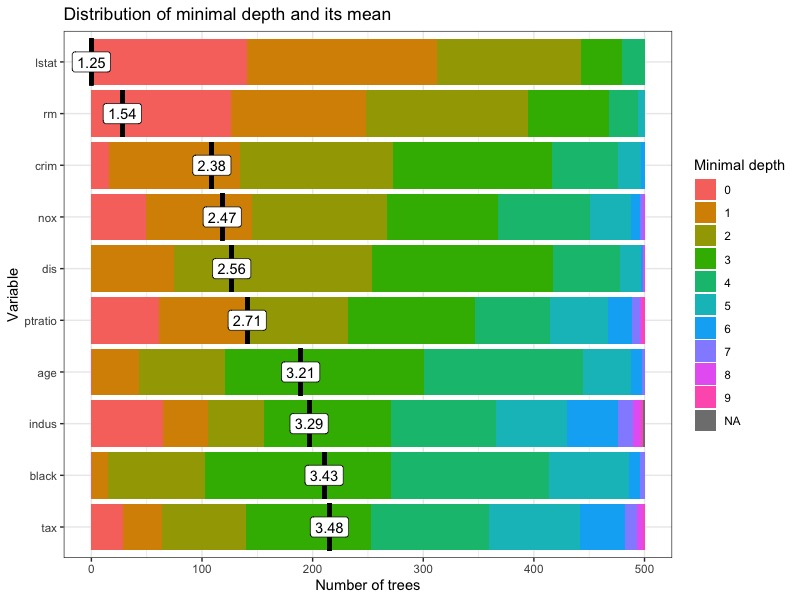

## 随机森林
### 定义与介绍
随机森林（Random Forest）是一种集成学习（Ensemble Learning）中的套袋算法（bagging），具体说来是一种Bootstrap方法。

Bootstrap是一种非参数统计蒙特卡洛方法，原理就是通过抽样来对总体特征进行统计推断。其通过大量的重抽样（Re-sample）来获得大量的新样本，根据大量新样本的方差和协方差来推断出原先样本的均值与标准误等统计量。

那么套袋算法又是什么呢？简单来说就是在原始数据中用Bootstrap抽取指定（n）个训练样本，进行k轮抽取，得到k个相互独立的训练集（如有1000个数据，我们以5个数据作为一个训练集，抽500次）。接着我们利用这k个训练集训练k个模型（模型由具体问题而定，如决策树（*备注，一般是决策树，很多很多决策树组成了森林所以叫随机森林*）或者knn），那么对于分类问题，由投票表决产生分类结果，而对于回归问题，则通过k个模型的结果的均值作为预测结果。

优点：很准，缺点：算是个黑箱。

随机森林在大部分分类问题中的训练速度和精度远大于knn和svm。knn易于实现但是预测缓慢，是惰性学习算法。svm的优势是效果不错且稳定，预测速度快（只需要和支持向量进行比较，支持向量往往很少）。 大部分竞赛中，随机森林比knn和svm用的要多。
[TOC]
### 基于R包的随机森林实现
我们主要通过R包randomForest和它的优化包randomForestExplainer来实现。
来源: [vignettes/randomForestExplainer.Rmd](https://github.com/ModelOriented/randomForestExplainer/blob/master/vignettes/randomForestExplainer.Rmd)
```r
#安装并启动相关包
library(randomForest)
#此包在git上下载
#devtools::install_github("MI2DataLab/randomForestExplainer")
library(randomForestExplainer)
```
在这里用于演示随机森林模型运算的数据来自R包MASS中的Boston数据，这是波士顿郊区的房价数据，其中```crim```为按城镇划分的犯罪率，```zn```为25000尺以上面积的豪宅的比例，```indus```为每个城镇的非零售业务的商业用地比例，```chas```为是否在查理河边，1为在，0为不在，```nox```为氮氧化物浓度，```rm```为每间房屋的平均房间数，```age```1940年前就住在这里的自建房户数的比例，```dis```距离五个就业中心的加权平均数，```rad```公路可达性指数，```tax```每10000美元的增值税率，```ptratio```按城镇划分的教师比例，```black```黑人比例，```lstat```底层人口比例，```medv```房价的中值。
```r
#提取数据
data(Boston, package = "MASS")
#将chas转为逻辑变量，即FALSE和TURE
Boston$chas <- as.logical(Boston$chas)
#显示数据
str(Boston)
```
接下来可以使用randomForest包进行随机森林的拟合
```r
#mtry函数为指定随机森林的训练次数，默认是500
forest <- randomForest(medv ~ ., data = Boston, localImp = TRUE)
forest
#Call:
# randomForest(formula = medv ~ ., data = Boston, localImp = TRUE) 
#               Type of random forest: regression
#                     Number of trees: 500
#No. of variables tried at each split: 4
#
#          Mean of squared residuals: 9.671408
#endregion                    % Var explained: 88.54
```
这就是随机森林模型的简单实现了
### 基于R包的随机森林扩展
#### 随机森林的决策树
决策树是一个递归过程，即通过对变量（节点）进行不断分类，细分出最符合结果的特征。在决策树的基本算法中，有三种情形会导致递归返回：(1)当前的节点所包含的样本全属于同一类别，无需划分；(2)当前属性集为空或是所有样本在所有属性上取值相同，无需划分；(3)当前节点包含的样本集合为空，不能划分。

另外，我们还可以看到决策树学习的关键是算法，即如何选择最优划分属性？一般而言，随着划分过程不断进行，我们希望决策树的分支节点所包含的样本尽可能属于同一类别，即节点的“纯度”越来越高。

变量重要性是通过考虑节点纯度的平均增加程度决定的（该变量导致的分裂）来计算的。哪个变量的分裂导致节点纯度的更大增加在这一指标中显得尤为重要。一般而言第一次分裂通常会导致节点纯度的最大增加因此往往这个变量的重要性最高。而最小深度表示此变量首次用于拆分树的时间是什么。如果是这种情况，则有意义的是，更重要的变量具有较低的最小深度值。导致纯度增加较大的分裂较早发生，因此重要变量会在早期分裂，因此最小深度较低的变量有着更高的重要性。
#### 最小深度分布
函数```plot_min_depth_distribution```用于绘制随机森林的最小深度分布，其在默认设置下根据随机森林使用的顶部树（mean_sample = "top_trees"）计算的平均最小深度来获得前十个变量的最小深度分布图。我们也可以将随机森林的直接传递给绘图函数，但是如果要制作多个深度最小分布图，则将传递```min_depth_frame```给绘图函数更有效，这样就不会为每个绘图再次计算。
```r
#显示决策树的最小深度分布
min_depth_frame <- min_depth_distribution(forest)
save(min_depth_frame, file = "min_depth_frame.rda")
load("min_depth_frame.rda")
head(min_depth_frame, n = 10)
#绘制最小分布图像
#也可以这样：plot_min_depth_distribution(forest)
plot_min_depth_distribution(min_depth_frame)
```

函数 `plot_min_depth_distribution` 计算平均最小深度时，该函数提供了三种可能性，它们的不同之处在于，它们处理在不使用变量在树的分支时出现的缺失值。它们可以描述如下：
- `mean_sample = "relevant_trees" `：这仅考虑存在交互作用的树。
- `mean_sample = "all_trees"` ：relevant_trees存在一个主要问题，即对于仅出现在少量树中的交互，采用条件最小深度的平均值会忽略这种交互并不那么重要的事实。在这种情况下，较小的平均条件最小深度并不意味着交互是重要的。为了解决这个问题，该函数用根变量的最大子树的平均深度替换相关的有交互作用的条件最小深度。基本上，如果我们查看x1：x2的交互作用，则表示对于不存在这种交互作用的树，请为其提供根为x1的最深树的值。这为mean_min_depth交互提供了一个（希望是很大的）数值，以免因为x1:x2的交互作用使其重要性下降。
- `mean_sample = "top_trees"` : 这是的默认选项，它类似于all_trees，但是尝试降低替换缺失值的贡献。原因是当有许多参数但观测不足时，即树的长度比较浅时，all_trees将其拉近mean_min_depth相同的值。为了减少替换缺失值的影响，top_trees仅计算子树n的平均条件最小深度，其中n是存在与指定根的任何交互的树数。
下面我们只查看有交互作用的树产生的结果：
```r
#添加k参数可以控制绘制的最大变量数，mean_scale可以将平均最小深度的值缩放至[0,1]
#main可以调整图的标题，mean_round调整平均最小深度的小数点位数
plot_min_depth_distribution(min_depth_frame, mean_sample = "relevant_trees", k = 15, mean_round = 1, main = "plot", mean_scale = 1)
```

#### 变量重要性
使用```measure_importance```函数获得变量的各种重要性。
```r
importance_frame <- measure_importance(forest)
#储存计算结果，以免以后调动时占用cpu资源
save(importance_frame, file = "importance_frame.rda")
load("importance_frame.rda")
# importance_frame
#    variable mean_min_depth no_of_nodes mse_increase node_purity_increase
# 1       age       3.208000        8934    4.0855711            1134.2629
# 2     black       3.428000        7889    1.4867754             765.1144
# 3      chas       6.428656         789    1.1975552             258.2084
# 4      crim       2.376000        9571    9.2249340            2493.8493
# 5       dis       2.562000        9261    7.9411435            2534.7189
# 6     indus       3.287496        4151    6.2116244            2449.1251
# 7     lstat       1.248000       11331   57.2785166           12817.6106
# 8       nox       2.474000        6069   10.3533262            2879.2618
# 9   ptratio       2.708000        4521    8.2257481            2798.4201
# 10      rad       4.871496        2618    1.6589265             416.1605
# 11       rm       1.538000       11424   32.9913736           11762.1410
# 12      tax       3.478000        4361    4.2818940            1417.1772
# 13       zn       5.973904        1536    0.4787724             292.5830
#    no_of_trees times_a_root       p_value
# 1          500            1 1.078759e-225
# 2          500            1  3.641439e-85
# 3          414            0  1.000000e+00
# 4          500           16  0.000000e+00
# 5          500            0 3.453578e-282
# 6          499           65  1.000000e+00
# 7          500          141  0.000000e+00
# 8          500           49  9.998443e-01
# 9          500           61  1.000000e+00
# 10         499            5  1.000000e+00
# 11         500          126  0.000000e+00
# 12         500           29  1.000000e+00
# 13         476            6  1.000000e+00
```
关于上述数据的解释，其每列均为一个重要性的衡量指标：
1. accuracy_decrease（分类问题中会出现） 变量被排序后的预测准确率的平均下降程度
2. gini_decrease（分类问题中会出现） 变量分裂后节点杂质的平均减少程度
3. mse_increase（回归问题中出现，比如这次）变量被排序后的均方误差（MSE）
4. node_purity_increase（回归问题中出现）变量分裂后节点纯度的平均增加值，以平方和的减少表示
5. mean_minimal_depth 平均最小深度，不谈
6. no_of_trees 变量被排序完成后所使用的决策树的数量
7. no_of_nodes 变量排序后决策树的节点总数（树很浅的时候往往等于树的数量）
8. times_a_root 变量用于拆分根节点所用的树的总数（第一次二分类或者n分类所用的树）（**一般这个就是指重要性值**）
9. p_value 似乎也不用解释？

接下来我们可以绘制重要性指标图：
```r
#也可以用最上面的forest这个最早的随机森林的结果来绘图，是一样的
plot_multi_way_importance(importance_frame, size_measure = "no_of_nodes")
```

显然由图可以得知底层人口数量和住宅的房间数量与房价显著相关，但可以更进一步，看一看树的结构相关的数据与变量的关系
```r
#x/y_measure指定坐标轴类型，size_measure指定颜色，no_of_labels指定显示前5个优秀的变量的名称
plot_multi_way_importance(importance_frame, x_measure = "mse_increase", y_measure = "node_purity_increase", size_measure = "p_value", no_of_labels = 5)
```

#### 选择合适的重要性指标
一般来说，多向重要性图提供了多种可能性，因此很难选择最重要的那一个。克服这一障碍的一个想法是，首先探索不同重要性指标之间的关系，然后选择三个最不一致的指标，并将它们运用到多因素重要性图中，以选择最重要的变量。第一种方法很容易实现，方法是使用下面的`plot_importance_ggpairs`函数将选定的重要性度量成对地绘制出来。当然，我们可以在图中包含所有七个度量值，但默认情况下，p值和树的数量被排除在外，因为它们携带的信息与节点数相似。
```r
#plot_importance_ggpairs(forest)
plot_importance_ggpairs(importance_frame)
```

我们可以看到，所有描述的测量值都是高度相关的（当然，任何测量值与平均最小深度的相关性都是负相关），但是有些测量值比其他测量值低。此外，无论我们比较哪种度量，似乎总有两个点是突出的，而这两个点最有可能对应于`lstat`和`rm`，它们可以是主要的预测因子/重要的影响因子。
#### 变量的交互作用
这里我们可以使用有条件的最小深度来衡量基于交互作用修正后的各个因子之间的最小深度。
在选择了一组最重要的变量之后，我们可以研究它们之间的相互作用，即在最大子树中出现的与所选变量之一相关的分裂。为了根据变量出现的树的平均最小深度和树数，我们提取5个最重要变量，将我们的重要性评价系统传递给函数重要变量。
```r
#(vars <- important_variables(forest, k = 5, measures = c("mean_min_depth", "no_of_trees")))
(vars <- important_variables(importance_frame, k = 5, measures = c("mean_min_depth", "no_of_trees")))
```
结果：`[1] "lstat" "rm"    "crim"  "nox"   "dis"  `
我们将结果和研究出的forest一起传递给`min_depth_interactions`函数，以获得一个东西，其中包含关于变量的每个元素的变量的平均条件最小深度的信息（缺失值与无条件最小深度类似地填充，用`mean_sample`指定的三种方式之一）。如果我们不指定`vars`参数，那么默认情况下，条件变量的向量将使用重要变量`measure_importance（forest）`获得。
```r
#interactions_frame <- min_depth_interactions(forest, vars)
#save(interactions_frame, file = "interactions_frame.rda")
load("interactions_frame.rda")
head(interactions_frame[order(interactions_frame$occurrences, decreasing = TRUE), ])
```
然后，我们将我们的`interactions_frame`传递给绘图函数`plot_min_depth_interactions`，得到以下结果：
```r
# plot_min_depth_interactions(forest)
plot_min_depth_interactions(interactions_frame)
```

交互作用是通过减少出现次数来排序的,即为最频繁的一次，所以lstat和rm有最小平均条件最小深度。值得注意的是，以lstat为根变量，rm在森林中的无条件平均最小深度几乎等于其在最大子树上的最小平均深度。
需要注意的是，使用默认的“top_trees”会惩罚出现频率低于最频繁的交互。所以如果在计算最小深度时设置`mean_sample = "relevant_trees" `会有不一样的结果。
#### 利用随机森林进行预测
预测的话很简单，如下
```r
#仅用于演示，实际上没有testdata
predict(forest, newdata = testdata)
```
但为了进一步研究房价和最相关的两个变量rm与lstat之间的关系，我们使用函数`plot_predict_interaction`来绘制我们的随机森林预测结果图像。该函数需要随机森林本体，训练集与x和y轴所用的变量。在内存不足的情况下，可以使用参数`grid`从默认值100开始减少网格的两个维度中的点数
```r
plot_predict_interaction(forest, Boston, "rm", "lstat")
```

在上面的图中我们可以清楚地看到相互作用的影响：当lstat较低时，预测的中间状态（模糊？）最高，反之则为rm的高低。为了进一步研究交互作用的影响，我们可以在网格上绘制其他频繁的交互作用。
#### 随机森林可视化
可以直接输出上述的所有结果，通过网页的形式：(**非常占用计算资源与内存！！！**)
```r
explain_forest(forest, interactions = TRUE, data = Boston)
```
## 灰色预测
一般适用于一些社会、经济、生态学等让人摸不着头脑的地方，就是一个系统，一个因素，受到很多已知条件的影响，也受到很多未知条件...就可以用灰色预测来进行预测（不知所云中）
接下来是GM11灰色预测的R程序：
来源：[DATAKilimanjaro的CSDN博客](https://blog.csdn.net/qq_38742877/article/details/101700392)
灰色预测的执行
```r
gm <- function(x0,t)	#gm(xO,t)，其中xO是向量，为原始数据，t为表示预测到第几个数据
{
  xl <- cumsum(x0) #读原始数列xO,并用cumsum(xO)累加生成数列文1;步骤1完成
  b <- numeric(length (x0)-1)
  #lengthO计算xO的长度，numericO生成指定长度的0向量，这里生成比xO长度少1的0向量，记作b，实质是向量b的初始化
  n <- length(x0)-1	#向量xO的长度减1，记作n
  for(i in 1:n){	#循环语句i从1到n循环，步进为1
    b[i]<--(xl[i] + xl[i+1])/2
    }#b[i]:向量b的第i个元素
    d <- numeric(length(b)) # 向量 d 初始化
    d[] <- 1#向量d的元素全部赋值1，即单位向量
    B <- cbind(b,d)	#cbind(,)以列方式将向量b和d合并成矩阵B;步骤2中矩阵B生成
    BT <- t(B)	#t(),将矩阵B的转置，记作BT
    M <- solve(BT%*%B)
    #solve(A，b),解方程Ax=b，返回x的值，如果b缺失，则返回A的逆矩阵，这里M是BT * B的逆矩阵* %是乘法运箅符记作BT
    yn<-numeric(length(x0)-1)	# 向量 yn 初始化
    yn<-x0[2:length(x0)] #将原始向量xO除第一个外的其余元素赋与yn步骤2的yn生成
    alpha<-M%*%BT%*%yn #最小二乘法计算微分方程参数,a和u赋予向量alpha
    alpha2<-matrix(alpha, ncol =1)
    a<-alpha2[1]	#提取参数a似乎直接从alpha提也行
    u<-alpha2[2]	#提取参数u步骤3完成
         y<-numeric(length(c(1:t))) # 向量 y 初始化
         y[1]<-x0[1]	#原数列的第一个数值付给y的第一个数值
         for(w in 1:(t-1))
         {
         y[w+1]<-(x0[1]-u/a)*exp(-a*w) + u/a
         }            #建模生成模型计算值完成步骤4

         xy<-numeric(length(y))	#向量xy 初始化
         xy[1]<-y[1] #向量xy的第1个与y的第1个值不变,初始化
         for(o in 2:t)
         {
         xy[o]<-y[o]-y[o-1]
         }	#数据还原xy为还原值。完成步骤5
xy<-round(xy,4)
         m<-length(x0)
         e<-numeric(length(x0)) #残差向量 e 初始化
for(L in 1 :m)
{
  e[L]<-xy[L]-x0[L]
}	#循环语句计算残差向量e
e<-round(e,4)
q<-numeric(length(x0))	#相对误差向量初始化
for(L in 1:m){
    q[L]<-(e[L]/x0[L]) * 100
    }	#循环语句计算相对误差向量q完成步骤6
q<-round(q,4)
se<-sd(e)	#计算残差向量e标准差
sx<-sd(x0)	#计算原数列xO标准差
cv<-se/sx	#计算后验差比值C
#窗口打印后验差比值
pe<-abs(e-mean(e))#小频率误差 P
i<-length(pe)
accumulator=0
for(L in 1:i){
  if (pe[L]<0.6745 * sx) accumulator = accumulator+1
}
pv=accumulator/i #小频率误差P，完成步骤7
if((pv>0.95)&(cv<0.35)) d<-c("predictions is Good")
else if((pv>0.8)&(cv<0.4)) d<-c("predictions is Qualified")
else if((pv>0.7)&(cv<0.45)) d<-c("predictions is Reluctantly")
else d<-c("predictions is not good")
list(model=paste("a=",round(a,4),"u=",round(u,4)),original.data=x0,
      lAGO.predictions=y,predict.values=xy,Residuals=e,relative.error=q,C=cv,P=pv,test.re=d)
 }
```
绘图函数
```r
plot.gm<-function(list,start=1,frequency=0)#plot.gm(上面的结果)
{
m1<-list
x0<-m1$original.data
xy<-m1$predict.values
lonx0<-length(x0)
lonxy<-length(xy)
mx<-max(max(xy),max(x0))
mn<-min(min(xy),min(x0))
one<-(mx-mn)/25
if((start&TRUE)&(frequency&TRUE)){
  x1<-seq(start,start+(lonxy-1)*frequency,frequency)
  x2<-seq(start,start+(lonx0-1)*frequency,frequency)
  plot(x1,xy,col='blue',type='b',pch= 16,xlab='Time series',ylab='Values',ylim = c(mn-one,mx+one))
  points(x2,x0,col='red',type='b',pch=18)
  legend(locator(1),c('Predictions','Raw data'),pch = c(16,18),lty=1,col = c('blue','red'))}
  else if((start&T)&(frequency==F)){
    frequency<-1
    x1<-seq(start,start+(lonxy-1)*frequency,frequency)
    x2<-seq(start,start+(lonx0-1)*frequency,frequency)
    plot(x1,xy,col='blue',type='b',pch= 16,xlab='Time series',ylab='Values',ylim = c(mn-one,mx+one))
    points(x2,x0,col='red',type='b',pch=18)
    legend(locator(1),c('Predictions','Raw data'),pch = c(16,18),lty=1,col = c('blue','red'))
  }
  else{plot(xy,col='blue',type='b',pch= 16,xlab='Time series',ylab='Values',ylim = c(mn-one,mx+one))
    points(x0,col='red',type='b',pch=18)
    legend(locator(1),inset = 0.5,c('Predictions','Raw data'),pch = c(16,18),lty=1,col = c('blue','red')) }

}
```
结果输出为excel
```r
putout.gm<-function(list,file="")
{
  m1<-list
  x0<-m1$original.data
  xy<-m1$predict.values
  e<-m1$Residuals
  q<-m1$relative.error
  t<-length(xy)
original.data<-numeric(t) # 结果输出阶段
original.data[]<-'NA'#全缺失值填充向量
original.data[1:length(x0)]<-x0	#原数据填充向量前端，[length(x0)5 t]的元素值缺失
predict.values<-round(xy,4)
Residuals<-numeric(t)
Residuals[]<-'NA'
Residuals[1:length(e)]<-round(e,4)	# 误差数据填充向量前端，[length(x0)： t]的元素值缺失
Relative.error<-numeric(t)
Relative.error[]<-'NA'
Relative.error[1:length(e)]<- round(q,4)#相对误差数据填充向量前端，[length(xO) : t]的元素值缺失
result<-cbind(original.data,predict.values,Residuals,Relative.error)#合并输出原数据、预测值、残差、相对误差
colnames(result)<-c("原始数据","预测值","残差","相对误差")

if(file == ""){
  wd<-getwd()
  wd2<-paste(wd,"result.csv",sep="/")
  print(wd2)
  write.table(result,file=wd2,sep=",",row.names = F)
  }
else{
  write.table(result,file=file,sep=",",row.names = F)
  print(file)
}
}
```