# R与数据处理与可视化
## 前言
开始写人生第一篇sci的时候才发现其实科研的最大问题就是如何分析数据，和将分析结果呈现出来，本章的目标就是将学习中遇到的数据可视化方案记录下来
[TOC]
## 绘图制表与ggplot2
ggplot2是R中最高效的绘图工具，在ggplot2中，我们的数据集必须得是data.frame格式，这种格式易于保存数据，而且能在保留原有的绘图参数下, 用%+%方便地变更已有数据集。ggplot2由数据与映射、几何对象(geom)、统计变化(stats)、标度、坐标系(coord)和分面(facet)这几个部分构成。在实际操作中，我们通过”+”将这些功能以图层的形式连接在一起。
我们对数据进行绘图，使用`df = ggplot(data, aes(x,y))`即可以得到一个数据源于data，横坐标为x，纵坐标为y的**图框**（只是一个框）
我们通过`+ geom_point()`的方式给框里添加一个散点图进去，散点的透明度可以用alpha函数去指导（0< alpha <1)，而我们还可以通过`position = position_`对图形元素进行调整:（在[从lm()开始进行简单线性回归](#%e4%bb%8elm%e5%bc%80%e5%a7%8b%e8%bf%9b%e8%a1%8c%e7%ae%80%e5%8d%95%e7%ba%bf%e6%80%a7%e5%9b%9e%e5%bd%92)中的的第一张图里我们会用到这个）
dodge为避免重叠，并排放置；fill为堆叠图形元素并将高度标准为1（标准化），position为描述；identity为不做变化；jitter为对点添加扰动以免重合（不知道这样会不会对数据的严谨性造成影响），stack为将图形元素堆叠
### data.frame
一般翻译为数据框，就是R语言中的表，由行和列组成，与Matrix不同的是，其每个列可以是不同的数据类型。
我们可以使用data.frame函数初始化一个Data Frame（听起来有点像SQL语言）
```r {class=line-numbers}
#这里的c()是将括号中的元素连接起来，但不创建向量，而`paste()`则会创建向量。
#我们就会得到一个列名为ID、Name、Gender的表格
student<-data.frame(ID=c(1,2,),Name=c("Eden","Edward"),Gender=c("M","M"))
#我们可以访问里面的元素，比如我们想看第二列：
student[,2]
#那要看其中几列，我们可以（注意是：）：
idname<-student[1:2]
#也可以是
idname<-student[c("ID","Name")]
```
那么其实还是得装一个“sqldf”包，然后就可以用SQL语言去查询了，属实方便：
```r
library(sqldf)
result<-sqldf(“select XX from XX")
```  
那么接下来我们去生成这样的一个数据框来熟悉一下：
```r {class=line-numbers}
#生成一个数据框，其中列x为1-8和1-8（共16个数），列y为使用runif()函数生成的16个服从正态分布的随机数。runif(n,min=0,max=1)意为生成一个数量为n，分布下限为0，上限为1的正态分布的数。
#我们将group1定义为一个循环2次（rep(x,n)为将x循环n次）的一组数
#这组数通过gl()函数定义为了2级因子，重复4次，水平为a和b的两组数。
d <-data.frame(x = c(1:8, 1:8), y = runif(16),
  group1 = rep(gl(2, 4, labels = c("a", "b")), 2)
  group2 = gl(2,8))
head(d)
```
我们使用ggplot2可以将它们画出来，我们使用`facet_grid()`函数将表格按group分面并且group显示在表头:
```r
ggplot(data = d, aes(x = x, y = y, colour = group1)) + geom_point() +
  facet_grid(~group2)
```
可得：
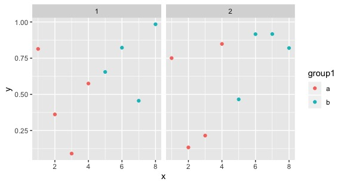
利用随机数我们可以验证许多数学方法！如[模拟正态随机变量并用于kmeans聚类](#kmeans%e8%81%9a%e7%b1%bb)。
接下来我们使用加拉帕戈斯雀的数据进行练习……这个数据大概要一直用到博客更完，数据来源在<http://bioquest.org/birdd/morph.php>。这是Sato等在2000于Mol. Biol. Evol.上发的文章中的数据 <http://mbe.oxfordjournals.org/content/18/3/299.full>。
```r {class=line-numbers}
#我们通过stringsAsFactors = FALSE来避免R将字符串string的列当成变量/因子factor去瞎搞
morph <- read.csv("data/raw/Morph_for_Sato.csv", stringsAsFactors = FALSE)
#tolower()函数将字母全变成小写，toupper()则相反
names(morph) <- tolower(names(morph))
#通过filter(.data=,condition_1,condition_2)来根据condition进行数据的筛选，我们筛选出“Flor_Chrl"岛的数据
morph <- filter(morph, islandid == "Flor_Chrl")
#选择我们用来分析作图的数据
morph <- select(morph, taxonorig, sex, wingl, beakh, ubeakl)
#重命名列
morph <- rename(morph, taxon = taxonorig)
#使用na.omit删去所有的na行，即删去所有数据缺失的行
morph <- data.frame(na.omit(morph)) # remove all rows with any NAs to make this simple
#把morph作为一个data.frame，但此时R会说”`as_data_frame()` is deprecated, use `as_tibble()` (but mind the new semantics).“，那就用as_tibble()？？？，但是tibble不能使用glimpse()工具……
morph <- as_data_frame(morph)
#使用set.seed()函数保证我们设置的随机数每次都一样，此时()内的数只是一个标记，对结果没有影响
set.seed(1)
#使用sample(x=x,size=n,replace=T)来对数据集x进行有放回的n次抽样
#使用seq(from,to,lenth),来对生成一组从什么到什么间隔什么的数，而seq_len(nrow(morph))即为从morph的行数中生成一个从1开始，步长为1的向量/也可以说是从1开始步长为1的一列数去对应morph的各行
那么我们要从morph列的各行中随机挑选200个数据作为morph的数据集
morph <- morph[base::sample(seq_len(nrow(morph)), 200), ]
morph
#使用glimpse功能转置数据以便更好地研究变量
glimpse(morph)
##这是原效果
# taxon                   sex   wingl beakh ubeakl
#   <chr>                   <chr> <dbl> <dbl>  <dbl>
# 1 Geospiza scandens       M        66   9.2   18.7
# 2 Camarhynchus pauper     M        67   8.5   14  
# 3 Geospiza fuliginosa     M        59   8.1   13  
# 4 Geospiza fuliginosa     M        66   8.4   13  
# 5 Geospiza fortis         M        71  13.3   18  
# 6 Geospiza fortis         M        70  12.3   15.8
# 7 Camarhynchus psittacula M        70  11.1   14.2
# 8 Geospiza fortis         M        75  15.4   19.4
# 9 Geospiza fuliginosa     F        64   8     11.9
#10 Geospiza fortis         M        72  12.6   16.2
##这是glimpse后的效果：
#Observations: 200
#Variables: 5
#$ taxon  <chr> "Geospiza scandens", "Camarhynchus #pauper", "Geospiza …
#$ sex    <chr> "M", "M", "M", "M", "M", "M", "M", "M", #"F", "M", "M",…
#$ wingl  <dbl> 66, 67, 59, 66, 71, 70, 70, 75, 64, 72, #61, 70, 62, 64…
#$ beakh  <dbl> 9.2, 8.5, 8.1, 8.4, 13.3, 12.3, 11.1, #15.4, 8.0, 12.6,…
#$ ubeakl <dbl> 18.7, 14.0, 13.0, 13.0, 18.0, 15.8, 14.2,# 19.4, 11.9, …
```
### 几何对象(geom)
几何对象就是图标中的点线面，geom有以下这些功能：
```
`geom`              | Description
------------------- | -----------
`geom_point()`      | Points
`geom_line()`       | Lines
`geom_ribbon()`     | 可以指定函数的上下边界，geom_ribbon(aes(ymin = a+b, ymax=a-b)) + geom_line来做一个关于a在直线上活动范围（往往是置信区间）的图表
`geom_polygon()`    | 绘制多边形
`geom_pointrange()` | 中间有点的线状图？
`geom_linerange()`  | 一种用三条直线来表示的箱形图？
`geom_path()`       | 高级的geom_line，但是不限制画线的方向
`geom_histogram()`  | 直方图
`geom_text()`       | 将文本和数值插入到图中，比如给散点图每个点做注释，我们可以使用(check_overlap = TRUE)来让所有的注释不重叠。
`geom_label()`      | 高级的geom_text()，可以给注释文字加个框
`geom_violin()`     | Violin plot (another name for a beanplot)，beanplot是高级的小提琴图，有个包可以去研究研究
`geom_map()`        | 画地图，然而我用ArcGIS，不谈
`geom_bar()`        | 柱状图
```
我们来应用一下：
```r
#考察翅膀长度和性别之间的关系
ggplot(morph, aes(sex, wingl)) +
  geom_violin()
```
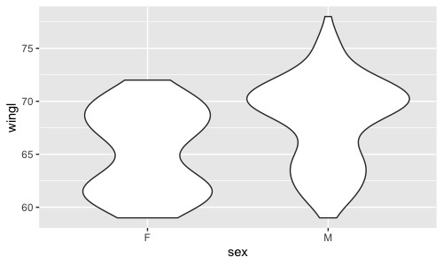
```
#r通过箱型图翅膀长度和物种间的关系，箱型图中的小点为异常值
ggplot(morph, aes(taxon, wingl)) + geom_boxplot()
```
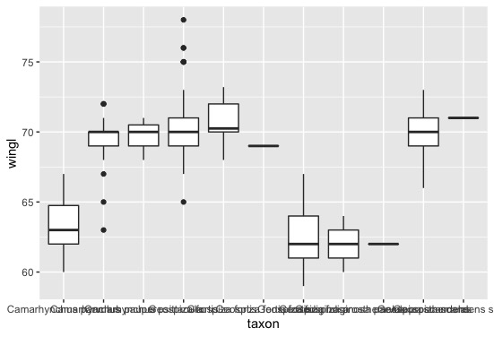
结果发现下面的物种名字我们都看不见了……
因此我们使用`coord()`来设置坐标系，就非常好了
```r
ggplot(morph, aes(taxon, wingl)) + geom_boxplot() + coord_flip()
```
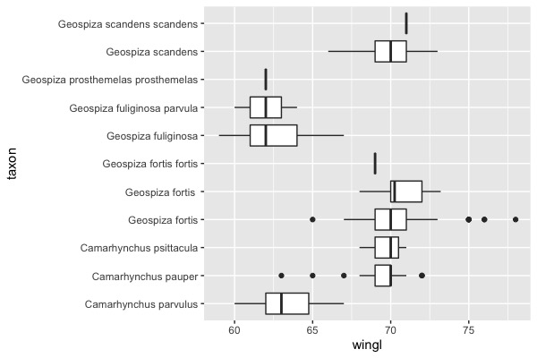
我们可以在geom_boxplot(aes(fill = ...))中设置箱子的颜色，这样我们就可以按supp（变量）去设置颜色。
我们也可以使用position = position_dodge()来调整箱型图之间的距离。
### ggplot2的美学(Aesthetics)
我们可以对图表进行各种美学上的设置，这些设置往往会自动附加一个图例：
```r
ggplot(morph, aes(wingl, beakh)) +
  geom_point(aes(colour = sex))
```
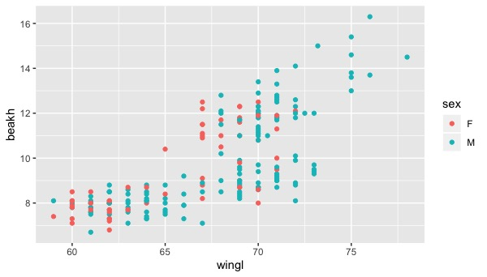
我们还可以通过图例里再加一个别的数据，如上喙长(ubeakl)，实现表格数据的套娃：
```r
ggplot(morph, aes(wingl, beakh)) +
  geom_point(aes(size = ubeakl))
```
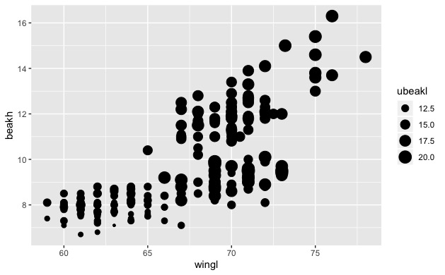
这样可能太丑了，我们需要换一种方式来表达：
```r
ggplot(morph, aes(wingl, beakh)) +
geom_point(aes(colour = ubeakl))
```
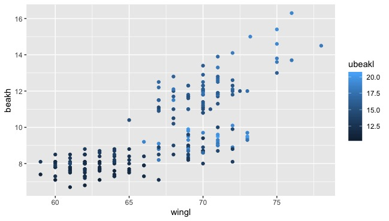
那我们可以把这些参数都加入，制作一张终极套娃：
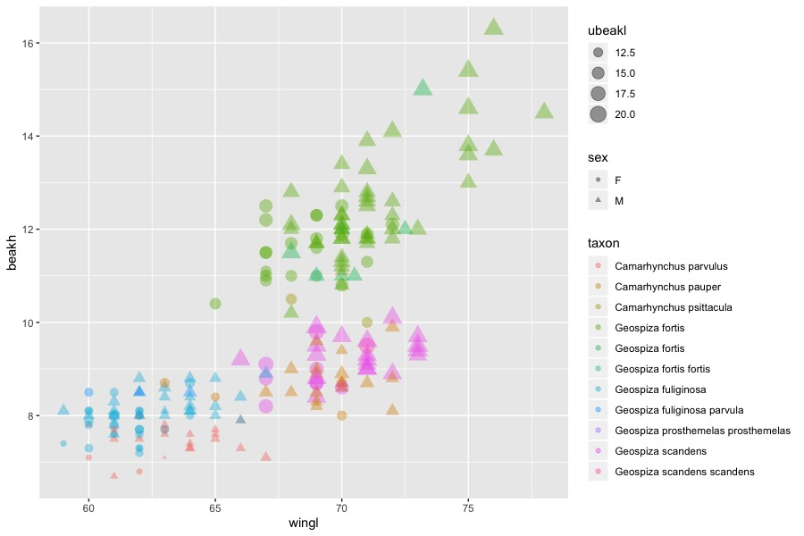
我们要分类出图的话需要使用facet函数：其中warp是对一个因子分类，而grid是对多个因子：
```r
facet_wrap(facets, nrow = NULL, ncol = NULL, scales = "fixed", shrink = TRUE, as.table = TRUE, drop = TRUE)
#nrow,ncol为设置的行和列，scales为坐标轴刻度，其中参数fixed表示固定坐标轴刻度，而free表示反馈坐标轴刻度；shrink也和坐标轴刻度有关，如果为TRUE（默认值）则按统计后的数据调整刻度范围
#drop表示是否去掉没有数据的分组，默认情况下不显示，逻辑值为FALSE；as.table为和小图排列顺序有关的选项；space表示分面空间是否可以按照数据进行缩放，和scales一样
facet_grid(facets, margins = FALSE, scales = "fixed", space = "fixed", shrink = TRUE, labeller = "label_value", as.table = TRUE, drop = TRUE)
```
如：
```r
ggplot(morph, aes(wingl, beakh)) + geom_point() +
  facet_wrap(~taxon, scales = "free")
```
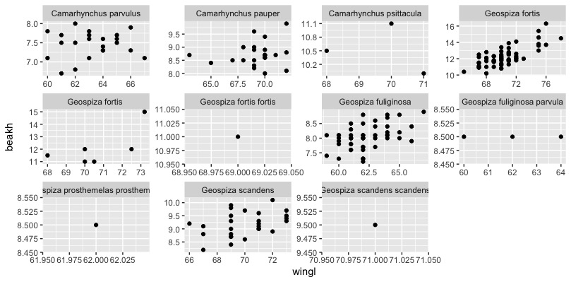
或：
```r
ggplot(morph, aes(wingl, beakh)) + geom_point() +
  facet_grid(sex~taxon)
```
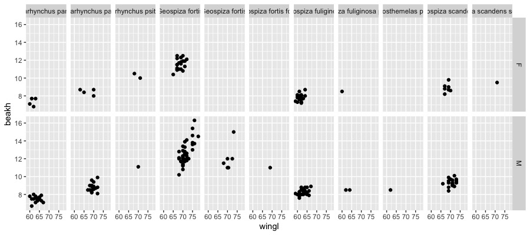
接下来我们制作pointrange图？其实不知道有啥用……
准备数据并绘图：
```r {class=line-numbers}
morph_quant <- morph %>%
#quantile()是取百分位的函数，[[1]]似乎是一个引用函数？
  group_by(taxon) %>%
  summarise(
  l = quantile(wingl, 0.25)[[1]],
  m = median(wingl),
  u = quantile(wingl, 0.75)[[1]]) %>%
#创造一个新列方便处理
  mutate(taxon = reorder(taxon, m, function(x) x))
ggplot(morph_quant, aes(x = taxon, y = m, ymin = l, ymax = u)) +
  ylab("Wing length") + xlab("") +
  geom_pointrange() +
  coord_flip()
```
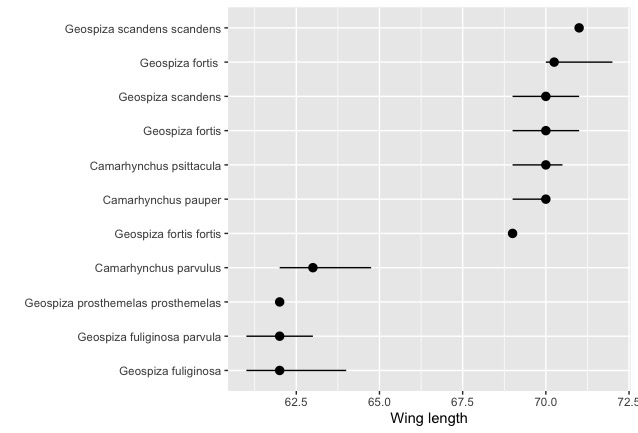

### 给ggplot添加P统计值
可以通过`stat_compare_means`函数给ggplot图像添加P值。该函数的表达式为：
```r
stat_compare_means(mapping = NULL, data = NULL, method = NULL, paired = FALSE, ref.group = NULL, comparisons = NULL, hide.ns = FALSE, label.sep = ", ", label = NULL, label.x.npc = "left", label.y.npc = "top", label.x = NULL, label.y = NULL, geom = "text", position = "identity", na.rm = FALSE, show.legend = NA, inherit.aes = TRUE, ...)
```
一般来说我们通过“+”将这个图层附在我们的ggplot图层后，我们只需要使用：
```r
stat_compare_means(method = NULL, ref.group = NULL, comparisons = NULL, label = NULL)
```
其中，method为我们进行统计时采用的方法，默认是Kruskal-Wallis，也可以设置为anova、t-test之类的，而comparisons是用来设置组间比较的并显示的函数，label函数则是选择怎样的显著性标记，而label.y可以调整添加的p值标志的高度。
### R语言中的颜色
可以通过定义col参数自定义颜色，在r语言中可以使用`col=c()`来设定颜色填充，通过输入数字2(palette的第一种颜色)，或“red”这种英文，或rgb(1,0,0)这种rgb值或“#FF0000”这种rgb的代码表示来确定我们实际填充的颜色。
而通过`palette()`函数我们可以设置我们的调色板。
还可以使用RcolorBrewer包的`brewer.pal()`函数来填充颜色，包中颜色被分为了序列型(sequential)(display.brewer.all(type = "seq"))和分类型(qualitative)(`display.brewer.all(type = "qual"`)和离散型(diverging)(`display.brewer.all(type = "div"`)
在ggplot中，`scale_fill_brewer()`函数控制着图表的颜色变化，我们可以使用`scale_fill_brewer(palette ="")`来调节颜色，而颜色模板的名字则可以通过在包RColorBrewer中 - 运行 `display.brewer.all()`查看。
## 数据整理与dplyr
dplyr包可以处理r语言内部或外部的一切结构化数据，它高效、快速、简洁，专注于dataframe对象，有着稳健的数据库接口，是学习r语言必备的数据简化工具。
一般而言我们在使用dplyr时会用到5个常用的函数：**select**为选择数据，**filter**为筛选数据，**arrange**为排序数据，**mutate**为列的修改，**summarise**为汇总整理。
可以下载<http://esapubs.org/archive/ecol/E090/184/>的PanTHERIA数据库获得关于物种和环境的数据作为dplyr操作的练手工具。
```r
pantheria <-
  "http://esapubs.org/archive/ecol/E090/184/PanTHERIA_1-0_WR05_Aug2008.txt"
download.file(pantheria, destfile = "data/raw/mammals.txt")
```
接下来加载dplyr包并对数据进行简化并查看：
```r {class=line-numbers}
mammals <- readr::read_tsv("data/raw/mammals.txt")
#使用sub和gsub函数进行替换，sub()和gsub()的区别在于，前者只替换第一次匹配的字串（请注意输出结果中world的首字母），而后者会替换掉所有匹配的字串。
#将表中的0-9_(如05_这种)都删了，这种表达式为正则表达式
names(mammals) <- sub("[0-9._-]+", "", names(mammals))
#将表中的MSW给删了
names(mammals) <- sub("MSW", "", names(mammals))
mammals <- select(mammals, Order, Binomial, AdultBodyMass_g, AdultHeadBodyLen_mm, HomeRange_km2, LitterSize)
#把所有大写字母变成小写并在前面加上“_”
names(mammals) <- gsub("([A-Z])", "_\\L\\1", names(mammals), perl = TRUE)
#把词首的“_”删去
names(mammals) <- gsub("^_", "", names(mammals), perl = TRUE)
#把表格中的-999换成空值
mammals[mammals == -999] <- NA
#将binomial替换为species
names(mammals)[names(mammals) == "binomial"] <- "species"
#变成数据框格式并打开
mammals <- as_data_frame(mammals)
mammals
```
接下来横过来看看数据：
```r
glimpse(mammals)
#Observations: 5,416
#Variables: 6
#$ order                  <chr> "Artiodactyla", "Carnivora", "Carnivora", "Carnivora", "Carnivora", "Artioda…
#$ species                <chr> "Camelus dromedarius", "Canis adustus", "Canis aureus", "Canis latrans", "Ca…
#$ adult_body_mass_g      <dbl> 492714.47, 10392.49, 9658.70, 11989.10, 31756.51, 800143.05, 500000.00, 6359…
#$ adult_head_body_len_mm <dbl> NA, 745.32, 827.53, 872.39, 1055.00, 2700.00, NA, 2075.00, 354.99, NA, NA, N…
#$ home_range_km2         <dbl> 1.963200e+02, 1.010000e+00, 2.950000e+00, 1.888000e+01, 1.598600e+02, NA, NA…
#$ litter_size            <dbl> 0.98, 4.50, 3.74, 5.72, 4.98, 1.22, 1.00, 1.22, 1.01, NA, 1.02, 1.02, 1.02, …
```
使用select函数可以选取我们需要的数据：
```r
#select(.data,...)来选取我们想要的信息
#可以根据列名选取
select(mammals, adult_head_body_len_mm, litter_size)
#可以选取某列到某列
select(mammals, adult_head_body_len_mm: litter_size)
#可以选取除了某列的其他列
select(mammals, -adult_head_body_len_mm)
#也可以在select()中插入函数，如starts_with()可以按首字母(或首更多字母)来查找变量，而ends_with()则正相反，而contains()函数则对查找的位置没有限制，同时我们也可以按列号的数字来查找我们要的变量。
```
Filter函数可以方便地筛选数据（行数据）：
```r
#筛选adult_body_mass_g行中数据大于1*10^7的行，而要筛选等于的数据用“==”来表示全等
filter(mammals, adult_body_mass_g > 1e7)
#筛选科为Cetacea的且成体生物量小于200的行数据，我们用逗号“,”表示和，用竖线“|”表示或。我们也可以用is.xxx()来指定行为xxx
filter(mammals, order == "Carnivora", adult_body_mass_g < 200)
```
arrange函数可以排序，默认从小到大，我们也可以通过desc()来设置成从大到小排序。同样地，我们可以使用group_by()函数进行分组
```r
#对数据mammals，我们先按order排序，再按adult_body_mass_g从大到小排序
> arrange(mammals, order, desc(adult_body_mass_g))
```
Mutate函数可以调整列：
```r
#给mutate表增加一个新列
glimpse(mutate(mammals, adult_body_mass_kg = adult_body_mass_g / 1000))
```
summarise函数可以进行一些总结性的工作：
```r
#按科分类后计算平均质量，同时使用rm函数将na缺失值删除
head(summarise(group_by(mammals, order),
  mean_mass = mean(adult_body_mass_g, na.rm = TRUE)))
```
基于这些内容，我们可以通过函数嵌套的方式创建一个质量与长度之间的关系数据（在程序语言中我们通过缩进来表示函数的关系，相同缩进的都在一起）：
```r
select(
  arrange(
    mutate(mammals,
      mass_to_length = adult_body_mass_g / adult_head_body_len_mm),
    desc(mass_to_length)),
  species, mass_to_length)
```
dplyr部分暂时完结。
## ggtree与系统发育树
[G Yu的教程无敌](https://yulab-smu.github.io/treedata-book/)
ggtree是结合了ggplot2绘图功能的用来处理基于treeio所得的系统发育数据的一个程序包。
### 材料与方法

### 结果

### 讨论

## 输出图片
如果有RStudio，那么我们在图片的边上选择Export，格式的话也许可以选择EPS，这样我们可以在Adobe illustrator中打开并编辑。同时我们还可以使用“export”包进行导出，这里我们可以自定义图像的质量等参数：
```r
library(export)
filen <- tempfile(pattern = "ggplot")
graph2tif(x=x, file = filen, dpi = 400, height = 5)
```
## MuMIn包
对回归模型进行模型比较必不可少的包
[MuMIn包教程翻译](./MuMIn.html)