# 深度学习
## 前言
R语言上与深度学习相关的原生程序包很少，大多其实是基于Python的二道贩子包。但是也勉强够用了，这里就简单介绍一些深度学习与图像识别的相关思路与方法
[TOC]
我们需要安装相关程序包和程序：
```r
#安装程序包
install.packages("keras")
#安装相关组件
#for mac
keras::install_keras(method = "conda")
#for win/win
keras::install_keras()
#看看安装是否成功，ture才行
keras::is_keras_available()
#如果不成功再试试安装这些
reticulate::py_config()
tensorflow::tf_config()
```
## 简单的神经网络预测
在运行一个简单的神经网络前需要加载这些包与数据
```r
library(cowplot)
library(keras)
library(dplyr)
library(tensorflow)
library(ggplot2)
#从美国国家标准与技术研究院数据库（NMIST）获取手写数字图像数据
mnist = dataset_mnist()
#看看这些数据的结构
str(mnist)
#设置测试集与训练集
x_train = mnist$train$x
y_train = mnist$train$y
x_test = mnist$test$x
y_test = mnist$test$y
#并查看他们的结构
```
`array_reshape`函数允许我们将三维数组（如在mnist数据集中找到的三维数组）整形为矩阵。我们的28x28像素图像将变成具有长度的数组/向量28*28=784。
```r
#L表示整数
height = 28L
width = 28L
#转为矩阵
x_train = array_reshape(x_train, c(nrow(x_train), height * width))
x_test = array_reshape(x_test, c(nrow(x_test), height * width))
#我们看看结构，可以发现这些已经不是二维数据了
str(x_train)
str(x_test)
summary(x_train[, 500:550])
#查看数据，可以注意到每个像素变成了介于0（色谱的黑端）到255（色谱的白端）之间的像素值
x_train[1, ]
#将数据缩放至0-1之间
x_train = x_train / 255
x_test = x_test / 255
summary(x_train[, 500:520])
#通过找到每个像素列的最大值，然后取该向量的最大值来明确地确认它。
max(apply(x_train, MARGIN = 2, max))
#最大值都是1
```
现在我们可以定义模型了。我们要建立一个顺序的层堆栈。该`units`参数定义了我们在每个层中应该有多少个节点（神经元）。`input_shape`允许我们在初始输入层中定义图像尺寸。该`activation`参数允许我们传入激活函数的名称作为参数。
```r
model = keras_model_sequential() 
model %>%  
#输入层加一层隐藏层的结构
#layer_dense可以增加隐藏层.
#input_shape参数实际指定输入层；“units=”and“activation=”定义第一个隐藏层。
#或者我们在layer_dense()前有一个单独的layer_input().
layer_dense(units = 64, activation = 'relu', input_shape = 784) %>% 
  layer_dropout(rate = 0.4) %>% 
# 第二层隐藏层
layer_dense(units = 16, activation = 'relu') %>%
  layer_dropout(rate = 0.3) %>%
#输出层
layer_dense(units = 10, activation = 'softmax')
summary(model)
```
我们使用`sparse_categorical_crossentropy`作为损失函数，因为我们要处理多个分类（即分类变量），而使用`optimizer_rmsprop()`作为优化器，因为它的性能可能比带动量的梯度下降要好一些。什么是`lr`参数呢？我们还选择“accuracy”作为我们的指标，以便为结果产生简单的分类率。
```r
model %>% compile(
  loss = 'sparse_categorical_crossentropy',
  # loss = "mean_squared_error",
  optimizer = optimizer_rmsprop(lr = 0.001),
  metrics = c('accuracy')
)
```
### 训练与评估
现在我们可以使用训练模型了`fit`，在这里，我们只需传递X和Y变量以及其他超参数即可。
观看模型构建时代。一个时期（epoch）是所有训练数据的一次迭代，此处通过批处理128个观测值来完成。
```r
(history = model %>% fit(
  x_train, y_train, 
  epochs = 45, batch_size = 128, 
  validation_split = 0.2
))
```
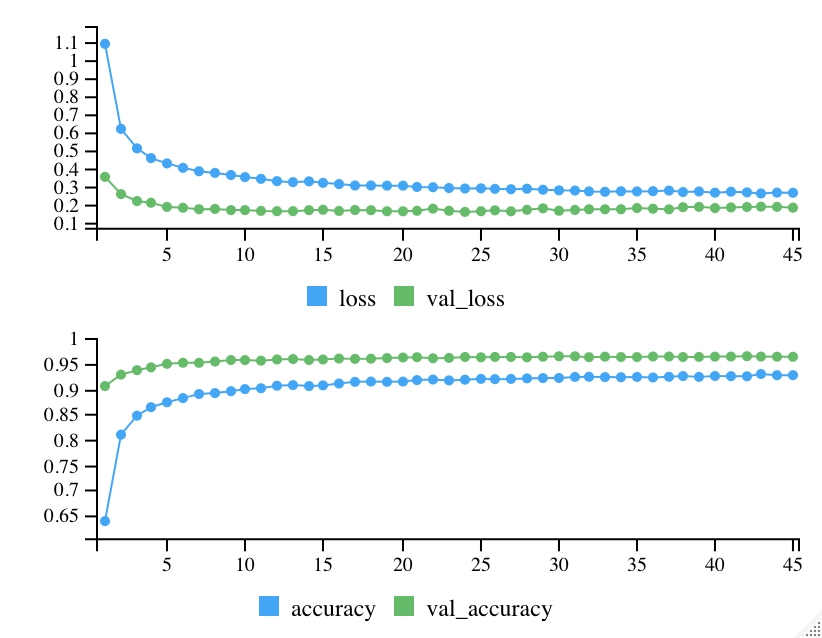
如何解释这些参数呢：
loss：损失是每批训练数据中平均损失的平均值。我们希望早期批次的损失高于晚期批次的损失，因为模型应该随着时间的推移而不断学习。我们希望以后的数据损失更少。
acc：训练的准确性
val_loss和val_acc是测试数据的损失和准确性。
可以通过ggplot绘制训练历史：
```r
plot(history) + theme_minimal()
#ggsave()来保存
```
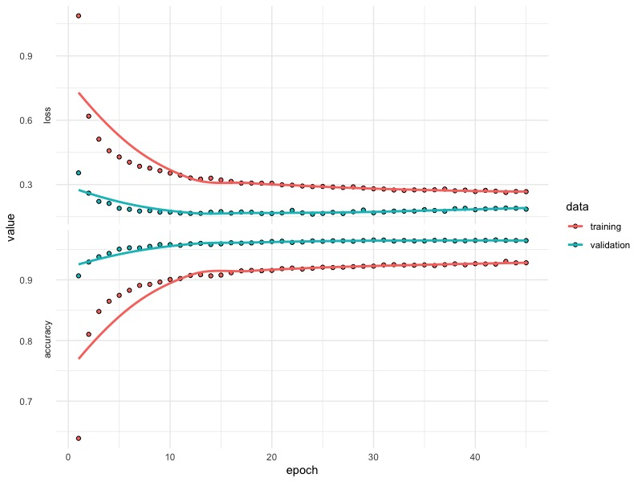
评估测试数据的性能：
```r
model %>% evaluate(x_test, y_test)
#结果非常好
#313/313 [==============================] - 0s 1ms/step - loss: 0.1895 - accuracy: 0.9634
#     loss  accuracy 
#0.1894975 0.9634000 
#对测试数据生成预测，无需显式评估。
preds = model %>% predict(x_test)
dim(preds)
head(round(preds, 4))
glimpse(preds)
```
## 复杂一点的简单神经网络
```r
setwd("your way")
#为测试集和训练集指定文件路径
train_path = "data-raw/dog-human/TRAIN"
val_path = "data-raw/dog-human/VAL"
#再定义两个变量作为文件的实际名称
train_images = list.files(train_path, full.names = TRUE, recursive = TRUE)
val_images = list.files(val_path, full.names = TRUE, recursive = TRUE)
#我们有600个训练集图像和100个验证集图像
length(train_images)
length(val_images)
#查看图像
train_images[1]
val_images[1]
#绘制图像
library(cowplot)
ggdraw() + draw_image(train_images[20])
ggdraw() + draw_image(val_images[1])
```
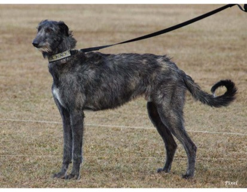
训练集的狗狗

测试集的狗狗
### 定义模型
我们想在模型之外定义一些特征。这样，我们可以每次都传递相同的变量而不是值。
```r
#预期的图像宽度和高度为96像素。
img_width = img_height = 96L
#每次迭代要分析的观察数。
batch_size = 100L
#训练集数量(600)。
(num_train_samples = length(list.files(train_path, recursive = TRUE)))
#验证集数量。
num_validation_samples = 100L
#完全通过训练数据的次数。
epochs = 30L
```
我们可以使用`image_data_generator`执行数据扩充，但是，我们将仅使用单独的`rescale`参数将数据缩放到一堆二进制矩阵-每个数字代表深色或浅色像素。
```r
#训练集
train_datagen = keras::image_data_generator(rescale = 1/255)
#验证集
val_datagen = keras::image_data_generator(rescale = 1/255)
train_datagen
```
在定义模型之前，我们还需要向keras提供更多关于图像属性的细节。我们将在`train_datagen`和`val_datagen`上使用`flow_from_directory`方法来定义新变量。
```r
#配置培训模型
#指定训练图像的文件路径与图像性状与批量（batch）大小
#class_mode为分类模板，binary就是二元（人/狗）颜色配置为灰度图像
train_gen = train_datagen$flow_from_directory(train_path, target_size = c(img_width, img_height), batch_size = batch_size, class_mode = "binary", color_mode = "grayscale")
#配置验证模型
val_gen = val_datagen$flow_from_directory(val_path, target_size = c(img_width, img_height), batch_size = batch_size, class_mode = "binary", color_mode = "grayscale")
```
### 定义模型
```r
# %>%与magrittr函数来自这里
library(dplyr)
#负责关于神经网络的layer_flatten, layer_dense, layer_dropout等等指令
library(keras)
model = keras::keras_model_sequential()
model %>%
#输入层
#layer_flatten将把我们的三维阵列变成一维阵列
#Note: 在第1部分中，我们没有必要这样做，因为数据已经变平了
layer_flatten(input_shape = c(img_width, img_height, 1)) %>%
#隐藏层
#layer_dense允许我们实际添加输入层。我们指定了哪些参数？
layer_dense(units = 96, activation = 'relu', input_shape = c(img_width, img_height)) %>%
#layer_dropout允许我们对模型应用正则化。
layer_dropout(rate = 0.4) %>%
#隐藏层
layer_dense(units = 192, activation = 'relu') %>%
layer_dropout(rate = 0.3) %>%
#输出层
#在这里，我们可以将我们的激活改为一个二元结果的sigmoid函数?
layer_dense(units = 1, activation = 'sigmoid')
summary(model)
```
### 输出并评估
我们可以使用通用`compile`函数来指定损失和优化器函数以及分类指标。
```r
model %>% compile(
#看看是狗是人
loss = 'binary_crossentropy',
#把学习速度放慢一点。。。
optimizer = optimizer_adam(lr = 0.000001), 
#如何评估模型性能
metrics = c('accuracy')
)
```
训练模型：
注意，这次我们必须使用`fit_generator`拟合模型，因为我们还使用了自定义`flow_from_directory`函数，而不是之前的简单格式。
```r
batch_size = 100
#会有警告WARNING:tensorflow:Your input ran out of data; interrupting training. Make sure that your dataset or generator can generate at least `steps_per_epoch * epochs` batches (in this case, 10 batches). You may need to use the repeat() function when building your dataset.
#batch_size = 10
num_validation_samples

history = model %>%
  fit_generator(train_gen,
                steps_per_epoch = as.integer(num_train_samples / batch_size),
                epochs = epochs,
                #epochs = 13,
                validation_data = val_gen,
                validation_steps = as.integer(num_validation_samples / batch_size))

# Review fitting history.
plot(history) + theme_bw()
model %>% evaluate_generator(generator = val_gen, steps = 10)
```
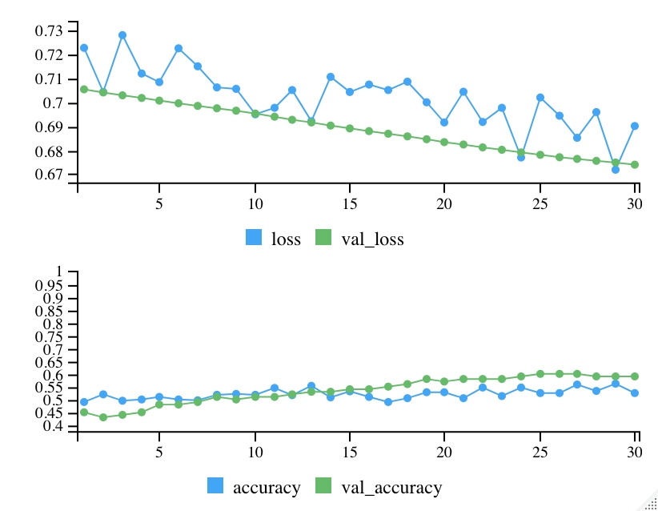
## 神经网络的参数优化
在此之前需要安装magic包，ImageMagick是C ++的开源图像处理库，许多不同的语言都支持它。我们正在使用与C ++代码对接的R包。
以及其他包：
```r
library(keras)
# Set the seed immediately after loading keras library.
# If the library was already loaded, we may want to run .rs.restartR() to restart
# our R session.
# This is broken right now.
#use_session_with_seed(1, disable_gpu = FALSE, disable_parallel_cpu = FALSE)
library(dplyr)
library(ggplot2)
# Gives us the tf object for certain manipulations.
library(tensorflow)
```
### 获取、指定并检查数据
模型用于训练的数据需要单独下载，我们不会将图像数据直接存储在GitHub存储库中，因为Git旨在跟踪更改文本文件，并且不适用于图像之类的二进制文件。我们将下载一个zip文件并以编程方式将其解压缩。这样可以使存储库的大小更小，并且可以更快地克隆或下载。
```r
local_file = "data-raw/Open_I_abd_vs_CXRs.zip"
#如果我们的工作目录中还没有zip文件，请下载它，大约13.5MB。
#也可以顺着链接去手动下载
if (!file.exists(local_file)) {
  download.file("https://raw.githubusercontent.com/paras42/Hello_World_Deep_Learning/master/Open_I_abd_vs_CXRs.zip", local_file)
}
#将本地文件解压到data raw目录中（如果还没有的话）。
if (!file.exists("data-raw/Open_I_abd_vs_CXRs")) {
  unzip(local_file, exdir = "data-raw")
}
```
我们将使用该dirs列表将不同的目录组织为几个变量：
`dirs$base` -解压图像后的主目录路径。
`dirs$train` -训练集文件夹的路径。
`dirs$val` -验证集文件夹的路径。
将多个设置组织到一个列表对象中是一个好习惯。首先，它可以使环境更加井井有条，并且还可以更轻松地将这些设置保存到RData文件中以供后代使用。
```r
#把我们的目录整理成一个列表。
dirs = list(base = "data-raw/Open_I_abd_vs_CXRs/")
#不要在结尾加“/”，因为list.files()将稍后添加这些。
dirs$train = paste0(dirs$base, "TRAIN")
dirs$val = paste0(dirs$base, "VAL")
#打印出我们的目录配置。
dirs
```
每个目录中有多少个图像？
```r
#图像被组织到两个子目录中（每种图像类型一个），我们将recursive=TRUE设置为进入每个子目录。
length((train_files = list.files(dirs$train, recursive = TRUE, full.names = TRUE)))
#检查前两个文件元素。两者都是腹部x光片（注意子目录）。
train_files[1:2]
#挑战：
#我们的验证目录中有多少个文件？
#验证文件列表中的第二和第三个元素是什么？
# Hint:
# length((val_files = list.files(_________, ________, ________)))
```
绘制图像：
```r
#magick包是显示图像的一种方式。
library(magick)
#在R上显示这些图
print(image_read(train_files[5]))
#打开系统查看以查看图像。
image_browse(image_read(train_files[5]))
#或者，我们可以使用cowplot在ggplot内部打印图像。
library(cowplot)
#使用ggplot, cowplot, magick包绘图
ggdraw() + draw_image(train_files[1])
#同时绘制第二幅图像，这次添加了一个标题并删除了额外的项目。
ggdraw() + draw_image(train_files[2]) + ggtitle("2nd image") + theme_minimal() +
  theme(axis.text = element_blank(), panel.grid = element_blank())
###
#挑战：绘制第三张图片并在标题中输入文件名。
#额外提示：basename()将从文件路径中删除所有目录。
###
```
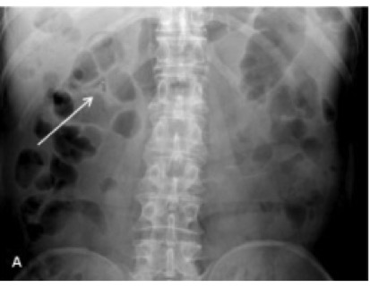
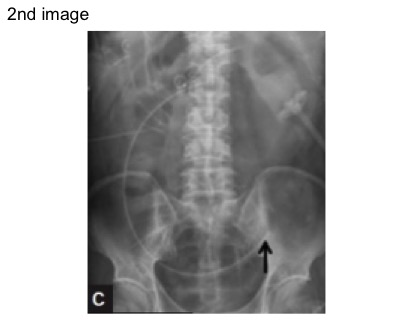
### 预训练网络与微调
为了达到较高的准确性，神经网络通常需要非常深，这意味着许多隐藏层。这使网络可以对输入数据建立复杂的理解，因为更深的层次建立在较早的层次上，以“设计”它已学习的与准确预测有关的新功能。

但是，深度神经网络由神经元之间的数百万个链接（权重）组成，如果我们只有100个观察值，则网络没有足够的信息来准确地调整权重。而从头开始构建的深度神经网络需要进行大量观察：最好是数百万个观察结果，取决于任务。

克服此限制的一种方法是“预训练+微调”。首先，我们在一个大型数据集上训练一个复杂的（深度）神经网络，这使各层能够很好地校准其权重。我们希望它针对该数据集设计的功能将适用于我们的新的较小数据集。这就是所谓的“基础模型”，Keras提供了10种这样的预训练模型供我们使用。

接下来，我们将该预训练的神经网络应用于较小的数据集。我们删除最原始的数据集的最后一两层，然后添加随机初始化的一两层。然后，微调将在我们较小的数据集上重新运行网络，并主要将这些新图层更新为我们的小型数据集；我们也可能会稍微更新“基本”神经网络权重。

设置数据与核心模型：
```r
#让我们图像的尺寸与神经结构所期望的一样。
img_width = img_height = 299L
batch_size = 5L
train_datagen = keras::image_data_generator(rescale = 1/255)
val_datagen = keras::image_data_generator(rescale = 1/255)
#使用目标大小
train_gen = train_datagen$flow_from_directory(dirs$train, target_size = c(img_width, img_height), batch_size = batch_size, class_mode = "binary")
val_gen = val_datagen$flow_from_directory(dirs$val, target_size = c(img_width, img_height), batch_size = batch_size, class_mode = "binary")
#这将在首次运行时下载初始权重(~84 MB)
base_model = keras::application_inception_v3(include_top = FALSE, pooling = "avg", input_shape = c(img_width, img_height, 3L))
#导出一个8x8x2048的tensor.
base_model$output_shape
?application_inception_v3
summary(base_model)
```
添加自定义层：
```r
#第一：只训练顶层（随机初始化）
#i.e. 冻结所有的InceptionV3层
#不起作用，kares可能有bug
freeze_weights(base_model)
#添加自定义层到初始。
model_top = base_model$output %>%
  #layer_global_average_pooling_2d() %>%
  layer_dense(units = 128, activation = "relu") %>%
  layer_dropout(0.5) %>%
  layer_dense(units = 1, activation = "sigmoid")
#这是我们将要训练的模型
model = keras_model(inputs = base_model$input, outputs = model_top)
length(model$layers)
#手动冻结初始初始层，只需训练最后3层。
freeze_weights(model, 1, length(model$layers) - 3)
summary(model)
#编译模型（应在*将图层设置为不可训练后*完成）
model %>%
  compile(optimizer = optimizer_adam(#lr = 0.00001或lr = 0.0005或lr = 0.0001试试, epsilon是adam优化器的配置设置
    epsilon = 1e-08),
    #或者可以使用字符类型的命令:loss=“binary_crossentry”
    loss = loss_binary_crossentropy,
    metrics = "accuracy")

(num_train_samples = length(train_files))
num_validation_samples = 10L
```
拟合模型：
```r
#在新数据的基础上训练几个时期的模型
history = model %>%
  fit_generator(train_gen,
                steps_per_epoch = as.integer(num_train_samples / batch_size),
                epochs = 5,
                validation_data = val_gen,
                validation_steps = as.integer(num_validation_samples / batch_size))
#查看拟合历史
plot(history)
```
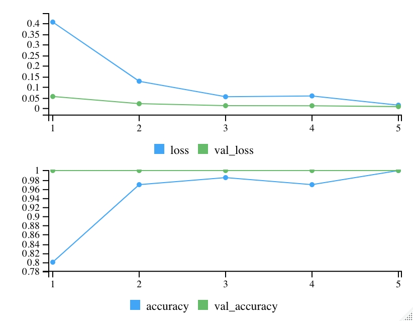
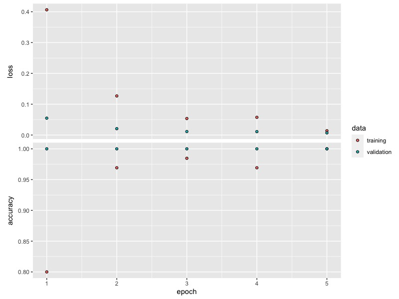
训练完整模型：
```r
#Unfreeze_weights()似乎要求我们具体指定层。
unfreeze_weights(model, 1, length(model$layers))
model %>%
  compile(optimizer =
            #注意这里的学习速率很低
            optimizer_adam(lr = 0.00001,
                           epsilon = 1e-08),
          loss = loss_binary_crossentropy,
          metrics = "accuracy")
#训练全套图层，但仅限于几个时期。
history = model %>%
  fit_generator(train_gen,
                steps_per_epoch = as.integer(num_train_samples / batch_size),
                epochs = 4,
                validation_data = val_gen,
                validation_steps = as.integer(num_validation_samples / batch_size))
```
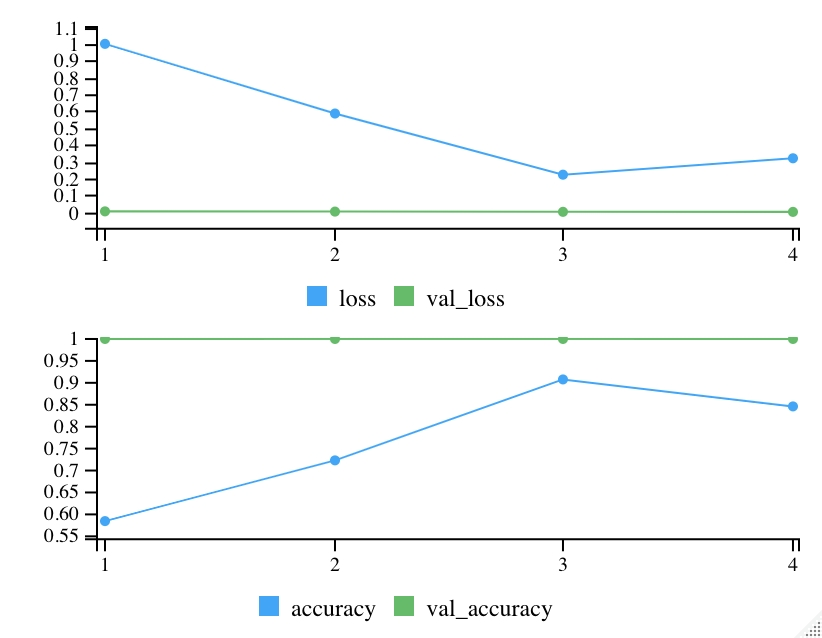
现在，我们的验证损失低于培训损失-为什么会有这样的想法？

挑战：
返回第一个模型并尝试修改一些设置：隐藏单元数，其他隐藏层和/或辍学率。它们各自如何影响您的结果？
查看帮助页面中的optimizer_adam，然后尝试更改一个或两个设置。单击其他优化器，然后尝试使用其他优化器。
其他/扩充：
作为可选的作业，以下是用于更复杂的图像数据生成器的示例代码。该代码使用数据增强，将数据随机随机的小扰动应用于原始图像，以：1）近似具有较大的样本大小； 2）鼓励网络对原始图像特征不那么敏感。结果，与不这样做相比，此增强步骤应使我们可以获得更好的性能。
```r
train_datagen =
  keras::image_data_generator(rescale = 1 / 255,
                              shear_range = 0.2,
                              zoom_range = 0.2,
                              rotation_range = 20,
                              width_shift_range = 0.2,
                              height_shift_range = 0.2,
                              horizontal_flip = TRUE)
```
## 文本分析
分析特朗普的推特
加载相关程序包
```r
knitr::opts_chunk$set(echo = TRUE)
library(dplyr)
library(rio)
library(ggplot2)
library(keras)
```
下载相关数据：
```r
data_file = "data-raw/condensed_2018.json"

if (!file.exists(data_file)) {

  file_url = "https://github.com/bpb27/trump_tweet_data_archive/raw/master/condensed_2018.json.zip"
  (local_file = paste0("data-raw/", basename(file_url)))
  if (!file.exists(local_file)) {
    download.file(file_url, local_file)
  }
  unzip(local_file, exdir = "data-raw")
}  

data = rio::import(data_file)
```
探索数据结构：
```r
dplyr::glimpse(data)
summary(data$favorite_count)
#哪条推文最受欢迎？
data %>% arrange(desc(favorite_count)) %>% filter(row_number() == 1)
qplot(data$favorite_count)
```
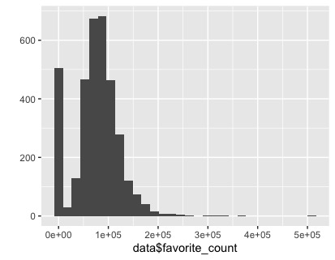
```r
qplot(log(data$favorite_count + 1))
```
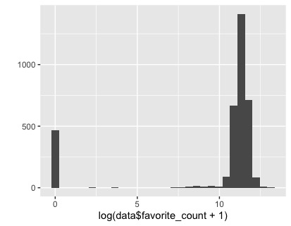
```r
qplot(data$retweet_count)
summary(data)
table(data$source, useNA = "ifany")
```
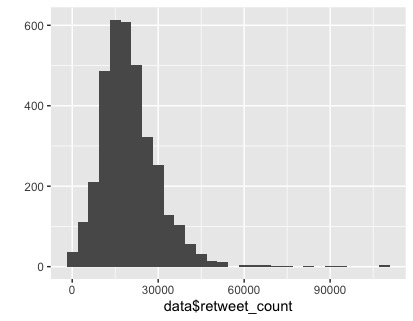
我们试着预测一条特朗普推特会收到多少转发呢？
数据准备
```r
max_words <- 5000
batch_size <- 32
epochs <- 5
cat('Loading data...\n')
text_col = "text"
outcome_col = "retweet_count"
data[[text_col]] = tolower(data[[text_col]])
#分为训练与测试集
set.seed(1)
data$train = 0L
data$train[sample(nrow(data), ceiling(nrow(data) * 0.8))] = 1L
table(data$train, useNA = "ifany")
prop.table(table(data$train, useNA = "ifany"))
train = data[data$train == 1, ]
test = data[data$train == 0, ]
x_train <- train[[text_col]]
y_train <- train[[outcome_col]]
x_test <- test[[text_col]]
y_test <- test[[outcome_col]]
cat(length(x_train), 'train sequences\n')
cat(length(x_test), 'test sequences\n')
cat('Vectorizing sequence data...\n')
x_train[[1]]
tokenizer <- text_tokenizer(num_words = max_words)
tokenizer$fit_on_texts(data[[text_col]])
#找到的唯一单词（标记）总数。
length(tokenizer$word_index)
x_train_seq = texts_to_sequences(tokenizer, x_train)
x_train_seq[[1]]
str(x_train_seq)
#检查标记长度的分布。
summary(sapply(x_train_seq, length))
maxlen = 61L
train_data <- pad_sequences(
  x_train_seq,
  #value = word_index_df %>% filter(word == "<PAD>") %>% select(idx) %>% pull(),
  padding = "post",
  maxlen = maxlen,
)
str(train_data)
train_data[1, ]
x_test_seq = texts_to_sequences(tokenizer, x_test)
test_data <- pad_sequences(
  x_test_seq,
#  value = word_index_df %>% filter(word == "<PAD>") %>% select(idx) %>% pull(),
  padding = "post",
  maxlen = maxlen,
)
```
### 模型1
建立模型：
```r
#vocab_size <- 10000

(vocab_size = tokenizer$num_words)

model <- keras_model_sequential()
model %>% 
  layer_embedding(input_dim = vocab_size, output_dim = 16) %>%
  layer_global_average_pooling_1d() %>%
  layer_dense(units = 16, activation = "relu") %>%
  layer_dropout(rate = 0.3) %>%
  layer_dense(units = 1, activation = "linear")

model %>% summary()

model %>% compile(
  optimizer = optimizer_adam(lr = 0.005),
  loss = 'mean_squared_error'
)
```
训练模型：
```r
history <- model %>% fit(
  train_data,
  y_train,
  epochs = 50,
  batch_size = 4,
  validation_split = 0.2,
  callbacks = list(
    callback_early_stopping(patience = 8L, restore_best_weights = TRUE),
    callback_reduce_lr_on_plateau(patience = 4L)
  )
)
history
plot(history)
```
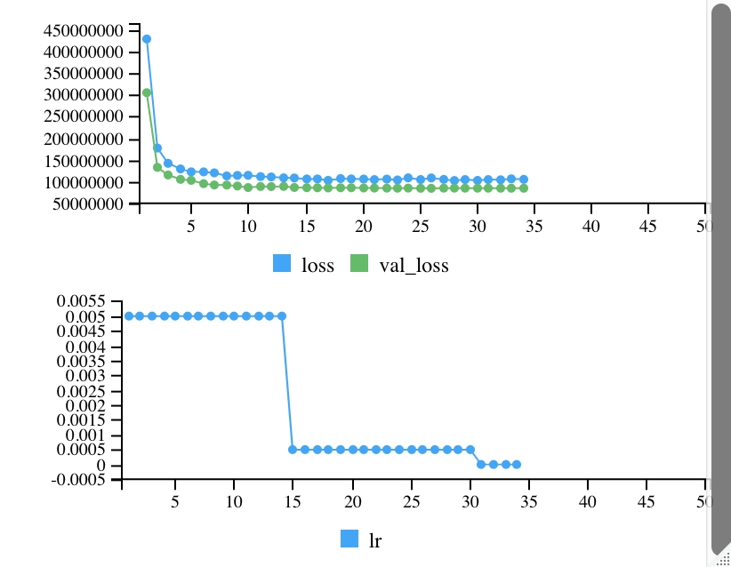
评估模型：
```r
(eval_loss = model %>% evaluate(test_data, y_test, verbose = 0))

# We're typically off by 10,483 retweets
sqrt(eval_loss)

# Just predicting the mean would only be off by 11,519 retweets typically.
sd(y_test)

# Look at predictions.
preds = model %>% predict(test_data)
head(preds)
summary(preds)
mean(y_train)
qplot(preds)
```
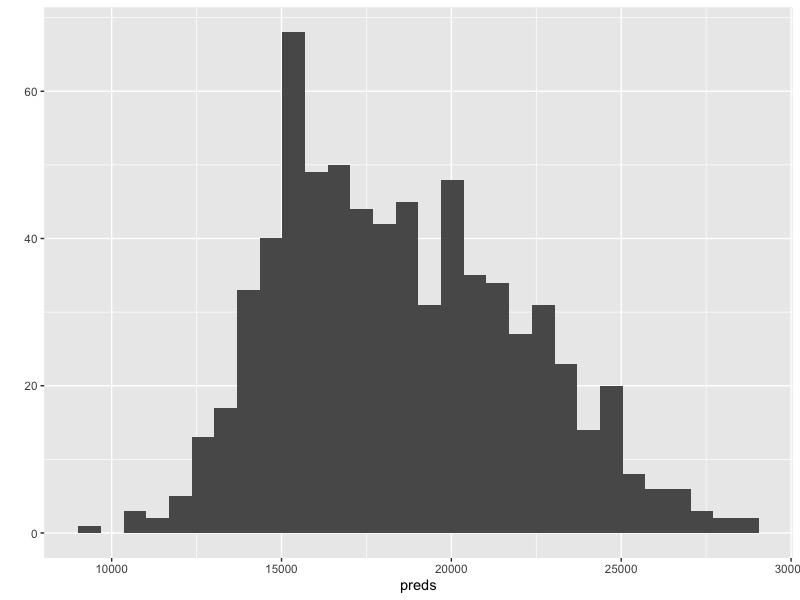
```r
qplot(preds, y_test) + geom_smooth() + theme_minimal()
# Correlation of 0.44, p is highly significant.
cor.test(preds, y_test)
# Spearman correlation of 0.575
cor.test(rank(preds), rank(y_test))
```
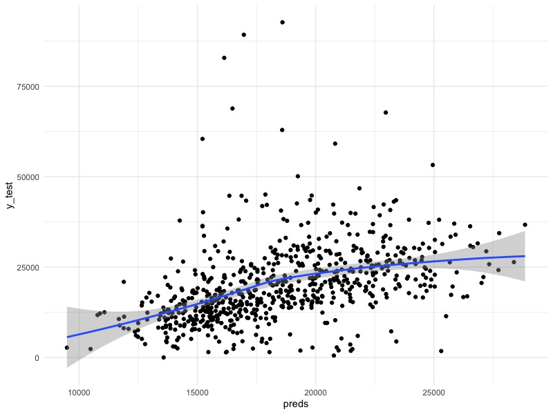
### 尝试其他模型结构
```r
(vocab_size = tokenizer$num_words)

model <- keras_model_sequential()
model %>% 
  layer_embedding(input_dim = vocab_size, output_dim = 32) %>%
  #layer_lstm(16) %>%
  layer_conv_1d(64, kernel_size = 1) %>%
  layer_global_average_pooling_1d() %>%
  layer_dense(units = 16, activation = "relu") %>%
  layer_dropout(0.3) %>%
  layer_dense(units = 1, activation = "linear")

model %>% summary()

model %>% compile(
  optimizer = optimizer_adam(lr = 0.001),
  loss = 'mean_squared_error'
)
```
训练模型2：
```r
history <- model %>% fit(
  train_data,
  y_train,
  epochs = 50,
  batch_size = 32,
  validation_split = 0.2,
  callbacks = list(
    callback_early_stopping(patience = 6L, restore_best_weights = TRUE, verbose = 1),
    callback_reduce_lr_on_plateau(patience = 3L, verbose = 1))
)
plot(history)
```
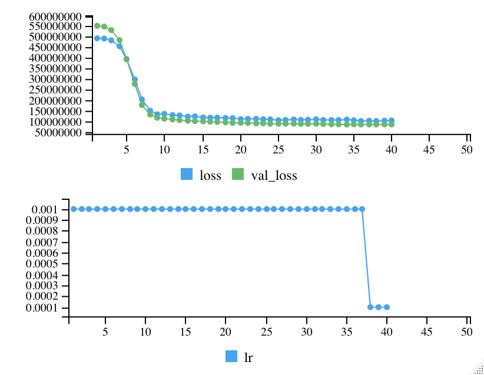
### 模型2
评估模型2：
```r
(eval_loss = model %>% evaluate(test_data, y_test, verbose = 0))
#通常会被10750次转发
sqrt(eval_loss)
#查看预测值
preds = model %>% predict(test_data)
head(preds)
summary(preds)
#开始在我们的预测中传播开来
qplot(preds)
```
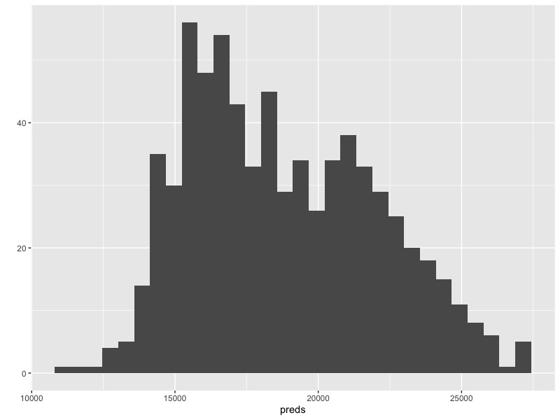
```r
qplot(preds, y_test) + geom_smooth() + theme_minimal()
# Pearson linear correlation of 0.395
cor.test(preds, y_test)
# Spearman correlation of 0.563
cor.test(rank(preds), rank(y_test))
# Same thing:
cor.test(preds, y_test, method = "spearman", exact = FALSE)
# Kendall's tau 0.402
cor.test(preds, y_test, method = "kendall", exact = FALSE)
```
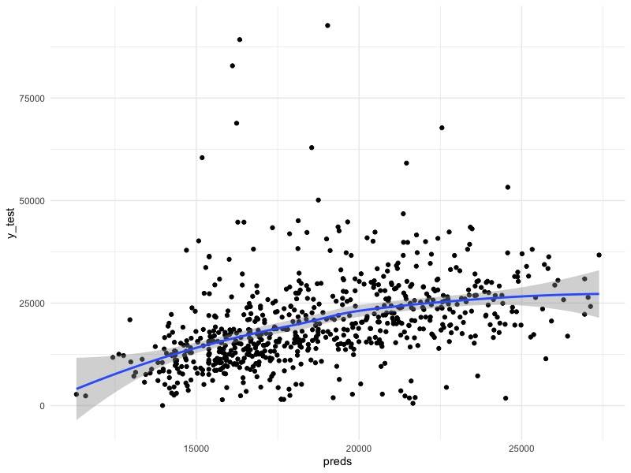
