#  预测：原理与实践
  
##  前言
  
来自澳大利亚莫纳什大学的教材[Forecast：Principles and Practice](https://otexts.com/fpp2/index.html )
所有计算与建模均基于R语言，可以通过在CRAN上安装fpp2软件包以便进行下面所有的操作。
***
Hyndman, R.J., & Athanasopoulos, G. (2018) Forecasting: principles and practice, 2nd edition, OTexts: Melbourne, Australia. OTexts.com/fpp2.
  
  
- [预测：原理与实践](#预测原理与实践 )
  - [前言](#前言 )
  - [入门](#入门 )
    - [关于预测](#关于预测 )
  - [时间序列图像的绘制](#时间序列图像的绘制 )
    - [ts对象](#ts对象 )
    - [时间图（折线）](#时间图折线 )
    - [散点图](#散点图 )
    - [滞后图](#滞后图 )
    - [自相关](#自相关 )
    - [白噪声](#白噪声 )
  - [预测工具箱](#预测工具箱 )
    - [简单预测](#简单预测 )
    - [数据预处理](#数据预处理 )
    - [残差诊断](#残差诊断 )
    - [评估预测结果的准确性](#评估预测结果的准确性 )
    - [fpp2函数包](#fpp2函数包 )
  - [判断性预测](#判断性预测 )
    - [Delphi法](#delphi法 )
    - [类比预测](#类比预测 )
  - [时间序列回归模型](#时间序列回归模型 )
    - [简单线性回归](#简单线性回归 )
  
##  入门
  
###  关于预测
  
有些预测很简单，而有些预测很难，事件的预测取决于以下三个因素：
1. 我们对造成这种情况的因素的了解程度（对变量的了解
2. 有多少数据可供预测
3. 预测是否会影响我们要预测的事物
  
一个好的预测模型可以捕捉事物变化的方式，我们通常假定环境变化的方式将持续到未来，即高度波动的环境将继续高度波动...等。
如果没有可用数据，或可用数据与预测不相关，则必须使用**定性预测**的方法，而当有关于过去的数字信息且有理由假设过去模式的某些方面将持续到将来时，则可以采用**定量预测**的方式，定量预测可以通过时间序列数据进行预测。
在预测时，我们通常不直接指出预测的值，而是给出预测间隔，该间隔给出了随机变量可以相对较高的概率获取的一系列值。例如，一个95％的预测间隔包含一系列值，其中应包括概率为95％的实际未来值。其中给了一条线表示了各个预测结果的平均值，这种预测方法称**点预测**。
  
预测任务可以分解为以下5个步骤：
1. 问题定义：怎么预测
2. 搜集信息：相关专业知识与数据
3. 初步分析：绘制图表，探讨趋势
4. 选择模型：就是选择模型啦
5. 使用模型：并评估其效果
  
##  时间序列图像的绘制
  
###  ts对象
  
时间可以作为`ts`对象存储与r中，如2012年的数据为10，2013年为11，2014年为15：
```r
y <- ts(c(10,11,15), start = 2012)
```
对于每年进行一次以上的观察，我们需要添加`fraquency`参数，如每月数据我们储存为了`z`，则：
```r
y <- ts(z, start = 2012, frequency = 12)
```
备注：一年有52周
  
###  时间图（折线）
  
对于时间序列数据，首先应当绘制相关的时间图。即将观察值相对于观察时间绘制，连续观察由直线连接。下图显示了澳大利亚两个最大城市之间的安捷航空每周的经济客运量。

```r
#autoplot可以自动生成合适的图表
autoplot(melsyd[,"Economy.Class"]) +
  ggtitle("Economy class passengers: Melbourne-Sydney") +
  xlab("Year") +
  ylab("Thousands")
```
由图片可以知道：
1. 1989年有一段时期没有乘客载运-这是由于劳资纠纷造成的。
2. 在1992年有一段时间，载客量有所减少。这是由于试验将某些经济舱座位替换为商务舱座位。
3. 1991年下半年客运量大大增加。
4. 每年年初，负载都有一些大的下降。这些是由于假期的影响。
5. 该系列的水平存在长期波动，该波动在1987年增加，在1989年减少，并在1990年和1991年再次增加。
6. 有些时期缺少观察结果。
  
也有一些简单的时间序列图：
```r
autoplot(a10) +
  ggtitle("Antidiabetic drug sales") +
  ylab("$ million") +
  xlab("Year")
```
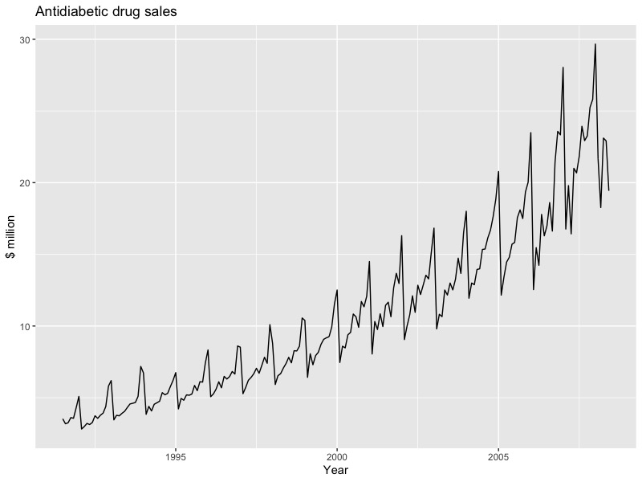
这是澳大利亚抗糖尿病药物的月销售额。显然这里的趋势是不断增长，每年年初的下降则与政府年初的补贴有关。
  
对于那些有季节性变化趋势的数据，我们可以将不同年份的数据进行对比，如上面的澳大利亚糖尿病药物数据：
```r
ggseasonplot(a10, year.labels=TRUE, year.labels.left=TRUE) +
  ylab("$ million") +
  ggtitle("Seasonal plot: antidiabetic drug sales")
```
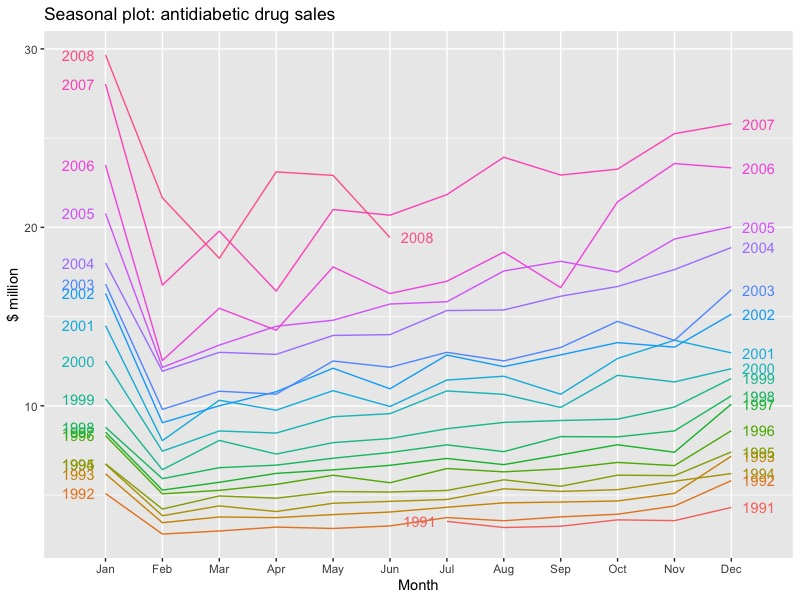
我们可以直观的观察到，在这种情况下，很明显，每年一月份的销售额都有很大的增长。实际上，这些可能是12月下旬的销售，因为客户在年末之前有库存，但是直到一两周后才向政府注册销售。该图还显示，2008年3月的销售额异常少（大多数其他年份显示2月至3月之间有所增长）。2008年6月的销售量很少，可能是由于在收集数据时对销售的计数不完整。
  
也许我们还可以用极坐标来显示：
```r
ggseasonplot(a10, polar=TRUE) +
  ylab("$ million") +
  ggtitle("Polar seasonal plot: antidiabetic drug sales")
```

也可以把每个季节的数据搜集在一起来显示：
```r
ggsubseriesplot(a10) +
  ylab("$ million") +
  ggtitle("Seasonal subseries plot: antidiabetic drug sales")
```

###  散点图
  
散点图可以探索不同因素的时间序列图像之间的关系。
下图显示了两个时间序列：澳大利亚维多利亚州2014年的半小时用电需求（千兆瓦）和温度（摄氏度）。温度是墨尔本（维多利亚州最大的城市）的温度，而需求值是整个州的温度。
```r
autoplot(elecdemand[,c("Demand","Temperature")], facets=TRUE) +
  xlab("Year: 2014") + ylab("") +
  ggtitle("Half-hourly electricity demand: Victoria, Australia")
```

我们可以通过绘制一个序列与另一个序列的散点图来研究用电需求与温度之间的关系。
```r
qplot(Temperature, Demand, data=as.data.frame(elecdemand)) +
  ylab("Demand (GW)") + xlab("Temperature (Celsius)")
```
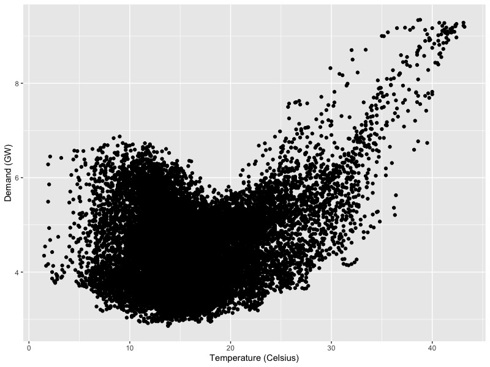
此散点图有助于我们可视化变量之间的关系。显然，由于空调的影响，当温度高时会出现高需求。但是相反的，对于非常低的温度，需求增加。
相关系数就是衡量两个变量之间是否是线性关系的一种手段，相关系数仅测量线性关系的强度，有时会产生误导，因此还需要查看数据图来获得更多详细结论。
  
散点图矩阵
当存在多个潜在的预测变量时，将每个变量相对于另一个变量作图很有用。下图显示了五个时间序列，该序列显示了澳大利亚新南威尔士州五个地区的季度访客人数。
```r
autoplot(visnights[,1:5], facets=TRUE) +
  ylab("Number of visitor nights each quarter (millions)")
```

显示它们的散点图矩阵（需要GGally包）
```r
GGally::ggpairs(as.data.frame(visnights[,1:5]))
```

散点图矩阵的值是可以快速查看所有变量对之间的关​​系。在此示例中，曲线的第二列显示，新南威尔士州北部海岸的游客和新南威尔士州南部海岸的游客之间存在很强的正相关关系，但新南威尔士州北部海岸的游客和新南威尔士州南部内陆的游客之间没有可检测的关系。异常值也可以看到。新南威尔士州都会区有一个异常高的季度，与2000年悉尼奥运会相对应。
###  滞后图
  
滞后嘛，就是滞后，比如5月数据一阶滞后后就算到4月里去了，那种意思。下图显示了澳大利亚啤酒季度产量的散点图，其中横轴显示了时间序列的滞后值。
```r
beer2 <- window(ausbeer, start=1992)
gglagplot(beer2)
```
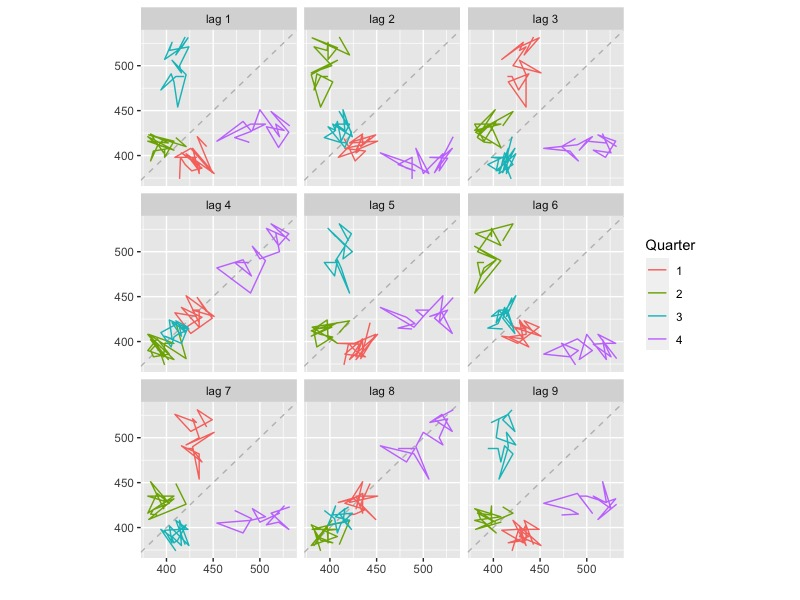
我们可以发现啤酒产量有4个月的滞后期，即生产4个月后可能才进入销售渠道。
###  自相关
  
自相关性度量时间序列的滞后值之间的线性关系，即数据是否自己有规律地变动。
对于上图中的九个散点图分别求相关系数可得其自相关情况。
```r
ggAcf(beer2)
```

蓝色虚线外表示相关性是否显着不为零。
  
当数据具有趋势时，小的滞后的自相关往往会很大并且是正的，因为及时附近的观测值的大小也很近。因此，趋势时间序列的ACF倾向于具有正值，而正值随着滞后的增加而逐渐降低。
  
当数据是季节性的时，季节性滞后（以季节性频率的倍数）的自相关将大于其他滞后。
  
如澳大利亚每月电力需求及其自相关：
  
```r
aelec <- window(elec, start=1980)
autoplot(aelec) + xlab("Year") + ylab("GWh")
```

```r
ggAcf(aelec, lag=48)
```
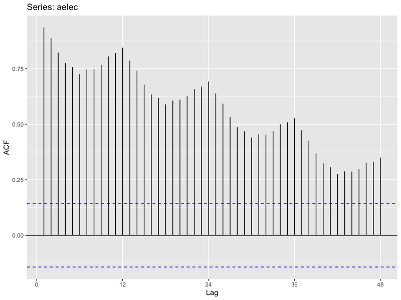
###  白噪声
  
没有自相关的时间序列称为白噪声（R6里的white noise）
如：
```r
set.seed(30)
y <- ts(rnorm(50))
autoplot(y) + ggtitle("White noise")
```

```r
ggAcf(y)
```

对于白噪声系列，我们希望每个自相关接近于零。当然，由于存在一些随机变化，它们将不完全等于零。对于白噪声系列，我们预计ACF中95％的尖峰位于内,其中是时间序列的长度。
##  预测工具箱
  
###  简单预测
  
1. 取平均，未来预测值等于历史数据的均值
```r
meanf(y, h)
# y contains the time series
# h is the forecast horizon
```
2. 随机游走预测(naive)，将所有预测设为最后一次观察的值
```r
naive(y, h)
rwf(y, h) # Equivalent alternative
```
3. 季节性随机游走预测,预测设为某个时间循环前观察的值
```r
snaive(y, h)
```
4. 漂移法，随机游走的方法的一种变化是允许预测随时间增加或减少，其中随时间的变化量（称为“漂移”）设置为历史数据中的平均变化。差不多就是在第一个观察值和最后一个观察值之间连线，将其外推到将来。
```r
rwf(y, h, drift=TRUE)
```
可以借此预测澳大利亚啤酒产量：
```r
# Set training data from 1992 to 2007
beer2 <- window(ausbeer,start=1992,end=c(2007,4))
# Plot some forecasts
autoplot(beer2) +
  autolayer(meanf(beer2, h=11),
    series="Mean", PI=FALSE) +
  autolayer(naive(beer2, h=11),
    series="Naïve", PI=FALSE) +
  autolayer(snaive(beer2, h=11),
    series="Seasonal naïve", PI=FALSE) +
  ggtitle("Forecasts for quarterly beer production") +
  xlab("Year") + ylab("Megalitres") +
  guides(colour=guide_legend(title="Forecast"))
```

当然，这些方法都不是很靠谱。
###  数据预处理
  
1. 日历调整，`monthdays`可以消除因为每月日数不同而带来的差异。如下图中的每月数据因为每月日期不同而产生了“锯齿”。
```r
dframe <- cbind(Monthly = milk,
                DailyAverage = milk/monthdays(milk))
  autoplot(dframe, facet=TRUE) +
    xlab("Years") + ylab("Pounds") +
    ggtitle("Milk production per cow")
```

2. 人口调整，尽量使用人均数据而不是人数数据。
3. 通货膨胀调整，根据价格指数或者CPI进行调整。
4. 数字转换，幂变换等，`BoxCox`函数可以自动寻找一个合适的lambda进行幂变化。
```r
(lambda <- BoxCox.lambda(elec))
#> [1] 0.2654
autoplot(BoxCox(elec,lambda))
```
5. 偏差调整，使用数学变换（例如Box-Cox变换）的一个问题是，逆变换的点预测将不是预测分布的均值。实际上，它通常是预测分布的中位数（假设变换空间上的分布是对称的）。但有时需要平均预测，例如，您可能希望汇总各个地区的销售预测以形成整个国家的预测。但是，中位数不会相加，而平均值却会相加。可以使用`biasadj=TRUE`显示预测的平均数。
```r
fc <- rwf(eggs, drift=TRUE, lambda=0, h=50, level=80)
fc2 <- rwf(eggs, drift=TRUE, lambda=0, h=50, level=80,
  biasadj=TRUE)
autoplot(eggs) +
  autolayer(fc, series="Simple back transformation") +
  autolayer(fc2, series="Bias adjusted", PI=FALSE) +
  guides(colour=guide_legend(title="Forecast"))
```
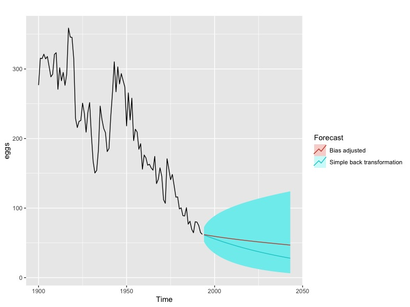
###  残差诊断
  
即为预测值与实际值的偏差。以谷歌股价为例，我们使用随机游走预测谷歌的股价，并计算它的残差。
绘制谷歌股价：
```r
autoplot(goog200) +
  xlab("Day") + ylab("Closing Price (US$)") +
  ggtitle("Google Stock (daily ending 6 December 2013)")
```
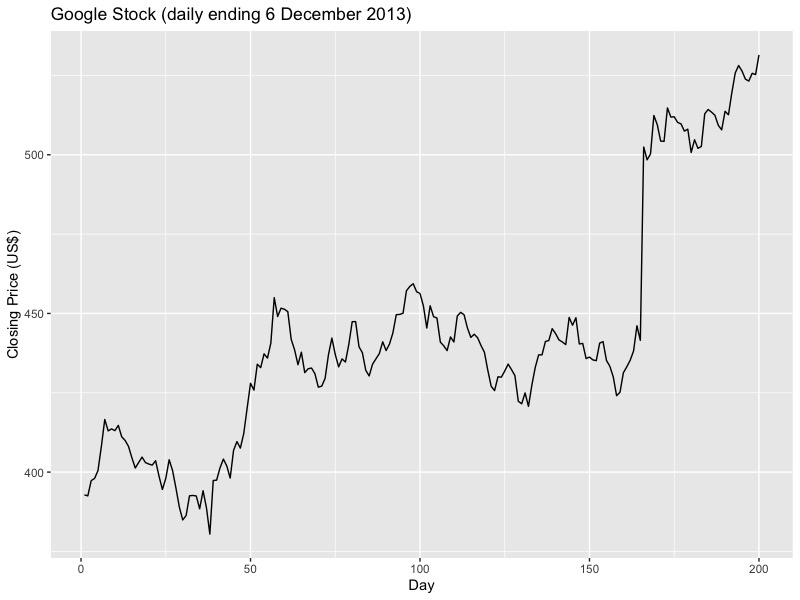
进行朴素预测：
```r
autoplot(naive(goog200)) +
  xlab("Day") + ylab("Closing Price (US$)")
  ggtitle("Google Stock (daily ending 6 December 2013)")
```
计算残差,可以发现大的正残差是第166天意外价格上涨的结果。：
```r
res <- residuals(naive(goog200))
autoplot(res) + xlab("Day") + ylab("") +
  ggtitle("Residuals from naïve method")
```

绘制残差直方图，右尾确实有点长：
```r
gghistogram(res) + ggtitle("Histogram of residuals")
```
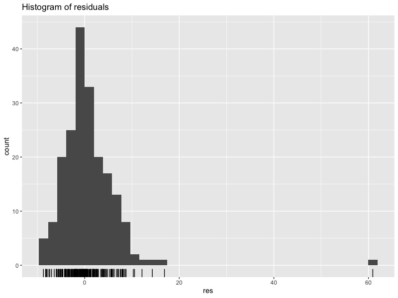
绘制ACF，可以认为缺乏相关性，因此预测结果不错
```r
ggAcf(res) + ggtitle("ACF of residuals")
```

这些图表明，朴素的方法(随机游走)所产生的预测似乎可以说明所有可用信息。残差的平均值接近零，并且在残差序列中没有显着的相关性。残差的时间图显示，除一个异常值外，残差的变化在整个历史数据中保持几乎相同，因此残差方差可以视为恒定值。这也可以在残差的直方图中看到。直方图表明残差可能不正常-即使我们忽略异常值，右尾也似乎太长。因此，使用此方法进行的预测可能会很好，但是假设正态分布而计算出的预测间隔可能不准确。
同时还可以进行Portmanteau自相关检验，包括Box-Pierce检验（`Box.test(res, lag=10, fitdf=0)`）和Ljung-Box测试（`Box.test(res,lag=10, fitdf=0, type="Lj")`），也可以用一个函数包搞定上面所有：`checkresiduals(naive(goog200))`。
###  评估预测结果的准确性
  
需要将数据分为训练集与测试集进行评估，测试集通常为总样本的20%。我们在训练集上与结果的差称为残差，在测试集上则称为误差
可以使用`window`函数提取时间序列中的一部分作为子集。
```r
#提取所有95年以后的数据
window(ausbeer, start=1995)
#使用subset进行筛选，提取最近5年的观测值
subset(ausbeer, start=length(ausbeer)-4*5)
#提取所有年份第一季度的值
subset(ausbeer, quarter = 1)
#用tail提取后5年的值，或者用head提取前5年
tail(ausbeer, 4*5)
```
可以通过百分比误差（平均绝对百分比误差MAPE）和比例误差（平均绝对比例误差MASE）进行误差的衡量
首先我们对啤酒产量进行预测：
```r
beer2 <- window(ausbeer,start=1992,end=c(2007,4))
beerfit1 <- meanf(beer2,h=10)
beerfit2 <- rwf(beer2,h=10)
beerfit3 <- snaive(beer2,h=10)
autoplot(window(ausbeer, start=1992)) +
  autolayer(beerfit1, series="Mean", PI=FALSE) +
  autolayer(beerfit2, series="Naïve", PI=FALSE) +
  autolayer(beerfit3, series="Seasonal naïve", PI=FALSE) +
  xlab("Year") + ylab("Megalitres") +
  ggtitle("Forecasts for quarterly beer production") +
  guides(colour=guide_legend(title="Forecast"))
```

接着我们来看看它的准确性，显然，季节性随机游走预测比较好：
```r
beer3 <- window(ausbeer, start=2008)
accuracy(beerfit1, beer3)
#                  ME     RMSE      MAE        MPE     MAPE
#Training set   0.000 43.62858 35.23438 -0.9365102 7.886776
#Test set     -13.775 38.44724 34.82500 -3.9698659 8.283390
#                 MASE        ACF1 Theil's U
#Training set 2.463942 -0.10915105        NA
#Test set     2.435315 -0.06905715  0.801254
accuracy(beerfit2, beer3)
#                      ME     RMSE      MAE         MPE     MAPE
#Training set   0.4761905 65.31511 54.73016  -0.9162496 12.16415
#Test set     -51.4000000 62.69290 57.40000 -12.9549160 14.18442
#                 MASE        ACF1 Theil's U
#Training set 3.827284 -0.24098292        NA
#Test set     4.013986 -0.06905715  1.254009
accuracy(beerfit3, beer3)
#                    ME     RMSE  MAE        MPE     MAPE      MASE
#Training set -2.133333 16.78193 14.3 -0.5537713 3.313685 1.0000000
#Test set      5.200000 14.31084 13.4  1.1475536 3.168503 0.9370629
#                   ACF1 Theil's U
#Training set -0.2876333        NA
#Test set      0.1318407  0.298728
```
训练/测试集的一个更复杂的版本是时间序列交叉验证。在此过程中，有一系列测试集，每个测试集包含一个观察值。由于结果随时间而变化，因此相应的训练集仅包含在形成测试集的观察之前发生的观察。因此将来的观察结果都不能用于构建预测。由于不可能基于小的训练集获得可靠的预测，因此最早的观察结果不被视为测试集。
预测准确性是通过对测试集进行平均计算得出的。此过程有时称为“滚动预测原点评估”，因为预测所基于的“原点”会及时向前滚动。
时间序列交叉验证是通过`tsCV()`函数实现的。在以下示例中，我们将通过时间序列交叉验证获得的RMSE与剩余的RMSE进行比较。
```r
e <- tsCV(goog200, rwf, drift=TRUE, h=1)
sqrt(mean(e^2, na.rm=TRUE))
#> [1] 6.233
sqrt(mean(residuals(rwf(goog200, drift=TRUE))^2, na.rm=TRUE))
#> [1] 6.169
```
不出所料，来自残差的RMSE较小，因为相应的“预测”基于适合整个数据集的模型，而不是真实的预测。
选择最佳预测模型的一个好方法是找到使用时间序列交叉验证计算出的最小RMSE的模型。
对谷歌股价进行朴素预测，并用`tsCV()`进行时间序列交叉验证：
```
e <- tsCV(goog200, forecastfunction=naive, h=8)
# Compute the MSE values and remove missing values
mse <- colMeans(e^2, na.rm = T)
# Plot the MSE values against the forecast horizon
data.frame(h = 1:8, MSE = mse) %>%
  ggplot(aes(x = h, y = MSE)) + geom_point()
```
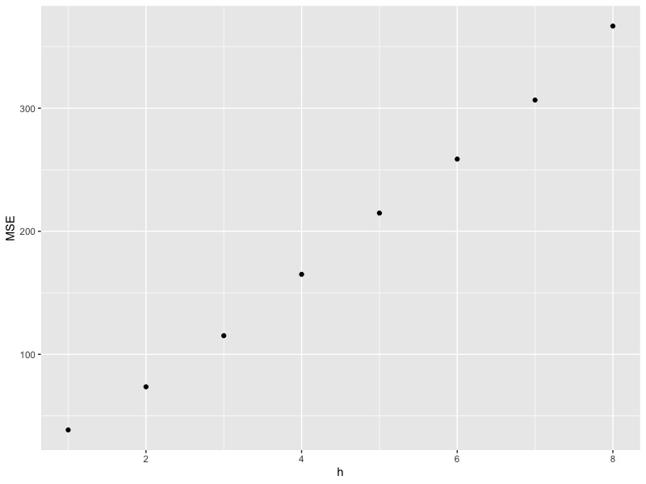
时间序列交叉验证表明，预测误差随着预测范围的增加而增加。
如果我们在预测参数中加入`bootstrap=TRUE`，就可以看到预测结果在不同的置信区间内的情况。
###  fpp2函数包
  
`forecast()`函数是主要的预测手段，其主要输入时间序列模型。其还有自动绘图功能`autoplot()`
##  判断性预测
  
判断性预测即指在没有历史数据的情况下进行预测，通常比较主观。
###  Delphi法
  
德尔菲认为群体的预测要比个体准确，因此他设计了一套流程：
1. 组成了一个专家小组。
2. 设置了预测任务/挑战并将其分发给专家。
3. 专家会返回初步的预测和理由。汇总并汇总了这些内容以提供反馈。
4. 向专家提供了反馈，专家们现在根据反馈检查了他们的预测。可以重复执行此步骤，直到达到令人满意的共识水平。
5. 最终预测是通过汇总专家的预测来构建的。
值得注意的是专家应当是匿名，且平等的。
###  类比预测
  
找一些别的相似的例子，或是进行结构化类比：
1. 聚集了可能具有类似情况经验的专家小组。
2. 设置任务/挑战并将其分发给专家。
3. 专家会识别并描述尽可能多的类比，并根据每个类比生成预测。
4. 专家列出每个类比与目标情况的相似性和差异，然后在一个量表上评估每个类比与目标情况的相似性。
5. 预测是由主持人使用设定规则得出的。这可以是加权平均值，其中权重可以由专家对每个类比的排名分数进行指导。
##  时间序列回归模型
  
其基本概念是我们要预测的感兴趣的时间序列假设它与其他变量的时间序列具有线性关系。
###  简单线性回归
  
如研究美国消费支出：
我们认为和收入有关：
```r
autoplot(uschange[,c("Consumption","Income")]) +
  ylab("% change") + xlab("Year")
```
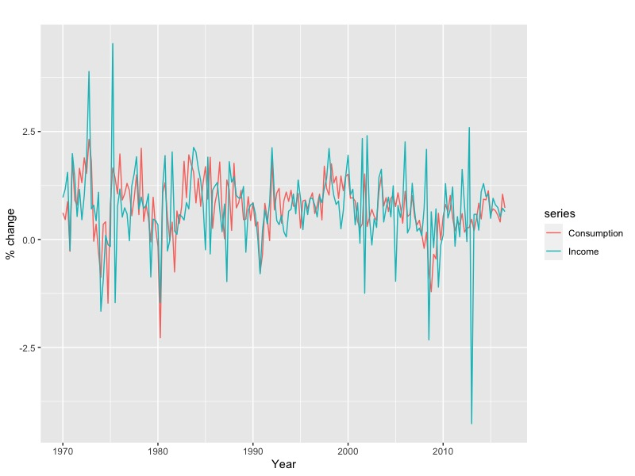
显然消费和支出有线性关系：
绘图：
```r
uschange %>%
  as.data.frame() %>%
  ggplot(aes(x=Income, y=Consumption)) +
    ylab("Consumption (quarterly % change)") +
    xlab("Income (quarterly % change)") +
    geom_point() +
    geom_smooth(method="lm", se=FALSE)
#> `geom_smooth()` using formula 'y ~ x'
```
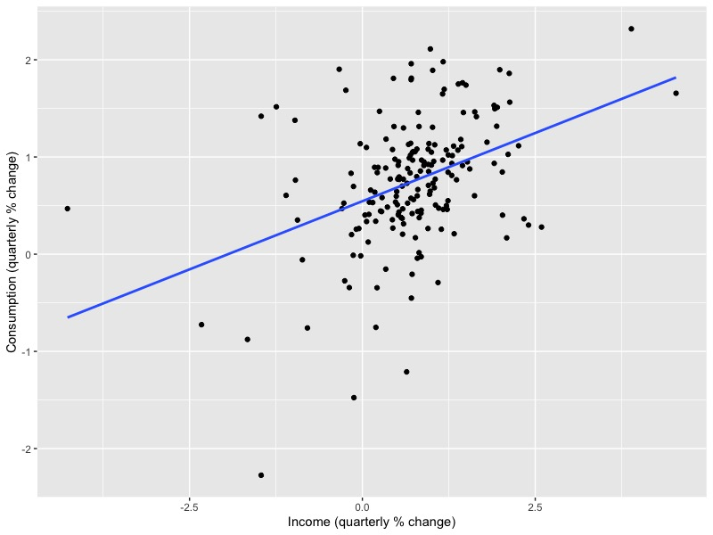
计算回归系数：
```r
tslm(Consumption ~ Income, data=uschange)
#> 
#> Call:
#> tslm(formula = Consumption ~ Income, data = uschange)
#> 
#> Coefficients:
#> (Intercept)       Income  
#>       0.545        0.281
```
  
  