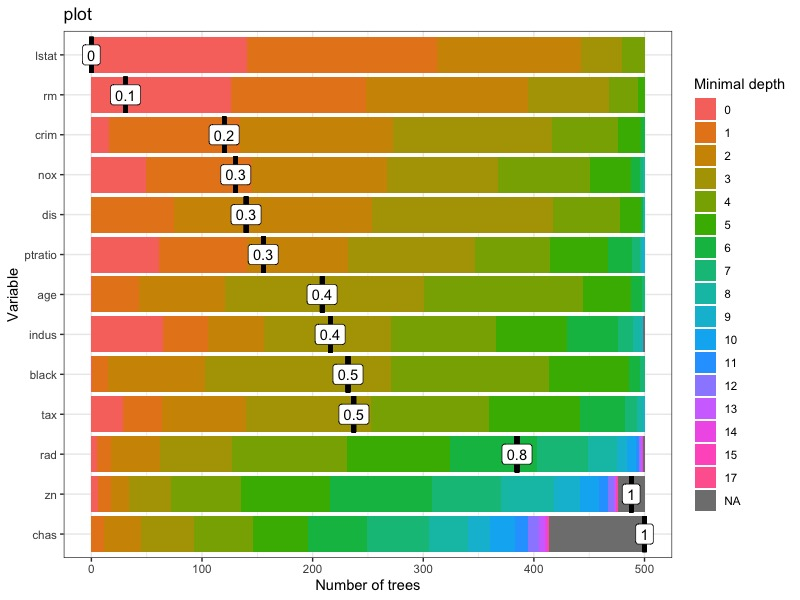
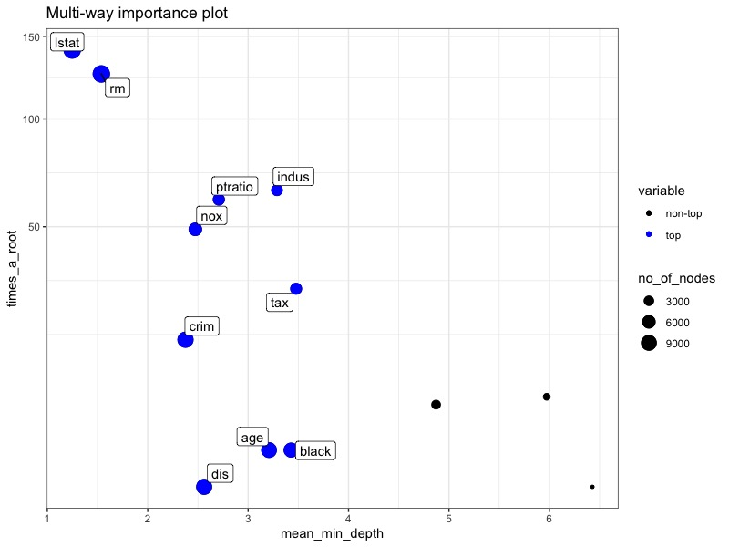

# R语言与机器学习？
其实我觉得这一个新的单元应该称为r语言与复杂数学模型，机器学习（Machine Learning）算是一个老生常谈的话题，也是一个论文灌水的重灾区，但随着时间的迁移，一些新的方法逐渐成为了灌水的大趋势，如遗传算法，神经网络，这些东西非常玄学，如果要应用其皮毛的话，大概要再开一章称为R语言与超级复杂数学模型。因此这里还是简单介绍一些难度相对不大，可能属于机器学习但也可能不是的数学模型，这些模型可以解决许多复杂的生态学问题或者是别的什么问题，各种问题。
[TOC]
## 随机森林
### 定义与介绍
随机森林（Random Forest）是一种集成学习（Ensemble Learning）中的套袋算法（bagging），具体说来是一种Bootstrap方法。

Bootstrap是一种非参数统计蒙特卡洛方法，原理就是通过抽样来对总体特征进行统计推断。其通过大量的重抽样（Re-sample）来获得大量的新样本，根据大量新样本的方差和协方差来推断出原先样本的均值与标准误等统计量。

那么套袋算法又是什么呢？简单来说就是在原始数据中用Bootstrap抽取指定（n）个训练样本，进行k轮抽取，得到k个相互独立的训练集（如有1000个数据，我们以5个数据作为一个训练集，抽500次）。接着我们利用这k个训练集训练k个模型（模型由具体问题而定，如决策树（*备注，一般是决策树，很多很多决策树组成了森林所以叫随机森林*）或者knn），那么对于分类问题，由投票表决产生分类结果，而对于回归问题，则通过k个模型的结果的均值作为预测结果。

优点：很准，缺点：算是个黑箱。

随机森林在大部分分类问题中的训练速度和精度远大于knn和svm。knn易于实现但是预测缓慢，是惰性学习算法。svm的优势是效果不错且稳定，预测速度快（只需要和支持向量进行比较，支持向量往往很少）。 大部分竞赛中，随机森林比knn和svm用的要多。
### 基于R包的随机森林实现
我们主要通过R包randomForest和它的优化包randomForestExplainer来实现。
```r
#安装并启动相关包
library(randomForest)
#此包在git上下载
#devtools::install_github("MI2DataLab/randomForestExplainer")
library(randomForestExplainer)
```
在这里用于演示随机森林模型运算的数据来自R包MASS中的Boston数据，这是波士顿郊区的房价数据，其中```crim```为按城镇划分的犯罪率，```zn```为25000尺以上面积的豪宅的比例，```indus```为每个城镇的非零售业务的商业用地比例，```chas```为是否在查理河边，1为在，0为不在，```nox```为氮氧化物浓度，```rm```为每间房屋的平均房间数，```age```1940年前就住在这里的自建房户数的比例，```dis```距离五个就业中心的加权平均数，```rad```公路可达性指数，```tax```每10000美元的增值税率，```ptratio```按城镇划分的教师比例，```black```黑人比例，```lstat```底层人口比例，```medv```房价的中值。
```r
#提取数据
data(Boston, package = "MASS")
#将chas转为逻辑变量，即FALSE和TURE
Boston$chas <- as.logical(Boston$chas)
#显示数据
str(Boston)
```
接下来可以使用randomForest包进行随机森林的拟合
```r
#mtry函数为指定随机森林的训练次数，默认是500
forest <- randomForest(medv ~ ., data = Boston, localImp = TRUE)
forest
#Call:
# randomForest(formula = medv ~ ., data = Boston, localImp = TRUE) 
#               Type of random forest: regression
#                     Number of trees: 500
#No. of variables tried at each split: 4
#
#          Mean of squared residuals: 9.671408
#endregion                    % Var explained: 88.54
```
这就是随机森林模型的简单实现了
### 基于R包的随机森林扩展
#### 随机森林的决策树
决策树是一个递归过程，即通过对变量（节点）进行不断分类，细分出最符合结果的特征。在决策树的基本算法中，有三种情形会导致递归返回：(1)当前的节点所包含的样本全属于同一类别，无需划分；(2)当前属性集为空或是所有样本在所有属性上取值相同，无需划分；(3)当前节点包含的样本集合为空，不能划分。

另外，我们还可以看到决策树学习的关键是算法，即如何选择最优划分属性？一般而言，随着划分过程不断进行，我们希望决策树的分支节点所包含的样本尽可能属于同一类别，即节点的“纯度”越来越高。

变量重要性是通过考虑节点纯度的平均增加程度决定的（该变量导致的分裂）来计算的。哪个变量的分裂导致节点纯度的更大增加在这一指标中显得尤为重要。一般而言第一次分裂通常会导致节点纯度的最大增加因此往往这个变量的重要性最高。而最小深度表示此变量首次用于拆分树的时间是什么。如果是这种情况，则有意义的是，更重要的变量具有较低的最小深度值。导致纯度增加较大的分裂较早发生，因此重要变量会在早期分裂，因此最小深度较低的变量有着更高的重要性。
#### 最小深度分布
函数```plot_min_depth_distribution```用于绘制随机森林的最小深度分布，其在默认设置下根据随机森林使用的顶部树（mean_sample = "top_trees"）计算的平均最小深度来获得前十个变量的最小深度分布图。我们也可以将随机森林的直接传递给绘图函数，但是如果要制作多个深度最小分布图，则将传递```min_depth_frame```给绘图函数更有效，这样就不会为每个绘图再次计算。
```r
#显示决策树的最小深度分布
min_depth_frame <- min_depth_distribution(forest)
save(min_depth_frame, file = "min_depth_frame.rda")
load("min_depth_frame.rda")
head(min_depth_frame, n = 10)
#绘制最小分布图像
#也可以这样：plot_min_depth_distribution(forest)
plot_min_depth_distribution(min_depth_frame)
```

函数 `plot_min_depth_distribution` 计算平均最小深度时，该函数提供了三种可能性，它们的不同之处在于，它们处理在不使用变量在树的分支时出现的缺失值。它们可以描述如下：
- ```mean_sample = "relevant_trees" ```：这仅考虑存在交互作用的树。
- `mean_sample = "all_trees"` ：relevant_trees存在一个主要问题，即对于仅出现在少量树中的交互，采用条件最小深度的平均值会忽略这种交互并不那么重要的事实。在这种情况下，较小的平均条件最小深度并不意味着交互是重要的。为了解决这个问题，该函数用根变量的最大子树的平均深度替换相关的有交互作用的条件最小深度。基本上，如果我们查看x1：x2的交互作用，则表示对于不存在这种交互作用的树，请为其提供根为x1的最深树的值。这为mean_min_depth交互提供了一个（希望是很大的）数值，以免因为x1:x2的交互作用使其重要性下降。
- `mean_sample = "top_trees"` : 这是的默认选项，它类似于all_trees，但是尝试降低替换缺失值的贡献。原因是当有许多参数但观测不足时，即树的长度比较浅时，all_trees将其拉近mean_min_depth相同的值。为了减少替换缺失值的影响，top_trees仅计算子树n的平均条件最小深度，其中n是存在与指定根的任何交互的树数。
下面我们只查看有交互作用的树产生的结果：
```r
#添加k参数可以控制绘制的最大变量数，mean_scale可以将平均最小深度的值缩放至[0,1]
#main可以调整图的标题，mean_round调整平均最小深度的小数点位数
plot_min_depth_distribution(min_depth_frame, mean_sample = "relevant_trees", k = 15, mean_round = 1, main = "plot", mean_scale = 1)
```

#### 变量重要性
使用```measure_importance```函数获得变量的各种重要性。
```r
importance_frame <- measure_importance(forest)
#储存计算结果，以免以后调动时占用cpu资源
save(importance_frame, file = "importance_frame.rda")
load("importance_frame.rda")
# importance_frame
#    variable mean_min_depth no_of_nodes mse_increase node_purity_increase
# 1       age       3.208000        8934    4.0855711            1134.2629
# 2     black       3.428000        7889    1.4867754             765.1144
# 3      chas       6.428656         789    1.1975552             258.2084
# 4      crim       2.376000        9571    9.2249340            2493.8493
# 5       dis       2.562000        9261    7.9411435            2534.7189
# 6     indus       3.287496        4151    6.2116244            2449.1251
# 7     lstat       1.248000       11331   57.2785166           12817.6106
# 8       nox       2.474000        6069   10.3533262            2879.2618
# 9   ptratio       2.708000        4521    8.2257481            2798.4201
# 10      rad       4.871496        2618    1.6589265             416.1605
# 11       rm       1.538000       11424   32.9913736           11762.1410
# 12      tax       3.478000        4361    4.2818940            1417.1772
# 13       zn       5.973904        1536    0.4787724             292.5830
#    no_of_trees times_a_root       p_value
# 1          500            1 1.078759e-225
# 2          500            1  3.641439e-85
# 3          414            0  1.000000e+00
# 4          500           16  0.000000e+00
# 5          500            0 3.453578e-282
# 6          499           65  1.000000e+00
# 7          500          141  0.000000e+00
# 8          500           49  9.998443e-01
# 9          500           61  1.000000e+00
# 10         499            5  1.000000e+00
# 11         500          126  0.000000e+00
# 12         500           29  1.000000e+00
# 13         476            6  1.000000e+00
```
关于上述数据的解释，其每列均为一个重要性的衡量指标：
1. accuracy_decrease（分类问题中会出现） 变量被排序后的预测准确率的平均下降程度
2. gini_decrease（分类问题中会出现） 变量分裂后节点杂质的平均减少程度
3. mse_increase（回归问题中出现，比如这次）变量被排序后的均方误差（MSE）
4. node_purity_increase（回归问题中出现）变量分裂后节点纯度的平均增加值，以平方和的减少表示
5. mean_minimal_depth 平均最小深度，不谈
6. no_of_trees 变量被排序完成后所使用的决策树的数量
7. no_of_nodes 变量排序后决策树的节点总数（树很浅的时候往往等于树的数量）
8. times_a_root 变量用于拆分根节点所用的树的总数（第一次二分类或者n分类所用的树）（**一般这个就是指重要性值**）
9. p_value 似乎也不用解释？

接下来我们可以绘制重要性指标图：
```r
#也可以用最上面的forest这个最早的随机森林的结果来绘图，是一样的
plot_multi_way_importance(importance_frame, size_measure = "no_of_nodes")
```

显然由图可以得知底层人口数量和住宅的房间数量与房价显著相关，但可以更进一步，看一看树的结构相关的数据与变量的关系
```r
#x/y_measure指定坐标轴类型，size_measure指定颜色，no_of_labels指定显示前5个优秀的变量的名称
plot_multi_way_importance(importance_frame, x_measure = "mse_increase", y_measure = "node_purity_increase", size_measure = "p_value", no_of_labels = 5)
```

#### 比较不同度量指标